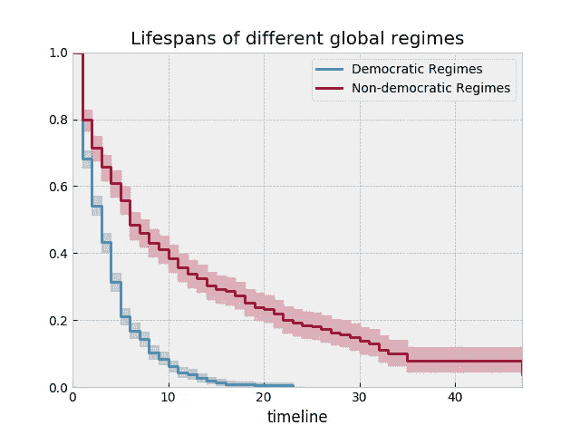
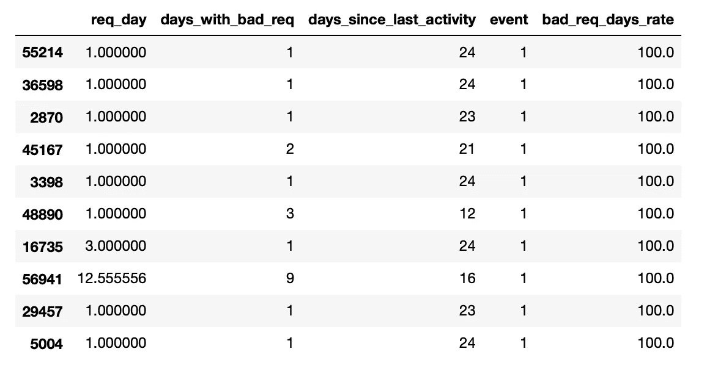
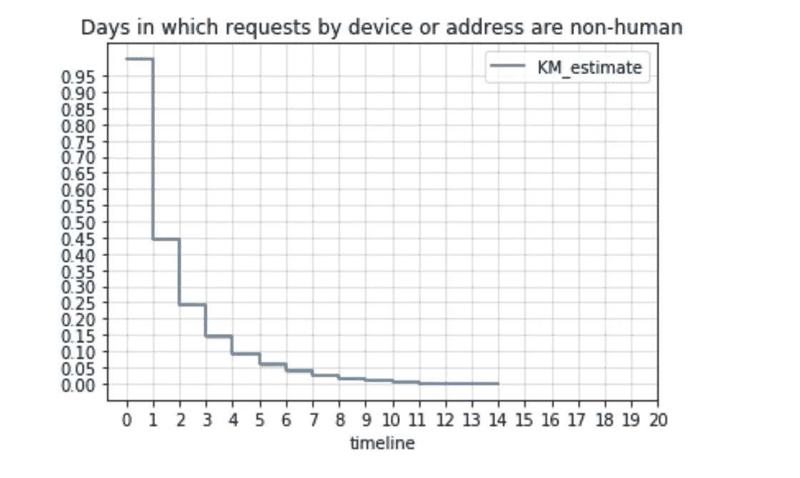
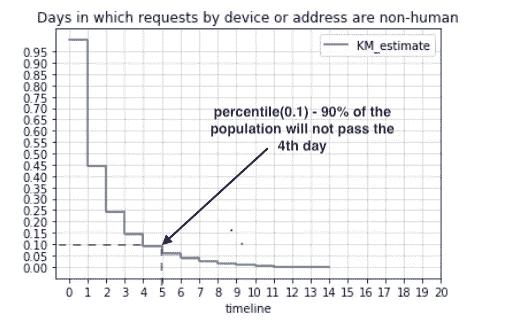
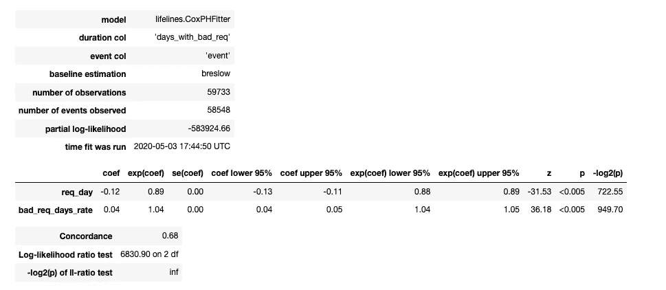
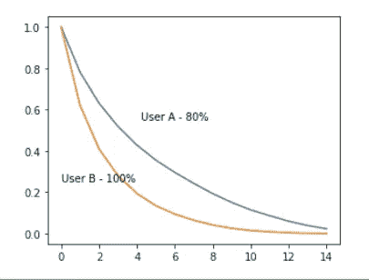

# 使用生存回归获得关于用户的洞察并优化黑名单保留策略

> 原文：<https://towardsdatascience.com/using-survival-regression-to-optimize-blacklist-retention-policies-and-gain-insights-about-users-4f61c2be3634?source=collection_archive---------54----------------------->

## 使用生命线 Python 库和生存分析来估计用户的“寿命”


克里斯·利维拉尼在 [Unsplash](https://unsplash.com?utm_source=medium&utm_medium=referral) 上的照片

公共网站和 SAAS 应用程序的安全管理员面临的最大挑战之一是检测非人类或恶意用户的非法活动。幸运的是，当有足够的使用数据可用时，通常不难发现某个用户的“行为”有些奇怪或不寻常。然而，要决定 T4 如何对这样的发现做出反应，通常也是一个不小的挑战。

在大多数情况下，最好的方法是简单地将可疑用户列入黑名单或阻止(通过阻止其 IP 地址、会话、设备、帐户等)。然而，用户有时不能被列入黑名单，直到得到进一步通知，安全管理员必须回答的下一个问题是“我们应该将可疑用户列入黑名单多长时间？”，“我们如何确保选择正确的阻塞持续时间？”，以及“我们如何测试自己？”当攻击者滥用合法用户的设备或 IP 地址时尤其如此。通常，这种关于黑名单的维护和保留策略的问题是使用相当多的直觉和假设来回答的——当使用直觉和假设的人足够有经验时，这是非常好的。

在这篇文章中，我将提出一个更可靠的方法来解决这个问题，它需要更少的直觉和更多的数据。我的方法是基于一种被称为*生存分析*或“*事件发生时间”*分析的方法论或统计工具。虽然我将集中讨论生存分析如何帮助我们处理一个非常具体的问题，但我相信这种方法，更重要的是，这里介绍的工具在各种环境和类似问题中是有价值的。

生存分析主要被研究人员和科学家用来估计在给定的*时间*发生某个*【死亡】事件*的*几率*。传统上，它用于比较或确定给定特定情况下不同人群的存活率，或回答一些问题，如“给予某种治疗，患者多活 3 年的可能性有多大”或“有多少人在被诊断患有 X 后有可能活 10 年”。

然而，生存分析也被用来估计其他类似死亡事件的可能性。生存分析用于估计用户在离开网站前可能会在网站上花费多长时间，引擎在发现某个故障后会继续运行多长时间，或者政府在不同类型的政治制度下“存活”多长时间。



该图表摘自我将在这里使用的生命线 Python 库的文档([https://lifelines.readthedocs.io/](https://lifelines.readthedocs.io/))

例如，上图中的分析描述了一条*生存曲线*，显示与平均执政时间不超过 10 年的民主政权相比，非民主政权更有可能“存活”20 年以上。

生存分析是一个巨大的话题，但我更愿意在下面引用一些好的介绍资源，然后继续展示它如何帮助我们解决这里提到的问题。然而，在我们继续之前，对于生存分析，或者更准确地说，对于它通常基于的表单数据，只有一个概念需要解释。

驱使科学家使用生存分析的一个主要问题是他们的数据被 T4 审查。假设我们试图在某一种树长得太大并倒塌之前估计它的寿命。同样，假设我们有一个数据集，其中包含我们在全国范围内监控的 1000 棵树。现在，假设我们的数据集中只有 50%的树倒塌了，剩下的 500 棵树仍然挺立着。我们应该如何解释这些树？在我们知道它们的寿命结束之前，我们能报告它们的寿命吗？我们是否应该将这些树从我们的数据集中排除，因为我们对它们的预期寿命一无所知？换句话说，我们的数据是*右删截的——*我们知道它从哪里开始(在图表的右侧)，但我们不一定知道它至少在哪里结束。我不打算在这里讨论这个理论(你可以使用下面引用的一个很好的来源)，但是生存估计量的一个主要目的就是解释这种数据。否则，生存分析会是一个更简单的任务。

因此，任何生存分析估计器都需要至少 2 个变量或特征: **(1)** *持续时间*(例如，树在倒塌之前站立了多长时间)；以及 **(2)** *事件*(是否已经发生“死亡”事件——树是否已经倒塌)。这一点很快就会清楚。

# 黑名单、保留策略和用户生活

因此，假设我们有一个 web 应用程序，它经常成为僵尸程序或自动化攻击的目标。幸运的是，我们知道如何识别由非人类和恶意用户生成的请求，并且我们可以轻松阻止生成这些请求的设备或地址。然而，我们也知道这些设备或地址也被真实用户使用，因此我们希望尽可能短时间地阻止它们。我们的安全顾问建议将我们黑名单的保留策略设置为 14 天，此后设备将不再被阻止，因为她的经验表明这是一种非常常见的模式。我们能测试这个吗？

我相信我们可以，生存分析是这项工作的一个非常好的工具。假设我们有了所需的数据，我们可以使用生存分析来估计这些设备或地址在停止生成非人类恶意请求之前将被邪恶用户接管多长时间。如果我们的安全专家是正确的，那么 14 天后，当我们检测到设备或地址产生非人类或恶意请求时，我们应该可以安全地重新激活我们已列入黑名单的设备或地址。

我们拥有的数据由大约 25 天前首次观察到的非人类行为的设备或地址的汇总统计数据组成。这里有两个我们特别感兴趣的特性: *days_with_bad_req，*记录设备或地址生成被我们识别为非人类的请求的天数，以及一个名为 *event 的变量，*告诉我们设备或地址是否已经停止生成非人类的请求，或者“攻击”是否仍在继续。当一个地址或设备发出*任何*请求已经超过 10 天时，我们将该地址或设备视为已经“死亡”或停止生成非人类请求。因此，如果有人接管了我的 IP 地址，并在 6 天内生成“坏”请求，然后消失了 14 天，我的地址将有*个 days_with_bad_req* = 6 和*个 event* = 1。如果他昨天接管了我的 IP，并仍然使用它来攻击网站，那么它将有*个 days_with_bad_req* = 2 和*个 event* = 0。



这里有两个更有趣的特性，我们稍后会用到: *req_day* 记录该设备或地址每天生成的请求数，这些请求应该会给我们一些关于其活动强度*的测量值。 *bad_req_days_rate* 是告诉我们该设备或地址产生非人类流量的时间百分比(天数)的功能(即，它是否专门用于生成恶意请求)。*

初步数据显示，恶意用户实际操作的时间比 14 天短得多，但请记住，这里报告的一些数字可能是仍在进行的攻击。


我们将首先使用 KaplanMeierFitter 来确认这一声明。KM 可能是最流行的单变量生存分析估计器，Lifeline 库版本非常容易使用，并且具有非常有用的绘图功能，可以立即给我们一些见解。请注意它只需要两个变量:变量*持续时间*——对我们来说是设备或地址创建非人类请求的天数，以及变量*事件*——在我们的情况下，它等于设备或地址的攻击是否正在进行，或者是否被认为已经完成(即，自其上次活动以来已经超过 10 天)。

KM fitter 绘制的图表显示，超过一半的恶意用户会在 2 天的活动后停止攻击，大约 90%的攻击者会在第 5 天结束时消失。



生命线库实际上有一个非常有用的函数，名为*【百分位()】*，它可以很容易地帮助我们进一步解释生存曲线，并确定所需的边界。 *percentile()* 函数可以只取一个参数，这是所需的百分位数，因此，例如， *percentile(0.1)* 将给出 90%的人口将“死亡”的时间点—回想一下，我们使用生存分析来估计“死亡时间”事件。



让我们用一些有用的百分位数来更好地了解我们的生存曲线。

```
50% of the population will not make bad req after 1.0 days
75% of the population will not make bad req after 2.0 days
99% of the population will not make bad req after 9.0 days
no one will make bad req after 14.0 days
```

嗯，这肯定证实了我们的安全专家的直觉，因为任何人都不可能到达的时间点是 14 天。然而，如果尽快从黑名单中删除地址或设备对我们来说真的很重要，那么我们的分析表明，我们也可以将保留时间设置为仅仅 10 天，以避免大约 99%的恶意非人类请求。

我们也可以使用 *predict()* 方法来确认这一点，该方法将我们想要估计存活几率的天数作为参数。

```
print(f’Probability that device/address takeover continues after 3 days is: {kmf_breq.predict(3)}’)**Probability that device/address takeover continues after 3 days is: 0.14585572331045113**print(f'Probability that device/address takeover continues after 10 days is: {kmf_breq.predict(10)}')**Probability that device/address takeover continues after 10 days is: 0.0033031481126646763**
```

# 生存回归越来越复杂

在大多数情况下，使用 Kaplan-Meier 估计量就足以获得所需的洞察力，但有时我们可能需要(或想要)做出更准确的估计。例如，假设我们有充分的理由相信，更具侵略性的非人类行动者也可能更快消失。如前所述，我们有另一个名为 *bad_req_days_rate* 的功能，它告诉我们设备或地址被用于生成恶意非人类活动的天数百分比。我们想检验这一特征(以及其他特征)的变化如何改变我们的生存功能。

Lifelines 库提供了另一个非常有用的估计器，名为 CoxPHFitter，这也是一个非常流行的估计器，用于 survival *回归。*与 KMF 等单变量估计不同，生存回归估计允许我们在分析中添加更多的协变量，并根据持续时间对它们进行回归。因此，让我们将特性 *bad_req_days_rate* 与特性 *req_day* 一起添加到我们的模型中，该特性通过计算每天生成多少请求(任何请求)来记录用户、地址或设备运行的一般速度。



这个总结告诉我们许多需要用教科书来解释的事情，但请注意几个要点:尽管这两个特征的 *p 值*在统计上是显著的(它小于 0.05)，但我们的模型的一致性得分并不令人印象深刻，这意味着我们的模型(我们选择的协变量)不会很好地预测我们想要估计的最终寿命。这通常意味着我们需要重新思考我们的模型甚至数据的结构。然而，为了便于解释，我现在将忽略这一点。

要注意的第二件重要的事情是在 **exp(coef)** 列下的两个特性的值，这是我们用来解释模型的主要值。变量 *req_day* 的 exp(coef) = 0.89，这意味着 *req_day* 增加一个单位将*降低死亡*的“危险”，从而增加设备或地址随时间存活的机会约 11%。另一方面，我们的第二个参数， *bad_req_days_rate* 的为正(或> 1.0) exp(coef) — 1.04。这意味着 *bad_req_days_rate* 每增加一个单位(例如，设备在%51 而非 50%的活动天数内发出错误请求)将*增加死亡风险*，从而将用户继续发出错误请求的几率降低 4%。

换句话说，正如我们假设的那样，更具攻击性的攻击持续的时间更短。实际上，我们可以使用 CoxPHFitter 通过 plot_covariate_groups()方法来可视化这一点。

```
cp.plot_covariate_groups('bad_req_days_rate', [75, 100])
```


这向我们展示了 bad_req_days_rate 为 75%和 100%的用户的生存函数。正如预期的那样，发起更集中攻击的用户“存活”更少或更早死亡。

我们也可以通过使用 *predict_survival_function()来看到这一点。*下面的代码通过创建两个用户来说明这一点，这两个用户的 *bad_req_days_rate 只有一个不同，即*一个是 80%，另一个是 95%。

```
**#Create the first user with *bad_req_days_rate = 80***
user_a_df = pd.DataFrame(np.array([0,2,1,80]).reshape(1,-1),columns=cols)**#Create the second user with *bad_req_days_rate = 95*** user_b_df = pd.DataFrame(np.array([0,2,1,95]).reshape(1,-1),columns=cols)**#predict the survival function for each user and plot it**surv = cp.predict_survival_function(user_a_df)
plt.plot(surv)surv = cp.predict_survival_function(user_b_df)
plt.plot(surv)
```



结论:这是对生存分析的一个简短而深刻的介绍，我希望它能成为一个强大的工具，使我们能够对用户活动数据的重要方面获得有趣的见解。虽然这只是一个(有趣的)用例，但我试图使它足够简单，以便在其他环境中使用。

祝你好运！

我的笔记本在这里可以找到

[1][生命线图书馆](https://lifelines.readthedocs.io/)

[2] [SciKit-Survival](https://nbviewer.jupyter.org/github/sebp/scikit-survival/blob/master/examples/00-introduction.ipynb) 是一个与我使用的不同的生存分析 python 库，但是一个极好的资源。

【2】几个比较好的来源[这里](https://www.karger.com/Article/Fulltext/324758)，这里[这里](https://www.statsdirect.com/help/survival_analysis/cox_regression.htm)。还有几个短的这里[这里](http://www.bandolier.org.uk/painres/download/whatis/COX_MODEL.pdf)和[这里](/survival-analysis-part-a-70213df21c2e)。