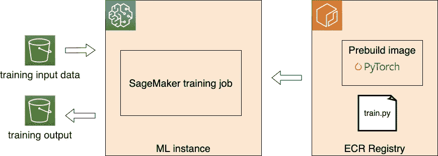

# 在亚马逊 SageMaker PyTorch 培训工作中使用 TensorBoard:一步一步的教程

> 原文：<https://towardsdatascience.com/using-tensorboard-in-an-amazon-sagemaker-pytorch-training-job-a-step-by-step-tutorial-19b2b9eb4d1c?source=collection_archive---------37----------------------->

## 理解 Amazon SageMaker 培训工作的数据流，并通过示例学习如何在 SageMaker Pytorch 培训工作上设置 TensorBoard

# TL；速度三角形定位法(dead reckoning)

在这篇文章中，我们在这个博客中向你展示如何在亚马逊 SageMaker PyTorch 培训工作中使用 TensorBoard。这些步骤是:

1.  在 SageMaker 培训作业运行时安装 TensorBoard，此处为
2.  将 PyTorch SageMaker 估计器初始化时的*tensor board _ output _ config*参数配置为[这里](https://sagemaker.readthedocs.io/en/stable/amazon_sagemaker_debugger.html#capture-real-time-tensorboard-data-from-the-debugging-hook)
3.  在 PyTorch 培训脚本中，记录您想要监控和可视化的数据，如这里的[所示](https://pytorch.org/docs/stable/tensorboard.html)
4.  启动 tensorbard 并将日志目录指向步骤 2 中配置的 s3 位置

# **写这篇博客的原因**

在我最近的一个项目中，我需要使用 TensorBoard 来可视化来自亚马逊 SageMaker PyTorch 培训工作的指标。在网上搜索并查看了 AWS 官方文档、SageMaker SDK 示例和 AWS 博客后，我意识到没有针对该主题的现有分步教程。所以，我写这篇文章，希望给你一个现成的解决方案。这篇文章也可以在我的[博客](https://www.sun-analytics.nl/posts/2020-05-23-using-tensorboard-in-an-amazon-sagemaker-pytorch-training-job-a-step-by-step-tutorial/)里找到。

# **SageMaker 培训作业如何在 S3 和培训实例之间交换数据**

首先，让我们在执行 PyTorch SageMaker 培训工作时有一个总体的了解。SageMaker 简化了以下流程:

SageMaker 培训工作

1.  启动并准备请求的 ML 实例
2.  从 S3 下载输入数据
3.  从 ECR 中提取训练图像
4.  执行训练文件(上图中的 train.py)作为训练的入口点
5.  把训练模型神器推回 S3

让我们通过下面的例子来放大 ML 实例和 S3 之间的数据交换。这里我们使用 [SageMaker Python SDK](https://sagemaker.readthedocs.io/en/stable/) 。

**输入数据:**

*   输入数据位置由[估算器配置。拟合](https://sagemaker.readthedocs.io/en/stable/estimators.html#sagemaker.estimator.EstimatorBase.fit)函数*输入*参数。在这个例子中，训练数据是具有 S3 前缀*S3://input-data-bucket/train*的所有对象，验证数据也是如此。
*   数据下载到 ML 实例中，位于*/opt/ML/input/data/****train****和/opt/ML/input/data/****val****文件夹中。“ *train* ”和“ *val* ”通道通过 *estimator.fit.inputs* 参数字典中的键进行配置。*

***输出模型神器***

*   *您的训练脚本应该将您所有的最终模型工件写到目录 */opt/ml/model* 中。*
*   *SageMaker 将 */opt/ml/model* 下的数据作为单个对象以压缩 tar.gz 格式复制到您在估计器对象 ***output_path*** 参数中指定的 S3 位置。在我们的示例中，在训练作业成功之后，模型工件被定位为*S3://output-data-bucket/model/model . tar . gz*。*

# ***在 SageMaker PyTorch 培训工作中逐步使用 tensor board***

## ***同步张量板日志***

*SageMaker 调试器是去年年底[的一个特性。它提供了一种](https://aws.amazon.com/about-aws/whats-new/2019/12/introducing-amazon-sagemaker-debugger-get-complete-insights-into-the-training-process-of-machine-learning-models/)[非常简单的方式](https://sagemaker.readthedocs.io/en/stable/amazon_sagemaker_debugger.html#capture-real-time-tensorboard-data-from-the-debugging-hook)从 SageMaker 培训工作中发出 TensorBoard 数据。要使调试钩子发出张量板数据，需要如下指定新选项`TensorBoardOutputConfig`:*

*在训练作业期间，调试挂钩将生成的张量板数据近乎实时地上传到从配置中提供的`s3_output_path`的值导出的 S3 路径。*

*在你的训练脚本中，你应该把你的 TensorBoard 日志写到 ML 实例中由`s3_output_path`指示的本地文件夹中。如果跳过设置，默认目录是*/opt/ml/output/tensor board/*。以下是一些示例代码:*

## *在 SageMaker PyTorch 容器中安装 TensorBoard*

*默认情况下，SageMaker PyTorch 容器中不包含 TensorBoard 包，SageMaker Python SDK 中的 PyTorch estimator 使用该包。你得先装 TensorBoard。最简单的方法是使用在 [SDK 文档](https://sagemaker.readthedocs.io/en/stable/using_pytorch.html#using-third-party-libraries)中描述的 requirements.txt 文件:*

> *如果您想在您的脚本中使用其他包，您可以在与您的训练脚本相同的目录中包含一个`requirements.txt`文件，以便在运行时安装其他依赖项。`requirements.txt`和你的训练脚本应该放在同一个文件夹里。创建 PyTorch 估计器时，必须在`source_dir`参数中指定该文件夹。*

## *启动 TensorBoard 服务器*

*现在，我们可以通过命令`*F_CPP_MIN_LOG_LEVEL=3 AWS_REGION=YOUR-AWS-REGION tensorboard --logdir s3://tensorboard-output-location*`启动 TensorBoard 服务器*

*   *TensorBoard 支持直接从 S3 加载日志文件。我们将日志目录指定为在`TensorBoardOutputConfig`中配置的目录。*
*   *您需要正确设置 AWS 环境变量，例如`AWS_ACCESS_KEY_ID and AWS_ACCESS_KEY_ID.`*
*   **F_CPP_MIN_LOG_LEVEL* 可以抑制详细日志*
*   *如果您在 SageMaker 笔记本实例中运行 TensorBoard 服务器，您可以通过预先设计的笔记本实例 url 访问 TensorBoard 页面，例如[***https://YOUR-NOTEBOK-INSTANCE-name . notebook . YOUR-region . SageMaker . AWS/proxy/6006/****。*](https://YOUR-NOTEBOK-INSTANCE-NAME.notebook.YOUR-REGION.sagemaker.aws/proxy/6006/.) 注意最后一个反斜杠是 madantory，否则看不到 TensorBoard 页面。*

# ***参考***

*   *SageMaker 容器提供的环境变量列表:[https://github . com/AWS/SageMaker-Containers # list-of-provided-environment-variables-by-SageMaker-Containers](https://github.com/aws/sagemaker-containers#list-of-provided-environment-variables-by-sagemaker-containers)*
*   *SageMaker 培训工作如何运作[https://docs . AWS . Amazon . com/sage maker/latest/DG/how-it-works-training . html](https://docs.aws.amazon.com/sagemaker/latest/dg/how-it-works-training.html)*
*   *SageMaker 调试器[https://docs . AWS . Amazon . com/SageMaker/latest/DG/train-debugger . html](https://docs.aws.amazon.com/sagemaker/latest/dg/train-debugger.html)*
*   *Estimator:通过 SageMaker Python SDK[https://sagemaker.readthedocs.io/en/stable/estimators.html](https://sagemaker.readthedocs.io/en/stable/estimators.html)为 SageMaker 培训提供的高级接口*