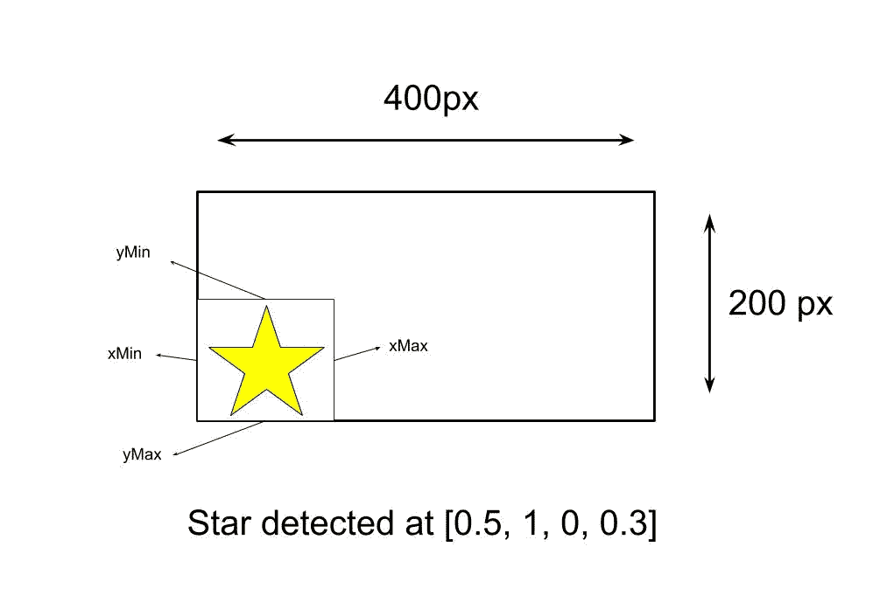
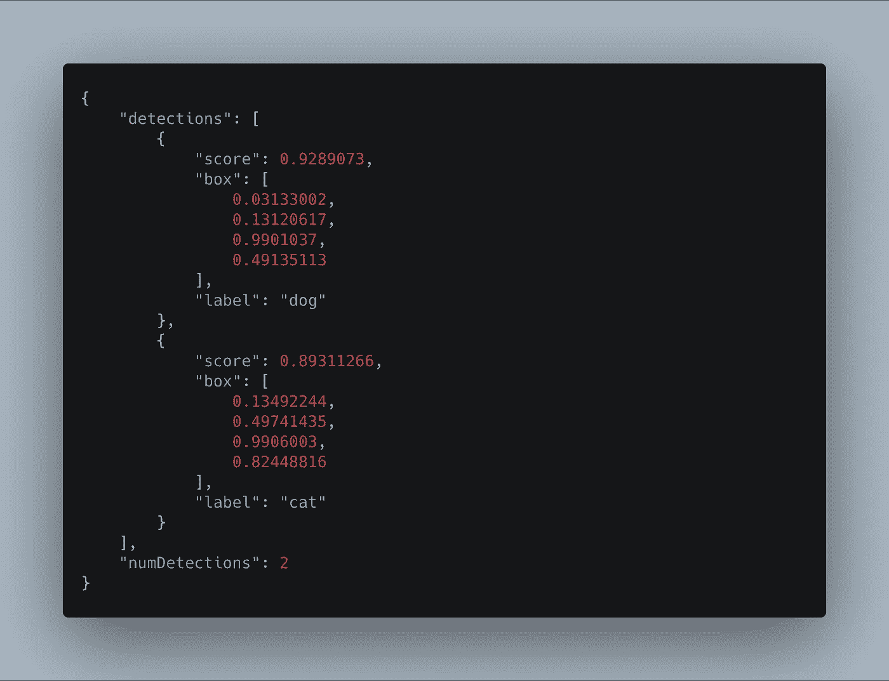
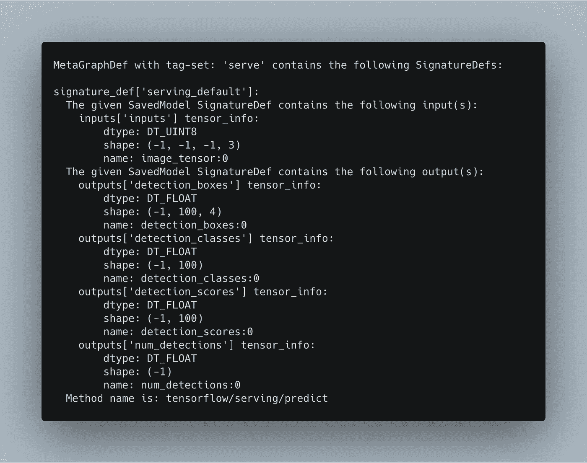

# 使用 TensorFlow Go 通过 web 服务服务于对象检测模型

> 原文：<https://towardsdatascience.com/using-tensorflow-go-to-serve-an-object-detection-model-with-a-web-service-7a47a0cc3d7d?source=collection_archive---------45----------------------->

## 使用 TensorFlow Go 构建 web 服务来服务 MobileNet 对象检测模型。

照片由[詹尼斯·布兰德](https://unsplash.com/@jannisbrandt?utm_source=medium&utm_medium=referral)在 [Unsplash](https://unsplash.com?utm_source=medium&utm_medium=referral) 拍摄

张量流这个术语超出了 Python 和神经网络的范畴。在这个时髦的词背后，有一个由几个框架、项目甚至硬件组成的完整生态系统。其中一个项目是 **TensorFlow Go** 。这个 TensorFlow API for Go 擅长在 Go 程序中加载和部署模型，这些模型是用 Python 对应物创建的。在本教程中，我们将看到一个这样的例子。这里的目标是在 Go 中创建一个 web 服务器，为 TensorFlow 中训练的对象检测模型提供服务。

# 安装 TensorFlow Go

安装 TensorFlow Go 需要使用下载软件包

`$ go get github.com/tensorflow/tensorflow/tensorflow/go`

此外，您需要安装 TensorFlow C 库。安装起来没那么简单，为了避免侧钻，这里就不讨论了。你可以在 https://www.tensorflow.org/install/lang_c[找到说明。](https://www.tensorflow.org/install/lang_c)

# 项目的设计

对于第一次迭代，我只向项目中添加一个对象检测模型。然而，我将这些功能实现为包，以防将来我决定添加额外的模型。如果发生这种情况，我将重用部分代码或将其他部分重构为接口。

# 模型

我们将服务的模型是在从[http://download . tensor flow . org/models/object _ detection/SSD _ MobileNet _ v1 _ COCO _ 2018 _ 01 _ 28 . tar . gz](http://download.tensorflow.org/models/object_detection/ssd_mobilenet_v1_coco_2018_01_28.tar.gz)获得的 COCO 数据集上训练的 SSD MobileNet 对象检测模型。“但是胡安，MobileNet，SSD，还有 COCO。这是什么意思？”很高兴你问了！我将从 MobileNet 开始简要解释这些术语。

MobileNet ( [Howard et al.](https://arxiv.org/abs/1704.04861) )是一个轻型机器学习模型家族，以精度换取速度和性能。顾名思义，MobileNet 设计用于移动或嵌入式设备。SSD，代表单次多盒检测器([刘等](https://arxiv.org/abs/1512.02325))，是指使用单个神经网络来检测对象的方法。与这种“单镜头”方法相对应的是一种架构，它使用一个称为“提议生成器”的额外组件来查找图像的感兴趣区域。最后，我们有 COCO，它是“上下文中常见对象”的缩写([林等人](https://arxiv.org/pdf/1405.0312.pdf))，用于训练模型的数据集。COCO 数据集是一个超过 200，000 个标记图像的集合，这些图像分布在 90 个类别中，包括“鸟”、“猫”、“人”和“车”。"

# 服务

我们将构建的服务有一个端点——`predict`——它将图像的路径作为参数。它的响应是一个 JSON，包含以下字段:

*   `detections`:被检测对象的数组，包括以下对象:`score`、`box`和`label`。
*   `score`:检测的置信度得分。
*   `box`:检测对象的边框(`[yMin, xMin, yMax, xMax]`)。这个数字不是检测的像素位置。相反，返回值是相对于图像的宽度和长度的位置。例如，在大小为[400，200]的图像中，位于其垂直中心的对象的`yMin`值为 0.5(图 1)。
*   `label`:被检测对象的 COCO 类。
*   `numDetections`:检测总数。

图一。检测到的对象的示例。

图 2 给出了一个响应示例。

图二。服务的输出。

# 构建服务

## 下载模型

从这里下载模型开始教程[http://download . tensor flow . org/models/object _ detection/SSD _ mobilenet _ v1 _ coco _ 2018 _ 01 _ 28 . tar . gz](http://download.tensorflow.org/models/object_detection/ssd_mobilenet_v1_coco_2018_01_28.tar.gz)。然后解压缩文件。在该目录中，您填充了几个文件，其中包括关于模型的元数据、训练配置文件(来自 TensorFlow 的对象检测 API)、检查点等。从所有这些中，您只需要 saved_model/目录。所以复制它，并粘贴到您的工作目录。

## 加载模型

下载完模型后，下一步是将其加载到 TensorFlow Go 中。在工作目录中，创建一个新文件夹，并将其命名为 models。在里面，创建一个文件 *coco_ssd_mobilenet.go* 。然后添加以下代码:

在最上面，我们有包的名字，imports，和一个 struct Coco，我们将在其中添加模型。结构之后是文件的路径和创建结构的构造函数。很标准的做法。然后就变得有趣了。

该结构的第一个方法`Load()`加载模型。它的第一行`tf.LoadSavedModel()`，使用模型的路径、一系列**标签**和一个我们目前不需要的`SessionOptions`对象作为参数:

等等，**标签**？那是什么？

## SavedModel 标记和签名

像我们这样的 TensorFlow SavedModel 可以有多个图。因此，为了识别它们，这些图表与标签相关联。因此，当加载模型时，你需要指定你要使用的图。在这个例子中，我们需要标记“serve”，它预测。要查看 SavedModel 的标签，以及我们即将使用的模型的其他信息，您需要 TensorFlow 安装附带的工具 **saved_model_cli** 。要使用它，请执行以下命令:

`$ saved_model_cli show --dir PATH/TO/MODEL/ssd_mobilenet_v1_coco_2018_01_28 --all`

下面的图 3 显示了输出。

图 3。模型的“服务”标签。

上面是标签“serve”的签名。SavedModel 签名定义了模型的输入和输出。这个模型的输入是一个名为“image_tensor”的张量，其`dtype`为`UINT8`，输入形状(-1，-1，-1，3)(任意大小的一批彩色图像)。至于输出，它们与我们在 JSON 响应中返回的值相同(detection_boxes、detection_classes、detection_scores 和 num_detections)。

有关 SavedModel 的更多信息，请访问[https://www.tensorflow.org/guide/saved_model](https://www.tensorflow.org/guide/saved_model)

## 阅读标签

加载模型后，下一步是读取标签文件。Coco 模型有 91 个类，因此，模型的输出是 1 到 91 之间的一个数字。但是这个值对用户来说没有意义。如果你给我看，我会说，“这是什么数字？我需要实际的标签。”因此，我将数据集的标签收集在一个名为 labels.txt 的文件中，目标是将模型的输出映射到一个标签:

以上是功能`readLabels()`。这个函数读取标签文件并将它们作为字符串片段返回。要使用该函数，从`Load()`添加对它的调用:

## 预测

现在最酷的部分来了:预测。总而言之，预测包括获取输入图像，将其转换为张量，然后将其提供给模型。正如我们在模型的签名中看到的，在预测之后，它产生四个张量`detection_boxes`、`detection_classes`、`detection_scores`和`num_detections`。这些值是用户将收到的信息:

`Predict()`有一个参数`[]byte`，代表图像。在函数的第一行，我们将使用`[]byte`并使用即将到来的函数`makeTensorFromBytes()`将其转换为张量。然后，我们使用`Run()`方法和刚刚转换的张量作为输入来执行图形。至于输出，使用一个`[]tf.Output`切片，包含模型的所有可能输出。接下来是函数`responses.NewObjectDetectionResponse()`将输出值封装在一个结构中。在进入细节之前，我们先来看看`makeTensorFromBytes():`

函数`makeTensorFromBytes()`取自[这里的](https://github.com/tensorflow/tensorflow/blob/master/tensorflow/go/example_inception_inference_test.go)，将`[]byte`转换为张量。在它的内部有一个对`makeBatch()`的调用，这个函数为一个张量增加了一个额外的维度，并将其转换为大小为 1 的一批(还记得输入形状第 4 维输入形状):

最后，我们需要一个方法`CloseSession()`来结束会话:

## 准备响应

在预测并得到结果后，我们需要提取值，并使它们对用户来说是可显示的。为了实现这一点，我创建了一个名为`responses`的新包，并在其中添加了一个由检测列表和检测数量组成的`ObjectDetectionResponse`结构:

这里最重要的部分是`NewObjectDetectionResponse`函数，负责创建响应。这个函数有两个参数:输出张量和标签列表。输出张量与几个类型断言语句一起使用，以获取它们的值。然后，在一个循环中，我们迭代`numDetections`次，每次都检查检测的置信度是否低于给定的阈值。如果是真的，我们继续。否则，创建一个由乐谱、边界框和标签组成的`detection`实例，并将其添加到列表`detection`中。在函数结束时，返回`ObjectDetectionResponse`对象。

# 网络服务

因此，我们到达了最后一部分:网络服务。如上面的例子所示，该服务有一个 POST 方法，它接收一个图像并以 JSON 的形式返回`ObjectDetectionResponse`:

两个函数中的第一个，`main()`加载模型并设置服务。而第二个函数，处理函数`predict()`，接收图像并执行预测。

要运行服务器，请执行`$ go run main.go`。要进行测试，执行 run a *curl* 命令，就像这样`curl -F "data=@PATH/TO/IMAGE" [http://localhost:8080/predict](http://localhost:8080/predict)`。

尽情享受吧！

# 概述

TensorFlow 是一个由多个平台组成的庞大生态系统。其中之一 TensorFlow Go 能够执行由 TensorFlow (Python)和 TensorFlow.js 等同类产品生成的图形。在本教程中，我们构建了一个程序来加载对象检测 MobileNet 模型，并通过 web 服务为其提供服务。

该项目可以用作一个库。如果您想使用它，运行`$ go get github.com/juandes/tensorflow-go-models/models`。为了进行测试，您可以使用上面给出的 web 服务器代码。将来，我想在项目中添加更多的模型，并将我们使用的一些方法转换成接口。这样，我们可以轻松地扩展项目以支持更多的模型。如果你想尝试并添加一个新的模型，请随时提交您的 PR。

完整的源代码可以在 https://github.com/juandes/tensorflow-go-models[获得](https://github.com/juandes/tensorflow-go-models)