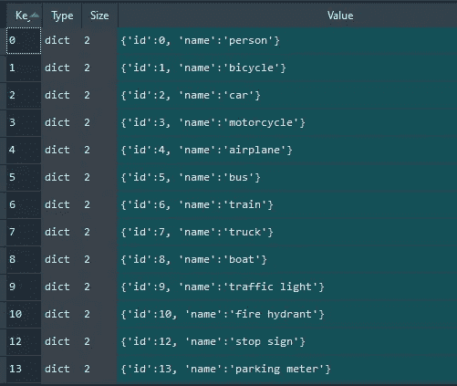
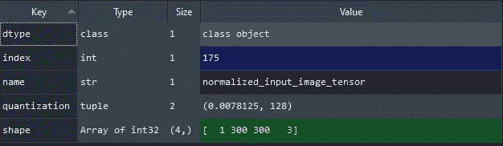
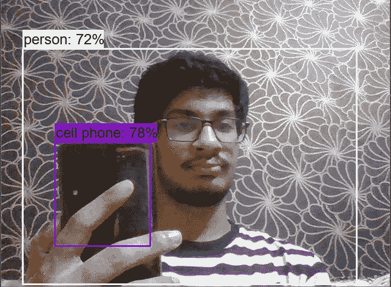
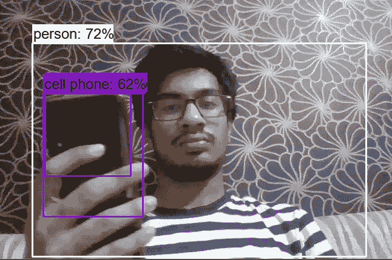

# 使用 Tensorflow Lite 进行对象检测

> 原文：<https://towardsdatascience.com/using-tensorflow-lite-for-object-detection-2a0283f94aed?source=collection_archive---------5----------------------->

## 了解如何使用在 Python 中的 COCO 数据集上预训练的 MobileNet SSD 模型，在具有完整代码和非最大抑制的边缘设备上运行。


伊利亚·赫特在 [Unsplash](https://unsplash.com?utm_source=medium&utm_medium=referral) 拍摄的照片

Tensorflow 最近发布了用于 Tensorflow 2 的对象检测 API，tensor flow 2 有一个非常大的模型动物园。然而，他们只提供了一款采用 Tensorflow lite 的 MobileNet v1 SSD 型号，此处描述的是。在那篇博文中，他们提供了在 Android 和 IOS 设备上运行的代码，但没有为 edge 设备提供代码。随着 edge 设备的普及和 OpenCV 发布空间 AI 套件，我想填补这一空白。这正是我们将在这里看到的。

# 要求

这不需要安装 Tensorflow 对象检测 API 即可运行。一个简单的 Tensorflow 安装，以及用于图像处理的 OpenCV 足以运行它。

```
pip install tensorflow
pip install opencv
```

我使用了对象检测 API 中提供的一些代码来使工作变得更容易，但没有必要担心它，因为不需要显式安装它，你可以在这里找到完整的代码。

预训练模型可以从 Tensorflow 的博客[这里](https://www.tensorflow.org/lite/models/object_detection/overview)下载，或者也提供代码。

# 标签

我们的第一步是将标签制作成随后需要的格式，这是一个嵌套的字典，里面有 id 和标签。我们将使用随模型提供的标签地图文本文件，并将其转换为所需的格式。

***注*** :-标签用“？？?"需要被忽略，并且除了第一个索引之外，跳过那些索引。所以每个标签都向后移动了一个位置。例如，标签“person”位于第一行，但它将被分配一个标签 0，依此类推。

这可以在它的 Java 实现中找到注释。

> // SSD Mobilenet V1 模型假设类 0 是后台类
> 
> //在标签文件和类标签中，从 1 开始到 number_of_classes+1，
> 
> //而 outputClasses 对应于从 0 到 number_of_classes 的类索引

这可以通过下面的代码来完成:

```
def create_category_index(label_path='path_to/labelmap.txt'):
    f = open(label_path)
    category_index = {}
    for i, val in enumerate(f):
        if i != 0:
            val = val[:-1]
            if val != '???':
                category_index.update({(i-1): {'id': (i-1), 'name': val}})

    f.close()
    return category_index
```

这里，忽略第一行，我使用 if 语句并存储`i-1`。这将创建一个字典，如下所示。



字典已创建

它将有 80 行，89 个键。

# TfLite 解释程序

标签做好了，让我们来了解一下 TfLite 的解释器，以及如何得到结果。

## 初始化解释程序

```
import tensorflow as tfinterpreter = tf.lite.Interpreter(model_path="path/detect.tflite")
interpreter.allocate_tensors()
```

只需加载你的 tflite 模型的正确模型路径，分配张量即可。

## 输入和输出详细信息

要获得输入和输出的详细信息，请编写:

```
input_details = interpreter.get_input_details()
output_details = interpreter.get_output_details()
```

现在，让我们研究它们，看看给出什么类型的输入和我们将得到的输出。

输入细节是一个只有 1 个元素的列表，它是一个字典，如下所示。



输入详细信息

这里，我们可以看到输入形状是`[1, 300, 300, 3]`。除此之外，它要求输入图像的数据类型为`np.uint8`。

输出细节是一个包含 4 个元素的列表，每个元素包含一个类似输入细节的字典。每个调用返回 10 个结果，第一项存储矩形边界框，第二项存储检测类，第三项存储检测分数，最后一项存储返回的检测数。返回的边界框是标准化的，因此它们可以缩放到任何输入尺寸。

为了获得输出，我们需要读取图像，如果使用 OpenCV，将其转换为 RGB，适当地调整其大小，并在用输入帧设置张量后调用解释器。然后可以使用解释器的`get_tensor`功能获得所需的值。

```
import cv2img = cv2.imread('image.jpg')
img_rgb = cv2.cvtColor(img, cv2.COLOR_BGR2RGB)
img_rgb = cv2.resize(img_rgb, (300, 300), cv2.INTER_AREA)
img_rgb = img_rgb.reshape([1, 300, 300, 3])interpreter.set_tensor(input_details[0]['index'], img_rgb)
interpreter.invoke()de_boxes = interpreter.get_tensor(output_details[0]['index'])[0]
det_classes = interpreter.get_tensor(output_details[1]['index'])[0]
det_scores = interpreter.get_tensor(output_details[2]['index'])[0]
num_det = interpreter.get_tensor(output_details[3]['index'])[0]
```

# 使用对象检测代码进行绘制

为了可视化，我使用了可用的 python 代码[这里是](https://github.com/tensorflow/models/blob/master/research/object_detection/utils/visualization_utils.py)，它不仅可以用来绘制边界框，如果需要的话还可以用来绘制关键点和实例遮罩。我们需要传递要绘制的图像、边界框、检测到的类、检测分数和标签字典。除此之外，当我们从解释器接收到归一化的边界框坐标时，我们还将归一化的坐标设置为 true。

```
from object_detection.utils import visualization_utils as vis_utilvis_util.visualize_boxes_and_labels_on_image_array(
    img,
    output_dict['detection_boxes'],
    output_dict['detection_classes'],
    output_dict['detection_scores'],
    category_index,
    use_normalized_coordinates=True,
    min_score_thresh=0.6,
    line_thickness=3)
```

# 结果

它将给出如下所示的结果。



结果

但是，仍然有一个问题需要解决，如下所示。



问题结果

这可以通过非最大抑制来实现。

# 非最大抑制

我不打算解释它，因为它已经在互联网上的各种文章中深入讨论过了。一个这样的例子是这篇文章。为了实现它，我将使用`combined_non_max_suppression` Tensorflow Image 来执行这个任务，因为它允许我们同时处理多个类。它获取输出并返回阈值后剩余的预测。

```
def apply_nms(output_dict, iou_thresh=0.5, score_thresh=0.6):q = 90 # no of classes
    num = int(output_dict['num_detections'])
    boxes = np.zeros([1, num, q, 4])
    scores = np.zeros([1, num, q])
    # val = [0]*q
    for i in range(num):
        # indices = np.where(classes == output_dict['detection_classes'][i])[0][0]
        boxes[0, i, output_dict['detection_classes'][i], :] = output_dict['detection_boxes'][i]
        scores[0, i, output_dict['detection_classes'][i]] = output_dict['detection_scores'][i]
    nmsd = tf.image.combined_non_max_suppression(
    boxes=boxes,
    scores=scores,    
    max_output_size_per_class=num,                                            
    max_total_size=num,
    iou_threshold=iou_thresh,
    score_threshold=score_thresh,
    pad_per_class=False,
    clip_boxes=False)

    valid = nmsd.valid_detections[0].numpy()
    output_dict = {
                   'detection_boxes' : nmsd.nmsed_boxes[0].numpy()[:valid],
                   'detection_classes' : nmsd.nmsed_classes[0].numpy().astype(np.int64)[:valid],
                   'detection_scores' : nmsd.nmsed_scores[0].numpy()[:valid],
                   }
    return output_dict
```

下面给出了完整的代码，或者你可以访问我的 Github [repo](https://github.com/vardanagarwal/Proctoring-AI/tree/master/coco%20models/tflite%20mobnetv1%20ssd) ，它也包含了`visualization_utils.py`和模型。

在结束之前，我想澄清一件事，如果你试图在采用英特尔处理器的 Windows 上运行它，你会得到一个可怕的 fps。我在 i5 上得到了大约 2，作为比较，没有 tflite 的相同 Tensorflow 模型给了我大约 8 fps。这里的[就是解释这个](https://stackoverflow.com/questions/54093424/why-is-tensorflow-lite-slower-than-tensorflow-on-desktop)。然而，在 edge 设备上，这不是问题，而且内存占用相当少，这将有利于他们的内存限制。

虽然这个模型不是很准确，但我希望我会提供一个样板文件，使您在使用 Tflite 的对象检测器时更容易完成任务。