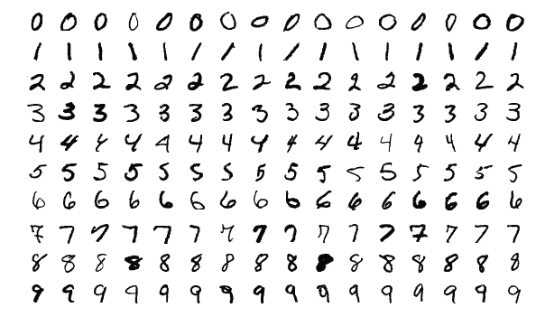

# 使用 TFRecords 训练 CNN 了解 MNIST

> 原文：<https://towardsdatascience.com/using-tfrecords-to-train-a-cnn-on-mnist-aec141d65e3d?source=collection_archive---------19----------------------->

## 编写、读取和使用 TFRecords 的简短演练

当我开始使用 TFRecords 时，我花了一段时间来理解它的概念。有那么多新事物。为了让其他人免于这种麻烦，我创建了一个基于 MNIST 数据集的实践演练。

注意:这篇博文现在在[有一个更通用的版本](/training-a-neural-network-on-tfrecord-files-8bff3b6e9ff4)，包含了更多最新的概念。此外，还要注意的是，一旦你开始使用，TFRecord 格式并不是那么难，这就是为什么我创建了一个[的实用介绍](/a-practical-guide-to-tfrecords-584536bc786c)。要了解更多，在本教程之后，我建议您参考这两个资源。

# 概观

MNIST 数据集由黑白的数字化手写数字组成。每张图片 28x28x1，非常小。整个数据集的内存占用只有 32 MB。

数据集概述。作者[约瑟夫·斯泰潘](https://commons.wikimedia.org/wiki/File:MnistExamples.png)。

# 导入和助手函数

让我们从必要的进口开始；两个库，os 和 Tensorflow。此外，我们还设置了一个全局变量 AUTOTUNE，我们稍后会用到它。

首先，我们将 MNIST 数据集下载到本地机器上。然后，我们将两个选项设置为 True， *shuffle_files* 和 *as_supervised* 。

当我们创建 TFRecord 数据集时，使用第一个选项；第二个选项允许稍微舒服一点的迭代。

我们还可以通过调用。基数()。

以下四个函数提高了可读性，并用于创建我们写入 TFrecord 文件的单个示例。

# 写入 TFRecords

接下来，我们检查所有拆分(这里，只有“训练”和“测试”)。

对于每个分割，我们创建一个 *TFRecordWriter* ，它将解析后的示例写入文件。请注意，我们将当前处理的分割添加到文件名中——这允许我们稍后通过字符串模式对文件进行分组。我们使用的额外索引用于计算我们写入磁盘的样本数量。这个小技巧对于自定义数据集很有帮助。cardinality()操作不会返回元素的数量。

因为我们之前设置了 as_supervised，所以现在我们可以迭代(例如，label)对。

主要的示例生成发生在临时字典*数据*的创建期间。首先，我们将稍后要使用的每个数据字段转换成一个 *tf.train.Feature* 。对于图像的高度和宽度，我们使用一个 *_int64_feature* (因为这些数字是整数)；对于实际的图像数据，我们首先序列化数组，然后将其转换成一个 *bytes_list* 。存储非标量数据需要这种转换。

定义好所有特性后，我们现在可以创建一个单独的*示例*并将其写入 TFRecord 文件。

我们继续进行，直到处理完当前拆分的所有示例，然后对以下子集重复该过程。

在处理完两个子集之后，我们已经创建了前两个 TFRecord 文件(耶！)，一个保存训练，一个保存测试数据。我们为每个子集的每个记录增加的索引在训练模型时很有用:

对于 tensorflow_datasets 附带的数据集，只需调用。基数()。这不会报告像我们这样的自定义数据集的实际大小，而是返回-1，这意味着示例的数量是未知的。

但是，当在这样的数据集上训练时，我们必须知道我们的数据集可以交付多少批。否则，我们可能会在一个无限循环中运行；详情见下文。

简单回顾一下:我们使用了 MNIST 数据集，并将所有示例写入 TFRecord 文件。

# 正在读取 TFRecords

在创建之后，我们希望将它们读回内存中。这个过程与上面类似，但方向相反:

我们创建了一个从 TFRecord 文件中读取示例的函数。在这里，我们创建了一个字典，其中包含了我们希望从示例中使用的所有字段；这本字典类似于我们用来写数据的那本。对于每个键，我们定义一个占位符。注意最后一个字段:它的类型是 *tf.string* (尽管我们将它存储为一个字节列表)；所有其他字段都用与以前相同的类型初始化。

准备好字典后，我们可以从 TFRecord 文件中提取示例。最后，我们获得原始图像数据。注意，我们将 *uint8* 设置为数据类型。如果我们的图像包含浮点，我们将设置 *float64* 为数据类型。由于 MNIST 数据的范围在 0 到 255 之间，因此我们可以接受整数:

# 创建数据集

通过下面的函数，我们围绕 TFRecord 文件创建了一个数据集。以前，我们只定义了一个函数来得到一个例子；现在我们创建一个 *TFRecordDataset* 来将所有的例子映射到这个函数。

我们在中间语句中这样做。这里，我们使用上面创建的自动调优器。在训练过程中，稍后，它会自动确定我们可以并行处理多少个示例。这可以减少 GPU 的空闲时间。

之后，我们重组数据，设置批量大小，并设置 repeat，不带参数；这意味着无休止地重复。这需要我们记住我们的数据集有多少个例子(如上所述)。

[作为一种简单的替代方法，我们可以在这里将 repeat 设置为我们稍后想要训练的时期数，并将 fit()-函数中的时期数设置为 1。这使得数据集通过我们的网络解析“epoch”次(因为我们用 epoch 的数量设置了 repeat()，但是只解析一次(因为我们用 epochs = 1 设置了 fit())。]

最后，我们让自动调优器决定预取的最合适的例子数量。

到目前为止，我们只创建了一个数据集，并向它映射了一个数据生成函数。作为健全性检查，让我们看一下数据集给我们的一个样本。

它返回两个张量。第一个张量的形状为(32，28，28，1)(因为我们取了一个批次，批次大小为 32)，第二个张量的形状为(32，)(因为我们有 32 个标签，在我们的批次中每个示例一个)。

到此为止，我们来回顾一下:

我们创建了两个 TFRecord 文件，一个用于训练数据，一个用于测试数据。我们通过迭代原始 MNIST 数据集中的所有(影像，标注)对，将它们转换为 tf.train.Feature。所有要素一起形成一个示例。然后，我们创建了一个函数来反转这一点；它从存储在 TFRecord 文件中的示例中提取特征。最后，我们将该函数映射到我们的数据集，并进行健全性检查，看看是否一切正常。

# 培养

我们的下一步是在 TFRecordDataset 上训练一个网络。

我们使用一个简单的卷积神经网络；请随意尝试不同的架构。

为了保持可读性，我们编写了一个函数来返回我们的网络，并检查我们的输出层是否符合标签形状，

然后在我们的训练数据集上拟合网络。我们将历元数(网络看到完整数据集的次数)设置为 2。

现在，我们需要知道我们的训练数据集有多少个例子。由于我们将数据集设置为无限重复，所以我们需要告诉网络要查询多少批，直到完成一个历元；这是参数*步数每纪元:*

训练完成后，在启用 GPU 的情况下，在 Colab 上大约需要 30 秒，我们将测试该模型。由于我们还将测试数据写入了 TFRecord 文件，我们可以使用我们的 *get_dataset()* 函数从这些文件中快速创建另一个 TFRecordDataset。

由于我们将函数调用中的第二个参数设置为“test”，所以我们的数据集不会重复；我们不需要确定步骤的数量。

然后我们调用 model.evaluate()，它返回两个值的数组。

第一个数字是损失；第二个数字是我们感兴趣的:精确度。仅仅过了两个时代，它就徘徊在 95%左右，这是一个好的开始。

# 摘要

我们把重点放在 MNIST 数据集上作为我们正在进行的例子。使用它，我们创建了两个 TFRecord 文件，一个用于训练数据，一个用于测试数据。接下来，我们讨论了将数据读回内存，以最终训练 CNN。

这篇博文现在在[有了一个更通用的版本](/training-a-neural-network-on-tfrecord-files-8bff3b6e9ff4)，包含了更多最新的概念。此外，还要注意的是，一旦你开始使用，TFRecord 格式并不是那么难，这就是为什么我创建了一个[的实用介绍](/a-practical-guide-to-tfrecords-584536bc786c)。要了解更多，在本教程之后，我建议您参考这两个资源。

涵盖整个过程的 Colab 笔记本在[这里](https://colab.research.google.com/drive/19Ms8CwvTardmte9fk_jBWdBEZB8j5NP_?usp=sharing)有售。

这篇文章讨论了现有数据集环境中的 TFRecords。如果你有兴趣看到这种用于自定义数据集的文件格式，请看一下[这段代码](https://colab.research.google.com/drive/1yQRDYzJsHX8w5g042w02y0lm1S3vMscL?usp=sharing)

 [## 谷歌联合实验室

### 创建自定义 TFR 数据集

colab.research.google.com](https://colab.research.google.com/drive/1yQRDYzJsHX8w5g042w02y0lm1S3vMscL?usp=sharing) 

对于这个帖子

 [## 使用 TensorFlow 进行自定义音频分类

### 包含代码的端到端示例项目。

towardsdatascience.com](/custom-audio-classification-with-tensorflow-af8c16c38689)