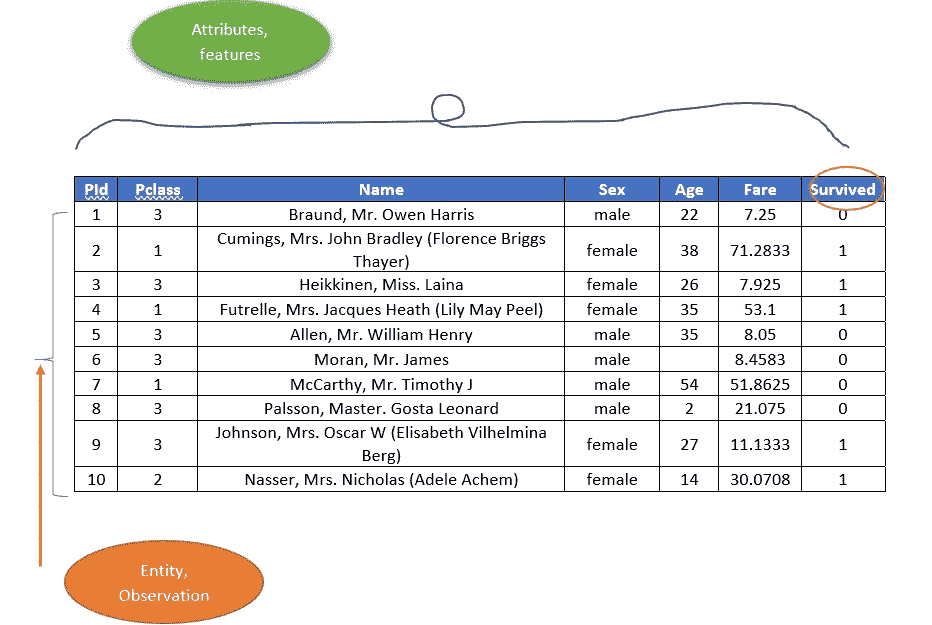
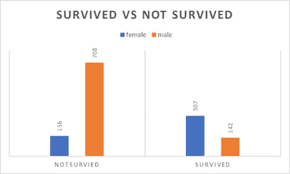
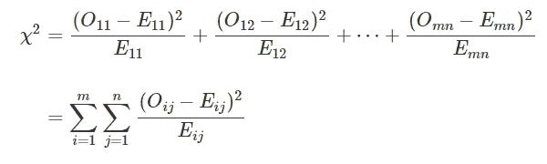
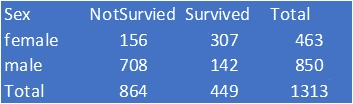
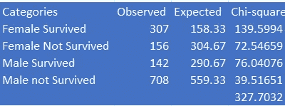
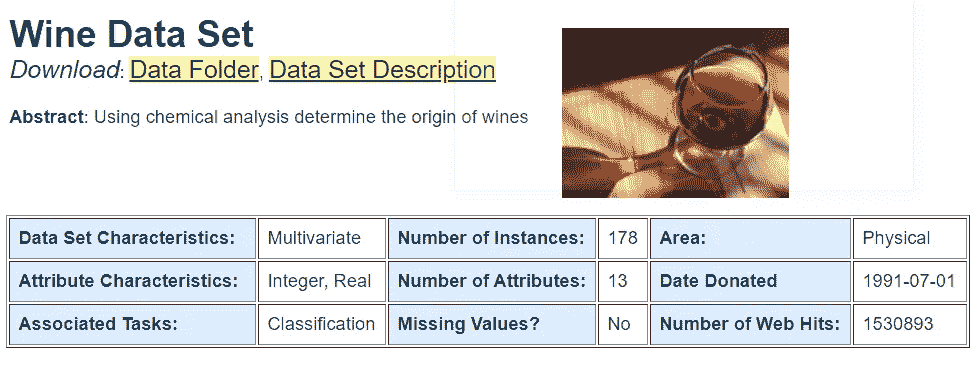

# 使用卡方检验进行特征选择和实现

> 原文：<https://towardsdatascience.com/using-the-chi-squared-test-for-feature-selection-with-implementation-b15a4dad93f1?source=collection_archive---------1----------------------->

## 特征越少，解释模型就越容易


[https://unsplash.com/@purzlbaum](https://unsplash.com/@purzlbaum)

让我们使用卡方问答方式来解决这个特征选择问题。如果你是一个视频爱好者，你可以看看我们在[同一个](https://youtu.be/hkDfi5j-6lM)的 youtube 讲座。

**问题 1:什么是特性？**

对于任何 ML 或 DL 问题，数据都是按行和列排列的。让我们以泰坦尼克号沉船问题为例。

*   这些行由乘客的数据组成，实际上，每一行都由单个乘客的数据组成。这通常被称为**实例、实体或观察。**
*   这些栏目描述了乘客的性别、年龄等。这些被称为**特征或属性。**



泰坦尼克号的数据、观察、特征(Imag 来源作者)

**问题 2:有哪些不同类型的功能？**

不涉及太多细节，让我们以上面的例子为例:

*   年龄、费用、Pid 是数字属性。但是，Pid 不会泄露任何模式，因为它通常是连续或随机分配的。
*   姓名、性别等。是分类属性(它们可以进一步分为名词性的和序数性的‘大小’,值有小、中、大之类)
*   特殊类是具有两个可能值的分类变量或二元变量，如性别或幸存变量
*   在问题的上下文中，我们要预测的变量的值是因变量，而我们要确定的变量或特征称为自变量。

**问题 3:什么是特征选择？**

在泰坦尼克号沉船数据集中，要解决的问题是给定乘客的特征，要确定乘客是否幸存(即，他是否能够接近船只)。所以，这是一个分类问题。


图片来源:[https://unsplash.com/photos/MeGmdPNe36w](https://unsplash.com/photos/MeGmdPNe36w)

如果原始数据集有关于乘客的 8 个特征，并且分类模型带来大约 90%的分类准确度，**特征选择的目标是从 8 个特征中选择可能的 3 个或 4 个，并且仍然达到相似的准确度。**

**问题 4:为什么选择功能？**

具有较少的功能:

*   这些模型更容易解释
*   模型训练更快，模型所需的空间也更大

**问题 5:特征选择和卡方有什么联系？**

实际上，这不是卡方检验，而是假设检验。同样的典型设置是:

*   H0:属性性别在乘客的生存中不起作用(特征不重要)
*   H1:属性性别在生存中扮演了一个角色(特征很重要)

值得注意的是，这些技术被称为单变量技术，因为我们分别检查每个特征。

C 当特征是分类的，目标变量是任何可以被认为是分类的时，使用卡方检验。*它衡量两个分类变量之间的关联程度。如果两者都是数字，我们可以使用皮尔森的积差相关，如果属性是数字，并且有两个类别，我们可以使用 t 检验，如果超过两个类别，我们可以使用 ANOVA*

当我们探讨性对生存状态的影响时，我们可以从一个简单的形象化开始。



泰坦尼克号生存状态对性别(图片来源:作者)

上面的图像清楚地表明，两个班级的男女比例并不相同。假设检验是一种更正式的方式。卡方统计使用以下公式计算，其中“O”代表观察值或实际值，“E”代表期望值(如果这两个类别是独立的)。如果它们是独立的，这些 O 和 E 值将是接近的，并且如果它们有一些关联，那么卡方值将是高的。



卡方公式(来源:作者)



乘客性别对抗生存(来源:作者)

上表显示了乘客的性别与生存状态。这也被称为列联表。

*   如果他们是独立的，那么幸存和未幸存的男女比例应该是相同的。
*   幸存的比率为 449/1313
*   如果没有依赖或关联，463 * 449/1313 的女性应该存活，即 158.13
*   这是独立状态下的预期计数
*   所有四种情况计算如下



卡方计算观察值与期望值(图片:作者)

这些卡方统计由自由度调整，自由度随变量的级别数和类变量的级别数而变化。

可以注意到，在适当离散化之后，卡方也可以用于数值变量。

**问题 6:如何实现相同？**

导入库

```
from sklearn import datasets
from sklearn.feature_selection import chi2
from sklearn.feature_selection import SelectKBest
```

我们将对葡萄酒数据集进行特征选择



来源:[https://archive.ics.uci.edu/ml/datasets/wine](https://archive.ics.uci.edu/ml/datasets/wine)

让我们看看卡方得分

```
# Loading wine data
X,y=datasets.load_wine(return_X_y=True)
# k = 4 tells four top features to be selected
# Score function Chi2 tells the feature to be selected using Chi Square
test = SelectKBest(score_func=chi2, k=4)
fit = test.fit(X, y)
fit.scores_
```

它将按如下方式打印这些值

```
array([5.44549882e+00, 2.80686046e+01, 7.43380598e-01, 2.93836955e+01,4.50263809e+01, 1.56230759e+01, 6.33343081e+01, 1.81548480e+00,9.36828307e+00, 1.09016647e+02, 5.18253981e+00, 2.33898834e+01,1.65400671e+04])
```

现在，如果我们想选择前四个特性，我们可以简单地做以下事情

```
X_new=test.fit_transform(X, y)
```

**尾注:**

卡方是用于分类的单变量特征选择的非常简单的工具。它没有考虑特征的相互作用。这最适合分类变量，因此在文本数据中应用广泛。

参考资料:

[1][https://youtu.be/hkDfi5j-6lM](https://youtu.be/hkDfi5j-6lM)

[2][https://machine learning mastery . com/feature-selection-machine-learning-python/](https://machinelearningmastery.com/feature-selection-machine-learning-python/)

[3][https://www . ka ggle . com/saptarsi/feature-selection-using-chi-square/](https://www.kaggle.com/saptarsi/feature-selection-using-chi-square/)