# 通过 Python 使用 Fitbit Web API

> 原文：<https://towardsdatascience.com/using-the-fitbit-web-api-with-python-f29f119621ea?source=collection_archive---------9----------------------->


上图是由 Fitbit 数据制作的，只是没有通过 API。我只是想分享我同事的工作。[https://journals.plos.org/plosone/article?id = 10.1371/journal . pone . 0227709](https://journals.plos.org/plosone/article?id=10.1371/journal.pone.0227709)

Fitbit 提供了一个 Web API，用于从 Fitbit 活动跟踪器、Aria & Aria 2 秤和手动输入的日志中访问数据。所以如果你一直在使用 Fitbit，你可以使用【https://dev.fitbit.com/build/reference/web-api/basics/】的 [Fitbit API](https://dev.fitbit.com/build/reference/web-api/basics/) ( [的](https://dev.fitbit.com/build/reference/web-api/basics/))来获取自己的数据。除了使用 API 获取数据的便利之外，您还可以在在线应用程序上获取数据，您可以使用 API 获取在线应用程序上不可用的当天(每分钟)数据。虽然本教程最初与 Stephen Hsu 的惊人的[教程](/collect-your-own-fitbit-data-with-python-ff145fa10873)相似，但我想我应该稍微更新一下这个过程，解决几个你可能会遇到的错误，并展示一点你如何绘制数据。和往常一样，本教程中使用的代码可以在我的 [GitHub](https://github.com/mGalarnyk/Python_Tutorials/blob/master/Apis/Fitbit/Fitbit_API.ipynb) 上获得。就这样，让我们开始吧！

# 1.)创建一个 Fitbit 帐户

您可以点击[这里](https://www.fitbit.com/signup)创建一个 Fitbit 账户。它会带你到一个类似下面的页面。

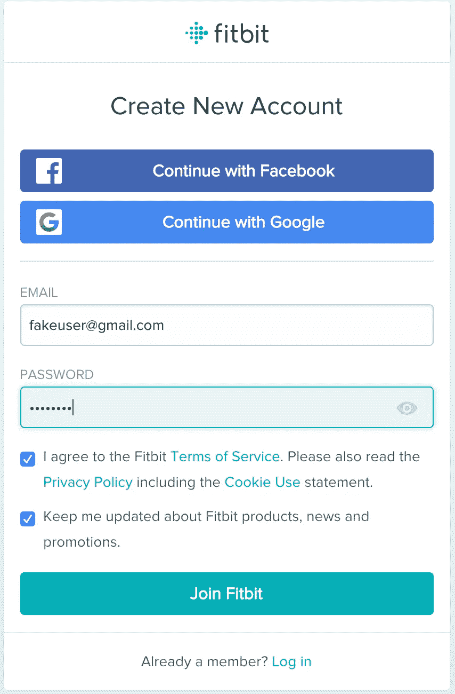

你不需要像我一样勾选“随时更新”框。此外，fakeuser@gmail 不是我的帐户使用的电子邮件。

# 2.)设置您的帐户并创建应用程序

前往[dev.fitbit.com](https://dev.fitbit.com/getting-started/)。将鼠标悬停在“管理”上，然后点击“注册应用程序”。

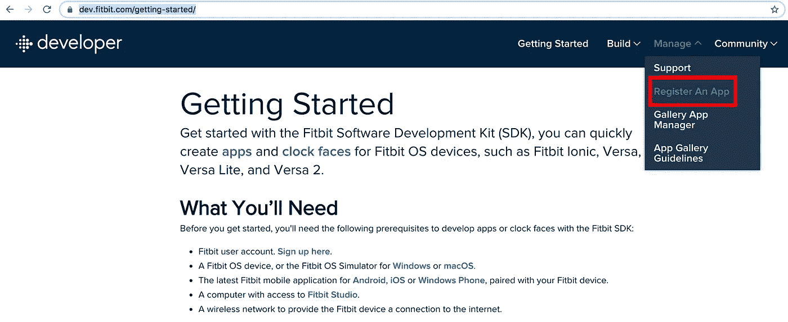

应该会出现一个类似于下图的页面。


(**答**)你需要指定个人，以便能够更方便地要求下载日内数据(如果你没有或得到一个错误，你可以随时要求它[这里](https://dev.fitbit.com/build/reference/web-api/intraday-requests/))。( **B** )回调 URL 是 http://127.0.0.1:8080，因为我们将使用的 Python API 将它作为默认重定向 URL。

对于图像中的每个字段，这里有一些关于您可以在注册页面中放置什么的建议。

**应用名称:**可以是任何东西。

**描述:**可以是任何东西。

**申请网址:**可以是任何东西。

**组织:**可以是任何东西。

**组织网站:**由于我是个人使用(查看个人 fitbit 数据)，这可能不适用。

**服务条款网址:**我放了 Fitbit 服务条款:[https://dev.fitbit.com/legal/platform-terms-of-service/](https://dev.fitbit.com/legal/platform-terms-of-service/)

**隐私政策网址:**我放了 Fitbit 隐私政策:[https://www.fitbit.com/legal/privacy-policy](https://www.fitbit.com/legal/privacy-policy)

**OAuth 2.0 申请类型:**如果您想下载您的日内数据，OAuth 2.0 申请类型应为“个人”。顺便说一下，如果你不知道 OAuth 是什么，[这里有一个解释](https://www.varonis.com/blog/what-is-oauth/)。

**回调 Url:** 确保回调 Url 是 http://127.0.0.1:8080/这是因为我们将使用的库需要这样做，如下所示。

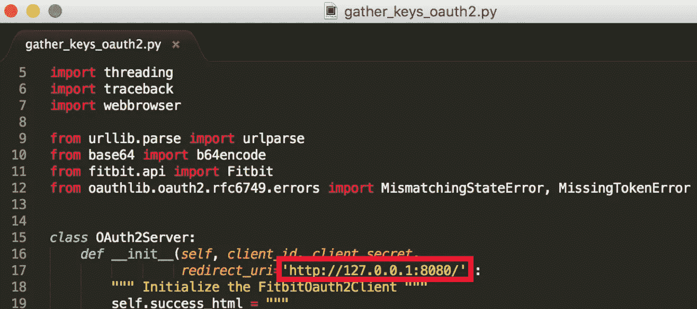

最后，单击协议框，然后单击注册。应该会出现一个类似于下图的页面。

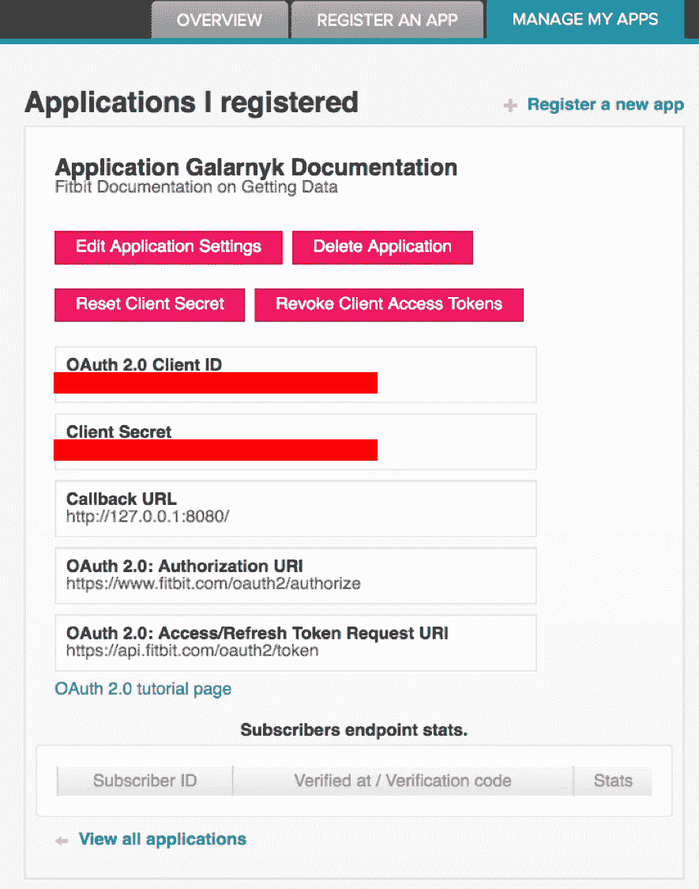

记下您的 OAuth 2.0 客户端 ID 和客户端机密。

我们将从这个页面中需要的部分是 OAuth 2.0 客户端 ID 和客户端密码。稍后您将需要客户端 ID 和客户端密码，因此请记下它们。

```
# OAuth 2.0 Client ID 
# You will have to use your own as the one below is fake
12A1BC# Client Secret
# You will have to use your own as the one below is fake
12345678901234567890123456789012
```

# 3.)安装 Python 库

下一步是使用一个 [Fitbit 非官方 API](https://github.com/orcasgit/python-fitbit) 。点击链接后，点击绿色按钮。接下来，单击 Download Zip 并继续解压缩文件。


下载 zip 文件。

之后，打开终端/命令行，将目录切换到解压后的文件夹，并运行下面的命令。

```
#reasoning for it here: 
#[https://stackoverflow.com/questions/1471994/what-is-setup-py](https://stackoverflow.com/questions/1471994/what-is-setup-py)
# If you want to install it a different way, feel free to do so. python setup.py install
```

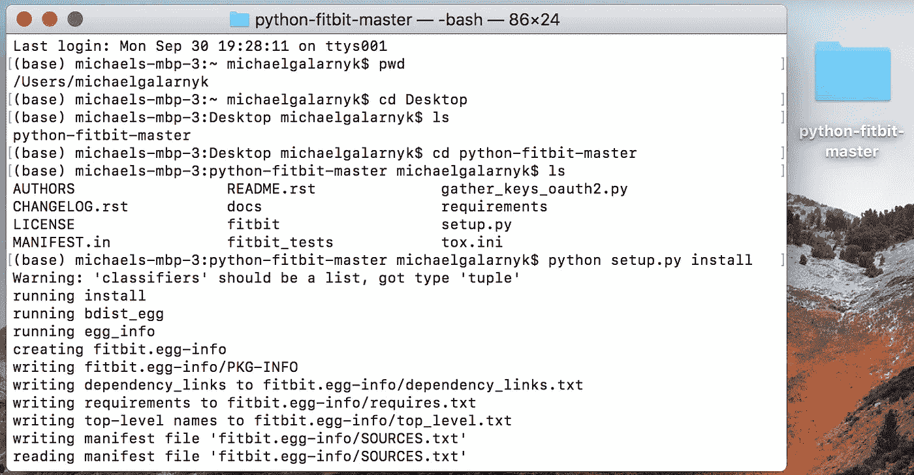

进入文件夹目录，在终端/命令行中输入 **python setup.py install** 。

# 4.)API 授权

在开始本节之前，我应该注意两件事。首先，本教程中使用的代码可以在我的 [GitHub](https://github.com/mGalarnyk/Python_Tutorials/blob/master/Apis/Fitbit/Fitbit_API.ipynb) 上找到。第二，如果你有错误，我在博文的后面有一个潜在错误部分。

下面的代码导入各种库，并将步骤 2 中的 CLIENT_ID 和 CLIENT_SECRET 赋给变量。

```
# This is a python file you need to have in the same directory as your code so you can import it
import gather_keys_oauth2 as Oauth2import fitbit
import pandas as pd 
import datetime# You will need to put in your own CLIENT_ID and CLIENT_SECRET as the ones below are fake
CLIENT_ID='12A1BC'
CLIENT_SECRET='12345678901234567890123456789012'
```

下面的代码使授权过程能够发生

```
server=Oauth2.OAuth2Server(CLIENT_ID, CLIENT_SECRET)
server.browser_authorize()
ACCESS_TOKEN=str(server.fitbit.client.session.token['access_token'])
REFRESH_TOKEN=str(server.fitbit.client.session.token['refresh_token'])
auth2_client=fitbit.Fitbit(CLIENT_ID,CLIENT_SECRET,oauth2=True,access_token=ACCESS_TOKEN,refresh_token=REFRESH_TOKEN)
```

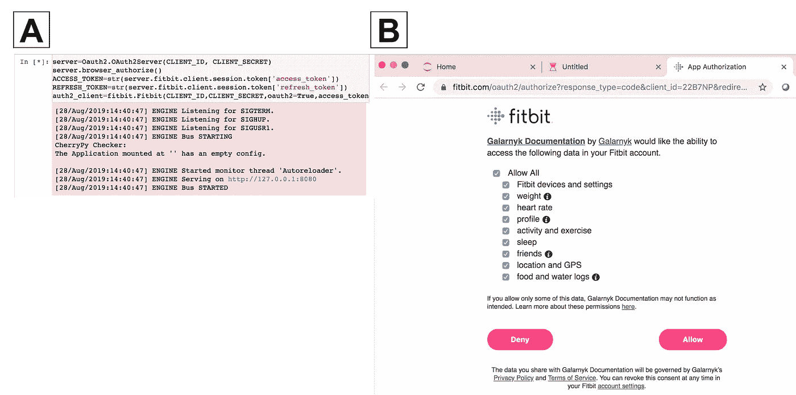

当您运行上面的代码(如 A 所示)时，单元格显示仍在运行，直到您登录您的 fitbit 帐户(B)并单击允许访问您的 Fitbit 帐户中的各种数据。

授权和登录后页面的外观。


这个窗口应该是你得到的。

# 5a。)获取一天的数据


您将使用 intraday_time_series 方法来获取数据。

我将首先从获得一天的数据开始，这样下一节将更容易理解。

```
# This is the date of data that I want. 
# You will need to modify for the date you want
oneDate = pd.datetime(year = 2019, month = 10, day = 21)oneDayData = auth2_client.intraday_time_series('activities/heart', oneDate, detail_level='1sec')
```


如果你愿意，你可以把这些数据放入熊猫数据框。


当然，您总是可以将数据导出到 csv 或 excel 文件中。

```
# The first part gets a date in a string format of YYYY-MM-DD
filename = oneDayData['activities-heart'][0]['dateTime'] +'_intradata'# Export file to csv
df.to_csv(filename + '.csv', index = False)
df.to_excel(filename + '.xlsx', index = False)
```

# 5b。)获取多天的数据

下面的代码从`startTime`变量(在下面的代码中称为`oneDate`)开始获取所有日期的数据。

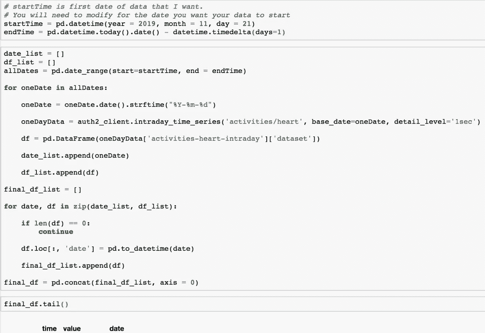

你当然可以导出`final_df`到一个 csv 文件(我建议不要试图导出到 excel，因为可能有太多的行很容易导出到 excel)。

```
filename = 'all_intradata'
final_df.to_csv(filename + '.csv', index = False)
```

# 6.)试着用图表显示当天的数据

这是一个部分，我强烈建议你用你自己的数据看看 [GitHub](https://github.com/mGalarnyk/Python_Tutorials/blob/master/Apis/Fitbit/Fitbit_API.ipynb) 代码。

这一部分的最终目标是获得特定日期的特定时间的适当图表(日期也包括当天的时间)。我应该注意到，部分由于我的懒惰，我没有使我的代码高效。如果你不明白是怎么回事，不要着急。您可以向下滚动并查看最终结果。

```
# I want to get the hour of the day and time. The end goal of this section is to get a particular time on a particular day. 
hoursDelta = pd.to_datetime(final_df.loc[:, 'time']).dt.hour.apply(lambda x: datetime.timedelta(hours = x))minutesDelta = pd.to_datetime(final_df.loc[:, 'time']).dt.minutes.apply(lambda x: datetime.timedelta(minutes = x))secondsDelta = pd.to_datetime(final_df.loc[:, 'time']).dt.seconds.apply(lambda x: datetime.timedelta(seconds = x))# Getting the date to also have the time of the day
final_df['date'] = final_df['date'] + hoursDelta + minutesDelta + secondsDelta
```

我的下一步将是查看 3 天的数据，而不是几天。

```
startDate = pd.datetime(year = 2019, month = 12, day = 24)
lastDate = pd.datetime(year = 2019, month = 12, day = 27)coupledays_df = final_df.loc[final_df.loc[:, 'date'].between(startDate, lastDate), :]
```

请记住，您也可以尝试通过按日期和小时(如果您愿意，甚至可以按秒)分组并取心率的平均值来绘制图表。代码还试图使图形看起来更好一些。

```
fig, ax = plt.subplots(figsize=(10, 7))# Taken from: [https://stackoverflow.com/questions/16266019/python-pandas-group-datetime-column-into-hour-and-minute-aggregations](https://stackoverflow.com/questions/16266019/python-pandas-group-datetime-column-into-hour-and-minute-aggregations)
times = pd.to_datetime(coupledays_df['date'])
coupledays_df.groupby([times.dt.date,times.dt.hour]).value.mean().plot(ax = ax)ax.grid(True,
    axis = 'both',
    zorder = 0,
    linestyle = ':',
    color = 'k')
ax.tick_params(axis = 'both', rotation = 45, labelsize = 20)
ax.set_xlabel('Date, Hour', fontsize = 24)
fig.tight_layout()
fig.savefig('coupledaysavergedByMin.png', format = 'png', dpi = 300)
```

有了这些工作，也许这不是我下去的好方法，因为目前的数据没有给出足够的背景来知道它是在休息或四处走动时。

# 7.)静息心率

有研究称[静息心率](https://www.health.harvard.edu/blog/resting-heart-rate-can-reflect-current-future-health-201606179806)可以反映你现在和未来的健康状况。实际上有一篇[研究论文显示了持续佩戴 Fitbit 的 92，447 名成年人的日常静息心率的个体间和个体内可变性及其与年龄、性别、睡眠、身体质量指数和一年中的时间的关联。下面是论文中的一张图片(为清晰起见，添加了文字)。](https://journals.plos.org/plosone/article?id=10.1371/journal.pone.0227709)


【https://journals.plos.org/plosone/article? id = 10.1371/journal . pone . 0227709

我们一直使用的 api 调用也返回静息心率，因此下面的代码与前面的步骤没有太大的不同。

```
# startTime is first date of data that I want. 
# You will need to modify for the date you want your data to start
startTime = pd.datetime(year = 2019, month = 11, day = 21)
endTime = pd.datetime.today().date() - datetime.timedelta(days=1)date_list = []
resting_list = []allDates = pd.date_range(start=startTime, end = endTime)for oneDate in allDates:

    oneDate = oneDate.date().strftime("%Y-%m-%d")

    oneDayData = auth2_client.intraday_time_series('activities/heart', base_date=oneDate, detail_level='1sec')

    date_list.append(oneDate)

    resting_list.append(oneDayData['activities-heart'][0]['value']['restingHeartRate'])# there is more matplotlib code on GitHub
fig, ax = plt.subplots(figsize=(10, 7))ax.plot(date_list, resting_list)
```

试着用图表显示你的数据。

# 8.)获取睡眠数据

在不涉及太多细节的情况下，下面的代码获得了每分钟的睡眠数据(`final_df`)和睡眠摘要信息`final_stages_df`，即 Fitbit 用户在深度睡眠、浅度睡眠、快速眼动睡眠和觉醒阶段总共花费了多少分钟。


`final_stages_df`是一个熊猫数据框架，显示了 Fitbit 用户在给定日期的给定夜晚每个阶段的睡眠时间(清醒、深度、浅睡、快速眼动)以及在床上的总时间。


`final_df`是一个熊猫数据帧，给出日期时间、日期和值。值栏中的 1 是“睡着了”， **2** 是醒着的， **3** 是真的醒着。


# 潜在错误

## 没有名为 gather_keys_oauth2 的模块

这是针对你得到一个类似下面的错误的情况。

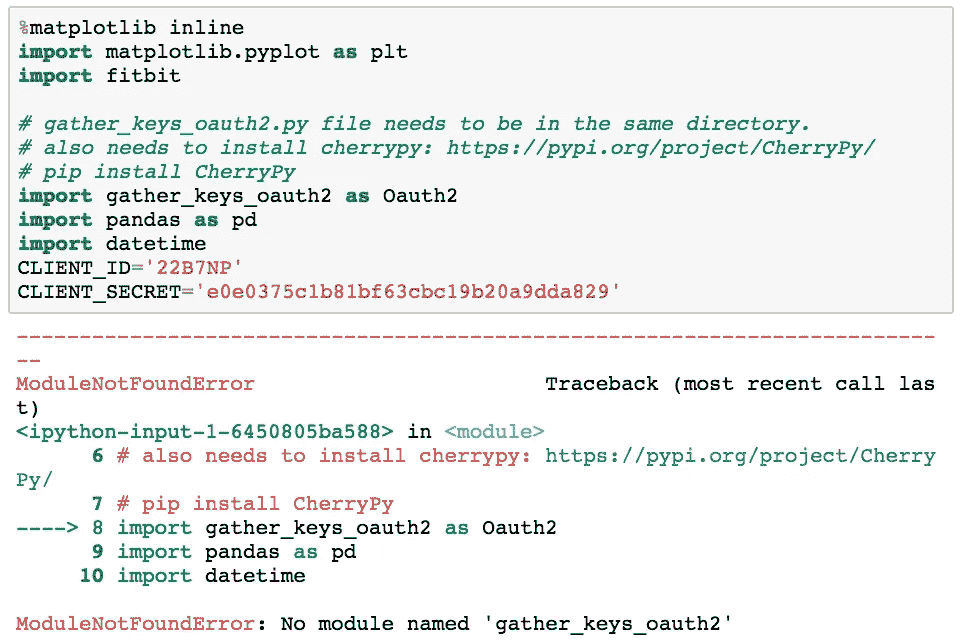

要解决这个问题，可以将 gather_keys_oauth2.py 文件放在 python 文件或 jupyter notebook 所在的同一个目录下。你可以在下面看到我的项目目录是如何排列的。


请注意，gather_keys_oauth2.py 与我的 jupyter 笔记本在同一个目录中。这是我们在步骤 3 中下载的 python-fitbit-master 中包含的一个文件。

## 无法识别 cherrypy，没有名为 CherryPy 的模块

如果你得到一个类似下面的错误，首先关闭你的 jupyter 笔记本或者 python 文件。

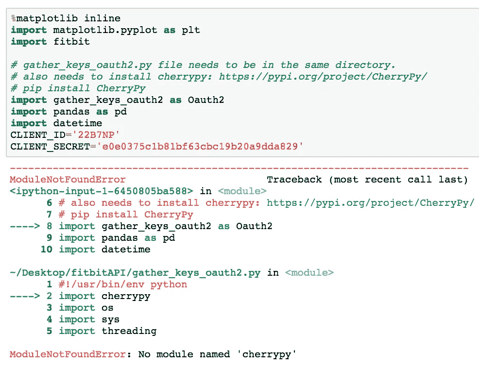

您可以使用下面的命令解决这个问题。

```
pip install CherryPy
```


## Https vs Http 错误

以下错误来自第 2 步，当时我曾试图将回调 url 设置为 https 而不是 http。

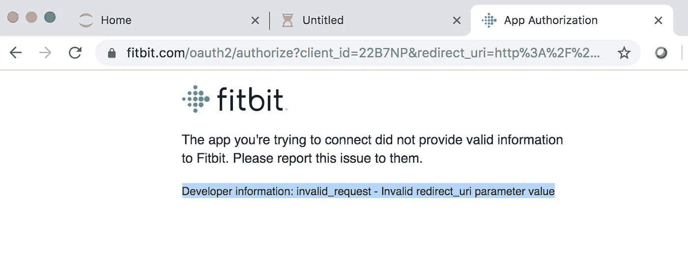

## HTTPTooManyRequests:请求太多

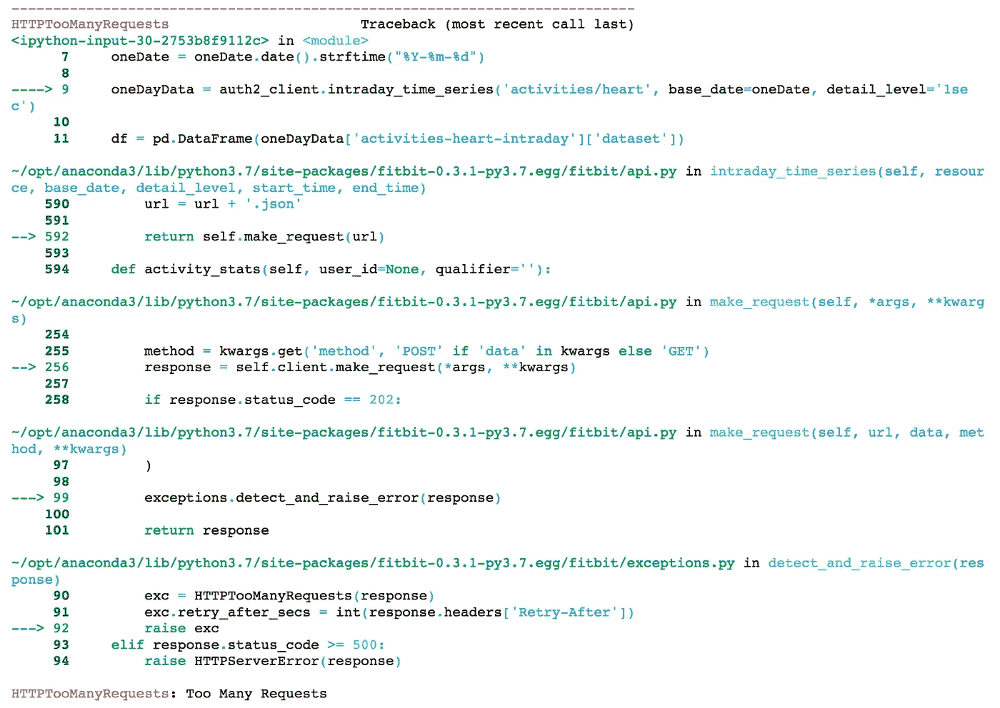

[fitbit 社区论坛](https://community.fitbit.com/t5/Web-API-Development/Too-many-request/td-p/1644362)有这个问题的答案。使用该 API，您可以每小时为每个用户/fitbit 处理多达 150 个请求。这意味着，如果您有超过 150 天的数据，并且您使用了本教程中步骤 5b 的代码，那么您可能需要等待一段时间才能获得其余的数据。

## 结束语

这篇文章讲述了如何从单个 Fitbit 获取数据。虽然我已经讲了很多，但是还有一些事情我没有讲，比如说 [Fitbit api 如何获得你的步数](https://python-fitbit.readthedocs.io/en/latest/)。Fitbit API 是我仍在学习的东西，所以如果你有贡献，请让我知道。如果你对教程有任何问题或想法，欢迎在下面的评论中或通过[推特](https://twitter.com/GalarnykMichael)联系。