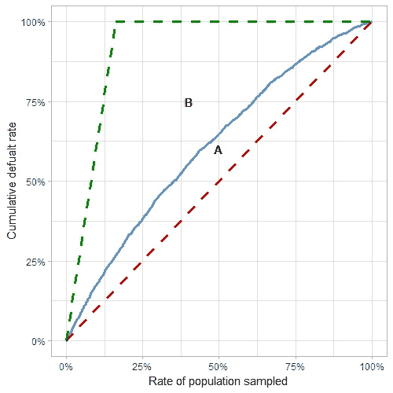
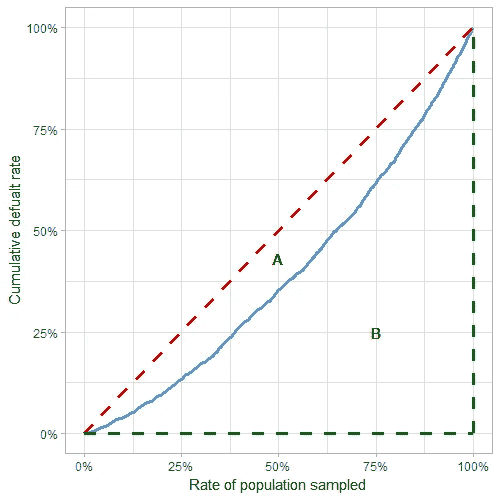
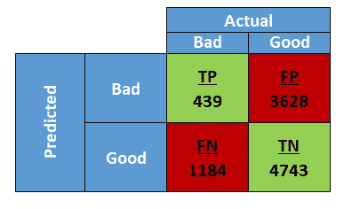
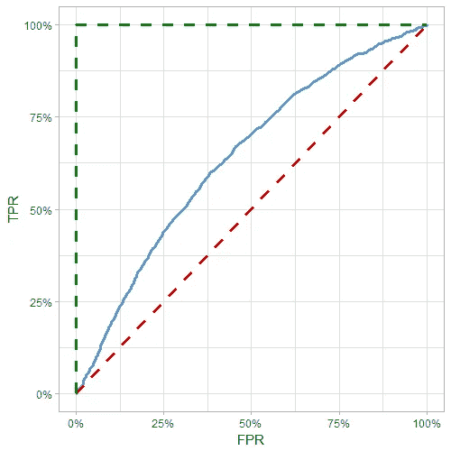
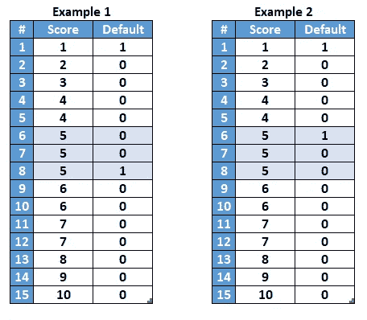
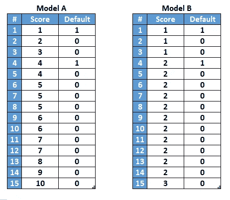
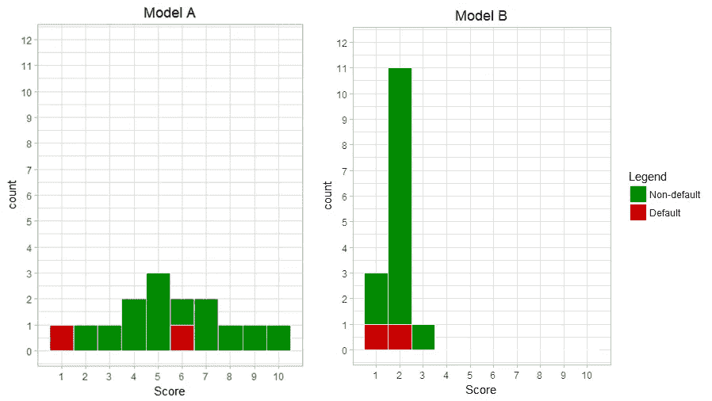

# 用基尼系数评价信用评分模型的性能

> 原文：<https://towardsdatascience.com/using-the-gini-coefficient-to-evaluate-the-performance-of-credit-score-models-59fe13ef420?source=collection_archive---------2----------------------->

## 基尼系数背后的机制、计算方法、常见陷阱及其主要缺点。

当一个新的信用评分模型诞生时，通常出现的第一个问题是:“它的基尼系数是多少？”。对于一个局外人来说，这听起来一定像是对迪士尼电影《阿拉丁》的奇怪引用。但是，*基尼系数*或*基尼系数*是金融业用来评估信用评分模型性能的最受欢迎的指标之一。


照片由 [Cesira Alvarado](https://unsplash.com/@cesiraalvarado?utm_source=medium&utm_medium=referral) 在 [Unsplash](https://unsplash.com?utm_source=medium&utm_medium=referral) 上拍摄

基尼系数是一个指标，表明模型的区分能力，即模型在区分“坏”借款人(将来会违约)和“好”借款人(将来不会违约)方面的有效性。该指标通常用于比较不同模型的质量，并评估它们的预测能力。


FICO 使用基尼系数展示了其信用评分模型的质量。来源: [FICO](https://www.fico.com/blogs/how-analytics-developers-can-game-model-results)

尽管基尼系数具有共性，但一些从业者并不真正熟悉基尼系数之外的机制，并错误地将其与同名的不同指标相混淆。虽然许多从业者错误地将基尼系数与洛伦兹曲线的摘要、科拉多基尼的不平等度量[1]联系起来，但他们使用的基尼系数大多数时候是 *Somers' D* ，即 CAP(累积准确度分布)曲线的摘要。

Somers' D 是以 Robert H. Somers 的名字命名的，他在 1962 年提出了这个概念[2]。它是两个变量之间顺序关系的度量。在信用评分模型的情况下，它衡量模型预测(以违约概率或评分表示)与实际结果(违约或不违约)之间的顺序关系。如果模型是有用的，低分(高 PD)应该比高分(低 PD)更与违约相关。

Somers' D 取值在(-1)和 1 之间。(-1)是完美的负序数关系，1 是完美的序数关系。在实践中，Somers' D 为 0.4 的信用评分模型被认为是好的。(此后，我将把萨默斯称为基尼系数)

出于极简主义的考虑，我不会描述计算基尼系数所涉及的数学。相反，我将展示三种不同的方法来导出它。

为了演示每一种方法，我将使用一个样本信用评分模型，该模型是使用逻辑回归和来自 [Lending-club](https://www.kaggle.com/wendykan/lending-club-loan-data) 的 10，000 名借款人的数据开发的。

```
model <- glm(default ~ fico + loan_amnt + annual_inc + home_ownership, family = "binomial", data = data_set)
```

基于模型的预测——估计违约概率(PD ),我从 1 到 1000 给每笔借款打分；1 代表最低 PD，1000 代表最高 PD。

**从 CAP 曲线中提取基尼系数**

在我们的上下文中，CAP 曲线旨在捕捉得分(PD)和违约率之间的顺序关系。如果我们的模型在区分好的和坏的借款人方面做得很好，我们将会发现低评分借款人比高评分借款人有更多的违约。CAP 曲线通过从最低分到最高分抽样借款人时累计违约率来捕捉这一概念。

为了构建 CAP 曲线，所有模型的总体需要按照违约的预测可能性排序。也就是说，得分最低的观察值在前，得分最高的观察值在后。然后，我们从头到尾对总体进行抽样，每次抽样后，计算累计违约率。帽曲线的 x 轴代表抽样人口的部分，y 轴代表相应的累积违约率。

如果我们的模型具有完美的区分能力，我们将期望在对一部分观察值进行采样后达到 100%的累积违约率，这等于我们数据中的违约率(下图中的绿线)。例如，如果我们数据中的违约率是 16%，那么在对 16%的观察值进行抽样后，我们将捕获我们数据中的所有违约。相反，如果我们使用随机模型，即以相等分布随机分配分数的模型，累积违约率将始终等于抽样观察的部分(下图中的红线)。



基尼系数被定义为模型曲线和随机模型线(A)之间的面积与完美模型曲线和随机模型线(A+B)之间的面积之比。换句话说，基尼系数是一个比率，代表我们的模型离“完美模型”有多近，离“随机模型”有多远。因此，“完美模型”的基尼系数为 1，“随机模型”的基尼系数为 0。

我的模型获得了低基尼系数 **0.26** :


**构造洛伦茨曲线，提取科拉多基尼系数，然后得出基尼系数**

洛伦兹曲线是 CAP 曲线的逆曲线；它是使用相同的抽样观察和累计违约率机制构建的，但抽样顺序相反(从最高分到最低分)。洛伦兹也有一条对角线，相当于 CAP 随机模型’线，被称为‘等比线’(下图中的红线)。

两条曲线的另一个区别是“完美模型”线。由于洛伦茨曲线是为了捕捉财富的分布而设计的，因此最具歧视性的结果是人口的所有财富都集中在一个观察值中的情况。也就是说，相当于洛伦兹曲线中的“CAP perfect model”线的线是由两条垂直线构成的，这两条垂直线是 x 轴和一条垂直线，垂直线是从 x 轴的末端以 100%的值(下图中的绿线)演变而来的。这条线表示所有累积结果都在最后一次采样观察中的情况。科拉多基尼系数的值被定义为模型曲线和“平等线”之间的面积与“平等线”和 x 轴之间的面积之比。

然而，当使用洛伦兹曲线来评估信用评分模型的区分能力并将其 y 轴指定为累积违约率时，问题出现了。由于 y 轴描述的是二元结果(1 或 0)的集合，因此不存在所有累积违约率都集中在一次观察中的情况。换句话说，在使用洛伦兹曲线评估一个信用评分模型时，不可能达到“完美模型”线。因此，这种评估的合适的“完美模型”线应该调整到人群中的违约率，就像在 CAP 曲线中一样。



因此，为了调整 Corrado Gini 的信用评分模型评估的措施，我们需要从其分母中扣除不可及区域。

最后，为了从科拉多基尼系数的测量中得出基尼系数，我们可以使用以下公式:


我的模型获得了科拉多基尼系数 0.22:


我的样本中的违约率是 16%，因此我的模型的基尼系数可以计算如下:


**构建 ROC 曲线，提取 AUC，然后得出基尼系数**

计算基尼系数的第三种方法是通过另一种流行的曲线:ROC 曲线。ROC 曲线下的面积，通常称为 AUC，也是评估和比较信用评分模型性能的常用指标。ROC 曲线总结了混淆矩阵中的两个比率:真阳性比率(TPR 或回忆)和假阳性比率(FPR)。

对于给定的阈值，混淆矩阵总结了以下情况的数量:

*   该模型预测会出现违约，而借款人违约了——T4——真的是正数。
*   该模型预测会出现违约，但借款人没有违约——假阳性。
*   该模型预测没有违约，借款人也没有违约——T2——真阴性。
*   模型预测没有违约，借款人违约——**假阴性**

例如，让我们用 850 分作为我们的阈值，即 850 分以下的借款人被预测为违约，850 分以上的借款人被预测为不违约。



850 阈值的混淆矩阵

真实正比率(TPR)定义为我们的模型捕捉到的违约借款人的数量超过我们数据中违约借款人的总数。假阳性率(FPR)的计算方法是，模型错误预测违约的案例数占非违约案例总数的比例。


ROC 曲线是通过使用源自 1 到 1000 之间阈值的混淆矩阵并驱动它们的 TPR 和 FPR 来构建的。ROC 曲线的 y 轴代表 TPR 值，x 轴代表 FPR 值。AUC 是曲线和 x 轴之间的面积。



令人惊讶的是，正如 Schechtman & Schechtman，2016[3]所示，AUC 和基尼系数之间存在线性关系。因此，要从 AUC 中得出基尼系数，只需使用以下公式:


从业者倾向于在他们的模型验证报告中披露 AUC 和基尼系数。然而，由于这些指标具有线性关系，这些指标的公开对模型质量的评估没有任何价值。

我的模型的 AUC 是 **0.63** ，因此基尼系数是这样计算的:


**基尼系数的弊端和陷阱**

尽管它的共性，基尼系数有一些缺点和陷阱，你应该考虑当使用它来评估和比较信用评分模型。为了极简主义，在这一节中，我将描述一个在试图推导基尼系数时的常见陷阱及其主要缺点。

为了说明这些概念，我将使用一个玩具示例:15 个借款人，2 个“坏”和 13 个“好”，分数从 1(最高 PD)到 10(最低 PD)。

在试图得出基尼系数时，一个常见的陷阱是相同的分数。在大多数情况下(尤其是当使用大型数据集时)，信用评分模型将为不同的观察估计相同的分数。当试图使用 CAP 曲线法得出基尼系数时，这种分数重复提出了一个问题。如上所述，导出 CAP 曲线的第一步是根据得分对观察值进行排序，如以下两个示例所示:



这两个例子使用相同的借款人，得分相同。这两个表之间的唯一区别是第二级排序。在示例 1 中，当存在相同分数的情况时(在分数 5 中)，首先出现默认的观察值。例 2 正好相反。这种微小的变化会对基尼系数的值产生重大影响，例如，在这种情况下，实施例 1 的基尼系数为 0.67，实施例 2 的基尼系数为 0.38。

为了避免这个陷阱，我建议像例 1 一样进行二次排序，或者简单地使用上述 AUC 方法得出基尼系数。

基尼系数的主要缺点在于，它是一个有序的度量标准，也就是说，它记录了数值的顺序，而忽略了数值之间的距离。基尼系数的这一特征有时会掩盖模型的不良表现。



当根据两个模型预测的分数对借款人进行排序时，我们会得到相同的“违约”列。这表明这两个模型具有相同的基尼系数(0.85)。

当比较由这两个模型预测的分数分布时，我们得到以下图表:



具有相同基尼系数的两个模型的分数分布

两个模型的基尼系数相同。但是，模型 B 只能将借款人分为三种类型:1、2 和 3，而模型 A 能够捕捉所有 10 个级别的风险。这表明，模型 A 比模型 B 对借款人的不同特征更敏感，可以更好地区分不同的风险水平。

为了理解上述特性的重要性，假设模型 A 的所有者和模型 B 的所有者决定设置一个分数，该分数将是他们贷款批准的阈值。即分数低于或等于阈值的借款人的贷款请求将被拒绝，而分数高于阈值的借款人的贷款请求将被批准。两个模型所有者都检查了他们在测试样本上的模型结果，并决定使用获得 100%累积违约率的分数作为他们的阈值。因此，模型 A 的所有者将阈值设置为 6，而模型 B 的所有者将她的阈值设置为 2。通过选择这些分数，模型所有者得到了非常不同的结果:


模型 A 的所有者拒绝了 8 个“好”借款人，批准了 5 个，而模型 B 的所有者拒绝了 12 个“好”借款人，只批准了 1 个。模型 A 的所有者设置的阈值产生 62%的 FPR，而模型 B 的所有者设置的阈值产生 92%的 FPR。

因此，基尼系数无法捕捉模型区分不同风险水平的有效性是一个主要缺陷。

为了克服这一缺点，我建议对模型预测的分布进行眼球测试，如 Gambacorta，Huang，Qiu 和 Wang，2019[4]所述，并使用精确回忆曲线来评估模型在捕捉“坏”借款人和错误预测“好”借款人违约之间的权衡。

**总结**

*   金融行业中用于评估信用评分模型质量的基尼系数实际上是 Somers' D，而不是 Corrado Gini 的不平等衡量标准。
*   计算基尼系数有三种常用方法:

1.  从 CAP 曲线中提取基尼系数。
2.  构造洛伦茨曲线，提取科拉多基尼系数，然后得出基尼系数。
3.  构建 ROC 曲线，提取 AUC，然后得出基尼系数。

*   在计算基尼系数时，一个常见的陷阱是相同的分数。
*   基尼系数的主要缺点是，它没有捕捉到模型对不同风险水平的敏感性。

**参考文献**

[1]基尼，C. (1914 年)。再版:关于测量字符的集中性和可变性(2005)。密特隆，LXIII(1)，338。

[2]萨默斯，R. (1962 年)。有序变量关联的一种新的非对称度量。*《美国社会学评论》，* *27* (6)，799–811。从 www.jstor.org/stable/209040[取回](http://www.jstor.org/stable/209040) 8

[3]谢克特曼，e .，&谢克特曼，G. (2016)。*基尼系数法与 ROC 曲线的关系* (SSRN 学术论文编号 ID 2739245)。纽约罗切斯特:社会科学研究网络。

[4]甘巴科尔塔，李，黄，杨，邱，黄，王(2019)。*机器学习和非传统数据如何影响信用评分？来自一家中国金融科技公司的新证据。从 https://www.bis.org/publ/work834.htm[取回](https://www.bis.org/publ/work834.htm)*