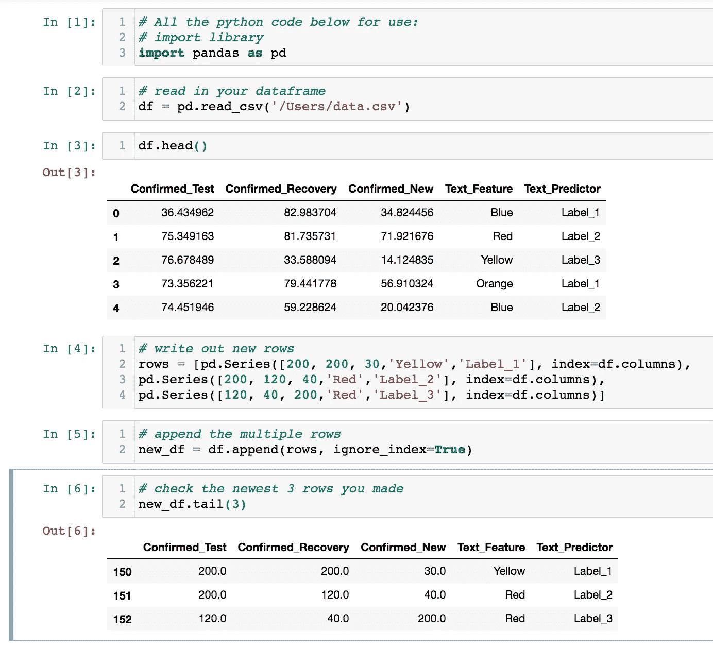

# 对数据帧使用 Pandas Append 函数

> 原文：<https://towardsdatascience.com/using-the-pandas-append-function-for-dataframes-84e30f7c5099?source=collection_archive---------38----------------------->

## 数据科学家的 python 教程，用于向已建立的数据帧追加新行


Theodor Lundqvist 在[Unsplash](https://unsplash.com/?utm_source=unsplash&utm_medium=referral&utm_content=creditCopyText)【1】上拍摄的照片。

# 目录

1.  资料组
2.  熊猫
3.  附加
4.  教程代码
5.  摘要
6.  参考

# 资料组

本分析和教程中用于熊猫追加函数的数据集是一个虚拟数据集，创建该数据集是为了模拟具有文本和数字特征的数据帧。请随意使用您自己的 csv 文件，包含文本和/或数字列，以遵循下面的教程。

# 熊猫

[Pandas](https://pandas.pydata.org/)【2】是数据科学家和机器学习工程师最常用的库之一。它主要用于构建模型的探索性数据分析步骤，以及模型结果的即席分析。它还包含几个函数，包括 append 函数。

# 附加

虽然我之前写了一篇关于 pandas 查询函数的文章[3 ],其中提到了添加多行，但我认为强调 append 函数本身的好处是有用的。append 函数通过向现有数据帧添加新行来工作。这些行是利用 Series 函数创建的，该函数存储的值将被追加到 index 参数中列出的列的顺序中。

附加功能的一些好处包括:

*   *处理熊猫数据帧*
*   *与熊猫系列功能*配合使用
*   *向现有数据添加新数据的快速方法*

# 教程代码

在下面的代码片段中，虚拟数据缺少一些信息。为了解决这个问题，我求助于 append 方法。使用 append 函数，我可以轻松地添加新行，而不会丢失原始数据帧的数据和完整性。首先，我导入了 pandas 库并创建了别名‘PD*’*——这个别名有助于以简写格式使用 pandas 库。接下来，我从现有的 csv 文件中读取数据帧，引用它在本地驱动器上的位置和路径。我打印出数据帧，看看前五行是什么样子。下一步是设置 append 函数的代码。使用 Series 函数按顺序将值(在本例中为文本或数字)作为列表放置，然后在各自的列上对其进行索引，新行被写出并保存为*‘rows’*。

实际的 append 函数本身相当简单；将这些行作为第一个参数传递，然后将' *ignore_index'* 设置为'*True【T3]'，这样就不会使用索引标签。最后，我使用 tail 函数检查我的行是否正确，该函数从 append 代码返回最后三行的数据帧。*

下面是我使用的所有代码的截图:



追加 3 个新行的示例。作者截图[4]。

这里是[代码](https://gist.github.com/mprzybyla123/d3a298a8598c2c653c14c87ba20ed236)【5】便于参考。请随意导入您自己的数据和引用您自己的文件路径，以及更改系列中的数据值，以查看在您的 python 环境或 jupyter 笔记本中追加是如何工作的。

```
# All the python code below for use:
# import library
import pandas as pd# read in your dataframe
df = pd.read_csv('/Users/data.csv')# print out your first five rows
df.head()# write out new rows
rows = [pd.Series([200, 200, 30,'Yellow','Label_1'], index=df.columns),
pd.Series([200, 120, 40,'Red','Label_2'], index=df.columns),
pd.Series([120, 40, 200,'Red','Label_3'], index=df.columns)]# append the multiple rows
new_df = df.append(rows, ignore_index=True)# check the newest 3 rows you made
new_df.tail(3)
```

要查看 python 格式的代码，而不是截图或写出来的代码，下面是嵌入的[要点](https://gist.github.com/mprzybyla123/d3a298a8598c2c653c14c87ba20ed236) [5]:

GitHub [要点](https://gist.github.com/mprzybyla123/d3a298a8598c2c653c14c87ba20ed236)来自作者【5】。

# 摘要

append 函数是向数据帧添加新数据的一种简单快捷的方法。还引用了 Series 函数，以便保存以后要追加的行。在最终创建数据科学和机器学习模型之前，我希望本教程对您创建数据和在数据框架上执行探索性数据分析有所帮助。感谢您的阅读！如上所述，请随意阅读我的类似的[文章](/pandas-query-for-sql-like-querying-279dc8cbfe3f)，它讨论了熊猫的查询功能。

# 参考

[1] [T.Lundqvist](https://unsplash.com/@umbriferous?utm_source=unsplash&utm_medium=referral&utm_content=creditCopyText) ， [Unsplash](https://unsplash.com/s/photos/panda?utm_source=unsplash&utm_medium=referral&utm_content=creditCopyText) (2017)

[2]熊猫，[熊猫](https://pandas.pydata.org/) (2020)

[3] M.Przybyla，[条](/pandas-query-for-sql-like-querying-279dc8cbfe3f) (2020 年)

[4] M.Przybyla，截图(2020 年)

[5] M.Przybyla，[要点](https://gist.github.com/mprzybyla123/d3a298a8598c2c653c14c87ba20ed236) (2020)