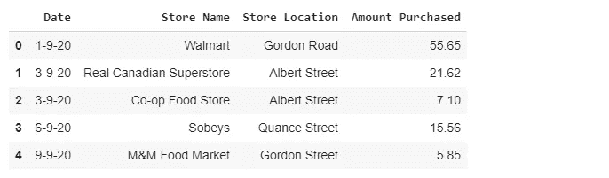
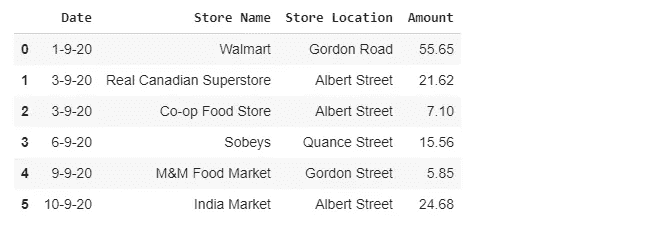
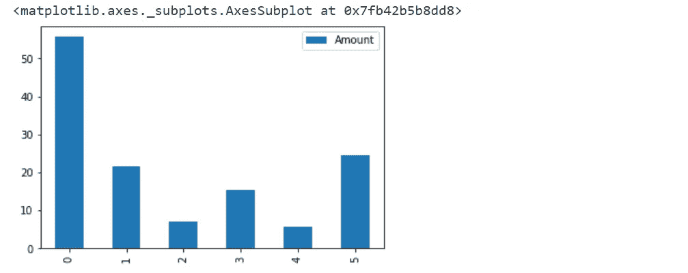
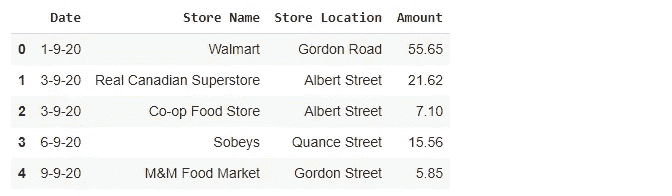
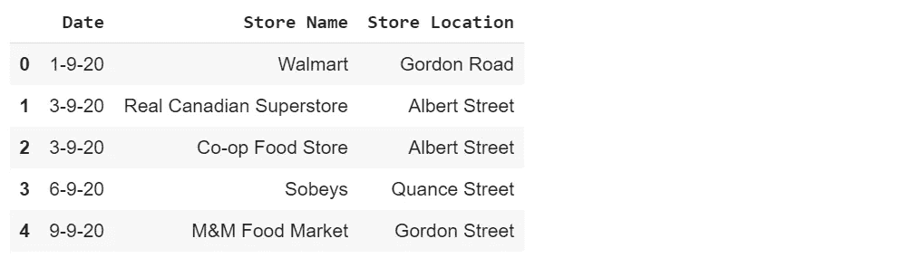
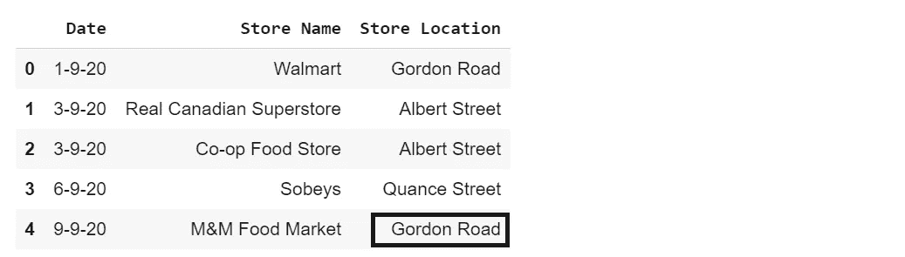

# 在日常生活中使用熊猫数据框架

> 原文：<https://towardsdatascience.com/using-the-pandas-dataframe-in-day-to-day-life-91859ee12cca?source=collection_archive---------43----------------------->

## 在这篇文章中，你将知道如何在日常生活中使用熊猫数据框。


**照片由** [**帕斯卡·米勒**](https://unsplash.com/@millerthachiller?utm_source=unsplash&utm_medium=referral&utm_content=creditCopyText) **上** [**下**](https://unsplash.com/s/photos/panda?utm_source=unsplash&utm_medium=referral&utm_content=creditCopyText)

B 在开始之前，让我们快速复习一下，Pandas 是一个 [python 库](https://pandas.pydata.org/)，它为 python 编程语言的数据分析工具提供了优秀的、简单易用的信息结构。下面的文章将帮助你提高对熊猫图书馆的理解水平。别忘了看一看。事实上，这是官方文件。值得一读。

[](https://pandas.pydata.org/) [## 熊猫

### pandas 是一个快速、强大、灵活且易于使用的开源数据分析和操作工具，构建于…

pandas.pydata.org](https://pandas.pydata.org/) 

# 帮助您入门的必要设置

**有两个重要的必要步骤，你需要注意，以执行顺利运作:**

*   **IDE 或者 Jupyter 笔记本**:不管你用的是像 [**PyCharm**](https://www.jetbrains.com/pycharm/) 、[**Visual Studio Code**](https://code.visualstudio.com/)、 [**IntelliJ IDEA**](https://www.jetbrains.com/idea/) 还是 [**Jupyter 笔记本**](https://jupyter.org/) 这样的 IDE 环境，其实都不重要。我个人用的是[**Google Colab**](https://colab.research.google.com/)with is[**Jypter 笔记本环境**](https://jupyter.org/) 因为它良好的文档化特性。我们可以更清晰、更准确地解释事物。
*   如果这是你第一次安装 Python，不要担心，我会支持你的。遵循下面给出的文章，并遵循有效安装 Python 的方法。

[](https://realpython.com/installing-python/) [## Python 3 安装和设置指南-真正的 Python

### 开始使用 Python 的第一步是在您的机器上安装它。在本教程中，您将学习如何…

realpython.com](https://realpython.com/installing-python/) 

> ***注意* → *如果你正在使用***[***Google Colab***](https://colab.research.google.com/)***或者任何***[***Jupyter 笔记本***](https://jupyter.org/) ***环境，那么你可以跳过 Python 安装这一步。***

# 方案

让我们在这里理解一个场景，并使用 Pandas DataFrame 提出一个解决方案。

> 每个人都喜欢购物。不是所有时候你都在同一家商店购物，你是基于折扣和优惠购物的(我就是这样)。现在，很明显，记录购物细节是一个很好的做法，比如商店名称、位置、数量、日期等。”

为了存储和操作日期，我知道你会使用“[**”Microsoft Excel**](https://office.live.com/start/excel.aspx)”但是这里的要点是我们将使用“ **Pandas DataFrame** ”，它使用起来更容易也更有趣。别担心，我会告诉你怎么做。

> ***别误会，*** [***微软 Excel***](https://office.live.com/start/excel.aspx) ***“就是它在的地方。但是对于所有的 Python 爱好者来说，这是理解熊猫并使其更上一层楼的最好例子。***

# 解决办法

让我们使用 Pandas DataFrame 来解决上面的场景。为了做到这一点，你需要遵循一定的步骤来避免犯错误。我会提供一个使用熊猫的系统方法，这样你就可以在你即将到来的项目中机械地使用它。

## 导入 Pandas 数据帧库

我们用走样的概念，用熊猫当`**pd**`。所以在后面的步骤中，与其每次都使用`**pandas**` ，我们可以直接告诉`**pd**`。

```
import **pandas** as **pd**
```

> ***感谢引入混叠概念的人。***

## 第一次将购物细节存储在列表中

对于那些不了解 Python 列表的人来说。请在这里查找[](https://docs.python.org/3/tutorial/datastructures.html)**。因为我现在住在加拿大萨斯喀彻温省的里贾纳。所以大多数杂货店和你的相比，可能相似，也可能不同。请记住这一点。这真的没关系，你可以根据自己的选择输入数据。**

```
**date** = ['1-9-20', '3-9-20', '3-9-20', '6-9-20', '9-9-20']**storeName** = ['Walmart', 'Real Canadian Superstore', 'Co-op Food Store', 'Sobeys', 'M&M Food Market']**storeLocation** = ['Gordon Road', 'Albert Street', 'Albert Street',       'Quance Street', 'Gordon Street']**amount** = [55.65, 21.62, 7.10, 15.56, 5.85]
```

**现在，我说的“**第一次**是什么意思，就是以后说假设你以后继续去买菜，而不是手动把值存储在列表里。这个列表将会增长到一列火车那么长。另外，不建议这样做。所以我在下面的部分写了一个处理这种情况的方法。**

## **创建一个 Pandas 数据框架来存储所有的列表值**

**在这里，因为我们将所有的值都存储在一个列表中，所以让我们将它们放在一个数据帧中。我们可以使用`**pd.DataFrame()**`并传递值，这种情况下是所有的列表。**

```
df = pd.DataFrame({'Date': date, 
                   'Store Name': storeName,
                   'Store Location': storeLocation,
                   'Amount Purchased': amount})df
```

**执行此操作后，您将得到一个漂亮的数据帧，如下所示**

****

****塔努·南达·帕布拍摄的照片****

## **将购物细节作为用户的输入——用于将来的访问**

**正如我所说的，将所有值存储在一个列表中并不是一个很好的做法。这样，我们自动使列表增长。处理这种情况有一个简洁而可爱的方法。首先，让我们从输入中提取输入，并将它们存储在临时变量中，如下所示:**

```
**dateNew** = input("Enter the date in dd-mm-yy format ---> ")
**storeNameNew** = input("Enter the name of the store ---> ")
**storeLocationNew** = input("Enter the location of the store ---> ")
**amountNew** = float(input("Enter the total amount purchased ---> "))
```

**所以第二天，我的意思是`**10–9–20**`我和[戈登·拉姆齐](https://www.gordonramsay.com/)一起去杂货店买了些香料，开玩笑我是一个人去的。以下是新店的详细情况。**

```
**Enter the date in dd-mm-yy format** ---> 10-9-20 
**Enter the name of the store** ---> India Market 
**Enter the location of the store** ---> Albert Street 
**Enter the total amount purchased** ---> 24.68
```

## **将新数据追加到现有列表中**

**这是一个明显的步骤，因为我们需要将新数据(购物细节)追加到现有的数据帧中。我们可以在`**append()**` Python 的帮助下做到这一点。**

```
date.**append**(dateNew)
storeName.**append**(storeNameNew)
storeLocation.**append**(storeLocationNew)
amount.**append**(amountNew)
```

## **通过数据帧显示更新的结果**

**这一步很简单，因为我们所做的只是将上述步骤中所有更新的结果显示为一个数据帧。类似于上面所示的“**创建熊猫数据帧以存储所有列表值**”步骤。**

```
df = pd.DataFrame({'Date': date, 
                   'Store Name': storeName,
                   'Store Location': storeLocation,
                   'Amount': amount})df
```

**执行这段代码后，将提示您上一步中添加的新杂货店的更新结果**

****

****塔努·南达·帕布拍摄的照片****

**这就对了，你已经成功地解决了这个问题。您可以继续添加更多的数据(购物详情)并保持每月或每年明智的。**

# **奖金**

## **您可以在现有数据帧上执行的漂亮技巧**

**下面是一些你可以在空闲时间执行或做的提示和技巧。因为它们很容易理解。让我来解释一下。**

## **绘制条形图**

**绘制数据图以获得更好的可读性始终是一个好习惯。现在为了绘图，让我们使用`**Amount**` 栏，这样我们就可以在绘图的帮助下知道到目前为止我们已经花了多少钱。这可以通过使用如下所示的`**df.plot.bar()**`来完成**

> *****注意:切记在熊猫*** 中只能绘制数字数据**

```
df.plot.bar()
```

**在编写这一行代码时，您可以看到如下所示的美丽情节:**

****

****塔努·南达·帕布拍摄的照片****

## **删除整行/整列**

**假设我们需要删除最后一行，因为条目中有一个错误，所以可以按如下方式执行。现在要删除一整行，我们需要在熊猫中使用`**drop()**`,如下所示:**

```
df = df.**drop**([5])
df
```

**这里的值`**5**` 是最后一行的索引值。通过执行这个，我们得到**

****

****塔努·南达·帕布拍摄的照片****

**删除列就像删除行一样，你所要做的就是传递要删除的列名，这种情况下就像`**df.drop([column_name, axis = 1])**``**axis = 1**`在这里很重要。假设您需要删除数据帧中的列`**Amount**` ,那么您只需要说:**

```
df = df.**drop**(['Amount'], axis = 1)
df
```

**通过执行该操作，您现在可以看到列`**Amount**` 已经被删除。**

****

**塔努·南达·帕布拍摄的照片**

## **修改特定条目**

**假设我们需要更新数据帧中的特定条目，在这种情况下，存储名称为`**M&M Food Market**`的第 4 个索引在其存储位置有一个错误(错误条目)`**Gordon Street**`，我们需要将其更正为`**Gordon Road**`。为此，只需使用:**

```
df['Store Location'][4] = "Gordon Road"
df
```

**我们需要知道特定条目的索引来更新条目，所以在执行上述操作之后，我们得到了更新的结果**

****

**塔努·南达·帕布拍摄的照片**

# **结论**

**好了，祝贺你们，你们已经成功地阅读/实现了这篇美丽的文章“**在日常生活中使用熊猫数据框架**”。现在，这还不是结束，我们可以使用 DataFrame 的许多其他方法或函数，并使其更上一层楼。我在这里只涉及了基础知识。如果你们发现了一些新的或有创意的东西，请在下面评论。我希望你们今天学到了新东西。敬请关注更多更新，下次再见。再见，祝你愉快，注意安全！**