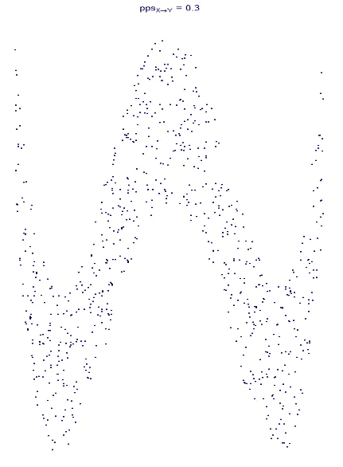
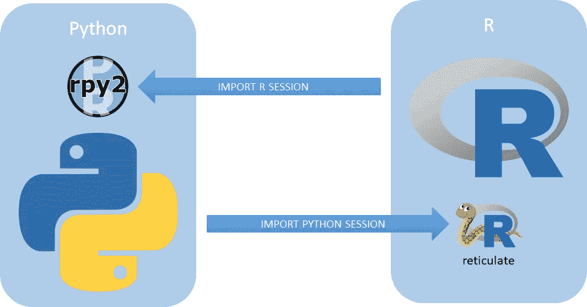
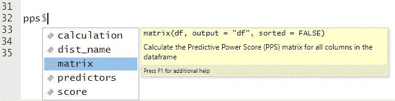
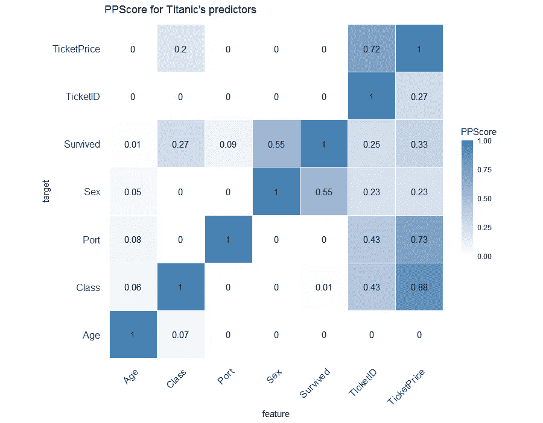
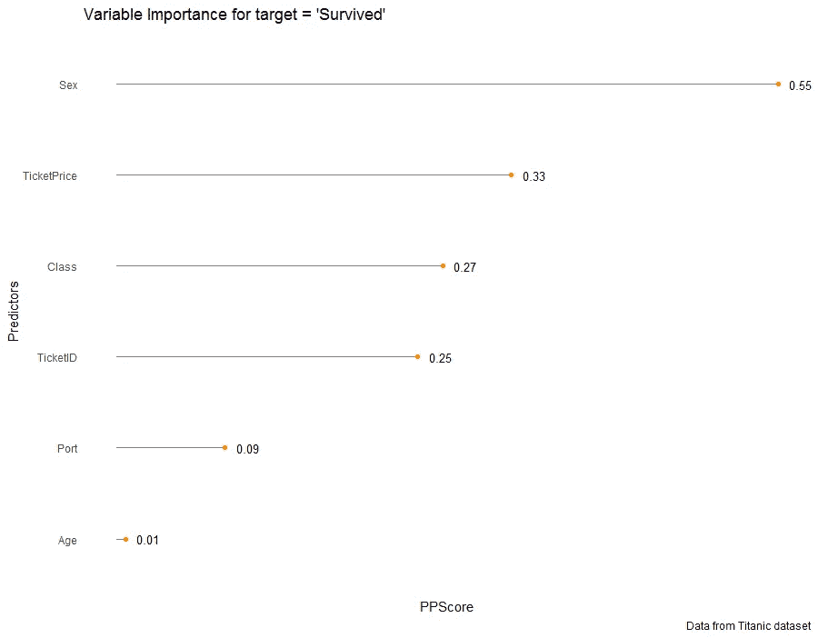
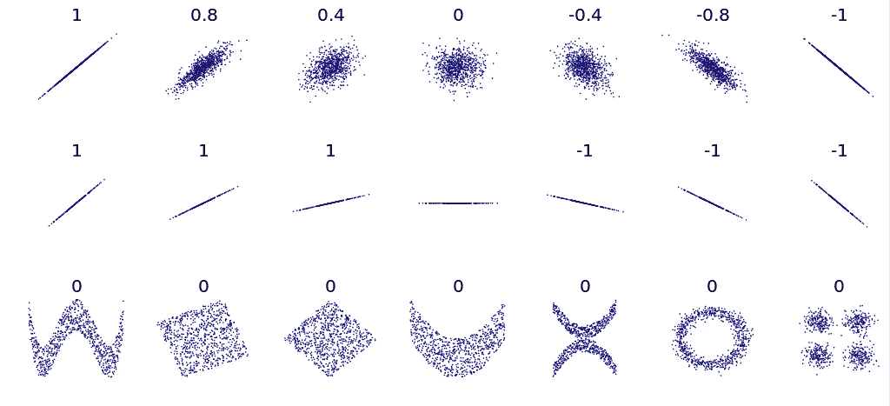
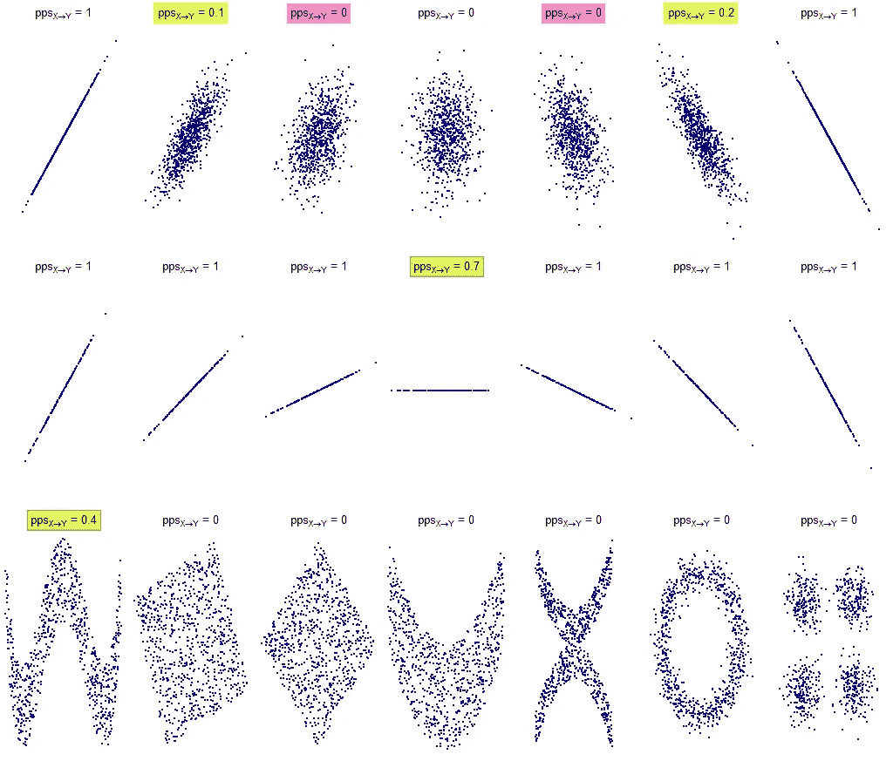
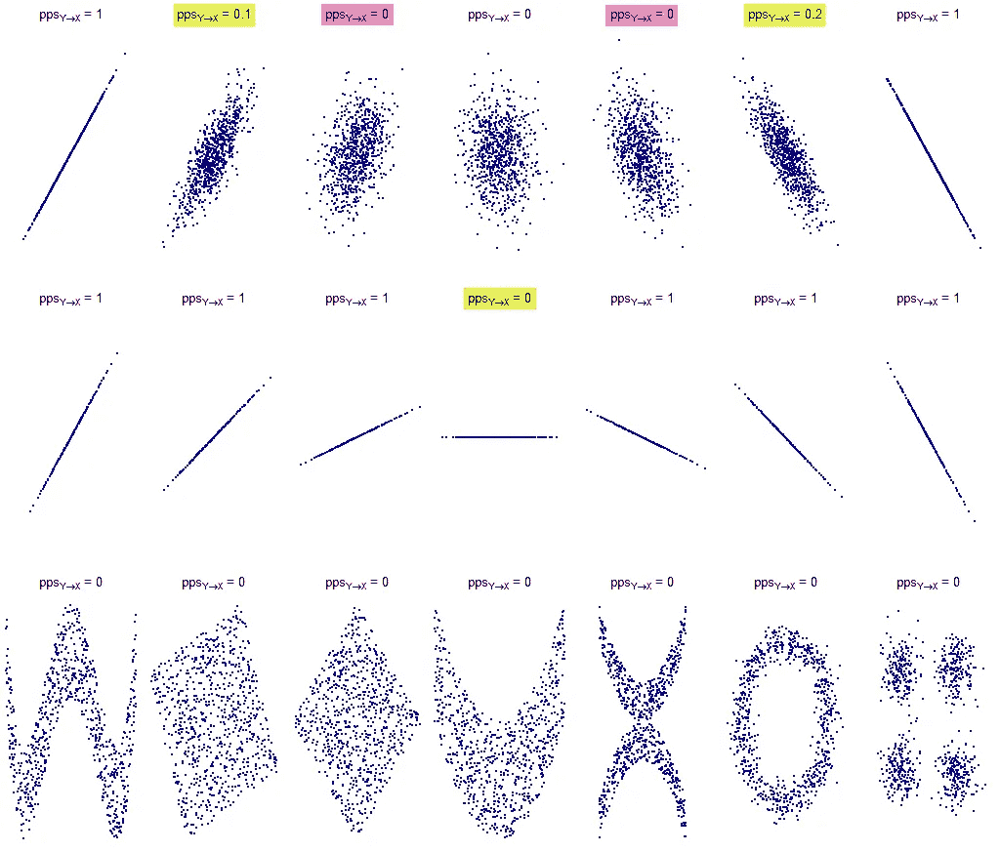

# 使用 R 中的预测能力评分

> 原文：<https://towardsdatascience.com/using-the-predictive-power-score-in-r-26c43d05dc01?source=collection_archive---------41----------------------->

## 最近一个关于预测能力得分的帖子吸引了许多数据科学家的注意。让我们看看它是什么以及如何在 R 中使用它



最近几个月 [Florian Wetschoreck](https://medium.com/u/6ed760f28120?source=post_page-----26c43d05dc01--------------------------------) 在《走向数据科学》的媒体频道上发表了一篇文章，由于其极具煽动性的标题:[“RIP correlation”，这篇文章在 LinkedIn](/rip-correlation-introducing-the-predictive-power-score-3d90808b9598) 上吸引了许多数据科学家[的注意。介绍预测能力评分"](https://www.linkedin.com/posts/florianwetschoreck_datascience-python-correlation-activity-6659121450919698432-TIRw)。让我们看看它是什么，以及如何在 r 中使用它。

# 预测能力得分的定义

*预测能力得分* (PPS)是一个标准化指数(范围从 0 到 1)，它告诉我们有多少变量 *x* (无论是数字还是分类)可用于预测变量 *y* (数字还是分类)。PPS 指数越高，变量 *x* 在预测变量 *y* 时越具有决定性。

PPS 与相关系数在概念上的相似性是显而易见的，尽管存在以下差异:

*   PPS 还检测 *x* 和*y*之间的非线性关系
*   PPS 不是对称指数。这就意味着 PPS( *x* 、 *y* ) ≠ PPS( *y* 、 *x* )。换句话说，并不是说如果 *x* 预测 *y* ，那么 *y* 也预测 *x* 。
*   PPS 允许数字和分类变量。

基本上，PPS 是一个非对称的非线性指数，适用于所有类型的变量进行预测。

在幕后，它实现决策树作为学习算法，因为它们对异常值和糟糕的数据预处理具有鲁棒性。

分数是在 sci kit-learn[*cross _ val _ score*](https://scikit-learn.org/stable/modules/cross_validation.html)函数给出的默认 4 重交叉验证的测试集上计算的，并根据目标变量定义的问题类型(*回归*或*分类*)由不同的度量给出:

*   **回归**:给定 *y* 的“原始”值基线，将平均绝对误差(MAE)归一化为目标变量的中值。
*   **分类**:给定作为目标变量最常见值或随机值计算的 *y* 的“原始”值基线(有时，随机值比最常见值具有更高的 F1)，归一化到[0，1]区间的加权 F1。

你可以深入了解 Python 代码的细节，这要归功于预测能力评分项目在 Github 上作为[开源发布的事实。](https://github.com/8080labs/ppscore)

# 皮尔逊相关与 PPS

这两个指数来自不同的领域，必须进行基本区分:

*   **皮尔逊相关性**由两个数值变量之间的归一化协方差给出。协方差取决于两个变量相对于各自均值的偏差，因此它是一种统计度量。给定两个数值变量，Pearson correlation 是一个描述性指标*在数学上得到很好的定义*，它给出了描述变量之间关系的最佳线性函数的拟合优度。
*   **PPS** 试图通过应用决策树估计来解决相关性分析中仅测量线性相关性和仅测量数字变量的问题。它来源于该评估的性能指标。在撰写本文时(版本 1.1.0)，默认情况下，它从输入数据集中获得一个 5000 行的随机样本(如果需要，可以分层)，以加快计算速度(样本的大小可以使用适当的参数进行修改)。没有进行任何调整来获得决策树的最佳模型参数。因此，存在过度配合或配合不足的可能性。此外，由于算法固有的随机性(随机种子可用于保证结果的可重复性)，在同一数据集上每次运行时，PPS 结果可能不同。所以，PPS 可能不准确。但是它的目的不是给出一个精确的分数，而是给出依赖的一般概念和一个快速的结果。

这两个索引都应该在勘探数据分析阶段使用。正如同一位作者所说:

> 对于**在数据中寻找预测模式**而言，PPS 明显优于相关性。然而，一旦发现了模式，相关性仍然是**传达发现的线性关系的一个很好的方式**。

# PPS 使用案例

作者在他的文章中列出了几个 PPS 可能增加价值的用例[:](/rip-correlation-introducing-the-predictive-power-score-3d90808b9598)

*   查找关联找到的每一个关系，甚至更多
*   特征选择
*   检测信息泄漏
*   通过将 PPS 矩阵解释为有向图，找到数据中的实体结构。

# 如何在自己的研发项目中使用 PPS

> 【https://github.com/paulvanderlaken/ppsr】更新:2020 年 12 月下旬研发出 R 专用包:

如前所述，项目 *ppscore* 是开源的，它是用 Python 开发的。R 中目前没有 *ppscore* 的移植项目，那么如何在 R 脚本中使用 *ppscore* 函数呢？由于为 Python 和 R 之间的互操作性而创建的一些库，可以将 R 的强大功能与 Python 的编程能力结合起来使用，反之亦然。在其他库中，有两个库使用最广泛:

*   **rpy2:** 嵌入在 Python 进程中的 R running 接口
*   **reticulate:** 由于在 R sessions 中嵌入了 Python 会话，这是一套用于 Python 和 R 之间互操作性的综合工具



图 1——得益于 rpy2 和 reticulate，Python 和 R 之间的互操作性

在我们的场景中， *reticulate* 将允许从 R 脚本中调用 *ppscore* 函数。

## 为 ppscore 准备单独的 Python 环境

首先，如果你没有在你的机器上安装 Python，我建议安装[*Miniconda*](https://docs.conda.io/en/latest/miniconda.html)(Anaconda 的一个小的引导版本，只包括 conda、Python 和少数其他有用的包)，如果是 Windows 机器，让安装程序将 Python 安装路径添加到你的 path 环境变量中。

Python 开发者通常使用虚拟环境。虚拟环境是一种工具，通过创建包含特定 Python 版本的 Python 安装以及许多附加包的自包含目录树，有助于将不同项目所需的依赖关系分开。Conda 是一个帮助管理环境和包的工具。

在这种情况下，将创建一个新的 Python 环境，以便在其上安装 *ppscore* 所需的包。您可以使用下面的 R 脚本为 *ppscore* 库准备一个新的 Python 环境:

```
# Install reticulate
if( !require(reticulate) ) {
  install.packages("reticulate")
}# Load reticulate
library(reticulate)# List current python environments
conda_list()# Create a new environemnt called 'test_ppscore'
conda_create(envname = "test_ppscore")# Install the ppscore package and its dependencies using pip into the test_ppscore environment.
# Requirements are listed here: [https://github.com/8080labs/ppscore/blob/master/requirements.txt](https://github.com/8080labs/ppscore/blob/master/requirements.txt)
conda_install(envname = "test_ppscore", packages = "pandas", pip = TRUE)
conda_install(envname = "test_ppscore", packages = "scikit-learn", pip = TRUE)
conda_install(envname = "test_ppscore", packages = "ppscore", pip = TRUE)# Check if the new environment is now listed
conda_list()# Make sure to use the new environment
use_condaenv("test_ppscore")# Import the ppscore Python module in your R session
pps <- import(module = "ppscore")
```

Python 模块和类中的函数和其他数据可以通过`$`操作符访问(以及与 R 列表交互)。导入的 Python 模块支持代码完成和内联帮助。例如， *pps* 模块中的`matrix`功能可通过以下方式访问:



图 2 — pps 模块的矩阵功能

如果你想了解更多关于*网纹*的信息，你可以通过[它的主页](https://rstudio.github.io/reticulate/index.html)。

## 《泰坦尼克号》预测因子和可变重要性的 PPScore 热图

从作者包含在资源库中的[示例](https://github.com/8080labs/ppscore/blob/master/examples/titanic_dataset.py)开始，可以使用`matrix`函数复制 Titanic PPScore 热图:



图 3 — PPScore 热图

给定目标“幸存”的变量重要性可通过适当过滤由`matrix`函数给出的输出(预测器之间的完全相互作用)获得。但是也可以直接使用`predictor`函数直接得到相同的结果，注意在两个函数中使用相同的`random_seed`参数，以避免得到不同的结果。

给定目标变量“存活”的变量重要性图如下:



图 4 —使用 PPS 的可变重要性图

用于获得上述图的 R 代码如下:

```
library(reticulate)
library(readr)
library(dplyr)
library(ggplot2)heatmap <- function(df, x, y, value,
                    main_title = "Heatmap", legend_title = "Value",
                    x_title = "feature", y_title = "target") {

  x_quo <- enquo(x)
  y_quo <- enquo(y)
  value_quo <- enquo(value)

  res <- ggplot( df, aes(x = !!x_quo, y = !!y_quo, fill = !!value_quo) ) +
    geom_tile(color = "white") +
    scale_fill_gradient2(low = "white", high = "steelblue",
                         limit = c(0,1), space = "Lab", 
                         name="PPScore") +
    theme_minimal()+ # minimal theme
    # theme(axis.text.x = element_text(angle = 45, vjust = 1, 
    #                                  size = 12, hjust = 1)) +
    coord_fixed() +
    geom_text(aes(x, y, label = round(!!value_quo, 2)), color = "black", size = 4) +
    theme(
      axis.text.x = element_text(angle = 45, vjust = 1, 
                                 size = 12, hjust = 1),
      axis.text.y = element_text(size = 12),
      panel.grid.major = element_blank(),
      panel.border = element_blank(),
      panel.background = element_blank(),
      axis.ticks = element_blank()
    ) +
    xlab(x_title) +
    ylab(y_title) +
    labs(fill = legend_title) +
    guides(fill = guide_colorbar(barwidth = 1, barheight = 10,
                                 title.position = "top", title.hjust = 1)) +
    ggtitle(main_title)

  return(res)

}lollipop <- function(df, x, y,
                     main_title = "Variable Importance",
                     x_title = "PPScore", y_title = "Predictors",
                     caption_title = "Data from Titanic dataset") {

  x_quo <- enquo(x)
  y_quo <- enquo(y)

  res <- ggplot(df, aes(x=!!x_quo, y=forcats::fct_reorder(!!y_quo, !!x_quo, .desc=FALSE))) +
    geom_segment( aes(x = 0,
                      y=forcats::fct_reorder(!!y_quo, !!x_quo, .desc=FALSE),
                      xend = !!x_quo,
                      yend = forcats::fct_reorder(!!y_quo, !!x_quo, .desc=FALSE)),
                  color = "gray50") +
    geom_point( color = "darkorange" ) +
    labs(x = x_title, y = y_title,
         title = main_title,
         #subtitle = "subtitle",
         caption = caption_title) +
    theme_minimal() +
    geom_text(aes(label=round(!!x_quo, 2)), hjust=-.5, size = 3.5
    ) +
    theme(panel.border = element_blank(), 
          panel.grid.major = element_blank(),
          panel.grid.minor = element_blank(), 
          axis.line = element_blank(),
          axis.text.x = element_blank())

  return(res)

}df <- read_csv("[https://raw.githubusercontent.com/8080labs/ppscore/master/examples/titanic.csv](https://raw.githubusercontent.com/8080labs/ppscore/master/examples/titanic.csv)")df <- df %>% 
  mutate( Survived = as.factor(Survived) ) %>% 
  mutate( across(where(is.character), as.factor) ) %>% 
  select(
    Survived,
    Class = Pclass,
    Sex,
    Age,
    TicketID = Ticket,
    TicketPrice = Fare,
    Port = Embarked
  )use_condaenv("test_ppscore")pps <- import(module = "ppscore")# PPScore heatmap
score <- pps$matrix(df = df, random_seed = 1234L)score %>% heatmap(x = x, y = y, value = ppscore,
                  main_title = "PPScore for Titanic's predictors", legend_title = "PPScore")# Variable importance
vi <- pps$predictors( df = df, y = "Survived", random_seed = 1234L)vi %>%
  mutate( x = as.factor(x) ) %>%
  lollipop( ppscore, x,
            main_title = "Variable Importance for target = 'Survived'",
            x_title = "PPScore", y_title = "Predictors",
            caption_title = "Data from Titanic dataset")
```

## PPS 和与各种分布的相关性

Denis Boigelot 在 Wikimedia Commons 上发布了一张关于 [Pearson 关联示例](https://commons.wikimedia.org/w/index.php?curid=15165296)的非常著名的图片，并分享了用于获得这张图片的 R 代码:



图 Boigelot 分布的皮尔逊相关性

从这段代码开始，可以计算相同分布的 PPScore。这里是 X→Y 的结果:



图 Boigelot 分布中“x 预测 y”的 PPScore

这里是 Y→X 的结果:



图 Boigelot 分布中“y 预测 x”的 PPScore

很明显，在写这篇文章的时候

> PPScore 很难在原点线存在最小离散点的情况下确定线性关系(如前面图片中黄色和红色突出显示的)。

这些案例表明

> 为了避免得出错误的结论，使用相关指数来检查线性是多么重要。

我与作者分享了这些结果，他证实他们正在研究解决线性关系问题的解决方案。他还在这个环节分享了为什么 PPScore 1.1.0 不能很好地处理线性关系[的原因。](https://github.com/8080labs/ppscore/issues/37)

相反，PPScore 在 Pearson 相关性不足的一些分布上提供了良好的结果(如前面图片中绿色突出显示的)。

用于获得上述 Boigelot 发行版的 R 代码如下:

```
# Install packages
pkgs <- c("dplyr","ggplot2","ggpubr","mvtnorm")for (pkg in pkgs) {
  if (! (pkg %in% rownames(installed.packages()))) { install.packages(pkg) }
}# Load packages
library(mvtnorm)
library(dplyr)
library(ggplot2)
library(ggpubr)
library(reticulate)# Functions
MyPlot <- function(xy, xlim = c(-4, 4), ylim = c(-4, 4), eps = 1e-15,
                    metric = c("cor", "ppsxy", "ppsyx")) {

  metric <- metric[1]

  df <- as.data.frame(xy)
  names(df) <- c("x", "y")

  if (metric == "cor") {

    value <- round(cor(xy[,1], xy[,2]), 1)

    if (sd(xy[,2]) < eps) {

      #title <- bquote("corr = " * "undef") # corr. coeff. is undefined
      title <- paste0("corr = NA") # corr. coeff. is undefined

    } else {
      #title <- bquote("corr = " * .(value))
      title <- paste0("corr = ", value)
    }

    subtitle <- NULL

  } else if (metric == "ppsxy") {

    pps_df <- pps$matrix(df = df, random_seed = 1111L)

    value <- pps_df %>% 
      filter( x == "x" & y == "y" ) %>% 
      mutate( ppscore = round(ppscore, 1) ) %>% 
      pull(ppscore)

    title <- bquote("pps"[X%->%Y] * " = " * .(value))

    subtitle <- NULL

  } else if (metric == "ppsyx") {

    pps_df <- pps$matrix(df = df, random_seed = 1111L)

    value <- pps_df %>% 
      filter( x == "y" & y == "x" ) %>% 
      mutate( ppscore = round(ppscore, 1) ) %>% 
      pull(ppscore)

    title <- bquote("pps"[Y%->%X] * " = " * .(value))

    subtitle <- NULL

  }

  ggplot(df, aes(x, y)) +
    geom_point( color = "darkblue", size = 0.2 ) +
    xlim(xlim) +
    ylim(ylim) +
    labs(title = title,
         subtitle = subtitle) +
    theme_void() +
    theme( plot.title = element_text(size = 10, hjust = .5) )

}MvNormal <- function(n = 1000, cor = 0.8, metric = c("cor", "ppsxy", "ppsyx")) {

  metric <- metric[1]

  res <- list()
  j <- 0

  for (i in cor) {
    sd <- matrix(c(1, i, i, 1), ncol = 2)
    x <- rmvnorm(n, c(0, 0), sd)
    j <- j + 1
    name <- paste0("p", j)
    res[[name]] <- MyPlot(x, metric = metric)
  }

  return(res)
}rotation <- function(t, X) return(X %*% matrix(c(cos(t), sin(t), -sin(t), cos(t)), ncol = 2))RotNormal <- function(n = 1000, t = pi/2, metric = c("cor", "ppsxy", "ppsyx")) {

  metric <- metric[1]

  sd <- matrix(c(1, 1, 1, 1), ncol = 2)
  x <- rmvnorm(n, c(0, 0), sd)

  res <- list()
  j <- 0

  for (i in t) {
    j <- j + 1
    name <- paste0("p", j)
    res[[name]] <- MyPlot(rotation(i, x), metric = metric)
  }

  return(res)}Others <- function(n = 1000, metric = c("cor", "ppsxy", "ppsyx")) {

  metric <- metric[1]

  res <- list()

  x <- runif(n, -1, 1)
  y <- 4 * (x^2 - 1/2)^2 + runif(n, -1, 1)/3
  res[["p1"]] <- MyPlot(cbind(x,y), xlim = c(-1, 1), ylim = c(-1/3, 1+1/3), metric = metric)

  y <- runif(n, -1, 1)
  xy <- rotation(-pi/8, cbind(x,y))
  lim <- sqrt(2+sqrt(2)) / sqrt(2)
  res[["p2"]] <- MyPlot(xy, xlim = c(-lim, lim), ylim = c(-lim, lim), metric = metric)

  xy <- rotation(-pi/8, xy)
  res[["p3"]] <- MyPlot(xy, xlim = c(-sqrt(2), sqrt(2)), ylim = c(-sqrt(2), sqrt(2)), metric = metric)

  y <- 2*x^2 + runif(n, -1, 1)
  res[["p4"]] <- MyPlot(cbind(x,y), xlim = c(-1, 1), ylim = c(-1, 3), metric = metric)

  y <- (x^2 + runif(n, 0, 1/2)) * sample(seq(-1, 1, 2), n, replace = TRUE)
  res[["p5"]] <- MyPlot(cbind(x,y), xlim = c(-1.5, 1.5), ylim = c(-1.5, 1.5), metric = metric)

  y <- cos(x*pi) + rnorm(n, 0, 1/8)
  x <- sin(x*pi) + rnorm(n, 0, 1/8)
  res[["p6"]] <- MyPlot(cbind(x,y), xlim = c(-1.5, 1.5), ylim = c(-1.5, 1.5), metric = metric)

  xy1 <- rmvnorm(n/4, c( 3,  3))
  xy2 <- rmvnorm(n/4, c(-3,  3))
  xy3 <- rmvnorm(n/4, c(-3, -3))
  xy4 <- rmvnorm(n/4, c( 3, -3))
  res[["p7"]] <- MyPlot(rbind(xy1, xy2, xy3, xy4), xlim = c(-3-4, 3+4), ylim = c(-3-4, 3+4), metric = metric)

  return(res)
}output <- function( metric = c("cor", "ppsxy", "ppsyx") ) {

  metric <- metric[1]

  plots1 <- MvNormal( n = 800, cor = c(1.0, 0.8, 0.4, 0.0, -0.4, -0.8, -1.0), metric = metric );
  plots2 <- RotNormal(200, c(0, pi/12, pi/6, pi/4, pi/2-pi/6, pi/2-pi/12, pi/2), metric = metric);
  plots3 <- Others(800, metric = metric)

  ggarrange(
    plots1$p1, plots1$p2, plots1$p3, plots1$p4, plots1$p5, plots1$p6, plots1$p7,
    plots2$p1, plots2$p2, plots2$p3, plots2$p4, plots2$p5, plots2$p6, plots2$p7,
    plots3$p1, plots3$p2, plots3$p3, plots3$p4, plots3$p5, plots3$p6, plots3$p7,

    ncol = 7, nrow = 3
  )

}#-- Main -------------------------------------
use_condaenv("test_ppscore")pps <- import(module = "ppscore")output( metric = "cor" )
output( metric = "ppsxy" )
output( metric = "ppsyx" )
```

# 结论

Florian Wetschoreck 提出的预测能力得分(PPS)指数试图帮助数据科学家给出提示，在项目的 EDA 阶段找到两个变量之间的任何类型的关系，无论它们是数字还是类别。PPS 可能不准确，但它的目的不是给出一个精确的分数，而是给出两个变量之间依赖关系的一般概念和一个快速的结果。

使用 Boigelot 分布表明，PPS(当前版本为 1.1.0)能够识别相关性指数无法识别的非线性关系。相反，PPS 似乎很难识别线性关系，即使这些点与原点线的离散度很小。

虽然 PPScore 是用 Python 开发的，但由于有了 *reticulate* ，它的函数也可以用在 R 脚本中。

**更新**。*一个 R 专用的包已经在 2020 年 12 月下旬开发出来，你可以在这里找到:*[*https://github.com/paulvanderlaken/ppsr*](https://github.com/paulvanderlaken/ppsr)

所有的代码都可以在[这个 Github 库](https://github.com/lucazav/ppscore-in-r)上找到。