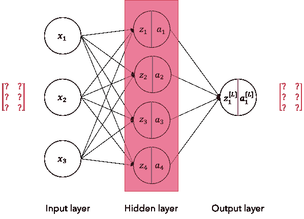
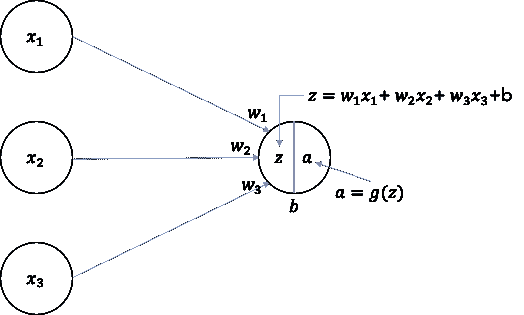
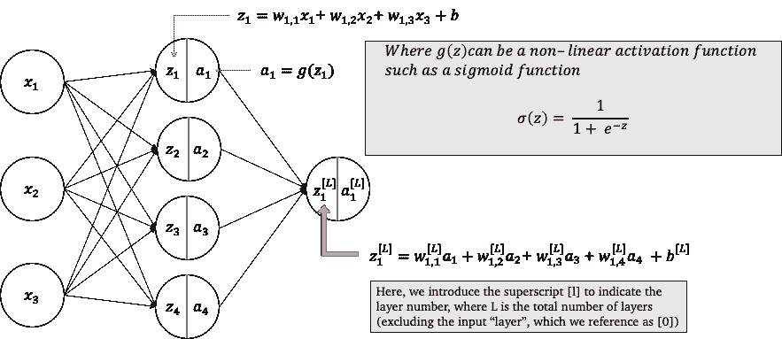
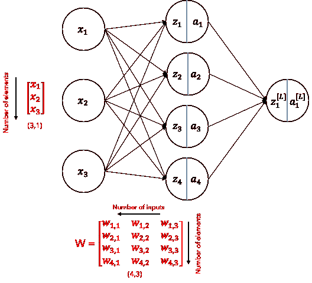
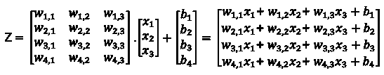
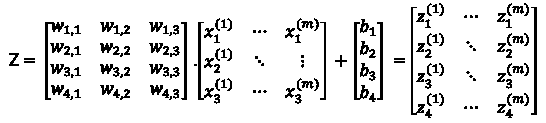

# 为你的神经网络使用正确的维度

> 原文：<https://towardsdatascience.com/using-the-right-dimensions-for-your-neural-network-2d864824d0df?source=collection_archive---------8----------------------->

## 当建立你的人工神经网络时，一个令人沮丧的错误是把向量和矩阵的形状弄错了。这是理解底层数学运算的简要指南，并阐明了要传入的维度。

用什么形状？(作者图片)

> **更新— 8 月 8 日** 该系列已简化为三集系列。

## 目标

如果你刚刚开始机器学习，你应该已经遇到了基本的模型，如顺序网络。这些全连接神经网络(FCNN)是在转向更复杂的架构之前理解基本深度学习架构的完美练习。

初学者会发现，通过 Keras 和 TensorFlow 等高级库很容易开始这一旅程，技术细节和数学运算都是从你这里抽象出来的。好处是能够快速启动学习之旅，而不会被数学所困，但如果你不知道自己在做什么，它会很快带来问题。

> 如果你像我一样，你可能遇到过代码不能按你期望的方式工作的情况，通过反复试验，你似乎能够让它工作。还是做到了？

为了建立基础，我决定参加 [Coursera](https://www.coursera.org/learn/neural-networks-deep-learning/home/welcome) 的在线培训(神经网络和深度学习由 [deeplearning.ai](/deeplearning.ai) 提供)，并希望分享我的学习。主要目标是强迫自己写作，在这个过程中，确保我已经真正理解了这些概念。

## 结构

这是 3 部分系列的第一部分，我们将逐步建立对以下领域的基本理解:

1.  为你的神经网络使用正确的维度
2.  神经网络是如何学习的？
3.  为二元分类构建您自己的神经网络

在本系列结束时，您将理解序列神经网络背后的基本数学，并编写自己的前向和后向传播例程来执行二进制分类。

让我们从第一个主题开始，理解并使用向量和矩阵的正确维数。

## 为什么选择正确的尺寸很重要

像 TensorFlow 和 Keras 这样的高级库从用户那里抽象出复杂的数学运算。这使得用户更容易开始深度学习的旅程。另一方面，如果没有正确的基础，深度学习有时会感觉像“黑魔法”。

> 它只是工作。我想。

凭直觉，你可能知道为什么，但不明白到底发生了什么，也无法验证答案。这可能是一个危险的开始，因为如果你没有掌握好基础知识，你可能会发现自己在更复杂的架构中碰壁了。

当我发现自己使用试错法调整代码只是为了让它工作时，我决定我必须从基础开始。

我选择这个主题作为起点，因为我总是对向量和矩阵维数感到困惑。在一些文献中，我看到变量的不同排序。有时，我看到一个换位操作，有时我看不到。

让我们定义一些术语和一致的表示方式，首先使用简单的单个神经元，这将是监督学习 FCNN 架构的构建块。

具有 3 个输入的单神经元(图片由作者提供)

在上图中，我们有 3 个 ***输入*** ，每个输入代表一个独立的特征，我们用它来训练和预测输出。单个神经元的每个输入都有一个与其相关的 ***权重*** ，它形成了正在被训练的参数。有多少个输入信号就有多少个权重进入一个神经元，并且每个神经元有单个 ***偏差*** (实数)。我们使用下面的 ***线性函数*** 来计算一个值 *z* ，然后将其传递给一个 ***非线性激活函数*** *g(z)* 。

在定义了基本术语后，我们现在将其扩展到一个简化的 FCNN，其中一个隐藏层包含 4 个神经元和 1 个输出节点。

简单的顺序架构，带有一个 4 节点隐藏层(图片由作者提供)

## Python 中向量和矩阵的实现

在 Python 实现中，计算通常使用矢量化算法进行，如 numpy 和 pandas，这消除了低效的`for`循环。

由于这些基础计算，正确设置向量和矩阵的维数至关重要。如果做得不正确，你可能会陷入两种情况中的一种。

> 第一，如果行和列不匹配，代码会拒绝运行，导致运行错误。第二种更危险的结果是，如果形状是正确的，但方向是错误的，则会导致不正确的输出(例如，如果在 4 元素层中有 4 个输入，则尺寸可能会被交换，从而导致错误的输出)。

在上面提到的 Coursera 模块中，我从吴恩达那里学到的一个教训是，首先要草拟出你的神经网络的架构。拥有一个标准的约定和对基础数学运算的理解有助于你轻松地决定是否需要移调和/或整形。它还帮助您更好地理解输出矩阵如何映射到您的神经网络架构。

让我们从通过 FCNN 发送的单个训练示例开始，上面有单个 4 神经元隐藏层。稍后我们将把它扩展到 *m* 训练组。

## 单一训练示例

我个人发现，记住以下几条经验法则会更容易记住结构:

1.  使用建筑布局的结构作为输入向量的形状。如果我们看下面的图表，将单个训练示例的形状记为一个 ***单列*** (就像您将如何绘制它一样)，在本例中是(3，1)。
2.  请记住，权重和偏差仅取决于层中单元的数量。它与训练样本的数量无关。换句话说， *m* (训练集的数量)不改变权重和偏差矩阵。
3.  权重的形状在垂直方向上与该层中神经元的数量相同。在水平方向上，它将基于输入的数量。

使用建筑的形状来模拟你的矢量形状(图片由作者提供)

了解矩阵乘法的排序对于确认形状和排序是否正确很有用。

`(a, b) . (b, c) will result in (a, c)`

下面的代码片段有助于理解约定，您可以自己尝试。

尝试形状和点操作(来源:作者)

矩阵乘法如下图所示。我们现在包括了偏置向量，它与输出的形状相同，只需要是一列(或者一行，如果你愿意的话)。如果提供 *m* 训练集，它将被广播到正确的形状。

计算输出 Z(来源:作者)

## 把它堆在一起

我了解到，一旦你有了正确的基础，就很容易把训练的例子堆在一起。我遵循了吴恩达在他的课程中建议的惯例，用 *m* 来表示训练样本的数量。

记住，权重和偏差**不受训练集数量**的影响。它们的结构是由体系结构决定的，这就是为什么我先花时间解释单个集合。

如果您遵循了我的约定，我们现在只需要将输入向量扩展成一个有 *m* 列的矩阵。我发现训练集的水平方向很容易记住，因为不同的输入被发送到网络中。

因此，我们现在有:

m 训练集的矩阵乘法

如您所见，权重和偏差矩阵和向量保持不变。通过扩展输入向量以覆盖 *m* 个训练集，我们简单地相应扩展输出矩阵。

# 结论

我希望这篇介绍性的文章有助于揭开矩阵形状的一些令人沮丧的秘密，也为你提供验证和检查你的结果的基础。

在我将在接下来的几周内撰写的后续文章中，我们将逐步构建简单的 FCNN 来预测 MNIST 人物。

这篇文章是基于我自己的学习，以及我试图阐明我的理解而写的。如果我的理解有错误，请随时纠正我，这样我们可以在这个过程中一起学习。