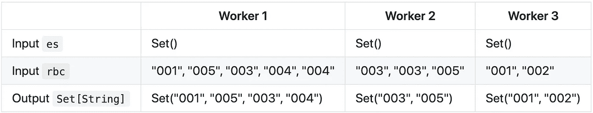
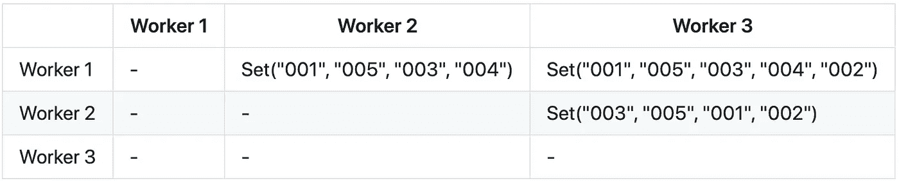
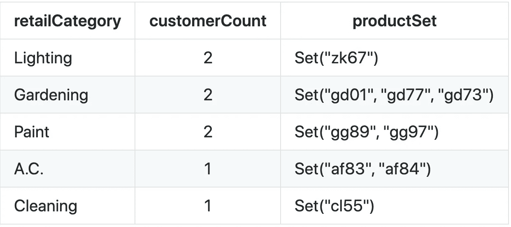

# 在 Scala 中使用 Spark 聚合器类

> 原文：<https://towardsdatascience.com/using-the-spark-aggregator-class-in-scala-341ee8bb46e5?source=collection_archive---------15----------------------->

**注意:**如果你已经理解了`Aggregator`类，并且只是想看看它是如何在 Scala 中实现的例子，请随意跳到“*使用我们的聚合器*”部分。


马库斯·温克勒在 [Unsplash](https://unsplash.com?utm_source=medium&utm_medium=referral) 上拍摄的照片

# **类型安全聚合**

***它们是什么？***

你在机场的行李认领处等你的行李。你内心的混乱正在加剧，因为大多数其他乘客现在已经收到了他们的行李，你肯定不想丢失你的衣服、化妆品或你托运的那瓶豪华精酿啤酒。就在你开始绝望的时候，你看到了它:一个大而亮的橙色行李箱，显然是你的。你兴高采烈地把它捡起来，微笑开始掠过你的脸庞——直到你注意到从拉链上滴下来的水滴。然后又是一个。另一个。虽然袋子本身和你托运时一样，但是里面的东西都湿透了。你不禁好奇，*这是什么时候的事？是飞机里的低压吗？它是从手推车上掉下来的吗？我应该用气泡包装吗？不幸的是，你真的没有任何办法知道。虽然你应该用气泡包装。*

当数据科学家在 Spark 中对数据集执行聚合时，也会有类似的苦恼，只是输出数据集的内容以某种方式显示为无效；也许输入和输出都是完整的数据集，但输出的内容类型有些不正确。聚合的内部机制以及哪里出了问题通常只能在大量的检测工作之后才能得到诊断。即使这样，也不能保证输入数据的未来实例不会给聚合带来另一个问题。

然而，就像添加更多的气泡包装以防止瓶子在您的手提箱中破碎一样，我们可以使用 Spark 的`Aggregator`类创建强类型化的自定义聚合。这个类允许数据科学家准确地指定 worker 节点执行什么转换，如何跨节点组合数据，以及每个步骤在预期的输入和输出类型方面应该包含什么。结果是对聚合转换是如何执行的有了深入的了解，并且有了一种自动的方法来诊断可能出现的任何类型问题。换句话说，这是一个万无一失的方法，可以让你下次坐飞机时省下一瓶啤酒。

***何时使用类型安全聚合***

决定是否对 Spark 数据集执行类型安全聚合可能是一个困难的决定。一方面，很容易就豁出去了，把输入输出类型声明为`Dataset`，就到此为止。根据我的经验，这适用于数据科学家可能遇到的许多探索和分析实例，因为数据和类型验证可以在笔记本或脚本环境中动态执行。

另一方面，在有些情况下(例如生产中的自动化 ML 管道，为其他数据科学家创建 API ),您需要确保转换不会在没有警告的情况下产生意外的和潜在的错误结果。这些是您想要在 Spark 中使用[聚合器](https://spark.apache.org/docs/2.0.2/api/java/org/apache/spark/sql/expressions/Aggregator.html)类的情况。该类允许数据科学家在执行某种类型的自定义聚合时识别输入、中间和输出类型。

第一次遇到的时候发现 Spark 的`Aggregator`类有些混乱。有几个步骤，看似不用的参数，网上例子有限。我见过的大多数例子都倾向于描述简单的用例，比如对一组整数求和或者计算平均值。虽然这些对于同义反复来说肯定是有用的，但是它们并没有提供对可能需要执行的其他常见聚合的更多了解。因此，我在这里的目的是演示`Aggregator`类的两种*用法，人们可能会在编写数据预处理应用程序时实际使用它们，并逐行分解它们。*

# **安`**T3**例**

让我们假设您有以下家装商店的零售数据

我们的五金店数据集。

并希望以类型安全的方式执行以下操作:

*   统计每个`retailCategory`中有多少独立客户
*   收集唯一的`productID`数组，按`retailCategory`分组
*   将上述数据转换成包含前两步的`Dataset`

让我们假设我们想要使用下面的通用结构来实现我们的聚合器:

这将导致数据科学家在使用我们的库时调用以下 API:

```
val myValue = DoSomething.transformData(…)
```

请注意，我们正在创建一个对象，其中包含我们希望用来执行聚合的方法，以及我们希望在该方法中使用的两个聚合器。这与我在网上看到的许多其他例子不同，原因有二。首先，我们试图创建一个 API 供数据科学家在数据预处理阶段使用，而不是创建一个工作流来调用某个`mainApp`对象。其次，我们正在构建两个以上的由同一个转换使用的聚合器。

我们的待办事项列表上的第一项是导入`Aggregator`类、`ExpressionEncoder`类，为上面显示的输入数据模式创建一个`case class`，并为我们的输出模式创建另一个`case class`:

```
import org.apache.spark.sql.expressions.Aggregator
import org.apache.spark.sql.catalyst.encoders.ExpressionEncoder// input schema
case class RetailByCustomer(customerID: String,
  productID: String,
  retailCategory: String)// output schema
case class AggRetailByCategory(retailCategory: String, 
  customerCount:Int,
  productSet: Set[String])
```

**注意**:我们需要导入`ExpressionEncoder`类来为`Set[String]`类型定义我们自己的编码器，因为这不是 Scala 中的默认编码器。

现在我们开始写我们的聚合器。我现在将完整地展示这两种方法，然后逐行分解。

我们的两个聚合器。

正如您可能从值名中推断的那样，我们的第一个聚合器提供了不同客户的计数。这是通过将每个客户添加到一个`Set`来完成的，因为集合只包含任何给定值的一个实例。在这种情况下使用不同的计数也很重要，以避免在传入数据可能包含重复值或没有映射到任何`retailCategory`的`productID`值的情况下出现过度计数。现在，让我们看看第一行:

```
val distinctCustomerCountAggregator: 
  TypedColumn[RetailByCustomer, Int] = new
    Aggregator[RetailByCustomer, Set[String], Int]
```

这里我们声明一个值，该值将返回一个具有预期输入(`RetailByCustomer` —一个[表达式](https://jaceklaskowski.gitbooks.io/mastering-spark-sql/spark-sql-Expression.html))和预期输出(`Int` —一个[表达式编码器](https://jaceklaskowski.gitbooks.io/mastering-spark-sql/spark-sql-ExpressionEncoder.html))的 [TypedColumn](https://spark.apache.org/docs/2.2.1/api/java/org/apache/spark/sql/TypedColumn.html) 。我们将这个值设置为一个新的`Aggregator`，并定义输入类型(`RetailByCustomer`)、中间类型(`Set[String]`)和输出类型(`Int`)。也就是说，这个聚合器将接受在我们的`RetailByCustomer` case 类中定义的某种类型，执行某种类型的转换，这将产生一个`Set[String]`类型，并在聚合后返回类型`Int`的某个值。

现在来看函数的实质。但首先，这里有一只小狗来打破单调，让你的灵魂稍微清醒一下。


[自由股票](https://unsplash.com/@freestocks?utm_source=medium&utm_medium=referral)在 [Unsplash](https://unsplash.com?utm_source=medium&utm_medium=referral) 上拍摄的照片

如果您正在阅读本文，您可能知道 Spark 是一个以分布式方式执行数据转换的框架，因此您可能知道有一个主节点向工作节点执行器发送任务来执行数据转换。但是，在对整个数据集执行聚合时，您会向工作节点发送哪些任务来协同工作呢？

我喜欢从高层次*考虑这个问题*从单个工人节点开始。`Aggregator`类将任务发送给单个工作节点(以及该作业的所有其他活动工作节点)上的执行器，说明如何开始聚合:

```
override def zero: Set[String] = Set[String]()
```

也就是说，在我们的例子中，每个 worker 节点应该用一个类型为`String`的空集开始聚合。

接下来，`Aggregator`类告诉每个 worker 节点如何处理它在内存中的数据:

```
override def reduce(es: Set[String], rbc: RetailByCustomer):
  Set[String] = es + rbc.customerID
```

我们的`reduce`定义中的指令告诉每个 worker 节点期待来自上一步的“空集”`es`和上面定义的`RetailByCustomer` case 类`rbc`的输入。此外，每个 worker 节点上的这个转换的输出将会产生一个期望的类型`Set[String]`。最后，定义了在每个 worker 节点上发生的实际转换。每个存储为类型`RetailByCustomer.customerID`(我们定义为`String`)的内存值被添加到现有的空集，从而产生一个包含不同客户 id 的`Set[String]`。

为了在实践中看到这一点，假设我们的数据已经由`retailCategory`进行了分区，这样关于“照明”和“园艺”的信息存储在一个 worker 节点上，“空调”和“清洁”存储在第二个节点上，而“油漆”存储在第三个节点上。每个节点上的结果集应该如下所示:



既然已经在每个工作者节点上执行了寻找唯一的`customerID`的转换，那么`Aggregator`类必须指示工作者节点如何相互交互，以便在节点上寻找唯一的`customerID` s *。这让我们想到了`merge`的定义:*

```
override def merge(wx: Set[String], wy: Set[String]): 
  Set[String] = wx.union(wy)
```

这里，我们将两个预期输入定义为类型`Set[String]`；一个来自“工人 X”(`wx`)，一个来自“工人 Y”(`wy`)。同样，我们将预期的输出类型定义为`Set[String]`。最后，`Aggregator`类必须给出每个 worker 节点在与其他节点交互时应该做什么的指令。在这种情况下，我们告诉每个工人将来自`reduce`步骤的输出与另一个工人的`reduce`输出合并(即返回两个集合之间的所有元素)。

虽然信息在工作节点之间传递的方式有很多细微差别，但是为了理解`Aggregator`类，我们可以将`merge`步骤的输出可视化如下:



假设如果我们的 workers 节点没有联合结果，它们将返回什么。

这将导致类型`Set[String]`的输出“集合(“001”、“005”、“003”、“004”、“002”)”。

下一步`finish`，为驾驶员提供执行动作的指令:

```
override def finish(reduction: Set[String]): Int = reduction.size
```

这里，我们将期望的输入类型定义为我们的`union` ed `Set[String]`，期望的输出类型定义为`Int`。我们还通过调用`size`方法定义了对`Set[String]`输入采取的动作，该方法返回一个表示集合中项目数量的整数。在我们的例子中，这会返回`5`。

最后一步是为我们的缓冲(或中间)步骤和输出步骤定义`Encoder`:

```
override def bufferEncoder: Encoder[Set[String]] =
  implicitly(ExpressionEncoder[Set[String]])override def outputEncoder: Encoder[Int] =
  implicitly(Encoders.scalaInt)
```

`distinctCustomerCountAggregator`的输出是一个`Int`，它在 Scala 中有一个预定义的编码器。因此，我们可以在定义我们的`outputEncoder`时简单地调用`Encoders.scalaInt`，并隐式地将它传递给其他定义。然而，尽管`Set`和`String`在 Scala 中都有预定义的编码器，但是`Set[String]`没有。因此，我们必须使用第一步中导入的`ExpressionEncoder`类定义我们自己的`Set[String]`编码器。

`productIDAggregator`实际上与`distinctCustomerCountAggregator`非常相似，除了一个关键的区别:我们期望的是`Set[String]`类型的输出，而不是`Int`。这将改变几个步骤。

**练习** : *如果你正在全文阅读这篇文章，我鼓励你在继续下一步之前，思考哪些步骤需要改变以促进这一点(提示:有 3 个)。*

第一个区别是将`TypedColumn`和预期`Aggregator`输出类型都改为`Set[String]`:

```
val productIDAggregator: 
  TypedColumn[RetailByCustomer, Set[String]] =
    new Aggregator[RetailByCustomer, Set[String], Set[String]]
```

接下来的三个步骤对于两个聚合器来说实际上是相同的:我们指示工作节点创建空集，向这些集合添加`productID` s，并联合它们自己得到的集合。

然而，第二个区别出现在`finish`定义中。我们希望将预期的输出类型从`Int`改为`Set[String]`，并删除`size`方法，因为我们只想返回实际的一组`productID` s:

```
override def finish(reduction: Set[String]): Set[String] = reduction
```

最后，我们需要改变`outputEncoder`。由于在这种情况下我们没有真正在类型之间转换，我们的`bufferEncoder`和`outputEncoder`将是相同的:

```
override def bufferEncoder: Encoder[Set[String]] =
  implicitly(ExpressionEncoder[Set[String]])override def outputEncoder: Encoder[Set[String]] =
  implicitly(ExpressionEncoder[Set[String]])
```

就是这样！我们已经创建了两个执行两种不同功能的聚合器！

# **使用我们的聚合器**

为了在实践中使用这些，让我们看一下完整的代码:

编译并发布上述代码后，数据科学家可以在构建数据转换管道时调用以下代码(或者您可以在文件底部调用它):

```
import com.wherever.code.is.PreprocessDataval retailData = Seq(
("001", "zk67", "Lighting"),
("001", "gg89", "Paint"),
("002", "gg97", "Paint"),
("003", "gd01", "Gardening"),
("003", "af83", "A.C."),
("003", "af84", "A.C."),
("004", "gd77", "Gardening"),
("004", "gd73", "Gardening"),
("005", "cl55", "Cleaning"),
("005", "zk67", "Lighting"),
).toDF("customerID", "productID", "retailCategory")val transformedRetailData = PreprocessData.createArrayAndCount(retailData)
```

这里显示的`val transformedRetailData`的输出应该类似于



# **结论**

*   类型安全聚合允许数据科学家指定如何进行转换，如何在节点内和节点间组合数据，以及每个步骤在预期的输入和输出类型方面应该包含什么。
*   使用 Spark 的`Aggregator`类来执行类型安全转换。典型的用例是在生产级环境中，编写 API，或者计划重复使用聚合。
*   理解 Spark 中发生的事情对于理解`Aggregator`类如何工作是很重要的。

## ***伸手***

感谢阅读这篇文章！如有任何意见/问题，请随时联系我们或通过 [Twitter](https://twitter.com/martainyo) 。你也可以访问我的个人网站:【mfjackson.github.com[。我一直在学习并寻求提高我在数据科学方面的知识，所以如果我做了任何错误的陈述，或者你知道比本文更好的方法，请告诉我！！](http://mfjackson.github.com)