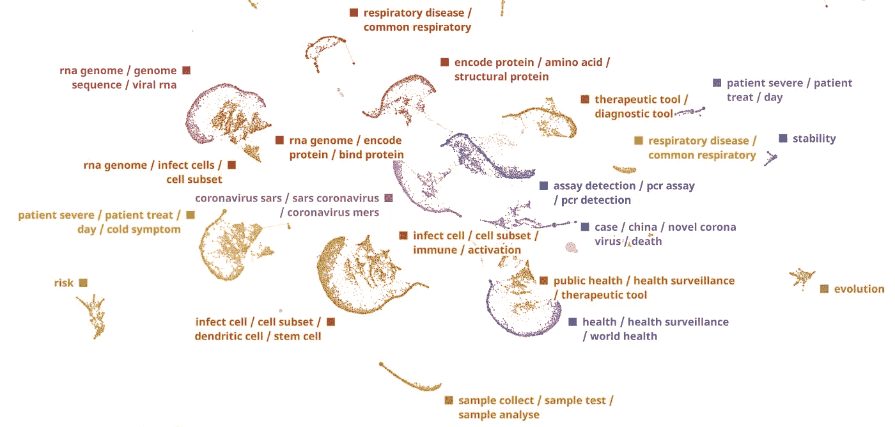
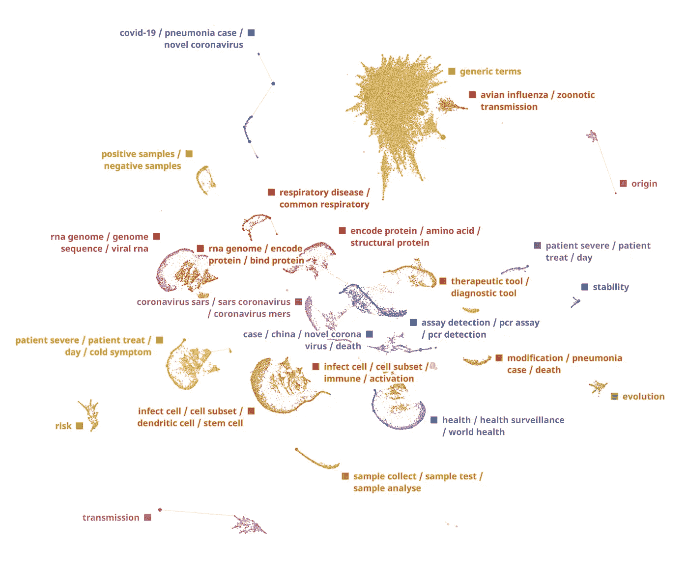
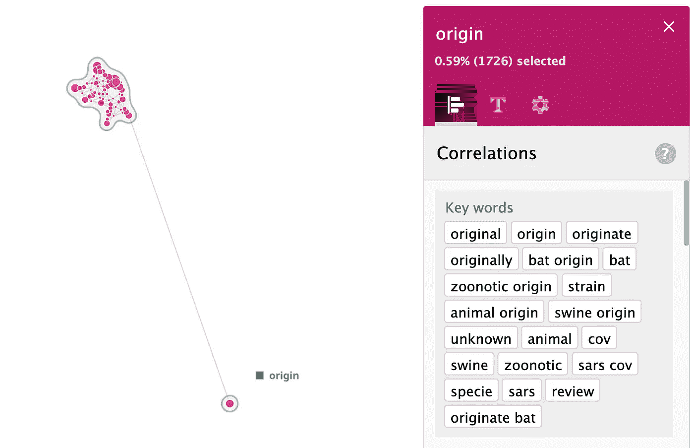
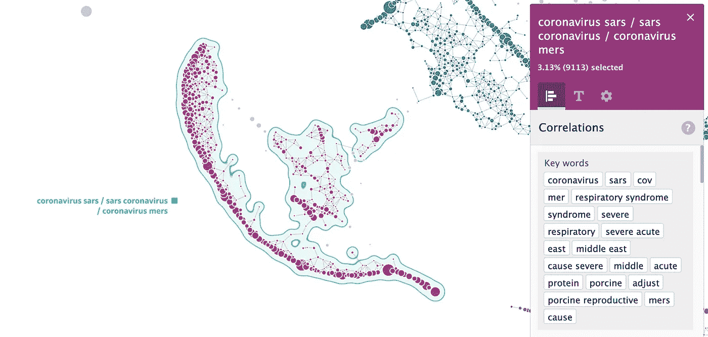
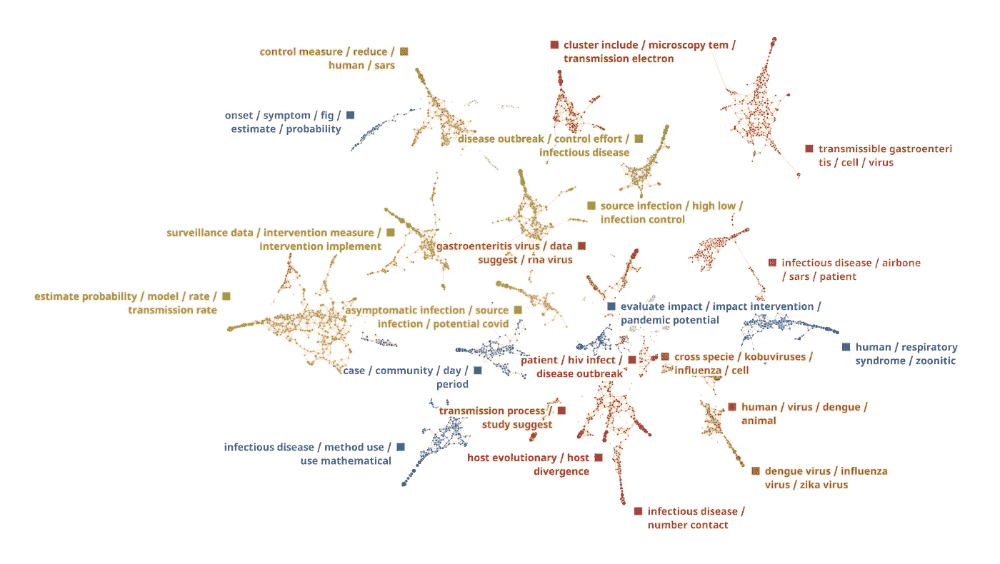
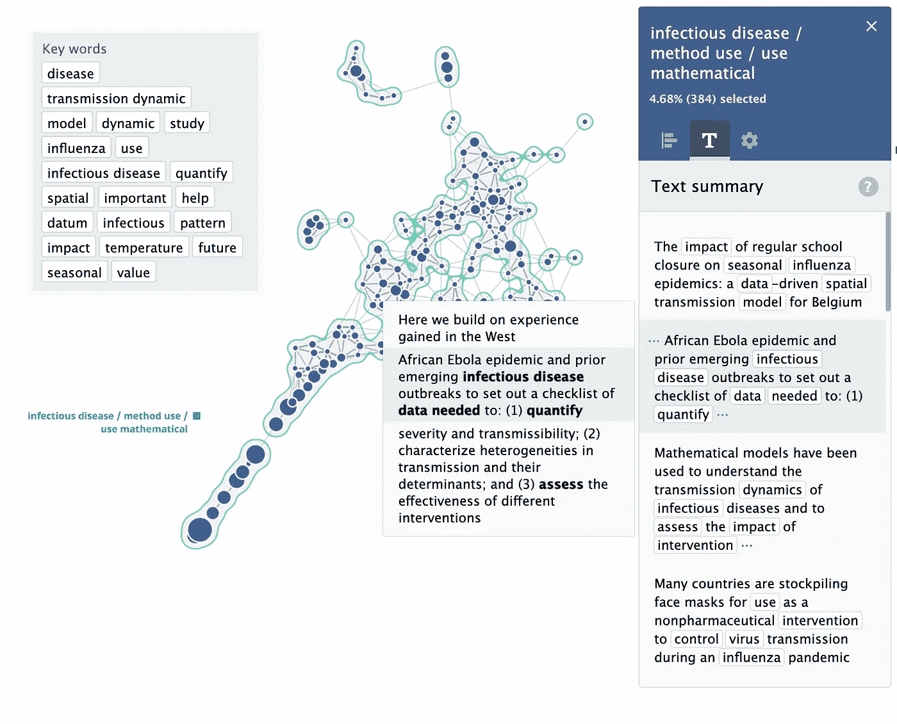
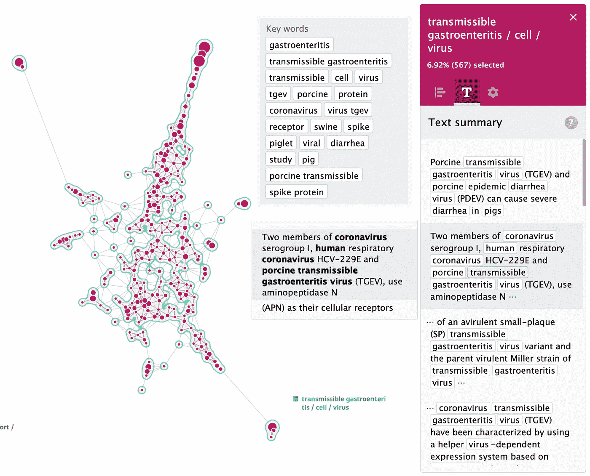
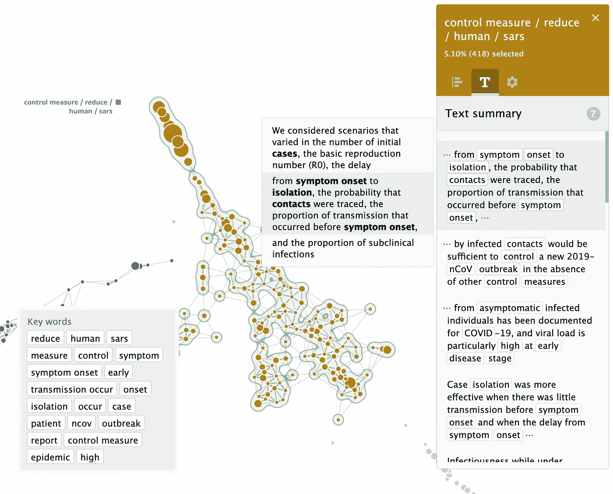
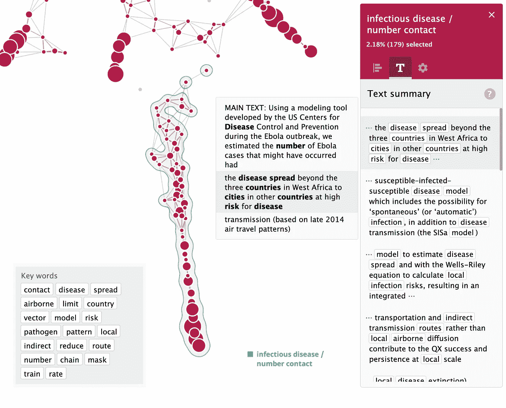

# 利用拓扑文本分析迎接新冠肺炎公开研究挑战

> 原文：<https://towardsdatascience.com/using-topological-text-analysis-for-covid-19-open-research-challenge-184d44bb92a6?source=collection_archive---------31----------------------->

## 我对新冠肺炎·卡格尔挑战科学白皮书的分析。这项研究是帮助病毒学、药学和微生物学专家找到问题答案的第一步。

使用 DataRefiner 平台的拓扑图可视化

***编者按:*** [*走向数据科学*](http://towardsdatascience.com/) *是一份以数据科学和机器学习研究为主的中型刊物。我们不是健康专家或流行病学家，本文的观点不应被解释为专业建议。想了解更多关于疫情冠状病毒的信息，可以点击* [*这里*](https://www.who.int/emergencies/diseases/novel-coronavirus-2019/situation-reports) *。*

3 月 12 日，白宫和一个领先的研究团体联盟准备了新冠肺炎开放研究数据集，以应对冠状病毒疫情。该数据集由超过 44，000 篇学术文章组成，包括超过 29，000 篇关于新冠肺炎、新型冠状病毒和相关冠状病毒的全文。这个免费提供的数据集提供给全球研究界，以应用自然语言处理和其他人工智能技术的最新进展，产生新的见解，支持正在进行的抗击这种传染病的斗争。这个挑战的 Kaggle 页面可以在这里找到:[https://www . ka ggle . com/Allen-institute-for-ai/CORD-19-research-challenge](https://www.kaggle.com/allen-institute-for-ai/CORD-19-research-challenge)

# **召集所有主题专家**

如果您是病毒学、药学或微生物学方面的专家，我们很乐意让您免费访问 DataRefiner 平台上的以下分析，以帮助加快科学研究和应对病毒。请在 ed@datarefiner.com 与我们联系。

该数据集是由艾伦人工智能研究所与陈·扎克伯格倡议，乔治敦大学安全和新兴技术中心，微软研究院和国家医学图书馆-国家卫生研究院合作创建的，并与白宫科技政策办公室合作

# **挑战**

挑战赛为机构群体提出了许多问题:

关于传播、潜伏期和环境稳定性，我们知道些什么？我们对该病毒的自然史、传播和诊断了解多少？关于感染预防和控制，我们学到了什么？

我们对新冠肺炎风险因素了解多少？
我们从流行病学研究中学到了什么？

**我们对病毒的遗传、起源和进化了解多少？** 我们对人与动物界面的病毒起源和管理措施了解多少？

**我们对非药物干预了解多少？** 关于非药物干预的公平性和合规性障碍，大家都知道些什么？

我们对疫苗和疗法了解多少？
关于疫苗和疗法的研发和评估工作，已经发表了什么？

**我们对诊断和监控了解多少？** 

# **数据预处理**

我们在分析中使用了文件的摘要和全文。该数据集中的文档通常只有摘要或全文。将它们融合在一起有助于展现全貌。

来自 kaggle 页面的挑战数据质量仪表板

科技论文的摘要通常相当复杂，分析它们的一种方法是将它们分解成句子。在这种情况下，每个句子都是一小段信息，这对于自动分析来说应该足够了。

这是其中一个摘要的例子:

> 传染因子的基本繁殖数是在一个未被感染的人群中，一个病例在传染期内可以产生的平均传染数。众所周知，由于一些方法问题，包括不同的假设和参数选择、使用的模型、使用的数据集和估计期，对这一数字的估计可能会有所不同。随着新型冠状病毒(2019-nCoV)感染的传播，发现繁殖数量有所变化，反映了冠状病毒爆发的传播动态以及病例报告率。“由于控制策略的显著变化(随着时间的推移一直在变化)，以及由于检测技术的引入，这些技术得到了快速改进，能够缩短从感染/症状发作到诊断的时间，从而更快地确认新冠状病毒病例，我们之前对 2019-nCoV 传播风险的估计需要修订。”

为了我们的分析，我们把它分成句子:

*   *感染因子的基本繁殖数是在一个未受感染的原始人群中，一个病例在感染期内可能产生的平均感染数*
*   *众所周知，这一数字的估算可能因若干方法问题而有所不同，包括不同的假设和参数选择、所用模型、所用数据集和估算期*
*   *随着新型冠状病毒(2019-nCoV)感染的传播，发现繁殖数量发生变化，反映了冠状病毒爆发的传播动态以及病例报告率*
*   *由于随着时间的推移，控制策略发生了显著变化，并且由于检测技术的引入得到了快速改进，从而能够缩短从感染/症状发作到诊断的时间，从而更快地确认新冠状病毒病例，因此我们之前对 2019-nCoV 传播风险的估计需要修订*

正如你所看到的，每一句话实际上足以表达研究人员至少部分回答一个问题所需的一条信息。我们总共有 291281 个句子——这对分析来说足够了。

# **句子分析**

所有的句子都进行了分析，并显示为下面的拓扑图，图上的每个点都是一个或多个句子，相似的句子彼此靠近放置。聚类是自动形成的，代表文本中不同的主题。

数据集中所有句子的拓扑图

在我们训练模型时，除了自动聚类，我们还配置了它，以提取包含“起源”、“稳定性”、“进化”、“风险”和“传播”等关键词的句子。我们使用半监督方法在地图上手动分离这些集群。

让我们来看看“起源”集群，我们可以从中提取什么知识。

“起源”分类的热门关键词

这些热门关键词是从句子中自动提取的，我们在这里显示前 20 个，其余的将用于查找以最佳方式描述集群的热门摘要句子。

为源聚类自动选择的前几个句子

描述聚类“起源”的顶级句子也被自动识别，并且相当准确。

让我们来看看另一个集群——这一次是完全自动形成的——“冠状病毒 sars / sars 冠状病毒/冠状病毒 mers”。

“冠状病毒 sars / sars 冠状病毒/冠状病毒 mers”聚类的热门关键词

用户调查自动发现的集群“冠状病毒 sars / sars 冠状病毒/冠状病毒 mers”的顶级摘要句子

# **分析与“传输”关键字相关的句子作为单独的地图**

除了对一整套句子进行分析之外，该系统还能够处理与特定关键字相关的句子，例如“transmission”。下面是与关键词“传输”相关的 8198 个句子的图:

“传输”关键字的映射

该数据集不仅包括冠状病毒白皮书，还包括大量关于其他近期病毒的论文，如“SARS”(严重急性呼吸综合征相关冠状病毒)、“MARS”(中东呼吸综合征相关冠状病毒)、“TGEV”传染性胃肠炎病毒和其他一些病毒。我们分别审查了不同的组群，以了解关于这种疾病和类似疾病传播的所有关键信息。

“传染病/方法使用/使用数学”群集的描述

“传染性胃肠炎/细胞/病毒”群集的描述

“疾病爆发/控制工作/传染病”组的描述

“估计概率/模型/速率/传输速率”群集的描述

“控制措施/减少/人/ sars”组的描述

“传染病/数字接触”集群的描述

该系统自动识别关键词簇，并在其中分割数据集。聚类越接近，相似的术语和主题就越多。这有助于理解高级分组并在数据中找到元聚类。

# **结论**

文本的拓扑分割有助于研究人员将大量文本信息中的知识系统化。在执行分段和分析每个数据段时，整个数据量被分成簇，这简化了数据的分析和理解。识别出的关键词和总结句子有助于找到最有代表性的信息，并加快寻找答案的速度。

本文的分析是使用 DataRefiner 平台执行的。我们已经在许多公司使用这项技术，不仅用于文本分析，还用于用户活动和物联网细分。如果您想了解更多信息或预订演示，请联系我们。

【https://datarefiner.com/feed/covid-challenge】原文：<https://datarefiner.com/feed/covid-challenge>

****

[DataRefiner.com](https://datarefiner.com/)是一家总部位于英国的公司，专门从事用户活动、传感器或文本等复杂数据的分析和细分。DataRefiner 平台是本文讨论的多年提炼方法的结果，但它被广泛应用于各种行业，包括航空、社交网络、欺诈检测等。如需了解更多关于您所在行业的信息，请通过 ed@datarefiner.com 联系我们

*   **我们对诊断和监控了解多少？**

关于系统的、整体的诊断方法(从公共卫生监督的角度到能够预测临床结果)已经发表了什么？