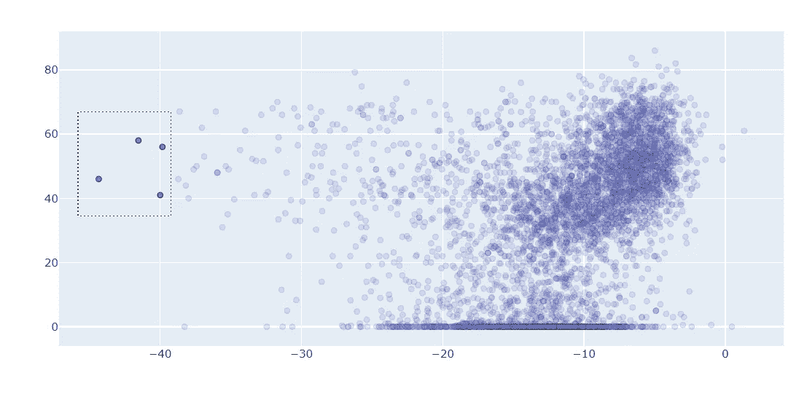
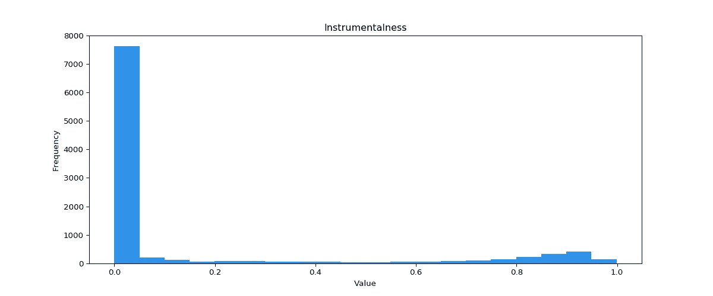
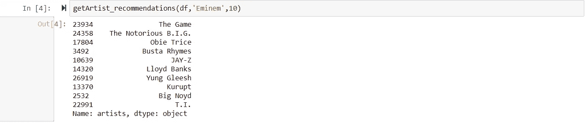
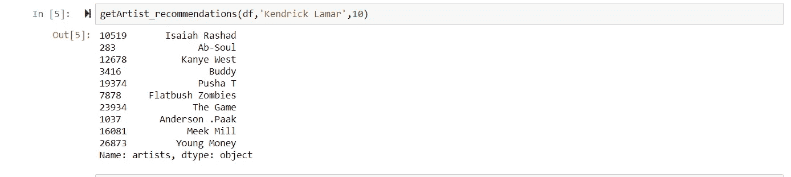
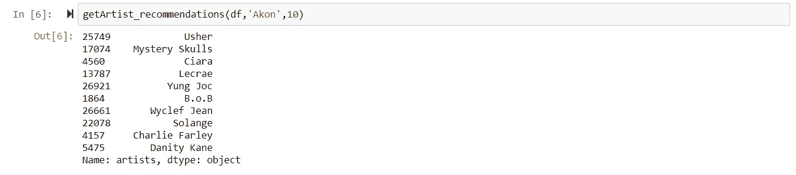

# 使用无监督学习生成艺术家推荐

> 原文：<https://towardsdatascience.com/using-unsupervised-learning-to-generate-artist-recommendations-dd4fdba3b4fa?source=collection_archive---------30----------------------->

## Scikit 的最近邻 Python 学习者

在本文中，我将探索使用无监督的机器学习来使用 Spotify 的数据生成艺术家推荐。虽然有许多算法可以用于此目的，但这里考虑的是最近邻学习器，使用 Python 中的 Scikit Learn 实现。

让我们开始吧！

**1。数据**

我们将使用来自 Spotify Web API 的数据(可以在[这里](https://www.kaggle.com/yamaerenay/spotify-dataset-19212020-160k-tracks?select=data_by_artist.csv)找到)。该数据集包含了从 1921 年到 2020 年的数据，涵盖了大约 27000 多位艺术家！

对于每个艺术家来说，有几个领域可以描述他们的音乐:响度、听觉、舞蹈性、流行度等等。(关于这些意味着什么的细节可以在[这里](https://developer.spotify.com/documentation/web-api/reference/tracks/get-audio-features/)找到)。我们将只使用这些特征(没有其他信息，如艺术家属于哪个流派)来训练我们的模型，然后要求它为类似于我们指定的艺术家生成推荐。

**2。算法**

虽然许多无监督学习算法可以用于这个问题，但我们将考虑一个最简单的算法——最近邻学习器。该算法本质上扫描 n 维空间(n 是我们给模型的“特征”或特性的数量)来寻找最接近我们指定的点。例如，如果我们只给模型响度和流行度，并要求它推荐 5 位与 Eminem 相似的艺术家，它将浏览所有艺术家并找到响度和流行度值最相似的 5 位艺术家。
形象化的一个有用方法是想象我们生成了一个散点图，响度在 x 轴上，流行度在 y 轴上。每个艺术家的 x-y 坐标可以被认为是他们的“地址”，我们的问题归结为找到“最近的邻居”(即在这个二维空间中离阿姆“距离”最小的艺术家)。这里我们将在 11 维空间中工作，但同样的原理也适用。
幸运的是，我们不需要费心去弄清楚如何编写代码来实际实现这个算法，它已经为我们完成了，我们可以直接使用 Python 中的 SciKit Learn 包。



作者在二维平面图像中寻找“最近的邻居”

**3。流程**

首先，我们将数据加载到 Python 中。可以从 [Kaggle](https://www.kaggle.com/yamaerenay/spotify-dataset-19212020-160k-tracks) 下载 csv 格式的文件。

二。然后，我们将决定应该将哪些“特性”或特征传递给模型。

三。这些特征中的一些可能具有偏斜分布。例如，大多数歌曲的“器乐性”值很低，这意味着我们有许多艺术家的器乐性得分接近 0，但相比之下，少数艺术家的得分要高得多(见下图)。机器学习算法通常不能很好地处理这种分布，因为异常值会在数据中引入大量“噪声”。为了解决这个问题，我们将使用 SciKit Learn 的 StandardScaler 函数来缩放我们的数据，这将减少这些异常值对我们数据的影响。更多关于定标器的细节可以在[这里](https://scikit-learn.org/stable/modules/generated/sklearn.preprocessing.StandardScaler.html)找到。



工具性显示了一个偏斜的分布:我们需要通过作者来修正这个图像

四。在我们的数据被缩放后，我们准备好训练我们的模型。我们将数据传递给最近的邻居学习者([文档](https://scikit-learn.org/stable/modules/generated/sklearn.neighbors.NearestNeighbors.html#sklearn.neighbors.NearestNeighbors))。虽然我们有机会调整该学员考虑的许多技术参数，但对于这个问题，我们将只让每个参数取默认值。我们将告诉我们的模型的唯一事情是我们想要多少推荐。

动词 （verb 的缩写）就是这样！我们现在将要求我们的模型扫描所有 27，000+位艺术家，并推荐与我们指定的艺术家相似的艺术家。

让我们开始吧:

```
import pandas as pd
import numpy as npdata_artist = pd.read_csv('./Spotify/data_by_artist.csv') *#This is a datafram with 27621 rows (each row represents one artist) and 15 columns (each column has a unique feature)**## Let's see the 10 most popular artists according to Spotify's algorithm*data_artist.sort_values(by='popularity',ascending=False).head(10)['artists']
```


Spotify 上最受欢迎的十位艺术家

我们现在将编写一个函数来准备数据、缩放数据、训练模型并生成建议:

```
features= list(data_artist.columns[0:12]) # We select only the features we want to pass to the model
df = data_artist[features]def getArtist_recommendations(data,artist,numArtists):
    X = data.iloc[:,1:] #This contains all our features
    Y = data.iloc[:,0] #This contains the name of the artists 
    from sklearn.preprocessing import StandardScaler
    scaler = StandardScaler()
    X_scaled = scaler.fit_transform(X) #We have now scaled our data to reduce the impact of outliers 

    from sklearn.neighbors import NearestNeighbors
    recommender = NearestNeighbors(n_neighbors=numArtists+1).fit(X_scaled) #Training the model took a single line of code :)
    distances, indices = recommender.kneighbors(X_scaled)
    output = pd.DataFrame(indices)
    output['Artist'] = Y

    recommendations = output.loc[output.Artist==artist,output.columns!='Artist']
    Y[list(recommendations.values[0])][1:]
    return(Y[list(recommendations.values[0])][1:])
```

就是这样！让我们测试一下模型的表现。我们将要求它推荐 10 位与阿姆、肯德里克·拉马尔和阿肯相似的艺术家。

```
getArtist_recommendations(df,'Eminem',10)
getArtist_recommendations(df,'Kendrick Lamar',10)
getArtist_recommendations(df,'Akon',10)
```



推荐与阿姆相似的艺术家-作者图片



推荐与 Kendrick Lamar 相似的艺术家-作者图片



推荐与阿肯相似的艺术家-作者图片

快乐聆听:)