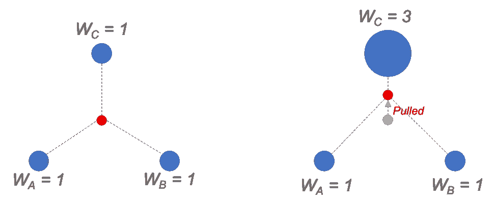
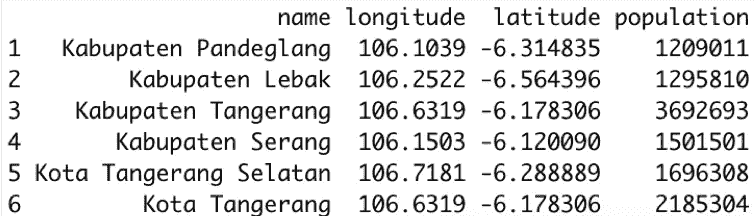
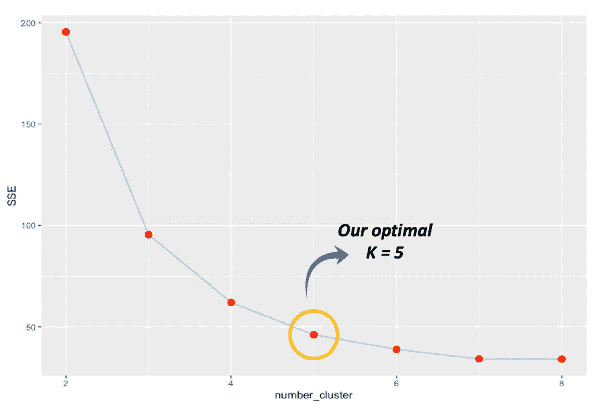
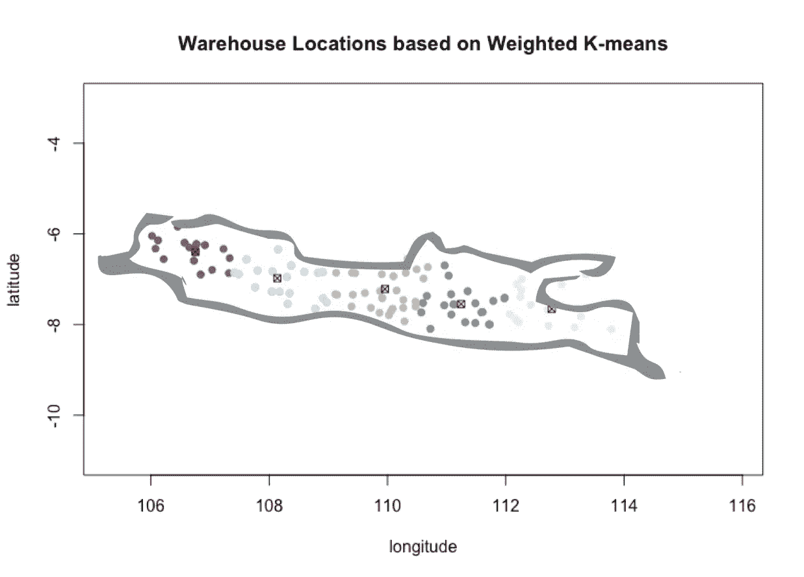

# 利用加权 K-均值聚类确定配送中心位置

> 原文：<https://towardsdatascience.com/using-weighted-k-means-clustering-to-determine-distribution-centres-locations-2567646fc31d?source=collection_archive---------2----------------------->


[Marcin Jozwiak](https://unsplash.com/@marcinjozwiak?utm_source=unsplash&utm_medium=referral&utm_content=creditCopyText) 在 [Unsplash](https://unsplash.com/s/photos/warehouse?utm_source=unsplash&utm_medium=referral&utm_content=creditCopyText) 上拍摄的照片

## 另一个你可能不知道的 K-means 算法的修改版本的用例

**背景**

我们所有人都一定熟悉快餐连锁公司，如肯德基或麦当劳，因为它们在我们周围有大量的分店。这些名字以快速提供即食餐而闻名，这要归功于提前散装烹饪，有时还包括预包装。作为其商业模式的一个暗示，快餐连锁店需要快速的供应链执行，特别是对于配料。这是为了确保它们总是新鲜的提供给顾客。

关于这一点，你有没有想过他们如何能及时提供这些易腐的原料？这并不是一个听起来简单的问题，因为涉及的出口数量巨大。**在这方面，仓库所描绘的配送中心起着至关重要的作用**。

快餐连锁店的仓库是供应商卸下货物的地方，这些货物随后被包装，最后被分发到商店。通常，一个仓库负责周围几个城市的所有经销店。因此，快餐连锁店会有几个仓库分布在他们的经营区域。

在本文中，我们考虑一家全球快餐公司，该公司最近计划进入印度尼西亚市场。管理层预计分两个阶段进行扩张:第一阶段和第二阶段。第一阶段将只覆盖爪哇岛，而其余地区将在第二阶段处理。为此，我们将帮助确定其仓库的位置，特别是在第一阶段

> 我们将帮助一家快餐店确定遍布爪哇岛的仓库位置。

**回忆(标准)K 均值聚类**

K 均值聚类是一种将数据划分为 K 个不同聚类的算法。关于算法如何工作的高级视图如下。给定 K 个簇(通常是随机的)的初始(这意味着来自 K 个质心)，该算法在以下两个步骤之间迭代:

1.  计算所有数据点和现有 K 个质心之间的距离，并相应地将每个数据点重新分配给其最近的质心。
2.  基于这个新的聚类分配，通过取数据点的平均值来计算新的 K 个质心。

执行上述迭代，直到质心不随迭代而改变(算法收敛)或者满足特定的停止标准(例如，触发最大迭代次数)

读者可能已经知道，该算法中的数字 K 是一个超参数(即预定义的数字)。在实践中，我们可以通过使用例如*肘方法*来选择最佳 K，我们将在本文后面使用并解释该方法。

此外，在选择距离度量时也有一定的自由度，而不是在原始算法中使用的标准欧几里德距离。如果有必要或者看起来更合适，我们可以使用其他距离度量，如哈弗森距离(我们将在文章中使用的距离)或曼哈顿距离。

**使用加权 K 均值聚类解决问题**

让我们回到我们的问题！确定仓库的位置可以看作是寻找相应服务分支的聚类的质心。因此，这是 K-均值聚类，特别是加权 K-均值聚类的一个很好的用例。我们所说的“加权”一会儿就明白了。

我们首先已经知道，这家快餐公司将在爪哇开设分店。因此，我们可以通过首先确定分支机构的位置来解决这个问题，我们可以用 Java 中所有城市/地区的经度-纬度(相当于(x，y))来合理地近似这个位置。使用这些城市中心的数据点，我们实际上可以运行标准的 K-means 聚类来解决这个问题。然而，这种方法没有考虑到这样一个事实，即一些城市确实比其他城市更大，这意味着对供应的原料有更高的需求量。

> 标准的 K-均值方法没有考虑到这样一个事实，即一些城市确实比其他城市大，这意味着对供应的原料有更高的需求量。

考虑到这一点，我们还包括人口数据，作为配料需求的代理。这些人口数据将成为相应城市(数据点)的权重，瞧！我们已经有了运行加权 K 均值聚类算法的设置。

为了解释权重对算法的影响，假设我们现在正在处理不同大小的数据点(由它们的权重表示)。我们可以进一步看到大小与数据点所拥有的重力成比例。因此，权重越大，数据点将质心拉得越近。**总之，与标准算法的根本区别在于质心计算，现在使用加权平均值，而不是标准平均值。**



计算质心的标准(左)与加权(右)平均值的图示

**数据来源**

我们感谢 benangmerah GitHub 帐户的这个存储库提供了所考虑的城市的经纬度坐标数据。原来，爪哇岛上有 119 个城市，从西部的奇勒贡到靠近巴厘岛的左部的班尤万吉。此外，我们还参考了印度尼西亚统计局(BPS)2018 年爪哇省各城市的人口数据。

**哈弗森距离**

请注意，**我们将使用经纬度**，它代表地球的球面——与(x，y)中的标准平面 2D 坐标系相反。因此，欧几里德距离不是这里使用的最佳距离度量。相反，我们将使用哈弗线距离，这是球面上一个合适的距离度量。

下面的等式中，φ是纬度，λ是经度，R 是地球半径(平均半径= 6371 公里)，这就是我们如何使用哈弗辛方法计算距离(记为 *d* )。

> A = sin((φB—φA)/2)+cosφA * cosφB * sin((λB—λA)/2)
> 
> c = 2 * atan2( √a，√( 1a))
> 
> ⋅ c

下面给出了这种距离度量的另一种实现方式。

```
#haversine distance functionhaversine_dist = function(point1, point2) { #each argument is a numeric vector with two elements (lon, lat)
  lon1 = point1[1] 
  lat1 = point1[2]
  lon2 = point2[1]
  lat2 = point2[2]

  R = 6371000 #earth radius in meters
  phi1 = lat1 * pi / 180 #convert to radian
  phi2 = lat2 * pi / 180 #convert to radian
  delta_phi = (lat2 - lat1) * pi / 180
  delta_lambda = (lon2 - lon1) * pi / 180

  a = (sin(delta_phi/2))^2 + cos(phi1) * cos(phi2) * ((sin(delta_lambda/2))^2)
  c = 2 * atan2(sqrt(a), sqrt(1-a))

  distance = R * c #haversine distance between point1 and point 2 in meters
  return(round(distance, 2))
}
```

**逐步解决方案和 R 中的代码**

好了，让我们动手做代码吧！在本文中，我们将使用 R 来运行算法。

*   数据准备

我们导入一个包含所需列的数据帧:城市名称、经度、纬度和人口。

```
df_city = read.csv('/Users/parara/Documents/Project/Weighted K-Means/city_data.csv')head(df_city)
```



负责人(df_city)

*   初始化

我们固定集群的数量 K，比如说 5 个。接下来，我们随机选择五个城市作为初始质心。之后，使用这些质心，我们将每个城市分配到其最近的质心(初始聚类)。回想一下，我们使用哈弗线距离作为距离度量。

```
#number of clusters
K = 5#initial centroids by random
init_centroids_index = sample(nrow(df_city),K)#initiate containers
distance_matrix = matrix(data = NA, nrow = nrow(df_city), ncol = K)
cluster = vector()
centroid_long = vector()
centroid_lat = vector()#compute distance between cities and initial centroids
for (k in c(1:K)) {
  for (i in c(1:nrow(df_city))) {
    city_i = as.numeric(df_city[i,2:3])
    centroid_k = as.numeric(df_city[init_centroids_index[k],2:3])
    distance_matrix[i,k] = haversine_dist(city_i,centroid_k)
  }
}#initial cluster assignment for each city
for (i in c(1:nrow(df_city))) {
  cluster[i] = which.min(distance_matrix[i,])
}
```

*   循环

有了初始集群，我们就可以开始循环了。我们迭代地更新质心，并将城市重新分配给聚类，直到聚类分配在迭代之间保持不变。

```
#iteration baseline
old_cluster = vector(length = length(cluster))
new_cluster = cluster#iterations
while (!all(old_cluster == new_cluster)) {
  #update old cluster assignment
  old_cluster = new_cluster
  #calculate centroids using weighted average
  for (k in c(1:K)) {
    cluster_k = which(old_cluster == k) #city index of cluster k
    centroid_long[k] = weighted.mean(df_city$longitude[cluster_k], df_city$population[cluster_k])
    centroid_lat[k] = weighted.mean(df_city$latitude[cluster_k], df_city$population[cluster_k])
  }
  df_centroid = as.data.frame(cbind(centroid_long, centroid_lat))
  #compute distance between cities and centroids
  for (k in c(1:K)) {
    for (i in c(1:nrow(df_city))) {
      city_i = as.numeric(df_city[i,2:3])
      centroid_k = as.numeric(df_centroid[k,])
      distance_matrix[i,k] = haversine_dist(city_i,centroid_k)
    }
  }
  #update cluster assignment for each city
  for (i in c(1:nrow(df_city))) {
    cluster[i] = which.min(distance_matrix[i,])
  }
  #update new_cluster
  new_cluster = cluster
}
```

*   选择最佳 K

事实是，上面选择的 K = 5 的值是追溯性的。我们事先根据下面的肘法挑选了号码。但是，理解这种技术需要我们首先理解什么是所谓的平方和误差(SSE)。在 K-means 算法中，SSE 中的术语“误差”是指数据点到其质心之间的偏差。因此，我们通过对所有数据点的所有此类平方误差求和来获得 SSE 的值。

我们注意到，任何集群分配都对应于一个 SSE 值。因此，我们可以绘制不同 K(聚类数)下的收敛算法的 SSE 值。使用该图，我们查看 K，在 K 处，值之后的下降斜率不再显著。这是我们正在寻找的最佳 K。通常，这个 K 值会在整个图上形成一个“肘形”,因此得名。

对于我们来说，情节如下。请注意，在 K = 5 之后，上证指数的下降不再显著，因此我们选择这个数字作为最佳 K。



上证指数在不同 k 线下跌

*   结果

最后，算法的结果如下。



加权 K 均值结果

基于上述结果，我们对五个仓库位置的建议如下:

1.  西爪哇省德博克附近
2.  西爪哇 Majalengka 附近
3.  靠近爪哇中部的 Temanggung
4.  东爪哇马迪恩附近
5.  东爪哇 Probolinggo 附近

**结论和备注**

在本文中，我们演示了加权 K 均值聚类算法在确定快餐店仓库位置中的应用。总之，K-means 的这个修改版本与原始版本的不同之处在于它计算聚类质心的方式，它使用加权平均值而不是常规平均值。

关于我们的实现还有最后一句话(代码在这篇文章中给出)。 **K-means 算法只产生局部最优**，而不是全局最优。也就是说，获得的最终簇分配取决于初始分配，这是随机的。**因此，** **在实际应用中，我们需要多次复制整个算法，并从产生最小 SSE 的最佳复制中挑选结果。**

对于感兴趣的读者，我把这个“真实实现”的代码放在我的 GitHub 库[这里](https://github.com/pararawendy/weighted_kmeans_R)。在那里，您还可以找到 SSE 函数的代码，生成本文中显示的图，当然，还有本文中使用的数据集。

总之，感谢您的阅读，让我们在 https://www.linkedin.com/in/pararawendy-indarjo-5b87bab7[的 LinkedIn 上与我联系。](https://www.linkedin.com/in/pararawendy-indarjo-5b87bab7/?originalSubdomain=id)