# 使用词语嵌入进行新闻研究

> 原文：<https://towardsdatascience.com/using-word-embeddings-as-a-method-for-journalistic-research-ae82ffea7a62?source=collection_archive---------17----------------------->

## 为了分析政治演讲中词语的语境，我不得不跨界到计算语言学。

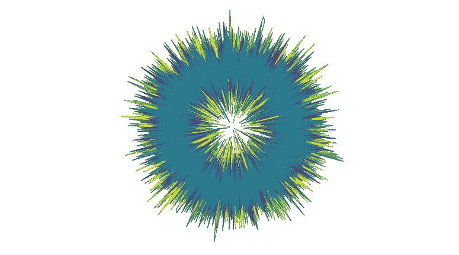

一个词向量从 1949 年到 2019 年随时间变化的可视化。

像大多数其他领域一样，新闻业正在走向数字化。我是德国《南德意志报》数据和数字调查团队的一员，在那里，我们试图利用现代技术手段开展新闻研究。

在我最新的项目中，我结合了政策分析和机器学习。我想知道:随着时间的推移，政治语言和某些词汇的使用发生了怎样的变化？

自 1949 年 5 月德意志联邦共和国成立以来，70 年已经过去了。在这段时间里，被称为 [*联邦议院*](https://en.wikipedia.org/wiki/Bundestag) 的联邦议会 4200 多次会议的每一次都被一丝不苟地记录下来:每一次演讲、每一次评论、每一次鼓掌都被记录下来。一个保存德国近代史、深远发展和重大政治冲突的数据宝库。

当然，计算机理解语言的方式与人类不同。相反，计算语言学的数学系统从上下文中揭示单词的含义。语言学家约翰·鲁帕特·弗斯在 1957 年说过一句著名的话:“你应该从一个单词所交的朋友那里知道这个单词”，这远在计算机被用来寻找内容的上下文之前。然而，这个原则在 21 世纪仍然适用，那时算法可以接管这项任务。

我选择的自动评估文本的方法叫做单词嵌入。我们无时无刻不在与这项技术互动，例如在进行简单的谷歌搜索或使用翻译软件时。我将计算语言学科学领域的这些方法应用于政治修辞学。

在我读到的每一篇关于单词嵌入的论文中，都有这样的短语:“有前途的新领域”或“大量研究”。是的，两者都被证明是真的…

# 算法输入:输入数据

像世界上其他国家一样，德国议会记录了议员们的一言一行。得到的文档是我分析的语料库。

我对随着时间的推移而发生的变化感兴趣，所以我不会在这些年里创建一个大型语料库，但是每个立法术语都有自己的语料库。所以总共有 19 个不同的语料库。

从表中可以看出，单个语料库并不是很大。这导致了如何将单词嵌入方法应用于 19 个相当小的议会记录语料库的第一个重大决定。

大多数研究论文引用了更多数据的项目。这是发人深省的，因为这些方法不能简单地应用于我的情况。但是我在 Antoniak et 里发现了一张桌子。艾尔。(2018) 那真让我振奋。它区分了两种不同的方法:以下游为中心的方法，一种是针对大型语料库的通用方法，另一种是针对特定领域(如政治)的以语料库为中心的方法。

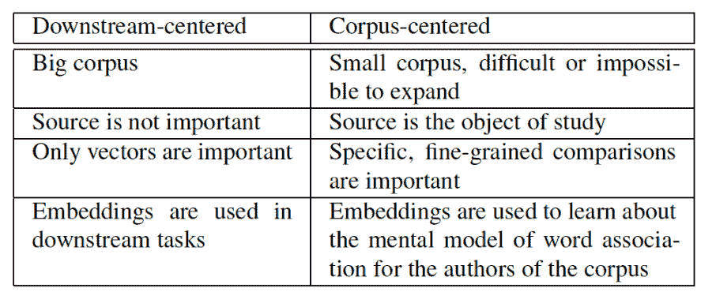

*以下游为中心和以语料库为中心的词汇嵌入方法比较。截图:安东尼亚克等人。艾尔。(2018)*

这种区别决定了分析的方法，正如安东尼亚克和明诺所写的:

> *“与以下游为中心的方法不同，以语料库为中心的方法基于对嵌入向量的最近邻居的直接人类分析，训练语料库不仅仅是现成的便利，而是研究的中心对象。”*

# 人类和计算机之间的翻译:单词嵌入

计算语言学使用的一种从上下文中提取单词含义的方法叫做单词嵌入。语料库中的每个词通过上下文和语义嵌入到模型中。关于德国议会的记录，这意味着:当计算单词嵌入的模型时，议会成员的语言的上下文和语义被嵌入到模型中。

每一个独特的单词都由一系列数字(也称为维度)来表示，这些数字是在学习上下文的过程中计数和权衡的结果。这个过程叫做“训练模型”。

结果看起来像这样:

> 环境*(um welt)(0.08567299 0.11279329 0.2180736-0.3106728…)* 自然保护*(Naturschutz)(-0.012405696 0.07818038-0.045643393-0.0051204716…)* 气候灾害

学习机的能力隐藏在这些乍看起来不起眼的单词和数字序列中。

这组向量携带以下信息:

*   每个向量描述了单词的**上下文**
*   相对于所有其他向量，每个向量对单词的**含义**进行编码

理论上，维度越多，一个向量可以包含的意义就越多。但实际上，它受到你输入算法的文本量的限制。寻找最佳长度可能是一个反复试验的评估过程。在这里，我使用 300 个维度。这是许多研究人员使用的默认设置，我坚持他们的经验。

单词嵌入的用户可以自由决定应该计算多少维度。这样的设置选项在机器学习中被称为[超参数](https://en.wikipedia.org/wiki/Hyperparameter_(machine_learning))。它们的调整会严重影响结果，并且用户在实现机器学习模型时会反复面临做出这样的决定。

请记住，嵌入模型中的含义只适用于特定的领域。在这种情况下:在过去的 70 年里，德国议会的演讲。

因此，一种算法将文本语料库作为输入，并返回计算出的单词向量。但是这是怎么发生的呢？

# 单词如何变成数字:word2vec 算法

有几种可能的算法可以解决计算单词嵌入的任务。对于这个项目，我选择了有据可查的 [word2vec](https://code.google.com/archive/p/word2vec/) 算法。它于 2013 年在谷歌推出([米科洛夫等人，2013 年 a](https://arxiv.org/abs/1310.4546) )。许多科学论文测试了单词嵌入算法，并得出结论:word2vec 是最佳选择。我使用了 Python 的实现 gensim ( [Rehurek 和 Sojka，2010](https://radimrehurek.com/gensim/models/word2vec.html) )。

首先，构建词汇表:从输入文本中提取并存储每个唯一的单词。Word2vec 通过检查哪些单词在特定上下文中一起出现来从文本中学习。上下文被定义为在被检查的单词周围的窗口。窗口的大小是要设置的另一个超参数。

我们来看这句话:

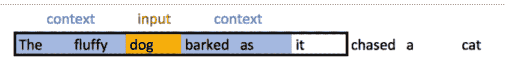

*截图:*[*jaye sh Bapu Ahire 的《词向量入门》*](https://medium.com/@jayeshbahire/introduction-to-word-vectors-ea1d4e4b84bf)

现在我们要用五个单词的窗口大小来训练*狗*的向量:用黄色标记的单词是从词汇表中挑选出来的，并在窗口内的每一对可能的单词上进行训练: *The* 、 *fluffy* 、*汪汪汪*、 *as* 。紧邻的单词被赋予更高的权重。例如，*蓬松的* + *剥皮的*被赋予比*更大的权重，把* + *称为*。

接下来，我们再深入一个词，看看*吠*。窗口向前移动一个单词，并且相邻单词被加权。

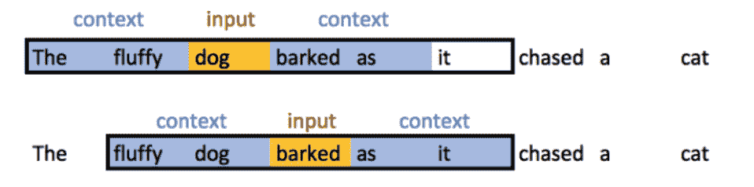

*截图:*[*Jayesh Bapu Ahire 著《词向量入门》*](https://medium.com/@jayeshbahire/introduction-to-word-vectors-ea1d4e4b84bf)

通过这种方式，该窗口迭代了自 1949 年以来的所有议会演讲。

所有出现的单词对都是一维神经网络训练的输入。Word2vec 旨在计算一个模型，该模型可以预测一个单词与另一个单词出现的可能性。为了解决这个任务，有一个隐藏层，其神经元的数量与向量的维数一样多。

> “*单词 vector 是模型试图学习单词的良好数字表示，以最小化其预测的损失(误差)*,[Jayesh Bapu Ahire](https://medium.com/@jayeshbahire/introduction-to-word-vectors-ea1d4e4b84bf)写道。

最后，当训练过程结束时，输出层被剥离。单词向量是经过训练的神经元的结果。在机器学习领域，这被称为假任务:你可以在一个任务上训练一个模型，你有足够的数据，然后扔掉最后一层。

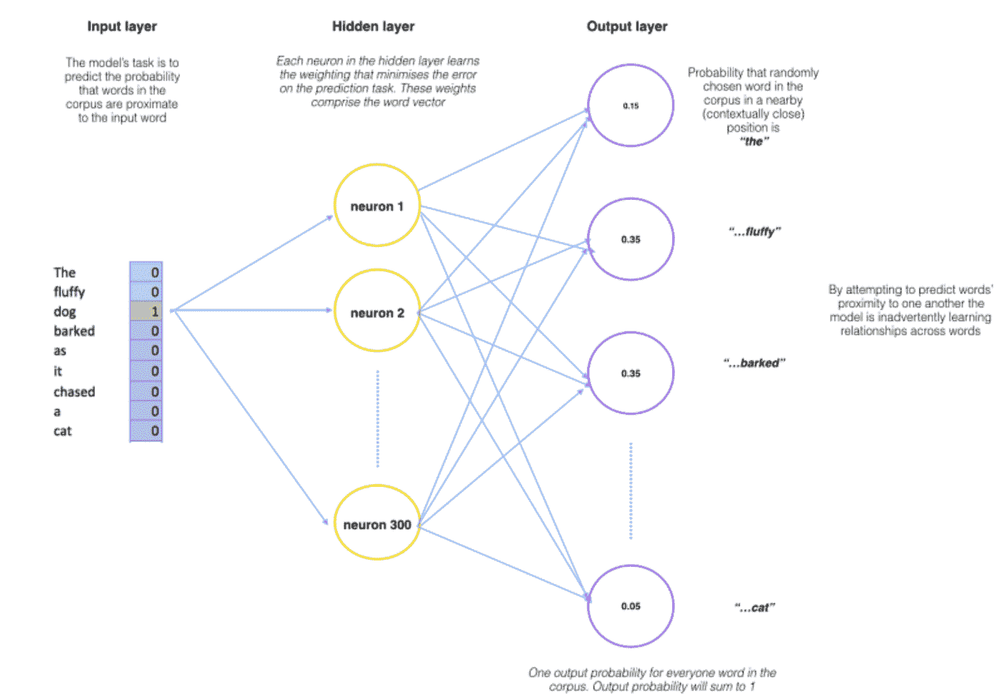

*word 2 vec 的内部运作方式。截图:*[*Jayesh Bapu Ahire*](https://medium.com/@jayeshbahire/introduction-to-word-vectors-ea1d4e4b84bf)对词向量的介绍

如果你想更深入地研究词向量和神经网络，我推荐这些博客帖子(按书呆子气升序排列):

1.  Jayesh Bapu Ahire 对单词向量的非常好的[介绍。你会认出上面的图形](https://medium.com/@jayeshbahire/introduction-to-word-vectors-ea1d4e4b84bf)
2.  在 [Word2Vec 教程—跳格模型](http://mccormickml.com/2016/04/19/word2vec-tutorial-the-skip-gram-model/)中有更多关于神经元网络和跳格实现的细节
3.  如果你还需要更多关于神经元网络内部发生了什么的信息: [Word2vec 使之变得容易](/word2vec-made-easy-139a31a4b8ae)

# 用语言计算:文字作为数字的魔力

在训练过程中，该模型不仅识别单词的上下文，还从概念上学习语法类别，如数、格或性别。这些关系被编码在模型的维度中。

一个概念性的例子:想象向量“女总理”( *Bundeskanzlerin* )、“男总理”( *Bundeskanzler* )、“女人”( *Frau* )和“男人”( *Mann* )有四个维度和虚构的数字。

考虑从左边开始的第二维:向量“女总理”( *Bundeskanzlerin* )和“女人”( *Frau* )具有高值，而“男总理”( *Bundeskanzler* )和“男人”( *Mann* )具有低值。这个维度可能被贴上女性化的标签。从左边算起的第三维度则是相反的方向，暗示着男子气概。

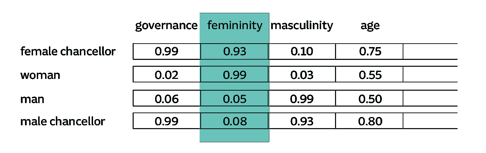

德国联邦议院模型中有 300 个维度，而不是 4 个维度——当然，没有标签。不仅仅是四个词，仅最近的选举任期就有超过 61，000 个词。这导致了 1830 万个数据点——对我们的大脑来说太复杂了，难以想象。尽管这是不可想象的，但是用向量来计算是可能的，就像回到高中一样。

描述 Word2Vec 的这一特性时，一个通俗的例子是:“国王—男人+女人=女王”。应用来自德国议会的数据，数学运算可以用“女总理——女人+男人=男总理”来进行。

一个很好的计算不同语料库的应用是北欧语言处理实验室的语义计算器。

用向量计算很有趣。但是探索广阔的向量空间可能会超出我们读者的耐心。此外，它无法回答主要问题:政治辩论正在发生怎样的变化？

# 解决不稳定的单词嵌入:不是一个，而是 30 个模型

发现政治演讲转变的主要想法是比较一届立法任期与前一届有多大不同。因此，下面的测量结果是有用的:余弦相似性。它计算两个向量之间角度的余弦值。结果是一个介于 0 和 1 之间的数字，其中 0 表示没有相似性，1 表示绝对相似。余弦相似度越接近 1，一个词就越能被解释为同义词。

自 71 年前德意志联邦共和国成立以来，共有 19 届选举。对于每个术语，我计算了一个模型，然后查询模型，以提取与 180 个特别感兴趣的词最相似的词，例如:“气候变化”( *Klimawandel* )，“交通”( *Verkehr* )，“难民”( *Flüchtlinge* )或“种族主义”(*rassi mus*)。

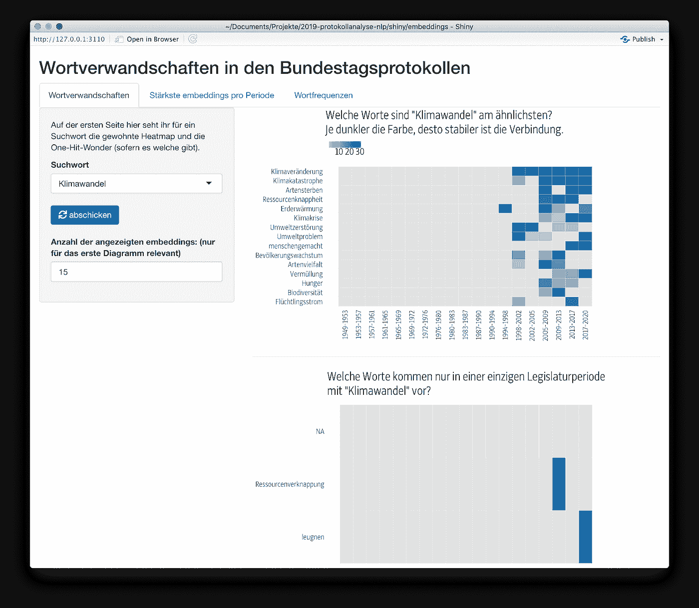

*我们用于研究 word 嵌入模型的内部仪表盘截图。*

我们在《南德意志报》的团队定义了一组 180 个高频相关术语，以便进行更深入的研究。我们没有事先选择这个查询词列表。花了一些时间在档案和数据中探索和研究，以识别有故事可讲的单词。

例如:下表显示了每个立法术语中与德语 *Umwelt* 中的“环境”一词最相似的词:

很明显，在最初的 20 年里，这个最相似的词每一个词都在变化，而且有着与今天不同的含义。那时候，“环境”( *Umwelt* )经常被用来描述周围的世界。这种情况在 20 世纪 80 年代发生了变化，当时绿党被选入议会，其对环境问题的关注极大地影响了“环境”一词的使用。同义词首先变成了“生计”(*lebengrundlage*)，然后进一步变成了“自然保护”( *Naturschutz* )。近来最相似的词是“生物多样性”。

这真的很强大:单词嵌入可以重现政治辩论。但是它们有一个巨大的缺点:它们不稳定，特别是对于像我这样的相对小的语料库[1，2]。每次您使用相同的数据和相同的设置编写新模型时，针对特定术语嵌入的查询结果都会因模型而异。安东尼亚克等人。艾尔。[1]在他们的论文中研究了这一现象:

> “我们发现嵌入中存在相当大的可变性，这些可变性对于这些方法的用户来说可能并不明显。大多数相似单词的排名是不可靠的，并且这种列表中的排序和成员资格容易发生显著变化。一些不确定性是预料之中的，对于‘可接受的’方差水平没有明确的标准，但我们认为我们观察到的变化量足以对整个方法提出质疑。”

下表列出了从 1983 年到 1987 年与“环境”最相似的 15 个单词。这六列代表不同的型号。这些值是“环境”和行中相应单词之间的余弦相似度。空单元格意味着该模型没有将该单词识别为十大相似单词之一。

因为单词嵌入模型是不稳定的，所以它们不会在不同的模型上提供相同的结果。例如，第二个模型不承认德语*leben straum*中的“生活空间”是“环境”的同义词，但其他五个模型承认。

当模型产生不同的结果时，我应该相信哪一个？没有。单一模型如此不稳定的结果是新闻研究不可接受的基础。我通过训练 30 个模型来解决这个问题，而不是每个选举任期只训练一个。总共有 570 个模型用于 19 个选举任期。我测试了一下:我删除了所有的模型，重新计算。我的查询对新模型产生了相同的结果。所以分析是可重复的。

当查找政治相关术语的相似词时，我从一个选举术语的所有 30 个模型中提取了 10 个最相似的词。下一步是计数过程:一个词在每个术语中作为同义词出现的频率是多少？

这种查询多个模型并对出现次数进行计数的过程确保了我们只检查那些在模型中反复出现并且可以被视为稳定结果的单词和伴随的嵌入。

为了可视化结果，我们使用热图。下表显示了“环境”最常见的同义词。

左边的十二个字是按照 1949 年以来的整体面貌排序的。在这里，我们也绘制低于 30 的值，因为它们表示“环境”话语中某个单词的上升或下降。

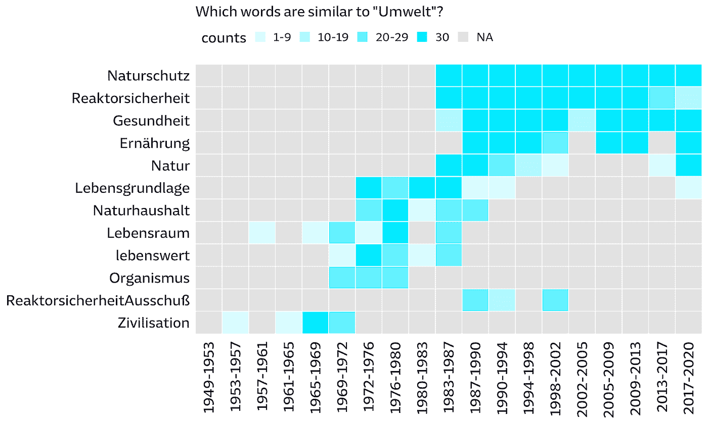

热图是一个很好的工具，可以检查整个时间跨度并查看随时间的变化。但它们不足以详细评估一个选举任期。为此，我们使用了由 30 个模型的平均余弦相似性排序的相似单词列表，并用更强的字体权重标记稳定的单词。

[我在 Github](https://github.com/sueddeutsche/political-german-word-embeddings) 上发表了 2017–2019 最新选举任期的 word embedding models。在德国政治领域，你可以随意使用它来完成你自己的项目。如果你这样做，请写信给我，我对你的工作很感兴趣。

# 意犹未尽:对历时词汇语义变化的探索

到目前为止，我们已经研究了单词的上下文是如何变化的。另一种方法是关注单词本身，看单词向量的变化。这就是所谓的历时词汇语义变化。

金等人。艾尔。[3]提供了这样做的方法。他们与[谷歌图书 ngram 语料库](https://books.google.com/ngrams)合作，计算了从 1900 年到 2009 年每年的一个模型。有两个词特别值得注意:“细胞”和“同性恋”。在这 100 年里，它们的意义发生了很大变化。" gay "的邻近词从"欢快的"、"愉快的"、"辉煌的"变成了"女同性恋"、"双性恋"和"女同性恋"，而" cell "从"壁橱"、"地牢"、"帐篷"变成了"电话"、"无绳"、"蜂窝"。

为德国政治争取这些词汇不是很好吗？

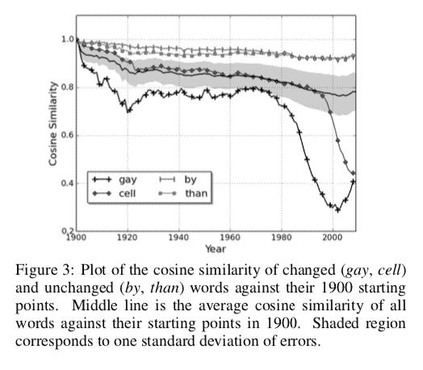

不幸的是，这篇论文经常被引用来批评其寻找这些单词的方法，例如，因为他们正在处理不稳定的单词嵌入。

幸运的是，我联系到了[张秀坤·施勒特韦格](https://www.ims.uni-stuttgart.de/en/institute/team/Schlechtweg-00003/)，他是一名博士生，与[萨宾·舒尔特教授一起在瓦尔代](http://www.schulteimwalde.de/)研究自然语言处理研究所(斯图加特大学)语义变化的分布式模型。他耐心地建议我将该方法应用于我的数据。

Schlechtweg 等人。艾尔。 [4]测试了几种测量这些变化的方法:“总体表现最好的模型是具有正交排列和余弦距离的 Skip-Gram。”

该方法可以应用如下:

1.  来自一个时间段的每个模型必须[与下一个时间段的模型](https://github.com/Garrafao/LSCDetection)对齐:时间段 1 到时间段 2，时间段 2 到时间段 3 等等。结果是更多的模型:每次新的选举期开始，我都会得到一对新的模型。
2.  对于每个单词，计算从模型到模型的余弦距离。
3.  棘手的部分:为了消除频率[5]的统计影响，应该额外提取在相应术语上具有相同频率变化的可比单词。

等等，这里有个例子:

视觉推理的首次尝试:

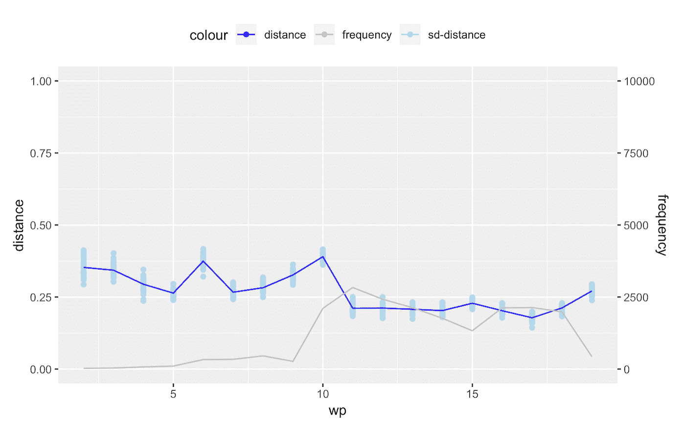

你看到的蓝线是向量“ *Umwelt* ”(环境)在 15 个模型中的平均变化。浅蓝色的一个点表示来自一个模型的单个余弦距离值(余弦距离= 1-余弦相似性)。

蓝线和灰线的对比很重要，灰线显示了“Umwelt”的频率。如你所见:如果灰线改变，蓝线也会改变，因为余弦相似度直接取决于频率。可用单词越多，相似度越低。

有了这个背景你就明白了:没什么可看的。单词向量(蓝线)的变化是由于频率变化(灰线)。为了消除这种统计效应，你必须找到频率变化相同的单词，并绘制出它们之间的距离。

下一次尝试以引用词结束，如下图所示:

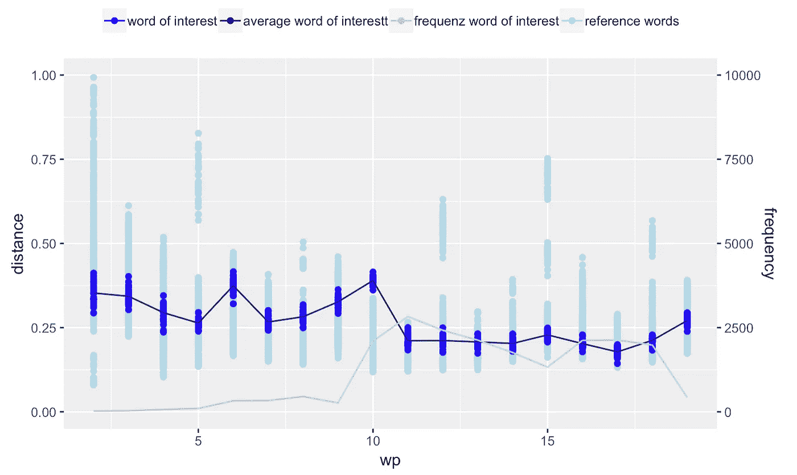

它看起来更好，因为有一个项，第 10 项，蓝色点位于浅蓝色点之上。这表明不管频率如何，词向量都有真实的变化。

蓝点代表向量“Umwelt”(这 15 个模型)的余弦距离。浅蓝色的点现在表示与在模型对中的最近术语中与我感兴趣的单词共享相同频率的可比单词的余弦距离。参考字从模型对变化到最佳地表示该时间点的频率。

你注意到这个缺陷了吗？

当我比较和计算来自两个不同选举术语的模型对的相似性时，我还需要比较来自两个选举术语的参考词的频率变化。词向量在一段时间内的距离，并不是与另一段时间内的课程进行比较，而是一个特定的时间点。这就是缺陷。

我试图通过搜索那些与“Umwelt”有相同频率变化的单词来修复它。但是没有相同的频率变化，即使我让频率有小幅度的波动。语料库实在太小了。

那么，让我们进入下一个迭代。而不是绝对变化，也许相对频率变化可以有所帮助？

看上面的图表:当频率折线图改变时，余弦距离折线图也随之改变。

如果选择相对频率变化相同但绝对频率更高的参考词，余弦相似性可能会更小，因为频率和余弦相似性之间存在反比关系。

因此，根据感兴趣的单词，你会仅仅因为基于频率差异的统计效应，而对单词向量的视觉变化进行推理。

这个问题有一个理论上的解决方案:寻找绝对数变化相同但频率更高的词，然后回到最初的语料库。现在的关键是通过随机屏蔽对参考单词进行采样，直到频率与感兴趣的单词相同。然后计算新模型，将它们对齐，并查询图表的相似度。那是我停下来的地方。

当我们讨论这个未解决的任务时，张秀坤写道:“我还想说，自动意义变化检测领域还没有准备好为你的应用问题提供标准方法。两年后，情况可能会有所不同。”

# 寻找故事:新闻的结果

基于这项研究发表了三个故事。

*   德国联邦议院如何搞糟气候变化:自 20 世纪 80 年代海尔马特·斯克米特总理时代起，联邦议院就一直在讨论气候灾难。但是一项数据研究表明:一代又一代的议员几乎不屑于对他们采取行动。
*   匆忙的议会:所谓的难民危机是一个转折点，德国变了。一项数据研究显示:关于难民和移民的话语已经向右转移——同样是由 AfD(德语中的)提出的。
*   《在语言的引擎室》:一个关于方法论的大故事。目标群体是《南德意志报》的普通受众。其野心是解释机器学习的话题，而不是求助于一个“这是一个黑箱”(德语中的)。

# 交流不确定性:技术沙文主义的危险

我对计算机如何捕捉自然语言很着迷。但是这种迷恋有技术沙文主义的危险。技术沙文主义是梅雷迪思·布鲁萨德提出的一个术语——“相信技术总是解决问题的方法”。

我们如此热衷于给机器分配我们的大脑无法解决的任务。所以我们很容易忽略这样一个事实，结果也必须被质疑。我们陷入了计算机总是客观地产生完美的结果的想法。这就是为什么我认为沟通像这样的项目的不确定性是很重要的。如果我改变算法的超参数，数据中的其他关系可能会被更强烈地强调，潜在的文章可能会产生不同的结果。这就像就一个具体问题询问多位证人。我如何表达我的问题也会影响我得到的答案。

*你有答案或意见吗？我感谢任何反馈。*

*特别感谢卡塔琳娜·布鲁纳和卡门·海格的评论。*

# DIY:Github 上的 30 个单词嵌入模型

[我在 Github 上发布了当前选举任期(2017–2019)的 30 个单词嵌入模型。随意使用它们并引用我](https://github.com/sueddeutsche/political-german-word-embeddings)。

# 阅读更多:相关的科学工作

[1]安东尼亚克，玛丽亚；米姆诺，大卫。基于嵌入的词语相似度的稳定性评估。《计算语言学协会汇刊》，第 107–119 页，2018 年 2 月。

[2]约翰内斯·赫尔里奇和乌多·哈恩。2016.坏公司——神经嵌入空间中的邻居被认为有害。《2016 年计算语言学国际会议论文集》，2785-2796 页，日本大阪。

[3] Yoon Kim、Yi-I Chiu、健太郎·哈纳基、达尔山·黑德和斯拉夫·彼得罗夫。2014.通过神经语言模型对语言进行时间分析。ACL 语言技术和计算社会科学研讨会论文集，第 61-65 页。

[4]施莱希特韦格，张秀坤等，“变化之风:检测和评估跨时间和领域的词汇语义变化。”计算语言学协会第 57 届年会论文集(2019)

[5] Haim Dubossarsky、Daphna Weinshall 和 Eitan Grossman。2017.失去控制:语义变化的规律和单词表征模型中的固有偏差。《2017 年自然语言处理经验方法会议论文集》，1147-1156 页，丹麦哥本哈根。