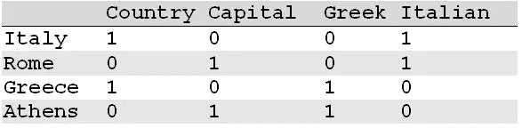
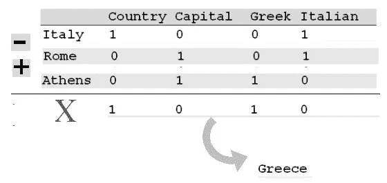

# 使用单词向量以数学方式找到意思相似的单词

> 原文：<https://towardsdatascience.com/using-word-vectors-to-mathematically-find-words-with-similar-meanings-fc9eadac3dbe?source=collection_archive---------32----------------------->

## [入门](https://towardsdatascience.com/tagged/getting-started)

## 学习使用词向量以编程方式计算文本的语义相似度

卡尼·查拉科娃摄

简而言之，单词向量只不过是代表自然语言单词含义的一系列实数。这项技术是有用的 NLP 能力的重要使能器，使机器能够“理解”人类语言。本文讨论了如何使用单词向量以编程方式计算文本的语义相似性，例如，如果您需要根据文本所涵盖的主题对其进行分类，这将非常有用。它从一个概念视图和示例开始，然后说明如何使用 spaCy(一个领先的用于 NLP 的 Python 库)来确定文本的语义相似性。

# 词向量的概念

所以，让我们先从概念上看一下单词向量，这样你就可以基本理解如何用数学方法计算以向量形式表示的单词之间的语义相似度。然后，您将查看 spaCy 的 similarity()方法，该方法比较容器对象(Doc、Span、Token)的单词向量，以确定它们含义的接近程度。

在统计建模中，您将单词映射到反映单词语义相似性的实数向量。你可以把一个单词向量空间想象成一朵云，其中有相似意思的单词向量位于附近。例如，表示单词“apple”的向量应该更接近单词“pear”的向量，而不是单词“car”的向量。因为前两个指的是可食用的水果，而后者指的是四轮公路车辆。为了生成这些向量，你需要对这些单词的意思进行编码。事实上，有几种方法可以对意义进行编码。

# 用坐标定义意义

生成有意义的单词向量的一种方式是将现实世界中的对象或类别分配给单词向量的每个坐标。例如，假设您正在为以下单词生成单词向量:罗马、意大利、雅典和希腊。向量这个词应该在数学上反映出罗马是意大利的首都，并且与意大利有着雅典所没有的联系。同时，它们应该反映出雅典和罗马是首都城市，而希腊和意大利是国家。

下图以矩阵的形式展示了这个向量空间的样子。

在这里，你在一个四维空间的坐标之间分配每个单词的含义，代表“国家”、“首都”、“希腊”和“意大利”等类别。在这个简化的例子中，坐标值可以是 1 或 0，指示相应的单词是否属于该类别。

一旦你有了一个向量空间，其中的数字向量捕获了相应单词的含义，你就可以在这个向量空间上使用向量算术来洞察一个单词的含义。要找出雅典是哪个国家的首都，您可以使用以下等式，其中每个令牌代表其对应的向量，X 是未知向量:

意大利—罗马= X —雅典

这个等式表达了一个类比，其中 X 代表单词 vector，它与雅典的关系就像意大利与罗马的关系一样。为了解出 X，你可以把等式改写成这样:

X =意大利—罗马+雅典

首先，通过减去相应的向量元素，从向量意大利中减去向量罗马。然后你把结果向量和雅典向量相加。下图总结了这一计算。

通过从代表意大利的单词 vector 中减去代表罗马的单词 vector，然后加上代表雅典的单词 vector，可以得到一个等于希腊的矢量。

# 用维度来表达意义

虽然您刚刚创建的向量空间只有四个类别，但是现实世界的向量空间可能需要成千上万个这样的类别。这种大小的向量空间对于大多数应用来说是不切实际的，因为它需要一个巨大的字嵌入矩阵。例如，如果您有 10，000 个类别和 1，000，000 个实体要编码，您将需要一个 10，000 × 1，000，000 的嵌入矩阵。

减少嵌入矩阵大小的明显方法是减少向量空间中类别的数量。单词向量空间的实际实现不是使用坐标来表示所有类别，而是使用向量之间的距离来量化和分类语义相似性。各个维度通常没有固有的含义。相反，它们表示向量空间中的位置，向量之间的距离表示相应单词含义的相似性。要看一个真实向量空间的例子，你可以在[https://fasttext.cc/docs/en/english-vectors.html](https://fasttext.cc/docs/en/english-vectors.html)下载 fastText 单词向量库，它将单词的意思分布在一个 300 维的单词向量空间中。

# 空间相似性()方法

在 spaCy 中，每种类型的容器对象都有一个相似性方法，允许您通过比较两个任意类型的容器对象的词向量来计算它们之间的语义相似性估计。为了计算跨度和文档的相似性(它们没有自己的词向量)，spaCy 对它们包含的标记的词向量进行平均。

即使两个容器对象不同，也可以计算这两个对象的语义相似度。例如，您可以将令牌对象与 Span 对象进行比较，将 Span 对象与 Doc 对象进行比较，等等。

以下示例计算 Span 对象与 Doc 对象的相似程度:

> > > doc=nlp('我想要一个青苹果。')

这段代码计算句子“我想要一个青苹果”之间的语义相似度。短语“一个青苹果”也来源于这个句子。如您所见，计算出的相似度足够高，可以认为两个对象的内容是相似的(相似度的范围从 0 到 1)。毫不奇怪，当您将一个对象与其自身进行比较时，similarity()方法返回 1:

> > > doc . similarity(doc)
1.0
>>>doc[2:5]。相似性(doc[2:5])
1.0

> 注:文中使用的例子摘自我最近由 No Starch 出版社([https://nostarch.com/](https://nostarch.com/))出版的《用 Python 和 spaCy([https://nostarch.com/NLPPython](https://nostarch.com/NLPPython))进行自然语言处理》一书。