# 使用 YOLOv3 实时检测个人防护设备和火灾

> 原文：<https://towardsdatascience.com/using-yolov3-for-real-time-detection-of-ppe-and-fire-1c671fcc0f0e?source=collection_archive---------14----------------------->

## 工业安全中的人工智能:这篇文章解释了我们如何使用 YOLOv3:一种用于实时检测个人防护设备(PPE)和火灾的对象检测算法

“安全不是一个小玩意，而是一种心态！”

> 世界摩天大楼的不断攀升是一个不断演变的挑战的故事。我们每天生活在摩天大楼、购物中心和仓库周围。大多数时候，我们对建造这些建筑需要什么一无所知。建筑业负责创造如此宏伟的杰作。截至 2020 年 3 月，建筑业拥有 1.3 万亿美元的年支出(约占 GDP 的 6.3%)[1]和 760 万名员工(约占总劳动力的 5%)[2]，是美国经济中最大的行业之一。然而，由于建筑工地的高死亡率，它也被认为是最危险的行业之一。

与建筑相关的伤亡的主要原因是跌倒、人员被设备卡住、触电和碰撞。如果工人穿戴适当的个人防护装备，如安全帽、安全背心、手套、护目镜和钢头靴，大多数伤害都是可以避免的。为了确保工作场所的安全，美国职业安全与健康管理局(OSHA)要求承包商强制执行并监控个人防护设备(PPE)的正确使用。

目前，PPE 检测技术可以分为两种类型:基于传感器的和基于视觉的。基于传感器的方法使用 RFID(射频识别 RFID)标签，需要在购买、安装和维护复杂的传感器网络方面进行大量投资。相反，基于视觉的方法使用摄像机记录施工现场的图像或视频，然后对其进行分析以验证 PPE 合规性。这种方法提供了关于场景的更丰富的信息，可用于更迅速、精确和全面地理解复杂的建筑工地。

本文解释了如何使用基于 YOLOv3(你只看一次)架构的深度学习模型来满足各种安全要求，如建筑工地工人的 PPE 合规性和使用最少硬件(即监控摄像头)的火灾探测。深度学习算法通过单个卷积神经网络(CNN)框架同时检测单个工人并验证 PPE 合规性。在当今世界，卷积神经网络(CNN)最广泛地用于图像分类和对象检测，因为它能够从大量带注释的训练数据中进行自我学习。

# **各种实时物体检测技术**

计算机视觉中的任何对象检测问题都可以定义为识别图像中的对象(也称为分类)，然后精确估计其在图像中的位置(也称为定位)。如今，物体检测几乎在任何地方都被使用。用例是无穷无尽的，无论是跟踪对象、视频监控、行人检测、异常检测、自动驾驶汽车还是人脸检测。

目前在工业中使用的主要对象检测算法有三种:

## **R-CNN:基于区域的卷积网络**

R-CNN 首先识别几个感兴趣的区域，然后使用 CNN 对这些区域进行分类，以检测其中的对象。由于原始的 R-CNN 很慢，所以已经提出了它的更快的变体，例如快速 R-CNN、更快 R-CNN 和屏蔽 R-CNN。在 R-CNN 中，图像首先被分成大约 2000 个区域推荐(区域比例)，然后 CNN (ConvNet)被分别应用于每个区域。

确定区域的大小，并将正确的区域插入到人工神经网络中。这种方法最大的问题是时间。由于图中的每个区域分别应用 CNN，训练时间约为 84 小时，预测时间约为 47 秒。

## **YOLO:你只看一次**

大多数目标检测算法使用区域来定位图像中的目标。网络不会看到完整的图像。取而代之的是，他们观察图像中包含物体的概率较高的部分。YOLO 或你只看一次是一个对象检测算法，与上面看到的基于区域的算法有很大不同。在 YOLO，单个卷积网络预测边界框和这些框的类别概率。

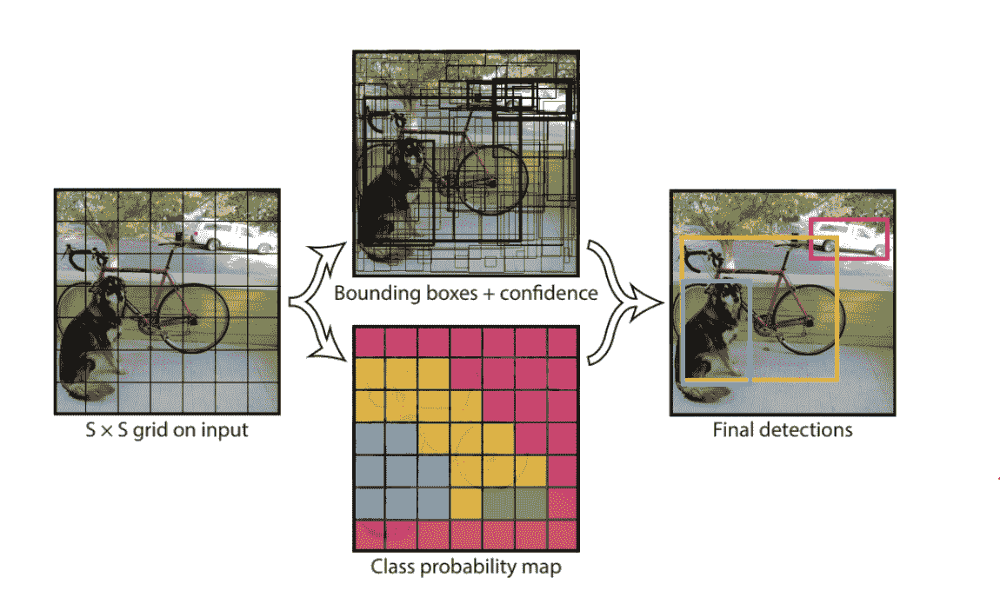

YOLO 天体探测器管道的简化图( [**来源**](https://arxiv.org/abs/1506.02640) )

YOLO 使用的策略与早期的探测系统完全不同。单个神经网络被应用于整个图像。该网络将图片分成多个区域，并计算每个区域的边界框和概率。这些边界框由预测概率加权。

## **SSD:单次多盒探测器**

SSD 是物体检测中比较流行的算法。一般比更快的 RCNN 快。SSD 将边界框的输出空间离散化为一组默认框，每个要素地图位置具有不同的纵横比和比例。在预测时，网络为每个默认框中每个对象类别的存在生成分数，并对框进行调整以更好地匹配对象形状。此外，该网络结合了来自不同分辨率的多个特征地图的预测，以自然地处理各种尺寸的物体。[4]

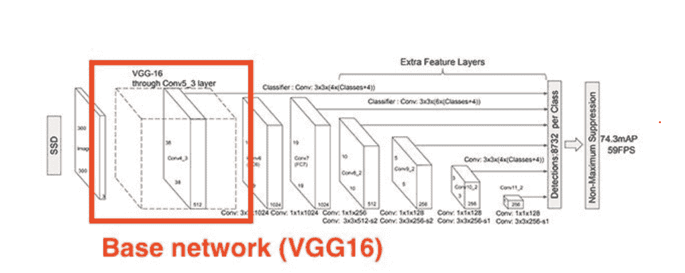

截图来自解释固态硬盘架构的[文章](https://medium.com/analytics-vidhya/beginners-guide-to-object-detection-algorithms-6620fb31c375)

现在，我们将看到我们如何为这个项目和 YOLOv3 的实现收集数据。

# **数据集采集**

在这个项目中，我们首先将正在探测的物体分为四类:头盔(戴头盔的人)、人(不戴头盔的人)、消防和安全背心。

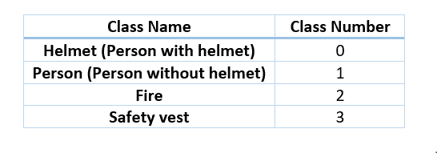

作者照片

## **YOLO 格式的图像标注**

训练数据集是作为样本收集的图像，并被注释用于训练深度神经网络。我们从多个来源为我们的数据集收集图像，如可以在 [github](https://github.com/njvisionpower/Safety-Helmet-Wearing-Dataset) 上找到的安全头盔数据集，来自 google 和 Flickr 的图像，并使用 labelIMg 对它们进行注释。此外，为了获得这些对象的定制数据，我们使用 Flickr API &下载了使用 [python](https://github.com/shwetashambhavi/object-classification-with-yolo/blob/master/flickrImageDownloader.ipynb) 代码的图像。为了给图像加标签，我们使用了[标签工具](https://github.com/tzutalin/labelImg)。

## **标签工具**

LabelImg 是一个图形化的图像注释工具。它是用 Python 编写的，图形界面使用 Qt。对于对象检测，有许多格式可用于准备和注释训练数据集。图像注释以 PASCAL VOC 格式保存为 XML 文件，这是 [ImageNet](http://www.image-net.org/) 使用的格式。它也支持 YOLO 格式，我们使用了这种格式，注释保存在下面的文本文件中。

## **文本文件中的格式**

<object-class><x><y><width></width></y></x></object-class>

<x>/ <y>对应于边界框对应轴的中心</y></x>

<width>/ <height>对应边界框的宽度和高度</height></width>

<x><y><width>；范围从[0；1]</width></y></x>

**举例:**

2 0.513125 0.209167 0.173750 0.358333

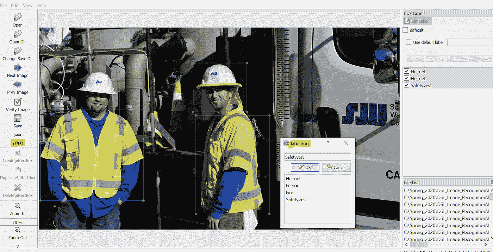

作者照片

你可以参考这篇文章[*https://medium . com/deepquestai/object-detection-training-preparing-your-custom-dataset-6248679 f0d 1d*](https://medium.com/deepquestai/object-detection-training-preparing-your-custom-dataset-6248679f0d1d)*来全面了解如何使用这个工具来注释你的定制数据集。*

## *贴标签时的重要注意事项*

*为了避免收集火灾图像数据时的错误预测，我们确保我们包括每个对象的各种方向、背景和角度，以更好地训练我们的模型。例如，我们已经包含了落日的图像，将注释置为空，以避免它被误认为是火。*

*这里有一个[链接](https://github.com/rroy1212/PPE_Detection_YOLOv3/blob/master/dataset)用于我们的数据集，其中包含一个戴头盔的人、一个不戴头盔的人、消防和安全背心的图像。*

# ***为什么使用 YOLO？***

*与其他检测系统相比，使用 YOLO 的最大优势之一是，它的预测是由测试时整个图像的全球背景提供的。与 R-CNN 等基于分类器的系统不同，它还通过单一网络评估进行预测。YOLO 比 R-CNN 快 1000 多倍，比快速 R-CNN 快 100 多倍。[10]*

*   *速度(每秒 45 帧，比实时速度快)*
*   *网络理解一般化的对象表示(这允许他们在真实世界的图像上训练网络，并且对艺术品的预测仍然相当准确)*
*   *更快的版本(架构更小)—每秒 155 帧，但精度较低*
*   *开源:[https://pjreddie.com/darknet/yolo/](https://pjreddie.com/darknet/yolo/)*

# ***不同版本的 YOLO***

*我们在项目中使用的版本是 YOLOv3。YOLO 目前有 4 个版本:v1、v2、v3 和 v4。每个版本都有不断的改进。我们使用的 v3 中最显著的改进是在类别预测和特征提取方面。对于类预测，YOLOv3 不使用 softmax，因为它假设每个“盒子”只能有一个类，这通常是不正确的。相反，研究人员使用独立的逻辑分类器。对于特征提取，他们使用了一个有 53 个卷积层的网络——称为 Darknet-53。[11]*

*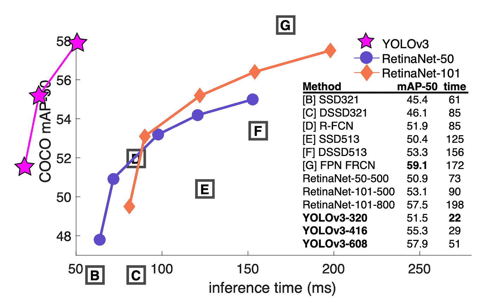*

*地图上 5 IOU 度量的速度/精度权衡参考[网站](https://pjreddie.com/darknet/yolo/)*

# *YOLO 的不同实现*

1.  *暗网([https://pjreddie.com/darknet/](https://pjreddie.com/darknet/))*
2.  *AlexeyAB/darknet([https://github.com/AlexeyAB/darknet](https://github.com/AlexeyAB/darknet))*
3.  *暗流(【https://github.com/thtrieu/darkflow/】T2*

*我们使用 YOLO 的暗网实现*

# ***yolov 3 是如何工作的？***

*请参考关于“[现场安全深度学习:个人防护装备实时检测](https://www.sciencedirect.com/science/article/abs/pii/S0926580519308325#!)的论文，以更好地了解 YOLOv3 的工作情况。*

1.  *在 YOLO-v3 中，我们将 416 × 416 RGB 图像作为输入，它包含三个输出层，每个层将输入图像分别划分为 13 × 13 网格(输出-1)、26 × 26 网格(输出-2)和 52 × 52 网格(输出-3)，如下图所示。[12]*

*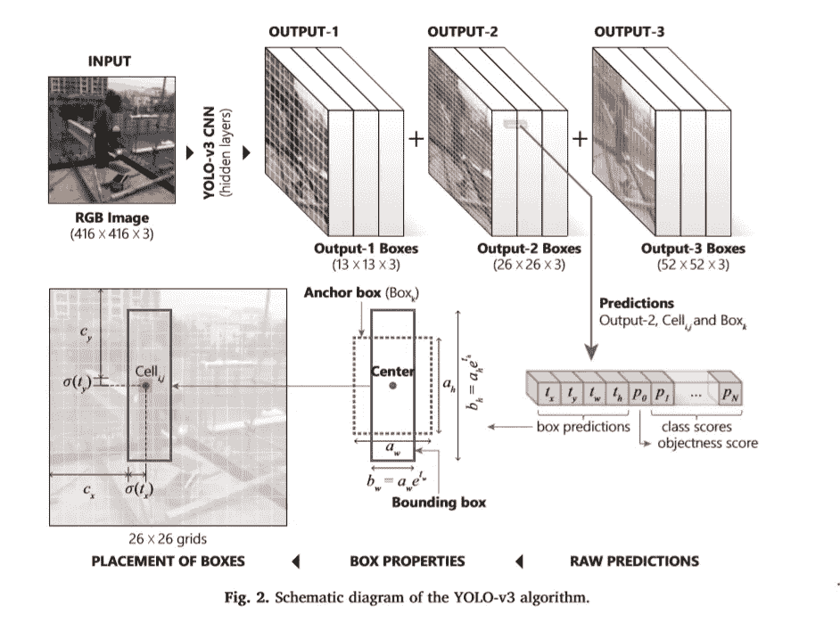*

*YOLOv3 算法，如“[现场安全深度学习:个人防护设备的实时检测](https://www.sciencedirect.com/science/article/abs/pii/S0926580519308325#!)”中所述*

*2.三个锚盒连接到三个输出层中的每一层，总共有九个锚盒。[12]*

*3.输出-1 层指的是三个最大的锚定框(用于检测大的对象)，输出-2 层连接到下三个最大的锚定框(用于检测中等大小的对象)，输出-3 层与三个最小的锚定框相关联(用于检测小的对象)。[12]*

*4.在训练过程中，输出层中的每个网格单元采用适当的锚定框，并学习如何移动和/或缩放这些锚定框，以使改变后的框(也称为边界框)完美地适合感兴趣的对象，如图所示..[12]*

*5.每个预测的边界框与一个(N +5)维向量相关联。[12]*

*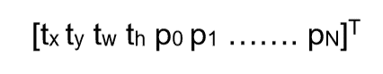*

*在上面的向量 tx 中，ty、tw 和 th 分别表示中心的 x 和 y 坐标，以及盒子的宽度和高度。*

*6.值 p0(也称为客体分数)是主体/客体在边界框内的概率。其余的值是 N 个条件概率，P(Ci|object)，每个表示给定一个存在于盒子内的对象，它属于 Ci 类的概率是多少，其中 i = 1，…，N[12]*

*7.总的来说，YOLO-v3 对于单个图像产生总共 10，647 个盒子，因为(13×13×3)+(26×26×3)+(52×52×3)= 10，647。然而，直觉上，输入图片中的大多数输出框要么是假阳性，要么代表相同的东西。[12]*

*8.为了避免推理部分的不一致和重复，YOLO 使用非最大抑制(NMS)技术来消除重叠百分比较高但置信度较低的框，从而确保给定项目的单个边界框的保留。[12]*

# *结果的定量分析*

*衡量对象检测算法性能的一个常见度量是交集/并集(又称 IoU)。如下图所示，IoU 表示两个框(如地面实况框(G)和预测框(P ))之间的重叠百分比，并使用下面给出的公式进行计算:[12]*

*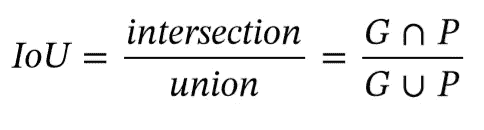*

*计算欠条*

*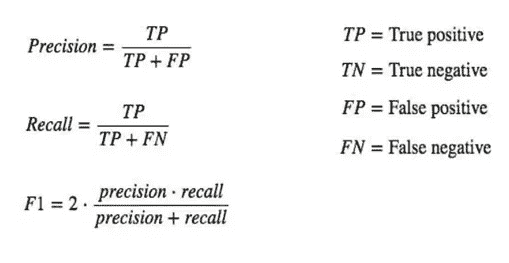*

*在下图中，我们可以看到白色的边界框代表真实情况，红色的边界框代表预测。地面真实值和预测值之间的差异用于获得我们模型的平均精度。*

*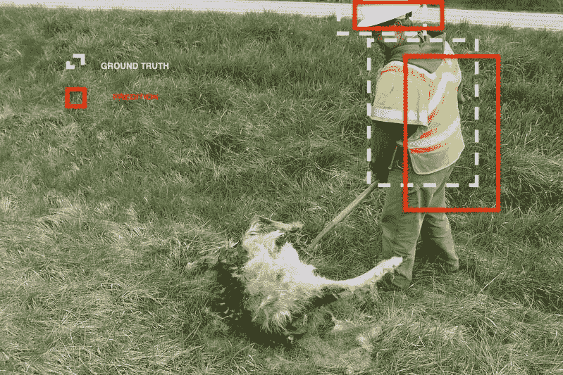*

*作者图片*

*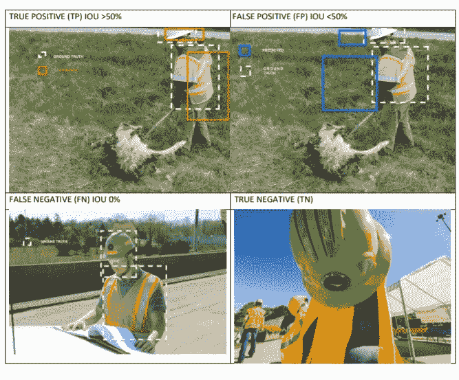*

*作者图片*

*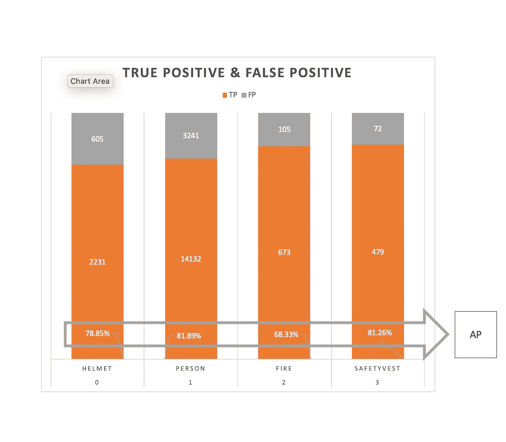*

*作者图片*

*AP(平均精度)是测量物体检测器(如更快的 R-CNN、SSD、YOLOv3 等)精度时使用最广泛的指标。平均精度计算 0 到 1 之间的召回值的平均精度值。*

*下图显示了我们对整个数据集的预测结果。我们获得了 77.58%的平均精度*

*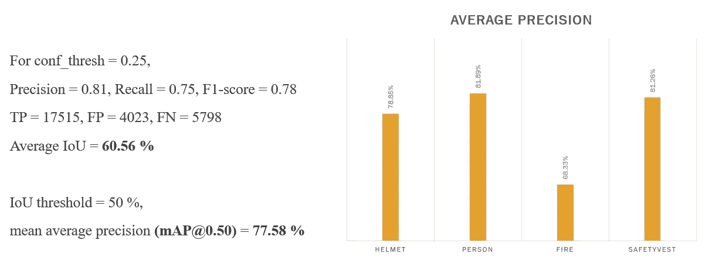*

*作者图片*

*我们在一个视频上测试了我们训练过的模型，视频中有人戴着头盔，穿着安全背心，还有一个有火的场景。*

*我们训练好的模型对视频输入的结果:由我的队友上传到他的 YouTube 频道*

*如果你对在我们的自定义数据集上实现 YOLOv3 的代码感兴趣，请使用下面的链接访问它。*

* [## rroy1212/PPE_Detection_YOLOv3

### permalink dissolve GitHub 是超过 5000 万开发人员的家园，他们一起工作来托管和审查代码，管理…

github.com](https://github.com/rroy1212/PPE_Detection_YOLOv3/blob/master/PPE_and_Fire_Detection.ipynb) 

# **我们项目的视频讲解**

视频讲解个人防护设备和使用 Yolov3 进行火灾探测

# 贡献者

> 由 Aastha Goyal、Harshit Nainwani、Rishi Dhaka、Rupali Roy 和 Shweta Shambhavi 为 UT Austin 的数据科学实验室课程 EE 460J 设计的项目。特别感谢 Alex Dimakis 教授！

# 参考

1.  美国人口普查局，建筑支出，[https://www.census.gov/建筑/c30/prpdf.html](https://www.census.gov/) ，访问日期:2020 年 5 月 11 日。
2.  劳工统计局，《行业一览:建筑业》，[https://www . bls . gov/iag/TGS/iag 23 . htm](https://www.bls.)，访问日期:2020 年 5 月 11 日。
3.  https://towardsdatascience . com/r-CNN-fast-r-CNN-faster-r-CNN-yolo-object-detection-algorithms-36d 53571365 e
4.  [https://arxiv.org/abs/1512.02325](https://arxiv.org/abs/1512.02325)
5.  [https://www . science direct . com/science/article/ABS/pii/s 0926580519308325？通过%3Dihub](https://www.sciencedirect.com/science/article/abs/pii/S0926580519308325?via%3Dihub)
6.  [https://medium . com/@ Jonathan _ hui/map-mean-average-precision-for-object-detection-45c 121 a 31173](https://medium.com/@jonathan_hui/map-mean-average-precision-for-object-detection-45c121a31173)
7.  T.-林毅夫、戈亚尔、吉希克、贺铿和杜大伟。密集物体探测的聚焦损失。arXiv 预印本:1708.02002，2017
8.  [https://arxiv.org/abs/1506.02640](https://arxiv.org/abs/1506.02640)
9.  [https://medium . com/analytics-vid hya/初学者-目标探测指南-算法-6620fb31c375](https://medium.com/analytics-vidhya/beginners-guide-to-object-detection-algorithms-6620fb31c375)
10.  [https://towards data science . com/yolo-you-only-look-once-real-time-object-detection-explained-492 DC 9230006](/yolo-you-only-look-once-real-time-object-detection-explained-492dc9230006)
11.  j .雷德蒙，a .法尔哈迪。YOLOv3:增量改进，2018。arXiv
12.  Nath、Nipun D .、Amir H. Behzadan 和 Stephanie G. Paal 关于“[现场安全的深度学习:个人防护设备的实时检测](https://www.sciencedirect.com/science/article/abs/pii/S0926580519308325#!)”*建筑自动化* 112 (2020): 103085*