# 用你的声音交易股票

> 原文：<https://towardsdatascience.com/using-your-voice-to-trade-stocks-9a07a00db565?source=collection_archive---------30----------------------->

## 嘿，谷歌，购买 10 只 MSFT 股票。了解如何将您的谷歌助手连接到 IFTTT，并使用羊驼 API 进行股票交易。

如果炒股可以像告诉谷歌开灯一样简单，那不是很好吗？有了羊驼毛 API 和 IFTTT，就是！羊驼[最近宣布](https://medium.com/automation-generation/integrating-the-alpaca-api-and-ifttt-to-make-applets-9c58156ea059)账号用户可以在 IFTTT 上构建小程序。这项新功能使用户能够用声音进行股票交易。

首先，你需要拥有[羊驼](https://app.alpaca.markets/signup)、[谷歌](https://assistant.google.com/)和 [IFTTT 的账户。](https://ifttt.com/join)一旦你为每项服务创建了账户。登录 IFTTT。你需要将[羊驼服务](https://ifttt.com/alpaca)和[谷歌助理服务](https://ifttt.com/google_assistant)链接到你的 IFTTT 账户。你可以点击上面的链接或者搜索这些服务。它会询问您的登录信息(每个帐户的用户名和密码。)

成功连接两个服务后，您可以通过单击“设置”来检查它们是否已连接。您将看到这样一个屏幕，表明状态是活动的。

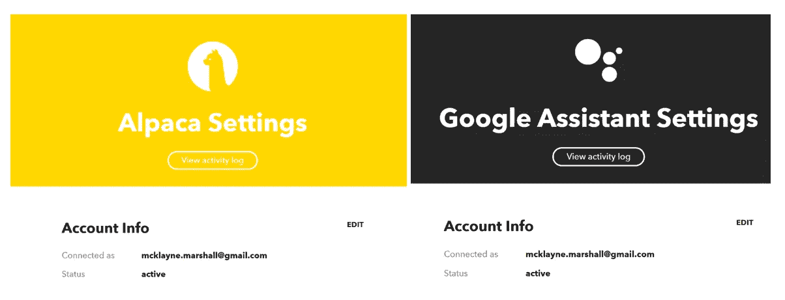

下一步是构建 applet。您将通过导航到 IFTTT 的“创建”区域来完成此操作。创建平台如下所示。

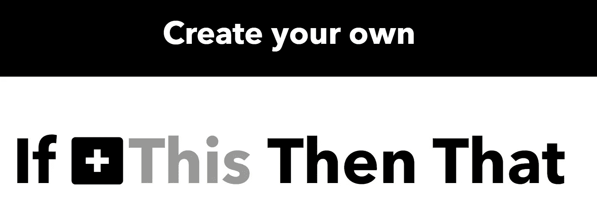

IFTTT 使用的逻辑是 IF This(触发动作)Then That(服务动作)。我们这个语音交易服务的逻辑是这样的。如果(谷歌助手听到某个短语)那么(羊驼会帮我们一个忙)。

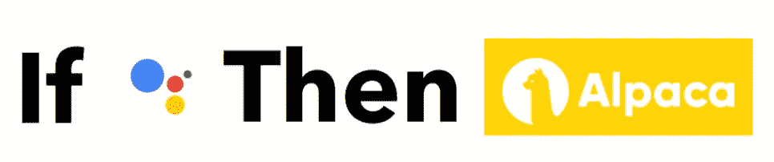

当您为(此)触发器服务选择 Google Assistant 时，系统会提示您选择触发器类型。您将选择允许数字和文本成分的选项。

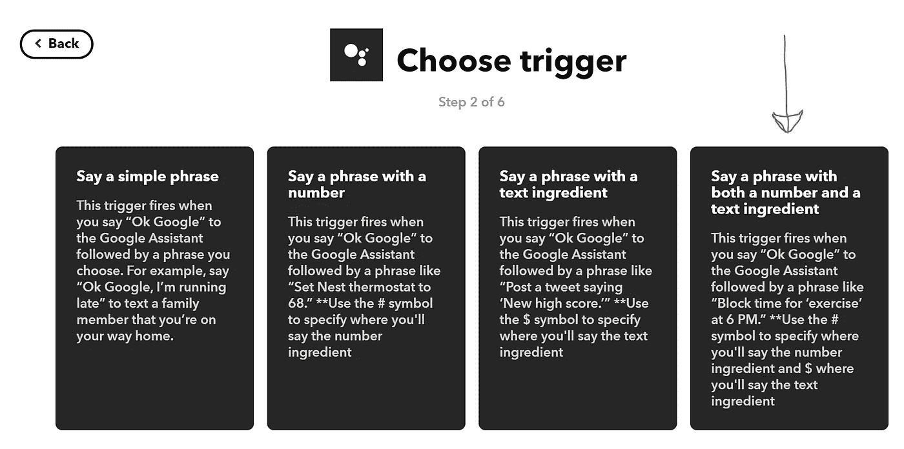

然后，它会提示您添加触发短语和触发操作的详细信息。

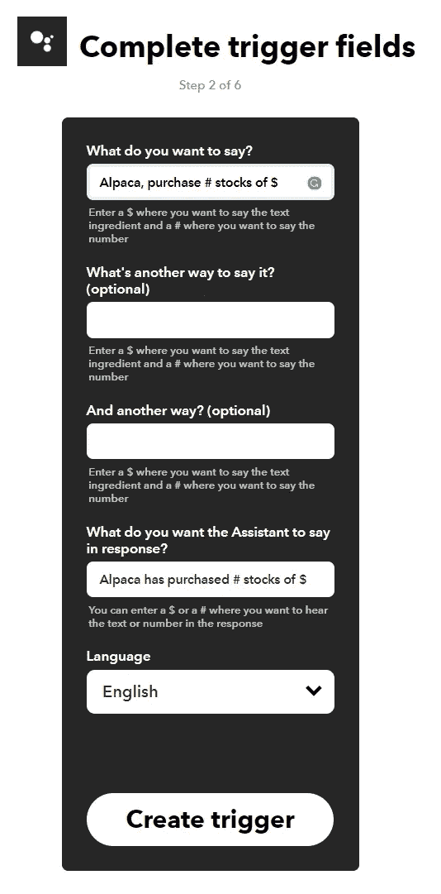

我把羊驼放在短语的开头，这样更独特，也更容易让谷歌助手触发 IFTTT。我用“购买”而不是“购买”，因为我的谷歌助手一直听到“按”而不是“购买”，它不会触发 IFTTT。创建触发器后，它会提示您选择服务。您将选择/搜索羊驼。

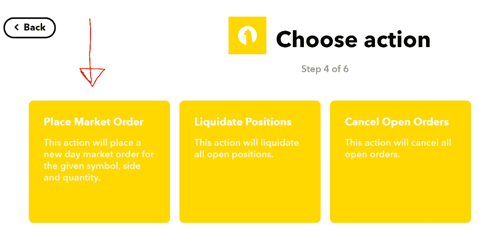

这将向您展示羊驼服务的所有当前/可用选项。对于此子视图，我们将选择“下达市场订单”。

这是您将使用“配料”的地方

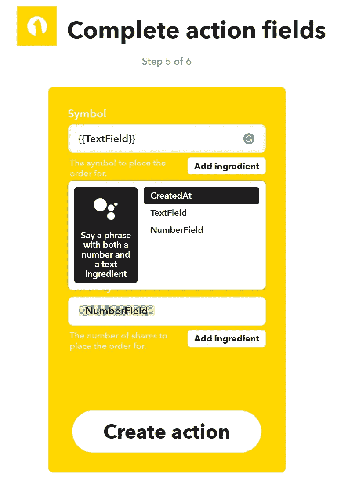

如果您选择“添加配料”，它会列出所有可能的选项。* *注:这就是我一直使用谷歌助手的原因。目前，亚马逊 Alexa 触发选项不包括文本和数字成分。

对于该子视图，我们将选择“购买”。添加完所有正确的逻辑后，单击 Create action。

最后一步是保存操作，并选择是否希望在 applet 运行时收到通知。

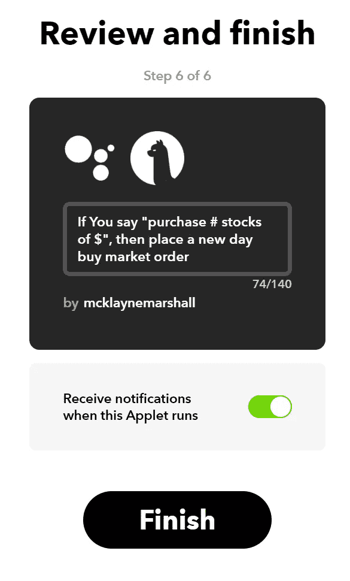

最后，在测试之前，IFTTT 将显示一个连接的屏幕——这允许您打开和关闭这个小程序。

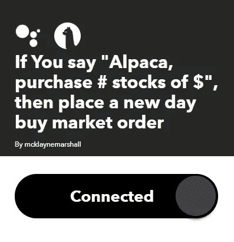

考验的时候到了！

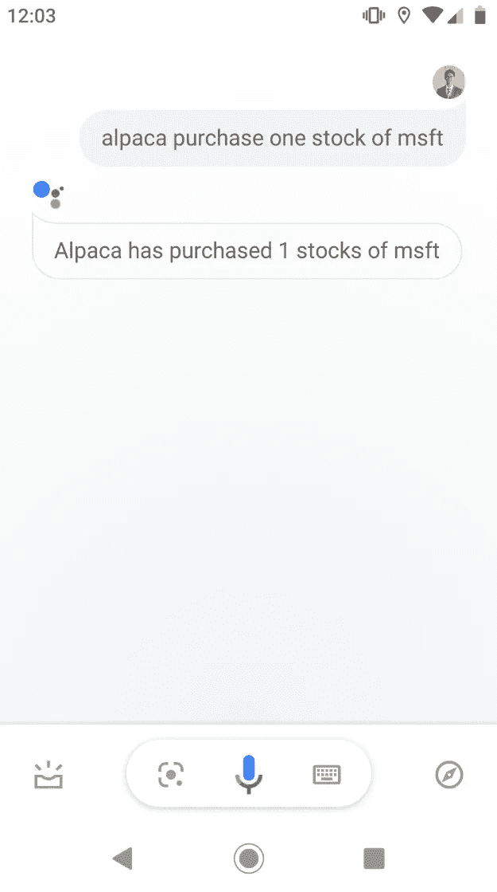

它非常有效！

最后一步是在 IFTTT 中创建另一个 applet(参考前面的步骤)来销售股票。一旦你完成了这个小程序，你就可以用你的声音来交易股票了。

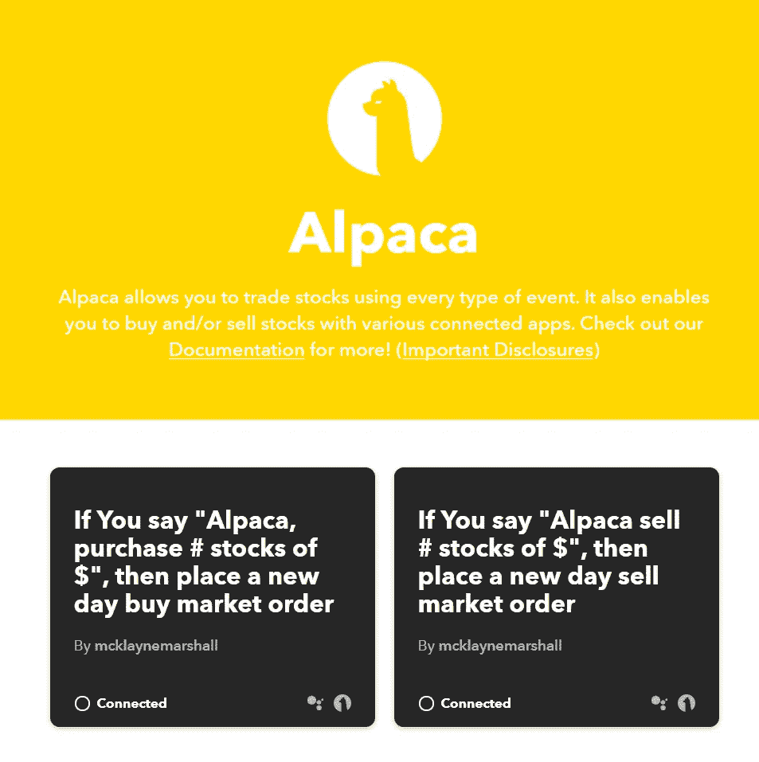

# **结论**

使用 API 进行股票交易已经从各个方面改变了股票交易。利用 IFTTT 和 Google Assistant 就是一个很好的例子。我希望你喜欢这篇关于如何为自己设置的教程。我也希望这能引发其他人思考如何使用羊驼和 IFTTT。

干杯。