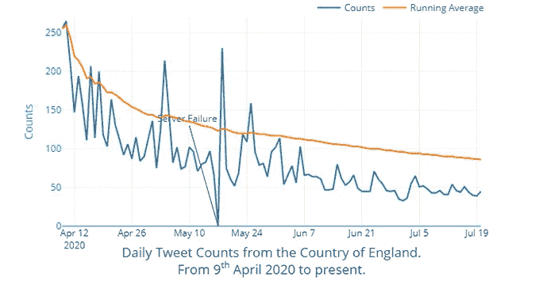

# 利用新型数据流对抗新冠肺炎病毒

> 原文：<https://towardsdatascience.com/utilising-novel-data-streams-in-the-fight-against-covid-19-89b4419dd443?source=collection_archive---------44----------------------->

美国墨西哥湾；照片由美国宇航局拍摄。

随着社交距离措施的到位，大量关于新冠肺炎的讨论现在发生在 Twitter 等社交媒体平台上。这些平台包含丰富的信息，可以帮助我们回答诸如*今天有多少人表现出冠状病毒症状？*然而，并非所有信息都是平等的——这些平台也包含大量错误信息，可能会对公众造成伤害。

我们开发了一个系统来跟踪和分析提到新冠肺炎症状的推文。这个系统“听”提到新冠肺炎症状的推文。一旦被识别，推文就会通过机器学习分类器进行分类，识别它是否与用户的个人症状、其他人的症状有关，或者推文是否包含错误信息。

我们还可以使用地理定位数据来计算在给定国家的每个地区(用户允许地理定位的地方)发布症状的用户数量。根据这些数据，可以确定在给定国家的不同地区之间旅行的用户数量。这些信息可能有助于识别一个国家内的新爆发群集，并提供对公众如何应对封锁措施的深入了解。

显示一段时间内与新冠肺炎症状相关的推文数量的仪表板

为了方便获取这些信息，我们开发了一个 [**【症状观察】**](http://pgb.liv.ac.uk/~johnheap/) 仪表板，报告每天提到症状的推文数量。目前，美国各州和英国各级(地方和上层机构、NHS 地区和国家)都提供这些计数。这项功能将在不久的将来扩展到其他国家。

我们还与 Evergreen Life 合作，分析他们健康应用程序中的数据。作为对新冠肺炎的回应，常青人寿一直在向应用程序用户提问，以深入了解疫情。例如，用户被要求报告他们是否被隔离，或者他们或他们家中的某人是否有症状。收集的数据的深度和广度令人印象深刻，可以回答无数的问题。

该团队已经开发出解决这些问题的方法，例如，一个人经历新冠肺炎症状的平均持续时间。Evergreen Life 应用程序的用户报告是零星的，因此我们看不到一个人出现症状的完整时间表。为了处理用户报告的零星性质，我们在“Stan”编程语言中定义并拟合了一个贝叶斯模型，使我们能够确定用户最有可能在 3.06 天内经历症状。

常青人寿仪表板数据显示

当用户报告一名家庭成员出现症状时，我们可以通过确定两名家庭成员患病之间的时间来了解新冠肺炎在家庭内的相互作用。我们还知道用户是否正在隔离并随后出现症状。从这些报告中，我们可以量化隔离是否会降低您患冠状病毒的几率。我们分析了今年 3 月至 6 月期间收集的数据，并确定未隔离的个人在报告未隔离的 7 天内报告症状的可能性增加了 35%。

到目前为止，我们所做的工作展示了如何利用新的数据流来加深对新冠肺炎疫情的理解。当与更传统的数据流结合时，这些新的数据流可以帮助政府做出更明智的决策来抗击病毒。

Matthew Carter 是一名博士生，他是 EPSRC 分布式算法 CDT 的成员。这篇博客最初发布在利物浦大学新冠肺炎中心。