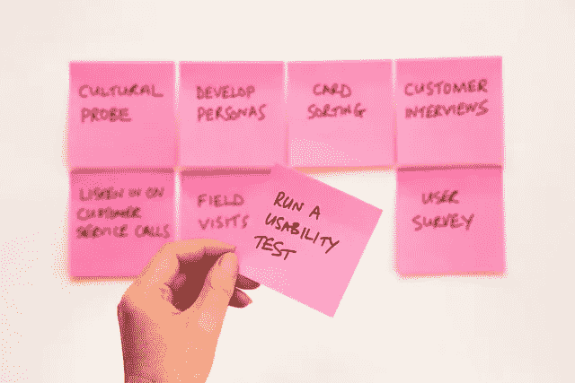

# 利用这段时间学习新的数据科学技能

> 原文：<https://towardsdatascience.com/utilize-this-time-by-learning-new-data-science-skills-134c152b350d?source=collection_archive---------37----------------------->

## 哪些鲜为人知的技能在数据科学家中变得越来越普遍

这段时光一去不复返，好好利用吧。不做任何有建设性的事情就让时间、日子、星期飞逝太容易了。把这段额外的时间作为一份礼物，让自己变得积极主动。

戴维·特拉维斯在 [Unsplash](https://unsplash.com/s/photos/test?utm_source=unsplash&utm_medium=referral&utm_content=creditCopyText) 上拍摄的照片

这些是最常见的技能，在数据科学家中变得非常流行。

## 码头工人

由[弗兰克·麦肯纳](https://unsplash.com/@frankiefoto?utm_source=unsplash&utm_medium=referral&utm_content=creditCopyText)在 [Unsplash](https://unsplash.com/s/photos/container?utm_source=unsplash&utm_medium=referral&utm_content=creditCopyText) 拍摄的照片

它不需要介绍，因为容器化你的应用程序是很常见的。但是让我们用一个例子来理解，为什么它如此有帮助。

假设您在 tensor flow lite for embedded devices 的帮助下构建了一个用于对象检测的应用程序。它必须部署在 20 个树莓设备上。现在，问题是您必须将源代码复制到所有的 raspberry pie 设备上，并安装要求，还需要设置一个进程控制监视器，以确保当设备重启或启动时，应用程序立即启动。您了解这种设置的复杂性，并且您必须在 20 台设备上执行类似的设置。你很有可能会犯一些错误，并且会花相当多的时间去改正。此外，如果有任何更新，你理解的复杂性。

现在，让我们看看 Docker 对类似设置的实现。当设备启动时，您不需要任何过程控制监视器来启动应用程序，因为有一个参数 restart，只需将其设置为 always。我们将使用应用程序的 Docker 图像。这将确保每个覆盆子馅饼得到相同的代码，这种方式也可以很容易地安装。

 [## Docker 让数据科学家变得简单

### 使用 Docker 的机器学习模型部署中的动手学习，并提供各种示例。

towardsdatascience.com](/docker-made-easy-for-data-scientists-b32efbc23165) 

## 瓶

Flask 是一个为机器学习模型或数据库创建 API 的微框架。学起来用起来超级简单。

这是使用 flask 的示例代码片段

大多数情况下，你会使用类似的脚本，你的同事，比如前端开发人员或后端开发人员会问你 API 和有效负载。

 [## 每个数据科学家都应该知道的

### 生产机器学习模型

medium.com](https://medium.com/zykrrtech/what-i-wish-i-knew-earlier-in-ml-1212f2eed73a) 

## PyTest(写作测试)

戴维·特拉维斯在 [Unsplash](https://unsplash.com/s/photos/test?utm_source=unsplash&utm_medium=referral&utm_content=creditCopyText) 上拍摄的照片

这被认为是最无聊的事情之一，但是相信我，你必须开始写测试了。原因是当你的应用程序开始增长，很多人都在工作时，很难跟踪变化的东西，我说的变化不是指 Git。想象一下，由于某人更新了一段代码，应用程序的某个特性突然停止了工作。现在，如果有测试，在部署之前就可以很容易地检测出来。

您可能会问，如果有人在部署之前忘记运行测试用例，该怎么办。这就是 CI/CD 派上用场的地方。您可以创建一个管道来运行代码测试，然后部署它。如果测试失败，那么您的应用程序将不会被部署。

## 哨兵

照片由[李成龙](https://unsplash.com/@trustdexigner?utm_source=unsplash&utm_medium=referral&utm_content=creditCopyText)在 [Unsplash](https://unsplash.com/s/photos/monitor?utm_source=unsplash&utm_medium=referral&utm_content=creditCopyText) 上拍摄

Sentry 用于您必须在数据科学应用程序上设置的警报。我认为这是监控机器学习模型的一部分。不同之处在于，我们用它来监控错误，而不是性能。当您已经部署了您的模型，并且它仍然处于早期阶段时，监控错误是一件非常重要的事情。

您还可以使用 Telegram 或 Slack API 将所有错误或警告发送给一个组，所有团队成员都可以看到。

许多人认为这些事情是 DevOps 的工作，但让我诚实地告诉你，它增加了你的技能，给你的简历增加了更多的价值，而且如果你在一家初创公司工作，你有机会自己做类似的事情。

## 绝对要结帐的附加文章

 [## 数据科学家的最佳 Python 实践

### 让我们看看生产级代码的一些行业标准。

towardsdatascience.com](/best-python-practices-for-data-scientists-11056edda8c7) 

谢谢你..！