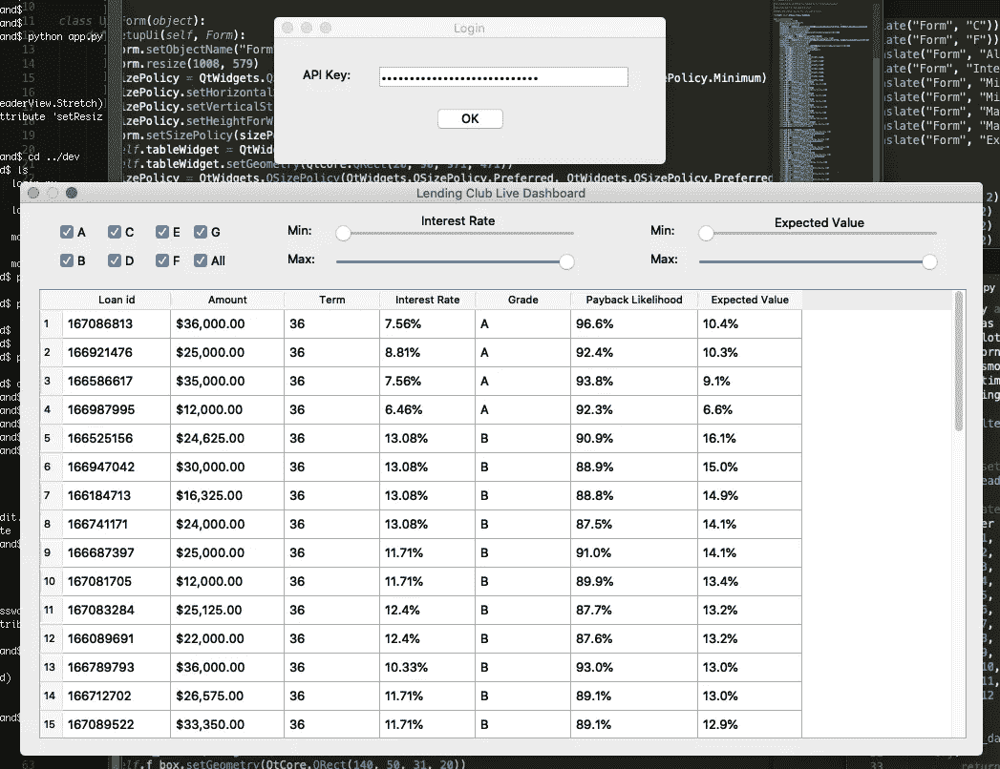
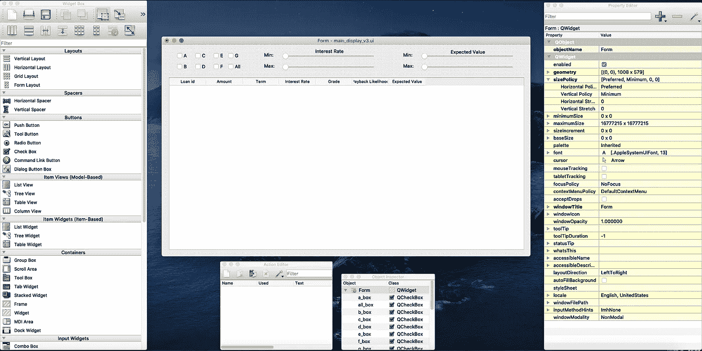

# 利用您的数据科学项目(第 2 部分)

> 原文：<https://towardsdatascience.com/utilize-your-data-science-project-part-2-982e59a4b4bf?source=collection_archive---------31----------------------->

## 使用 PyQt5 为 LendingClub 仪表板创建 GUI



我的 LendingClub 仪表板应用程序的图形用户界面

这是两部分系列的第二部分。查看第一篇文章，点击 [*此处*](/utilizing-your-data-science-project-32ef3f3230f4) *。*

在过去的几年里，数据科学就业市场对软件工程技能和将机器学习模型投入生产的经验的重视程度显著提高。在这个故事的第 1 部分，我经历了在最终产品(理论上是面向用户的)的环境中编写利用机器学习模型的程序的一些考虑。这个过程揭示了许多启示，我相信这些启示启发了我对数据科学产品过程的了解。

在这一部分，我将重点介绍一个对许多数据科学家或学生来说可能不熟悉的过程；创建用户界面。如果你想提高数据科学就业市场的技能，学习如何为消费者包装机器学习产品，或者创建一个程序，使你的项目更容易用于个人用途，请继续阅读！

# 选择 PyQt5 框架

[PyQt5](https://pypi.org/project/PyQt5/) 是一组 Python 绑定(一种从 Python 调用 C 函数的方式)，允许我们创建 GUI(图形用户界面)，在 C++中实现 Qt 库，只使用 Python，允许开发人员相当容易地从头创建应用程序。我也和 Kivy 和 Tkinter 一起玩过，但是 PyQt5 似乎最适合我的需要。Tkinter 是一个相当标准的 GUI 库，但它在 MAC 上有点问题，Kivy 对于移动应用程序开发来说很棒，但对于桌面应用程序来说不太有效。最终，我选择了 PyQt5，因为它非常直观和灵活。只要你熟悉创建和定义类，以及面向对象编程的一般原则，这是很容易掌握的。

我大量使用了来自编程频道“Tech With Tim”的 YouTube 教程来学习这个库和框架的基础知识。你可以在这里找到他的系列视频[。](https://www.youtube.com/watch?v=Vde5SH8e1OQ&list=PLzMcBGfZo4-lB8MZfHPLTEHO9zJDDLpYj)

# 用 Qt Designer 设计界面

Qt 框架的一个我最喜欢的特性是能够用一个叫做 Qt Designer 的工具手动布局窗口。Designer 允许您拖放不同的元素(如按钮、标签、滑块等)。)拖到一个示例窗口上，这样您就可以设计一个视觉上吸引人的程序，而不用在代码中摆弄 x/y 坐标或维度。



在 Qt Desginer 中设置我的仪表板

一旦有了喜欢的布局，就可以将其保存为. ui 文件。从那里，我们可以在命令行中使用 pyuic5 命令从我们的。ui 文件。在确保您位于正确的工作目录后，只需在您选择的命令行界面中键入以下内容:

```
pyuic5 -x saved_file.ui -o new_file.py
```

该命令的“-x”部分添加了一段 Python 代码，当我们运行生成的 Python 脚本时，该代码将执行并显示程序。“-o”命令指定输出文件的名称。

一旦你完成了这些，你就可以在你喜欢的文本编辑器中打开这个文件并创建一个工作应用程序！

你可以在这里下载 Qt Designer for Mac 或 Windows [。在 Windows 上，您还可以使用:](https://build-system.fman.io/qt-designer-download)

```
pip install pyqt5-tools
```

在命令行中安装一套与这个库相关的工具。

# 向界面添加功能

一旦你为你的用户界面创建了一个 Python 文件，你可以试着运行它。它应该像正常程序一样显示在你的屏幕上，但是按钮或小部件都没有做任何事情。我们仍然需要用 Python 编写代码来指导我们的程序做我们想要做的事情。

这一部分显然会根据您创建的应用程序而有所不同，但是我将概述我创建 Lending Club 程序的主要步骤。

## 填充仪表板

在第一部分中，我概述了从 Lending Club 下载实时数据，并使用该模型预测还款可能性的步骤。完成后，我们希望在仪表板中显示贷款信息以及我们的预测。

我们自动生成的代码创建了一个类(我的名为 Ui_Form)，然后是一个名为 setupUi 的方法。我们的主窗口将是这个类的一个实例，正如您可能猜到的，setupUi()将在脚本运行时创建并设置这个实例。生成我们的表或 tableWidget 的代码是自动为我们编写的，设置列维度也是如此。使用以下代码设置行数(display 是我们想要显示的数据框):

```
self.tableWidget.setRowCount(display.shape[0])
```

更多自动生成的代码创建表的列，然后用以下循环填充表:

```
for r in range(display.shape[0]):
    for c in range(7):
        self.tableWidget.setItem(
                                 r,c,
                                 QtWidgets.QTableWidgetItem(
                                     str(display.iloc[r,c]))
                                 )
```

很可能有一种更有效的方法来做到这一点。然而，我们的数据框可能不会超过 60 或 70 行。代码在速度方面没有留下任何需要改进的地方，所以我没有进一步优化。

## 添加过滤器

我希望用户能够缩小他们正在查看的贷款选项，以符合他们的个人偏好。首先，我添加了各种贷款类别的复选框(Lending Club 将所有贷款从 A 到 G 进行评级)。当程序启动时，我的程序自动检查每个等级的复选框，然后连接到一个名为“redraw”的类方法，每当单击它时，它将在接下来被定义。

```
self.a_box.setCheckState(2)  # A state of 2 means the box is checked
self.a_box.clicked.connect(self.redraw)
```

的功能。connect()将一个事件(在本例中是 self.a_box.clicked，或者是改变状态的 A 框)连接到一个方法。这是我们赋予界面生命的主要方法。除了“全部”框之外，前面的代码对每个复选框都重复。这个框连接到一个单独的函数，该函数检查或取消检查所有的框(取决于状态)，然后调用 redraw 方法。

接下来，我为用户添加了滑块，以便按利率或期望值/平均结果过滤显示的贷款。这个过程是相似的，除了我们必须设置最小和最大值，并且可能在初始化时为滑块设置一个值。

```
self.min_int.setMinimum(min(display_raw.intRate)-1)
self.min_int.setMaximum(max(display_raw.intRate)+1)
self.min_int.sliderMoved.connect(self.redraw)self.max_int.setMinimum(min(display_raw.intRate)-1)
self.max_int.setMaximum(max(display_raw.intRate)+1)
self.max_int.setValue(max(display_raw.intRate)+1)
self.max_int.sliderMoved.connect(self.redraw)
```

同样，无论何时移动滑块，动作都连接到 redraw 函数。

## 重画功能

每当更改过滤器时，都会调用 redraw 函数。它实际上做的和它听起来的一样。首先，创建一个过滤后的贷款等级列表。每当复选框被选中时，方法 checkState()为 2，因此 disp_rows 是用户希望返回的贷款等级列表。接下来，创建一个对象 newdf，它是反映过滤器状态的贷款数据框架的子集。最后，表会像最初一样被填充。

```
def redraw(self):disp_rows = [(self.a_box.checkState() == 2) * 'A', 
                    (self.b_box.checkState() == 2) * 'B',
                    (self.c_box.checkState() == 2) * 'C',
                    (self.d_box.checkState() == 2) * 'D',
                    (self.e_box.checkState() == 2) * 'E',
                    (self.f_box.checkState() == 2) * 'F',
                    (self.g_box.checkState() == 2) * 'G',
                    ]newdf = display[[x in disp_rows for x in display.grade] & 
                    (display_raw['intRate']>=self.min_int.value()) & 
                    (display_raw['intRate']<=self.max_int.value()) &
                    (display_raw['EV'] >= self.min_ev.value()) &
                    (display_raw['EV'] <= self.max_ev.value())
                    ]

    self.tableWidget.setRowCount(newdf.shape[0])for r in range(newdf.shape[0]):
        for c in range(7):
            self.tableWidget.setItem(
                                     r,c,
                                     QtWidgets.QTableWidgetItem(
                                     str(newdf.iloc[r,c]))
                                     )
```

## 登录屏幕

最后需要做的事情是合并一个登录屏幕。除了让它感觉更像一个“真实的”应用程序，登录屏幕还为用户提供了一个输入登录信息的简单方法(在本例中，是一个连接到 Lending Club API 的 API 键)。

为了创建一个单独的窗口，定义了一个新的类(我再次使用了 Qt Designer)。这个新的登录窗口将是程序启动时初始化的窗口，主窗口稍后创建。

一旦用户输入他们的 API 键，我们必须将一个按钮点击事件连接到一个函数。

```
self.ok_button.clicked.connect(self.logging_in)
```

当调用这个函数时，程序将用户的输入存储为一个名为 apikey 的全局变量，当我们设置主窗口时会再次调用这个变量。之后，主窗口被初始化，我们所知道的程序开始了。

```
def logging_in(self):
    global apikey 
    apikey = ui.keybox.text()
    Form = QtWidgets.QDialog()
    uimain = Ui_Form()
    uimain.setupUi(Form)
    Form.show()
    Form.exec_()
```

# 结论

经历这个过程教会了我很多关于将机器学习模型投入生产的生命周期、面向对象编程以及一般的应用程序开发。对于使用像 PyQt5 这样的框架可以完成的事情，我仅仅触及了皮毛。如果你有兴趣了解更多，请查看之前提到的 Tim(不是我)的 [Youtube 教程](https://www.youtube.com/watch?v=Vde5SH8e1OQ&list=PLzMcBGfZo4-lB8MZfHPLTEHO9zJDDLpYj&index=1)、 [PyQt5 文档](https://doc.qt.io/qtforpython/index.html)，或者尝试自己创建一个应用或项目！

*如果你想了解更多关于我的应用程序的后端，请在这里阅读第一部分*[](/utilizing-your-data-science-project-32ef3f3230f4)**。在我的 Github* [*上随意查看完整代码，这里*](https://github.com/timcopelandoh/thinkful/blob/master/Capstones%20and%20Projects/LC_app/final/app.py) *。**