# 利用二元交叉熵的内生变量

> 原文：<https://towardsdatascience.com/utilizing-endogenous-variables-with-binary-cross-entropy-a4320b586be5?source=collection_archive---------36----------------------->

## 如何使用内生变量做出更明智和准确的决策，而不破坏模型的基本数学和逻辑。

内生性通常是由于因果关系。时间的方向可以告诉我们变量在模型中应该如何相互关联。(burst.shopify.com)

最近，我的任务是使用具有有趣的[内生变量](https://www.statisticshowto.com/endogenous-variable/)的数据构建一个分类器——这对于告诉我的模型如何训练非常有价值。在本文中，我将详细介绍我所采取的步骤，您自己也可以采用类似的策略。最终，我们将有办法使用内生变量来训练一个模型，而不用担心它对模型假设的影响，也不用走任何逻辑捷径。很明显，使用一个不能包含在模型中的单独的数据，我们可以通过告诉它是否做了一个好的预测来改进模型。

开始之前，您应该对分类算法的工作原理和成本函数的作用有一个基本的了解。此外，对微分学有所了解会对最后一节有所帮助。

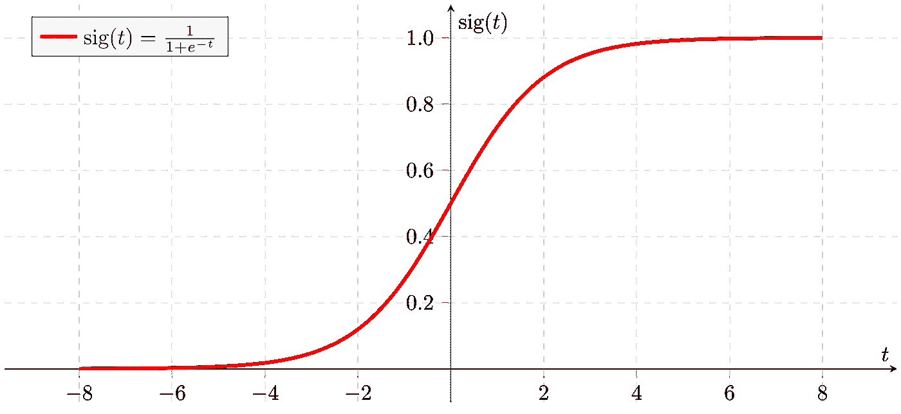

Sigmoid 函数——二元分类的关键数学公式。(维基共享资源)

# 什么是二元交叉熵？

二元交叉熵，也称为对数损失或逻辑损失，是逻辑回归的成本函数。Log-loss 也是一种流行的损失函数，用于深度学习模型的分类，以及像 XGBoost 这样的树集成模型。“二元交叉熵”恰好是这篇文章中探索的方法的一个特别合适的名字，因为我们将充分利用这个方程的可分性。

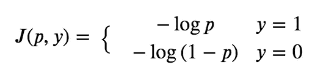

对数损失作为分段函数

上面是写为分段函数的二元交叉熵方程。

*   **T5【J】T6**是损失函数
*   ***y*** 才是真正的标签
*   ***p*** 是模型的连续输出，预测概率 ***y*** =1

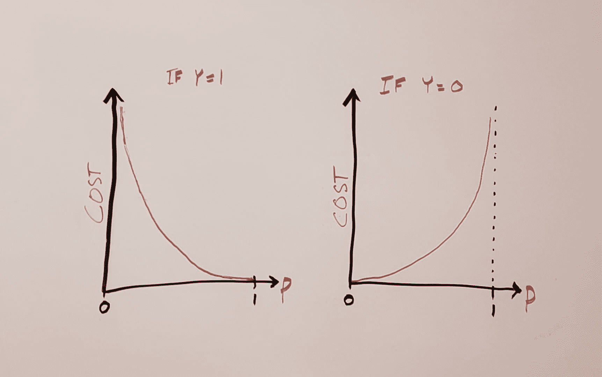

逻辑损失是并排绘制的两个方程。

我们的预测离实际值越远，成本函数值就越高。

它也可以合并成一个等式:

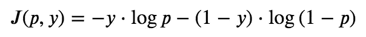

对数损失作为一个等式

请注意，该等式简化为 y=1 和 y=0 的第一个函数片段，这是 y 的唯一可能值。

## 快速旁注…

*损失函数、成本函数、*和*目标函数*经常互换使用。“损失函数”指的是与单个观测相关联的损失，而“成本”指的是整个数据集。“目标函数”只是一个函数被最小化或最大化的更一般的术语。

## 渐变和粗麻布

在分类模型中，目标是找到优化 ***p*** 的模型参数，最小化所有观察的该函数。为了做到这一点，我们需要使用函数的梯度，有时也是 hessian。这些是通过分别对模型参数取一阶和二阶导数而得到的。

对数损失的梯度和 hessian 如下所示。在讨论了原始成本函数的修改版本后，我们稍后将回到这个问题，并更深入地研究数学。

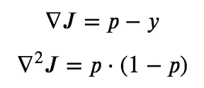

# 什么是内生变量？

内生变量是依赖于模型输出的变量。通常，人们可能将模型的目标变量称为*内生变量，但在某些情况下，可能不止一个。*

*例如，如果一个模型预测某人是否会买一只宠物狗，他们是否会给这只狗取名为“矮胖”将取决于他们是否买过这只狗。如果我们试图在“这个人会买狗吗”模型中使用被命名为 Chunky 的狗作为变量，就会出现两个问题。*

1.  ***因果关系:**买狗先于命名。未来发生的事情不能决定过去的事情。*
2.  ***训练偏差:**只有买过狗的人才会有关于他们是否给自己的狗起名为矮胖的有用信息。有些人差点就买了一只狗，并给它取名为矮胖，但他们没有买。如果我们在分类模型中使用“矮胖”变量，我们只能对一组结果这样做。我们无法得到一只不存在的狗的名字。*

*想一想第二点……一个人愿意给他们的狗起名叫矮胖，这可能首先就说明了这个人和他们对狗的喜爱。我们稍后将回到这个概念。*

## *分类模型的其他内生变量示例:*

*   *预测是否会下雨的模型中的降雨量*
*   *就职演说的长度预测某人是否会赢得政治选举的模型*
*   *在一个预测学生是否能通过课程的模型中，最终成绩达到了 T21*

**

*一个雨量计，本意是测量 ***后*** *下雨。*(维基共享)*

*到目前为止，你会注意到四个例子，有时变量是可量化的，有时是不可量化的。例如，你可以测量零英寸的降雨量，但是你不能得到一个没有发生的演讲的长度。有不同的方法来估算缺失值，但那是采用了不必要的假设，给我们的预测添加了不必要的警告。在下一节中，我们将讨论一个通用的解决方案。*

# *我们如何修改二元交叉熵，为什么我们要这样做？*

*让我们再看一个降雨的例子。一个预测“无雨”的模型实际上只下了半英寸的雨，从数量上来说，这比一个预测“无雨”的模型实际上只下了六英寸的雨要少得多。使用这些信息来改进模型可能是个好主意。*

*有时，这种关系并不十分清晰，但是如果内生变量和目标变量之间的关系可以被合理化并以数学方式公式化，**，那么它就可以被纳入成本函数**。*

*这将“惩罚”一个模型，而不是预测一个错误更多的结果，而不是一个错误更少的结果，从而相应地为成本函数产生更高或更低的输出。*

## *修改成本函数有什么作用？*

*修改成本函数将改变模型参数的误差表面的最小值和斜率。这意味着**收敛可能发生在模型参数被更好地概括的地方，因为模型现在包含了额外的信息。***

## *为什么不用回归模型来代替呢？*

*在某些情况下，预测正在讨论的内生变量，然后建立一个决策边界来预测原始目标变量可能是有效的。然而，可能会出现一些问题:*

1.  *带有决策边界的回归可能无法很好地回答最初的问题。回到降雨量的例子，累积十分之一英寸的降雨量仍然是雨，在二进制尺度上，这仍然是 1。*
2.  *连续内生变量的分布可能不适用于大多数参数建模技术。(例如，参见下面的 Tweedie 分布)。*
3.  *对于缺失的内生变量来说，一个合理的值可能并不存在。在某些情况下，估算值可能是合理的，但在我的特定项目中却不是这样。*

*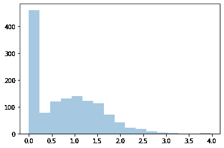*

*特威迪分布*

*另一个想法可能是使用内生变量为 ***y*** 设定一些修改值，但是**您*必须*考虑这对成本函数有什么影响。**如果 ***p*** > 1，将使用原始成本函数来定义值。*

## *一种改进的分类代价函数。*

*由于二进制交叉熵可以像分段函数一样处理，我们可以只修改方程的一部分。我们将添加一个比例因子， ***s*** ，它是我们内生变量的函数，对于 y=1 的情况。该比例因子是所讨论的内生变量的函数，在相当中性的情况下取值 1，当成本应该更高时取值高，当成本应该更低时取值低。*

*这最终会根据内生变量的值，或多或少地惩罚模型。现在不仅仅是估计是否错误的问题，还有另一个因素在某些情况下发挥作用。你可以原谅这样的情况，你可以说类似于*“这个估计在技术上是错误的，但是我不在乎这个其他的因素，所以我不希望这个模型有太大的改变。”*本质上，这就是改变成本函数的作用。*

*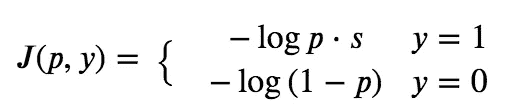*

*现在我们可以看到，对于我们缺失的内生变量的值，我们估算什么并不重要，因为对于 y=0 的情况，它在数学上是不相关的。当将原始函数转换为非分段函数时，这仍然成立。*

*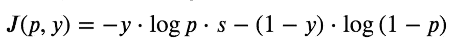*

# *微积分！*

*一些机器学习库，以及任何定制的梯度下降实现，将需要计算成本函数的梯度。有时，也需要粗麻布。*

*现在我们将计算这个二进制交叉熵的修改版本的梯度和 hessian。*

## *梯度*

*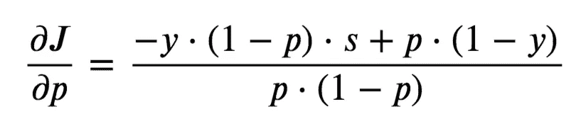*

*首先，求 J 对 p 的偏导数。*

*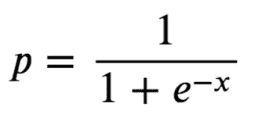*

*请记住，p 是模型输出的 sigmoid 变换，我们称之为“x”*

*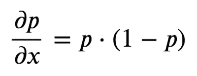*

*上面显示了 s 形曲线的导数。*

**

*代入上式，求梯度。*

*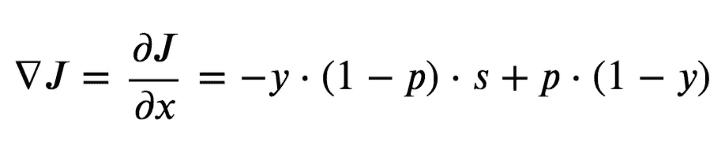*

*修改后的成本函数的梯度，使用我们上面计算的两个偏导数。*

*对于 ***s*** =1 和 ***y*** =0 的情况，这简化为原始梯度。我们现在已经找到了修改后的成本函数的一阶导数，这是基本梯度下降算法所需要的。*

## *打包麻布*

*对于更复杂的算法，我们也需要二阶导数。请记住，我们已经将 ***x*** 定义为预转换模型输出。*

**

*定义黑森人。*

*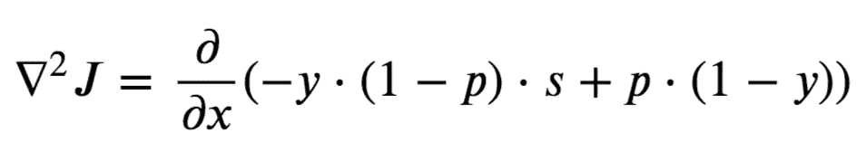*

*替代。*

*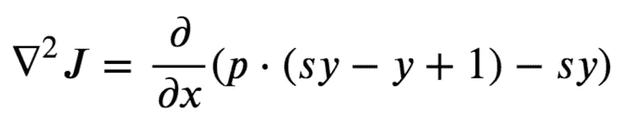*

*重构。*

*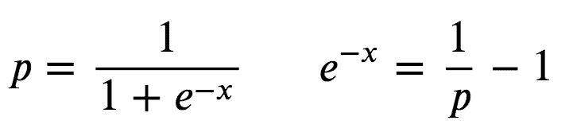*

*我们可以用 ***p*** *来继续区分。**

*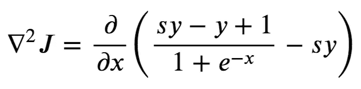*

*换人后。*

*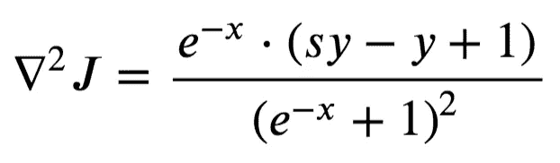*

*求导之后。*

*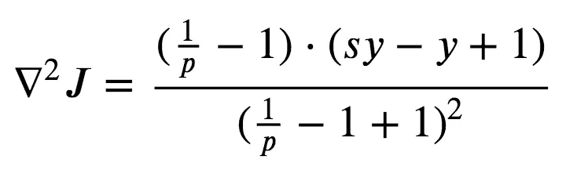*

*将 **p** 替换回。*

*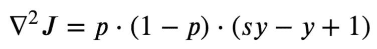*

*简化。*

*这简化为原始的 hessian 对于 ***s*** =1，以及 ***y*** =0 的情况。*

# *摘要*

*仅仅因为一个变量是内生的，并不意味着它不能用来改进一个模型。在这里，我提出了一个调整逻辑损失的建议，以纳入通常不会在模型中使用的数据，这可能会改善结果。对如何使用这些变量的决策进行合理化仍然很重要，但有足够的空间进行实验。*

## *后续步骤*

*这是我自己想出来的方法，以前没有遇到过类似的解决问题的方法。如果你已经找到了关于这个主题的其他资源，请在评论中分享！*

**

*矮胖的*