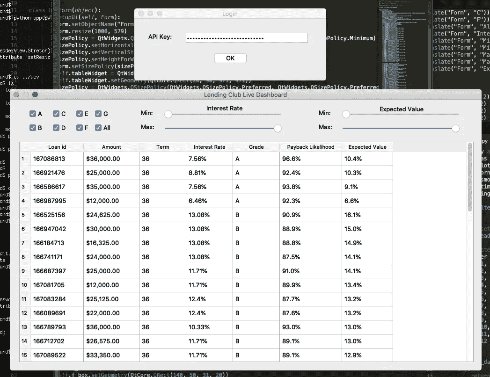

# 利用您的数据科学项目(第 1 部分)

> 原文：<https://towardsdatascience.com/utilizing-your-data-science-project-32ef3f3230f4?source=collection_archive---------20----------------------->

## 将 Lending Club 机器学习模型投入生产



我的 LendingClub 仪表板应用程序的图形用户界面

在过去几年中，数据科学行业最强劲的趋势之一是越来越重视在生产环境中部署机器学习模型。雇主期望的不仅仅是特征工程和建模。你执行至少一些基本软件工程任务的能力可能决定求职过程的成败。

我目前正在找工作。特别是因为我来自一个非技术背景，我不想把自己限制在只能拟合、预测和评分模型，而不能走出沙盒。在大多数现实世界的应用程序中(没有双关语的意思)，一个模型将是一个更大的产品的一部分。构建一个将模型投入生产的简单程序，向您介绍生产环境特有的想法。就我而言，我还想证明我可以学习一个新的库或用例，而我并没有明确的课程。

还有一个更明显的原因让你想把你的模型投入生产:你可以使用它，或者和其他人分享它！我住在一个不允许投资者使用 Lending Club 的州，我希望能够与能够使用它的朋友或家人分享我的模型，无论他们是否受过 Python 训练。

对于那些不熟悉的人来说，LendingClub 是一个点对点的借贷市场。实质上，借款人申请贷款，并由 LendingClub 分配一个利率。个人投资者可以选择贷款来资助或投资，以类似于众包活动的方式为贷款筹集资金。作为投资者，你的回报根据你选择的贷款(利率和违约率)而变化。因此，如果你能更好地预测哪些借款人会还贷，你就可以期待更好的投资回报。

在我的一个个人项目中，我建立了一个模型，可靠地选择了一个超过市场平均水平的贷款组合。在我的模型被完全微调后(即“数据科学”部分完成)，将模型投入生产有 5 个主要步骤。

# 保存/序列化您的模型

当你在 jupyter 笔记本上展示一个模型时，你的模型运行多长时间并不重要。然而，在生产环境中，速度通常很重要。即使在我们不断收到新数据的情况下，模型也很少需要立即重新训练。根据用例的不同，模型的训练可能只发生一次，在每天的某个时间，由外部事件触发，或者完全不同的事情。就我们的目的而言，在开发应用程序时，训练我们的模型一次就足够了。

为了以功能性的方式利用我们的模型，我们需要保存结果以供将来使用。这也称为序列化。在 python 中实现这一点的一个简单方法是使用 pickle 库

从库文档中:

> `[pickle](https://docs.python.org/3/library/pickle.html#module-pickle)`模块实现了二进制协议，用于序列化和反序列化 Python 对象结构。*【pickle】*是将 Python 对象层次转换成字节流的过程，*【unpickle】*是逆操作，将字节流(来自[二进制文件](https://docs.python.org/3/glossary.html#term-binary-file)或[类字节对象](https://docs.python.org/3/glossary.html#term-bytes-like-object))转换回对象层次。

我们需要知道的是，这个库为我们提供了一个简单的方法来保存一个合适的模型，这样我们就可以在应用程序启动时加载它，而不是每次我们想要运行程序时都必须适应一个可能很耗时的模型。

我设置了两个 python 程序。第一个包含所有的代码来训练我的应用程序将要使用的模型。程序做的最后一件事是保存这个模型以备将来使用。

```
rf.fit(X,y)
import pickle
pickle.dump(rf, open('rf.sav', 'wb'))
```

然后，在我们面向用户的程序中，当我们想要重新加载模型时:

```
rf = pickle.load(open(‘rf.sav’, ‘rb’))
```

这将在 Python 中加载我们的对象的实例，并允许我们像刚刚创建它一样使用它。

# 加载实时数据—使用 Lending Club API

这一步会有很大的不同，取决于你正在处理的具体问题。它可能涉及抓取网页、加载放入数据库的数据，或者为查看您的网页的客户加载客户信息。在这种情况下，我们希望利用我们的模型让我们知道哪些当前可资助的贷款可能给我们带来最高的投资回报。为了做到这一点，我们需要一个实时的数据源。

幸运的是，Lending Club 提供了一个易于使用的 API，我们可以使用请求库与之通信。Requests 允许您非常容易地发出 HTTP 请求，允许您与 web 页面和 API 进行交互。你可以在这里找到文档[。](https://requests.readthedocs.io/en/master/)

前两行代码为我们的请求指定了变量和参数。我们的变量‘API key’是在用户登录(并输入他们的 API 密钥)时定义的，而‘Content-Type’规定了 API 返回的数据格式。Lending Club 列出了一天中四个不同时间的新贷款。参数“showAll”告诉 API 是返回所有可资助的贷款，还是只返回最后一个列表中的贷款。

```
header = {‘Authorization’: apikey, ‘Content-Type’: ‘application/json’}params = {‘showAll’: ‘True’}
```

以下代码从 Lending Club API 发出请求:

```
url = ‘https://api.lendingclub.com/api/investor/v1/loans/listing’resp = requests.get(url, headers=header, params=params)
```

最后，我们从响应中提取贷款信息，并将其格式化为 pandas 数据框。

```
loans = resp.json()[‘loans’]loans = pd.DataFrame.from_dict(loans)
```

我们现在有来自 LendingClub 的熟悉格式的实时数据。

# 处理实时数据

我不会在这里做得太深入，但是值得注意的是，如果您关心准确的预测，那么您对测试和训练数据执行的任何预处理步骤也必须对实时数据执行。这意味着离群值的去除、转换等。

这对于我们在数据清理和特征工程过程中所做的一些决定有影响。例如，在生产中以相同的方式实现对数转换比 box-cox 转换要简单得多。

# 使用模型预测还款概率

从程序上来说，这与预测测试数据集的概率没有太大区别。然而，这将是你第一次为动态数据释放模型，你不知道最终结果。你在预测未来！这是你通过几个月的教程或课堂作业努力争取的时刻，所以拥抱它吧！

# 用用户界面实现模型

这是另一个部分，将根据用例的不同而显著变化。有些模型，比如推荐系统，会影响应用程序的行为。我的情况简单一点。我只是显示预测概率以及实时贷款信息。

我的第一个程序只是一个脚本，它将带有模型结果的数据框打印到终端。这确实迫使我思考上面的许多教训，我认为这是一个完全富有成效和有价值的练习，如果就此而言的话。然而，我也想构建一个图形用户界面(大多数人认为是程序或应用程序)。我觉得这将大大提高我与他人分享我的程序的能力，我也觉得我不能创建一个应用程序是我应该补救的事情。

我选择 PyQt5 作为我的开发库。这个过程相当广泛，我在本文的第二部分中写了更多。有几个在线演练，以及文档，使之有可能拿起。Qt designer 也非常有用，它可以让你直观地设计一个窗口，并为你生成代码。

# 结论

作为申请人，将你的模型产品化，说明你比只知道在 jupyter 笔记本上评价模型的人更全能。你实际上已经考虑了你的模型在现实世界中的用途，并且潜在地权衡了你在更理论化的项目中不会有的权衡。创建一个图形用户界面显示了学习一个新的库和超越典型数据科学工具箱的分支的能力。

根据您的具体项目，将您的模型放入最终产品中可能会有一些实实在在的好处。我非常期待进一步开发我的应用程序和模型，这样我就可以与朋友和家人分享了。如果您目前正在寻找一份数据科学方面的工作，或者碰巧有一个有趣的副业项目，利用它将是有益的，您应该考虑尝试做同样的事情！

如果你对我如何为这个程序设置图形用户界面(GUI)的基础知识感兴趣，请在这里查看第二部分[](/utilize-your-data-science-project-part-2-982e59a4b4bf)**。**