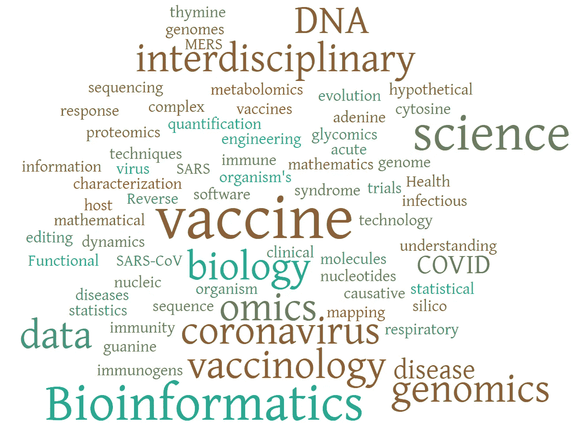
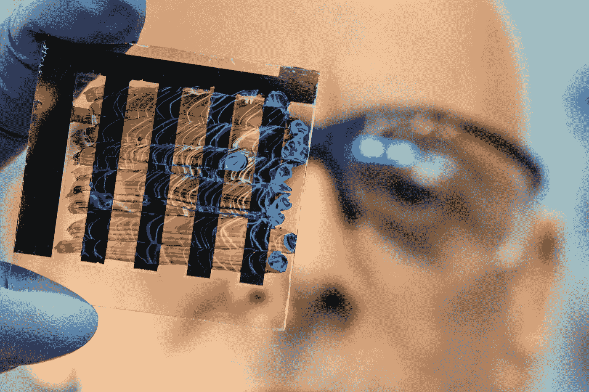
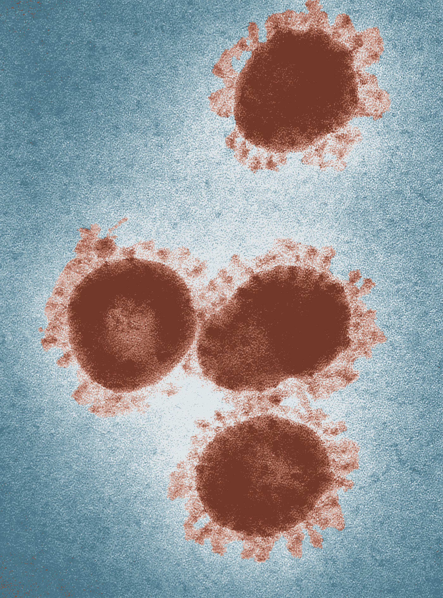
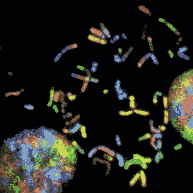

# 疫苗学 3.0 —数据科学的作用

> 原文：<https://towardsdatascience.com/vaccinology-3-0-the-role-of-data-science-6148f4742acb?source=collection_archive---------64----------------------->

## 回顾

## 当全世界屏息等待新冠肺炎疫苗的时候，这篇文章探索了数据科学对疫苗学的未来意味着什么？

T 何**本文的目的是在数据科学技术的范围内揭示现代疫苗学的发展。它试图回答一些问题，这些问题引起了越来越多的关注，因为全世界都在看着科学家和制药公司在创纪录的时间内竞相开发武汉疫情病毒的疫苗。例如:**

*   开发现代疫苗的挑战是什么？
*   在现代人工智能和数据科学工具的保护下，**疫苗学 3.0** 是如何发展的？

这是一篇综述文章，重点关注数据科学，但目标是涵盖疫苗学和相关概念的要点。因此，在尝试实现回顾数据科学在现代疫苗学中的机遇/成就的目标之前，有必要粗略浏览一下该领域中几个关键术语的定义。

# 定义

疫苗学是与疫苗开发有关的医学分支。其基本思想是将无害的实体引入体内，引发机体针对致病病原体的免疫反应，所述致病病原体持续存在于体内，从而防止未来的感染。根据引入体内的实体不同，疫苗有**三种。**

****

***全病原体疫苗*(传统)引入死亡或减弱的病原体以引发终身免疫。*亚单位疫苗*仅由病原体成分(或抗原)和**佐剂组成。**佐剂是增强疫苗所需免疫反应的物质。必须提到的是，佐剂的安全性还存在争议。*核酸疫苗*基于引入编码抗原的遗传物质的方法，针对该抗原需要免疫。粗略地说，疫苗学 1.0 和 2.0 这两个术语可以分别归因于前两种疫苗的开发。**

****疫苗学 3.0** 或[反向疫苗学](https://www.ncbi.nlm.nih.gov/pmc/articles/PMC6901788/) *、*哪个更近*、*涉及到病原体基因组信息使能的抗原发现过程。从解题的角度来看，疫苗学 3.0 类似于来自物理学的第一原理。它首先获得候选疫苗的流行病学信息，并对宿主-病原体相互作用进行建模，从而有效地减少候选疫苗的庞大列表。**

**[**组学**](https://en.wikipedia.org/wiki/Omics) 数据的爆炸式增长使这成为可能；组学是用来指来自(花式！)[学科](https://www.frontiersin.org/files/Articles/342531/fpubh-06-00062-HTML/image_m/fpubh-06-00062-t001.jpg)即。转录组学、蛋白质组学、代谢组学、细胞组学、免疫组学、分泌组学、表面组学或互作组学。由于这种*大数据*的支持，与之前自下而上和假设驱动的方法相比，逆向疫苗学本质上成为了一种*自上而下的*方法。因此，组学术语的最新补充是**疫苗组学**，其定义为研究疫苗诱导的免疫反应。**

**理解了这些关键术语，尽管是高层次的，并了解了疫苗开发的一些背景，我们可以深入研究数据科学的方法学，这种方法学使疫苗学 3.0 成为可能。为了有效地做到这一点，让我们列出疫苗开发中的[关键挑战](https://www.ncbi.nlm.nih.gov/pmc/articles/PMC7329983/)；这是逆向疫苗学的新范例，旨在有效解决这一问题。针对每一项挑战，强调如何利用数据科学和大数据技术。**

# **疫苗开发的关键挑战**

**疫苗的开发和交付存在大量问题。例如，其中一个社会问题是[反 vax](https://www.theguardian.com/sport/2020/apr/19/novak-djokovic-coronavirus-covid-19-vaccination-tennis) 运动的增加。世界人口老龄化是另一个问题。梅奥诊所的科学家在[的一篇文章](https://www.theguardian.com/sport/2020/apr/19/novak-djokovic-coronavirus-covid-19-vaccination-tennis)中列出了当前的四大挑战，这里正在讨论。**

## **1.对免疫学的不完全理解**

**人体及其免疫系统极其复杂，包含大量组件。尽管近几十年来取得了相当大的进展，但目前对这一系统的了解还远远不够。科学家不可能准确预测特定疫苗接种和相关感染的免疫系统行为。**

**这就是疫苗组学和系统生物学基于数据的计算方法为填补知识空白提供的机会。值得一提的是美国著名科学家、ACM 图灵奖获得者唐纳德·克纳特(Donald Knuth)，他激励了多代计算机科学家。当他[说](http://www.literateprogramming.com/clb93.html)(承蒙:计算机扫盲书店，公司)时，Knuth 对计算生物学的范围非常乐观:**

> **“我无法像对生物学一样对计算机科学充满信心。生物学很容易就有 500 年的令人兴奋的问题要解决，它处于那个水平。”唐纳德·克纳特。**

**这是他 1993 年采访的节选，事情朝着他预期的方向呈指数级发展。计算硬件、云技术以及最重要的深度学习打开了这一领域创新的闸门。**

****

**在 [Unsplash](https://unsplash.com?utm_source=medium&utm_medium=referral) 上[科学高清](https://unsplash.com/@scienceinhd?utm_source=medium&utm_medium=referral)拍摄的照片**

**免疫系统中的一个主要潜在活动是由相对自主和特化的细胞执行的，这些细胞被称为 **T 细胞；**它们通过它们的表面受体相互激活进行交流。最近，测量(*全体*)细胞状态、功能及其产物以及它们的基因编码的技术已经变得可行。这实质上产生了大量数据，可用于开发更全面的免疫系统模型——这在传统上是不可能的。因此，它催生了*系统免疫学领域—* 数据科学家的另一个游乐场。它还使科学家能够开发更好的佐剂，并提高免疫反应的持久性。**

## **2.人类群体的可变性**

**人类群体的免疫反应因遗传倾向而异。这使得开发对所有人群都有效的单一疫苗变得困难。解决这个问题的方法是使用*全基因组关联研究* (GWAS)，其目的是识别特定感兴趣特征下的常见遗传变异。**

**对于门外汉，让我稍微深入一下基因组研究。生物是由细胞组成的。我们的每个细胞都由一个细胞核组成。细胞核由组织成染色体的 DNA 组成。DNA 有四个碱基，分别用 T、A、C、g 表示 [**DNA 测序**](https://en.wikipedia.org/wiki/DNA_sequencing) 是确定一个 DNA 分子中这些碱基的物理顺序。在基因组数据科学中，基本上，从受试者收集样本，并进行 DNA 测序以定义受试者的基因组。你的基因组决定了你的身体如何工作。人类基因组的总长度超过 30 亿个碱基对。基因组由小的功能片段组成，这些功能片段可能与特定的过程和特征有关。基因组学涉及基因组的结构、功能、进化和绘图。**

> **人类基因组计划是世界上最大的合作生物学项目，始于 80 年代，目标是识别和绘制人类基因组的所有基因，并于 2003 年实现。**

**回到 GWAS，它的主要目标是将特定的基因变异与特定的疾病联系起来。它包括扫描许多不同人的基因组，寻找可以用来预测疾病存在的遗传标记。最近的一个例子是，GWAS 针对新冠肺炎的一项研究报告显示，O 型血患者的行为差异很大，与 T2 a 型血患者的高风险相比，O 型血患者表现出了保护作用**

**从数据科学的角度来看，除了在实现更快更便宜的测序技术方面的巨大贡献外，许多机器学习方法也使[受益于](https://www.frontiersin.org/research-topics/10891/machine-learning-in-genome-wide-association-studies#articles) GWAS。这篇[文章](https://www.frontiersin.org/articles/10.3389/fgene.2020.00350/full)很好地总结了许多 ML 对 GWAS 的贡献，例如，不同的方法如何处理**“维度的诅咒”**——数据的特征比样本多——这是 GWAS 的一个常见问题。**

## ****3。病原体可变性****

**伦敦大学国王学院的研究人员刚刚报道了美国、英国和瑞典的六种新冠肺炎病毒，患者人数只有几千人。他们使用了患者症状进展的时间序列数据，并对数据进行聚类，以确定归因于病毒可能变异的 6 种不同模式。属于这两类的病人需要重症监护。**

**病原体的可变性从两个方面对疫苗开发提出了挑战。首先，如果毒株的数量很高，那么制造对所有毒株都有效的疫苗是困难的，其次，病原体可能不断变异，需要不断地重新配制疫苗。**

**结合疫苗组学的基因组测序再次成为应对这一挑战的重要方法。**

**流感病毒疫苗开发的具体案例凸显了数据科学应对这一挑战的重要性。**

****

**[疾控中心](https://unsplash.com/@cdc?utm_source=medium&utm_medium=referral)在 [Unsplash](https://unsplash.com?utm_source=medium&utm_medium=referral) 拍摄的照片**

****流感疫苗的数据科学****

**流感有两种不同的表面蛋白，H 和 N，它利用这两种蛋白进入宿主细胞。这些蛋白质有多种变体，H1N1 和 H3N2 是两种最常见的亚型。1968 年至 1969 年，H3N2 杀死了世界上超过 100 万人。1918 年的 H1N1 导致了**西班牙流感。****

**由于上述病原体的可变性，流感疫苗每年都要重新配制。根据病毒以前和当前变种的数据(基因组)，疫苗学家使用机器学习算法对病毒的未来行为进行建模和预测。实现这一点的方法之一是构建一个[系统发育](https://www.cdc.gov/flu/about/professionals/genetic-characterization.htm#:~:text=The%20relative%20differences%20among%20a,viruses%20are%20to%20one%20another.)(进化)树。系统进化树代表了不同菌株在遗传学方面的接近程度。最大似然法系统发育分析( [PAML](https://biopython.org/wiki/PAML) )是一个帮助构建和分析树的软件包。为此，非负最小二乘回归是可以采用的另一种技术。同样，[贝叶斯分析](https://www.nature.com/articles/s41559-017-0280-x/)在这个研究中也是相当流行的。**

## **4.疫苗安全**

**考虑到我们对免疫系统和疫苗与我们身体相互作用方式的理解存在差距，确保安全和避免新发明疫苗的任何副作用至关重要。在这个新闻和假新闻像病毒一样传播并带来许多不良后果的社交网络时代(例如，在最近疫苗管理安全失误后，最近世界上爆发了麻疹)，疫苗安全极其重要。另一个例子，CDC 在这个[链接](https://www.cdc.gov/vaccinesafety/concerns/concerns-history.html)提供了一个关于疫苗的九个安全问题的列表。最近一次是在 2013 年召回一批 HPV 疫苗。**

**登革热疫苗是一种疫苗，当给没有登革热病毒感染史的健康个体接种时，由于一种称为**抗体依赖性增强** (ADE)的现象，实际上可能会增加严重登革热的风险。ADE 导致病毒的传染性增加，并已在登革热病毒、HIV、黄热病毒、寨卡病毒和冠状病毒中观察到。**

**[**状语**](https://www.ncbi.nlm.nih.gov/pmc/articles/PMC4630804/) 是一个新的研究领域，旨在识别、表征和预测对疫苗的不良免疫反应。这些研究将我们带到了个性化疫苗时代的门口。它涉及复杂的生物统计学方法，以确定模式和因果网络的大量非常高的维度数据。**

# **迈向疫苗学 3.0 的最新数据科学技术**

**现在让我们来讨论竞争对手互联网公司最近将人工智能和人工智能用于疫苗学的两个突出应用。**

## **Alphafold(谷歌 DeepMind)**

**生物学的核心挑战之一是蛋白质折叠。蛋白质折叠问题是蛋白质的氨基酸序列如何决定其三维结构的问题。换句话说，蛋白质的结构可以从它的氨基酸序列预测出来吗？这很重要，因为通过折叠获得特定的三维结构表征了蛋白质的生物功能。据估计，人体含有 80，000 到 400，000 种蛋白质。**

**例如，人类肺细胞含有与新冠肺炎互补的特殊蛋白质，这种蛋白质激活病毒引发感染。因此，当设计针对新冠肺炎病毒的疫苗或药物时，解决蛋白质折叠问题至关重要。**

**[Alphafold](https://www.nature.com/articles/s41586-019-1923-7.epdf?author_access_token=Z_KaZKDqtKzbE7Wd5HtwI9RgN0jAjWel9jnR3ZoTv0MCcgAwHMgRx9mvLjNQdB2TlQQaa7l420UCtGo8vYQ39gg8lFWR9mAZtvsN_1PrccXfIbc6e-tGSgazNL_XdtQzn1PHfy21qdcxV7Pw-k3htw%3D%3D) 是 DeepMind 开源的基于深度学习的蛋白质结构预测工具。本质上，它使用蛋白质数据库和蛋白质序列数据集(通过一段时间的 DNA 测序建立)来寻找与目标序列相似的序列。通过关联序列和靶序列之间氨基酸残基位置的变化，有可能预测残基之间的接触，然后用于预测蛋白质结构。**

****

**[亚历山大·波波夫](https://unsplash.com/@5tep5?utm_source=medium&utm_medium=referral)在 [Unsplash](https://unsplash.com?utm_source=medium&utm_medium=referral) 上拍照**

**在引擎盖下，Alphafold 使用卷积神经网络来预测氨基酸残基之间的距离和扭转角度。这些值用于确定蛋白质的统计潜力。用一种非常简单的方式，把这想象成蛋白质系统的能量，蛋白质会以这种能量最小化的方式折叠自己。使用梯度下降，这种蛋白质潜力被最小化，以获得更精确的扭转角和距离。**

**DeepMind 已经表明，Alphafold 比最先进的方法更准确，它可能有利于蛋白质科学的所有领域。更重要的是，这可能会加快寻找对抗疫情的疫苗和药物的步伐。**

## **线性设计(百度研究)**

**在讨论百度的 LinearDesign 之前，先简单说一下 Moderna 是有意义的。Moderna 是一家生物技术公司，致力于药物和疫苗开发，其技术完全基于 mRNA。对于外行人来说，RNA 是一种核酸，像 DNA 一样，但是是单链的。RNA 的关键过程之一是蛋白质合成。信使 RNA (mRNA)携带从 DNA 复制的遗传信息到细胞核外的蛋白质合成位点。然后，tRNA 和 rRNA 执行[后续](https://www.ncbi.nlm.nih.gov/books/NBK21603/)活动，本质上是作为氨基酸(蛋白质的构建模块)必须如何相互连接以形成蛋白质的指导者。**

****

**照片由[国家癌症研究所](https://unsplash.com/@nci?utm_source=medium&utm_medium=referral)在 [Unsplash](https://unsplash.com?utm_source=medium&utm_medium=referral) 上拍摄**

**像 Moderna 这样试图基于 mRNA 制造疫苗的公司，基本上是试图开发一种模拟病毒实际 mRNA 的合成 mRNA。病原体利用病毒 mRNA 在宿主体内构建[病毒蛋白](https://en.wikipedia.org/wiki/Viral_protein)。因此，基于合成 mRNA 的疫苗的目标是欺骗免疫系统产生抗体，然后抗体将对抗真正的病毒。**

**这是一种开发病毒的新模式，目前仍处于激烈的研究中。Moderna 还试图利用这项技术制造冠状病毒疫苗，如果成功的话，这可能是第一个。**

**[百度开发的 LinearDesign](https://arxiv.org/pdf/2004.10177.pdf) 是一款针对疫苗开发设计优化 mRNA 序列的工具。简而言之，这就是他们的工作要解决的问题——可能导致编码相同蛋白质序列的可能 mRNA 的数量呈指数增长，这使得寻找最佳 mRNA 设计变得困难。他们将这个设计问题简化为形式语言理论和计算语言学中的经典问题，然后使用近似算法来确定一个快速解决方案，与精确搜索确定的解决方案相比，该解决方案具有较高的准确性。**

**百度的 LinearDesign 受他们之前的技术 [LinearFold](https://arxiv.org/pdf/2001.04020.pdf) 和类似工具的启发，对于开发新冠肺炎疫苗至关重要，一般来说，也是疫苗学 3.0 的基础。**

**特别是，基于 mRNA 的疫苗开发技术可能会开创一个疫苗开发和管理的新时代，这与 PlanetLabs 在太空技术中通过使用敏捷方法简化卫星的进化和开发非常相似。为此，数据科学和人工智能技术将发挥关键作用。**

> **当前的疫情正在成为创新疫苗开发技术发展的催化剂，而数据科学是关键的推动者。**

**在 Linkedin 上找到我@[https://www.linkedin.com/in/deepak-karunakaran](https://www.linkedin.com/in/deepak-karunakaran)**