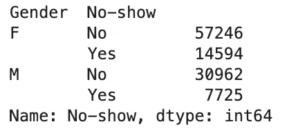

# 有价值的数据分析与熊猫价值计数

> 原文：<https://towardsdatascience.com/valuable-data-analysis-with-pandas-value-counts-d87bbdf42f79?source=collection_archive---------10----------------------->


照片由[莎伦·麦卡琴](https://unsplash.com/@sharonmccutcheon?utm_source=unsplash&utm_medium=referral&utm_content=creditCopyText)在 [Unsplash](https://unsplash.com/s/photos/counting?utm_source=unsplash&utm_medium=referral&utm_content=creditCopyText) 拍摄

## 使用这个简单的工具，你可以做比你想象的更多的数据分析

流行的 python 数据科学库 [Pandas](https://pandas.pydata.org/pandas-docs/stable/reference/api/pandas.Series.value_counts.html) 中的`**value_counts()**`函数是一种快速计算单个列中唯一值的方法，也称为一系列数据。

这个函数对于在 Pandas 数据帧中包含的特定数据列上快速执行一些基本的数据分析非常有用。关于熊猫数据帧的介绍，请看上周的帖子，可以在这里找到。

在下面的文章中，我将向你展示一些使用这个工具进行数据分析的技巧。这篇文章将向你展示如何在你的代码中添加一些东西，你就可以使用这个函数进行大量的分析。

## **数据**

在本文展示的例子中，我将使用来自 Kaggle 网站的数据集。它是为机器学习分类任务而设计的，包含有关医疗预约的信息和一个目标变量，该变量表示患者是否赴约。

可以在这里 下载 [**。**](https://www.kaggle.com/somrikbanerjee/predicting-show-up-no-show)

在下面的代码中，我已经导入了我将在整篇文章中使用的数据和库。

```
import pandas as pdimport matplotlib.pyplot as plt
%matplotlib inlinedata = pd.read_csv('KaggleV2-May-2016.csv')
data.head()
```


来自 Kaggle.com 的医疗预约失约数据集的前几行

## 基本计数

可以通过以下方式使用`value_counts()`函数来获得数据集中某一列的唯一值的计数。下面的代码给出了**性别**列中每个值的计数。

```
data['Gender'].value_counts()
```


要按升序或降序对值进行排序，我们可以使用**排序**参数。在下面的代码中，我添加了`**sort=True**`，以降序显示**年龄**列中的计数。

```
data['Age'].value_counts(sort=True)
```


## **与 groupby()结合**

value_counts 函数可以与其他 Panadas 函数结合使用，以获得更丰富的分析技术。一个例子是与`**groupby()**`函数结合。在下面的例子中，我正在计算性别列中的值，并应用`groupby()`来进一步了解每组中未出现的人数。

```
data['No-show'].groupby(data['Gender']).value_counts(sort=True)
```



## 使标准化

在上面的例子中，显示绝对值不容易使我们理解两组之间的差异。更好的解决方案是显示每个组中唯一值的相对频率。

我们可以将 **normalize** 参数添加到 value_counts()中，以这种方式显示值。

```
data['No-show'].groupby(data['Gender']).value_counts(normalize=True)
```


## 扔掉

对于有大量唯一值的列，value_counts()函数的输出并不总是特别有用。一个很好的例子是年龄列，我们在这篇文章的前面显示了它的值。

幸运的是，value_counts()有一个**bin**参数。此参数允许我们以整数形式指定箱(或我们想要将数据分成的组)的数量。在下面的例子中，我添加了`**bins=5**`来将年龄分为 5 组。我们现在有了每个箱中的值的计数。

```
data['Age'].value_counts(bins=5)
```


同样，显示绝对数字并不是特别有用，所以让我们也添加`normalize=True`参数。现在我们有了一个有用的分析。

```
data['Age'].value_counts(bins=5, normalize=True)
```


## 与 nlargest()结合使用

在我们的数据集中还有其他列有大量的唯一值，宁滨仍然不能为我们提供有用的分析。一个很好的例子就是**邻域**列。

如果我们简单地对此运行 value_counts()，我们会得到一个不是特别有见地的输出。

```
data['Neighbourhood'].value_counts(sort=True)
```


展示这一点的更好方法可能是查看排名前 10 位的社区。我们可以通过结合另一个名为`**nlargest()**`的熊猫函数来做到这一点，如下所示。

```
data['Neighbourhood'].value_counts(sort=True).nlargest(10)
```


我们还可以使用`**nsmallest()**`来显示排名最末的 10 个街区，这可能也很有用。

```
data['Neighbourhood'].value_counts(sort=True).nsmallest(10)
```


## 测绘

另一个方便的组合是 Pandas 绘图功能和 value_counts()。将我们从 value_counts()获得的分析显示为可视化的能力可以使查看趋势和模式变得容易得多。

我们可以显示以上所有的例子，以及 Pandas 库中可用的大多数绘图类型。可用选项的完整列表可在[这里](https://pandas.pydata.org/pandas-docs/version/0.23.4/generated/pandas.DataFrame.plot.html)找到。

让我们看几个例子。

我们可以使用条形图来查看排名前 10 的社区。

```
data['Neighbourhood'].value_counts(sort=True).nlargest(10).plot.bar()
```


我们可以制作一个饼图来更好地显示性别栏。

```
data['Gender'].value_counts().plot.pie()
```


value_counts()函数通常是我进行数据分析的第一个起点，因为它使我能够非常快速地绘制趋势图，并从数据集中的各个列中获得洞察力。本文已经给出了可以使用该函数的各种类型的分析的快速概述，但是该函数有更多的用途，超出了本文的范围。

感谢阅读！

我每月都会发一份简讯，如果你想加入，请点击此链接注册。期待成为您学习旅程的一部分！