# 价值函数逼近—控制方法

> 原文：<https://towardsdatascience.com/value-function-approximation-control-methods-a7a18e46ba29?source=collection_archive---------46----------------------->

## [强化学习之旅](https://towardsdatascience.com/tagged/a-journey-into-r-l)

## 未知、无模型环境中的控制算法

欢迎回到我的强化学习专栏。今天，我们将继续建立在我的[上一篇关于价值函数逼近的文章](/value-function-approximation-prediction-algorithms-98722818501b)的基础上。在上一篇文章中，我们展示了价值函数逼近中使用的政策预测方法，这一次，我们将看看控制方法。

我在[专栏](https://towardsdatascience.com/tagged/a-journey-into-r-l)的旧帖子中提到了这些帖子中使用的很多符号。此外，像往常一样，为我提供了对强化学习世界的惊人见解的资源将在帖子底部链接到。事不宜迟，让我们更深入地探讨价值函数逼近。

在这一点上，广义策略迭代对我们来说应该不是新概念。这里的变化将是使用*近似*策略评估。我们将从一些参数向量 *w* 开始，定义一些值函数。然后，我们将贪婪地进行一点探索，关于价值函数，给我们一个新的政策。然后，为了评估这个新策略，我们更新我们的价值函数的参数，不断重复这个过程，直到我们(希望)收敛到一个最优的价值函数。下图说明了这一过程。

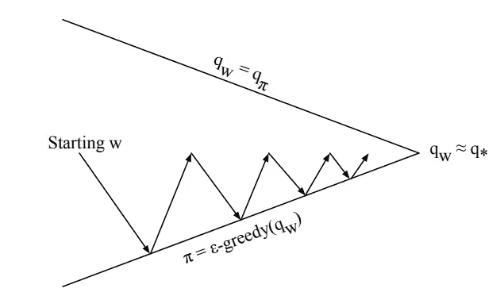

你会注意到，像以前一样，我们不需要一直走到顶线，或者换句话说，浪费时间/经验样本去尝试精确地拟合我们的函数逼近器。在我们的政策稍作调整后，我们立即行动，掌握最新的数据。

上述算法的问题是可能找不到最佳值函数，因为在现实中，我们只是越来越接近近似值函数。

现在，我们的第一步将是近似动作值函数，而不是状态值函数。

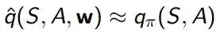

对于每一个状态和任何行为，用参数 *w* ，我们建立一个函数，预测我们期望从那个状态和行为中得到多少回报。

我们最小化近似动作值函数和真实动作值函数之间的均方误差。

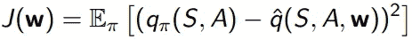

使用链式法则和随机梯度下降，我们找到一个局部最小值:

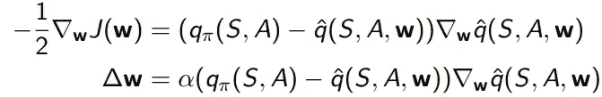

让我们考虑最简单的情况，使用*线性*动作值函数近似。我们构建一个特征向量来表示状态*和*动作:

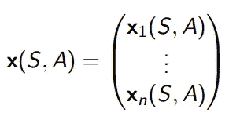

这些特征解释了整个状态-动作空间。我们通过构建特征的线性组合来做到这一点，但我们也可以使用更复杂的系统，如神经网络。

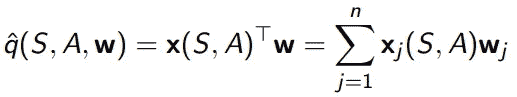

然后，梯度下降更新收缩为:

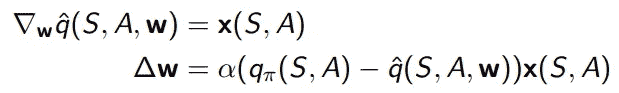

现在我们来看一个例子。下面的例子是强化学习中最广泛使用的问题之一，也是一个有趣的问题。

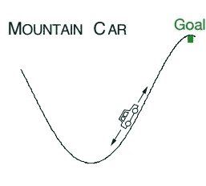

我们的想法是这辆车陷入了困境。汽车没有足够的动力直接开上山坡到达目的地，所以它必须向上开一点，松手，允许自己向后摆动通过下坡和后面的山坡，获得一些动量，并不断重复这个过程，直到它有足够的动量到达顶部。我们想要实现这个目标，即在不知道世界动力学(如重力、摩擦力等)的情况下，无模型地计算出控制策略。

首先，我们来定义这个问题的状态空间。这里的状态空间是汽车的位置，以及速度，使它成为一个二维的状态空间。

下面的伪代码显示了一个用于逼近最优值函数的分段 Sarsa TD 控制方法。

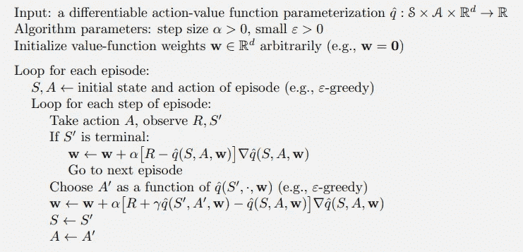

在让我们的山地汽车代理运行 100 集之后，结果显示了不可否认的学习:

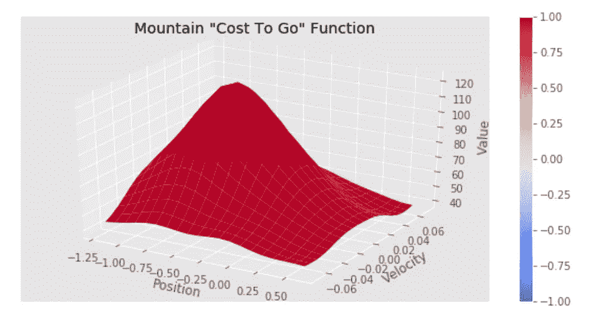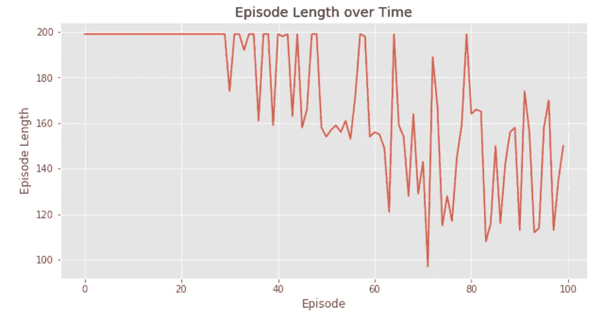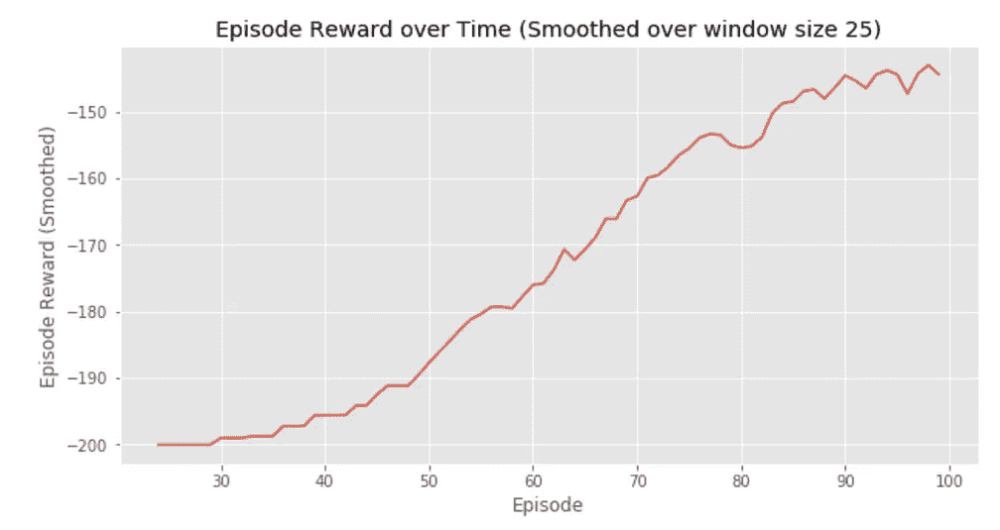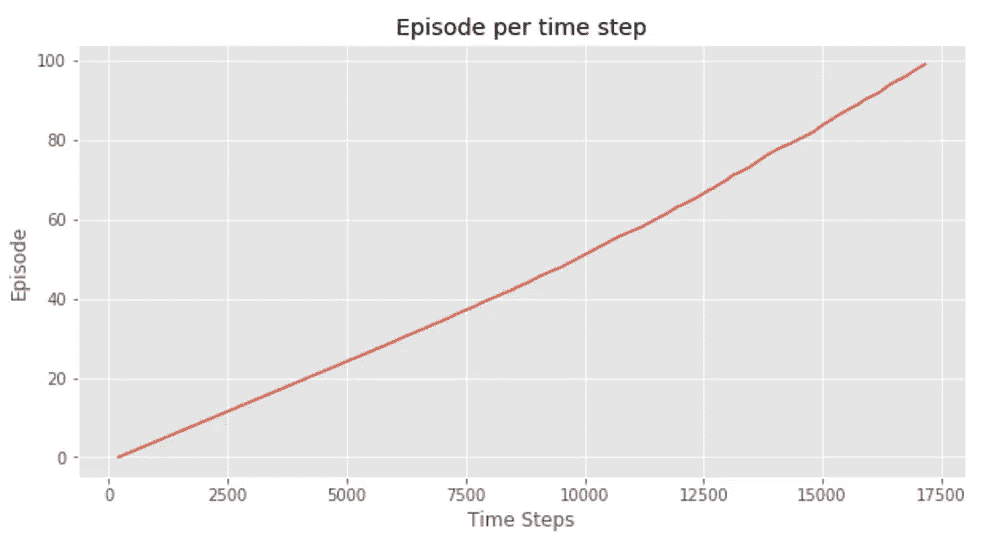

感谢你再次加入我对强化学习知识的探索。从这里开始只会变得更好，因为下一次我们将着眼于*深度 Q 学习*，使用深度神经网络作为函数逼近器，建立在这篇文章和上一篇文章的概念之上。期待再次学习！

# R 资源

[**强化学习:简介**作者*萨顿和*巴尔托](http://incompleteideas.net/book/RLbook2018.pdf)

YouTube 上大卫·西尔弗的 RL 课程

[强化学习 Github](https://github.com/dennybritz/reinforcement-learning) 由 *dennybritz*

[*OpenAI* 旗下*健身房*](https://gym.openai.com/)