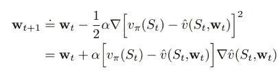

# 价值函数逼近—预测算法

> 原文：<https://towardsdatascience.com/value-function-approximation-prediction-algorithms-98722818501b?source=collection_archive---------22----------------------->

## [强化学习之旅](https://towardsdatascience.com/tagged/a-journey-into-r-l)

## 大型未知环境的学习方法

欢迎再次深入强化学习！这一次，我们将回顾价值函数近似，更具体地说，它背后的预测算法，理解它的用途，并围绕实现进行思考。在我的下一篇文章中，我将像往常一样，通过将*预测*和*控制*与一个挑战结合起来，将价值函数近似法绑在一起。然而，这篇文章将主要包括价值函数逼近和我们目前所学的一切之间的联系。

正如我们逐渐意识到的，有可能遇到非常大的问题或状态空间；甚至是无限/连续的状态空间。有时，环境就像 gridworld 一样简单，就像国际象棋等游戏的状态空间一样定义明确，但情况并非总是如此。例如，在机器人领域，遥控直升机可能会遇到无限多的情况/状态，无法对每一种情况/状态的实际值进行分类(以前从未见过类似的情况)。

我在[专栏](https://towardsdatascience.com/tagged/a-journey-into-r-l)的前几篇文章中提到了这篇文章中使用的很多符号。我会在文章底部贴上非常有用的资源，帮助我理解这些概念。我们来看看什么是价值函数逼近。

回顾过去，我们会注意到，我们一直在通过非常具体地表示价值函数，利用*查找表*来解决马尔可夫决策过程(MDP)。每个状态 *s* 都有一个条目 *V(s)* ，每个状态-动作对 *s，a* 都有一个条目 *Q(s，a)* 。实际上，我们能够查看我们的表，并通过最大化所有可能的行动来决定下一步做什么。

在大型 MDP 事件中使用这种策略会暴露出两个问题，第一个问题是最终我们会耗尽内存。在某些时候，将会有太多的状态和/或动作需要存储。第二个问题很简单，即使我们有足够的内存，单独估计每个值的过程也太慢了。价值函数逼近是解决这一问题的方法。

价值函数逼近试图通过创建使用较少参数的价值函数的紧凑表示来构建一些函数以估计真实的价值函数:

一种常见的做法是使用深度学习——在这种情况下，神经网络的权重是权重向量*，它将用于估计整个状态/状态-动作空间的价值函数。这个权重向量将使用我们之前见过的方法更新，*蒙特卡罗*或*时间差*学习。*

*我们将从查看如何利用价值函数近似中的*随机梯度下降*来调整每个示例后的权重向量开始。目标是找到使近似值函数和真实值函数之间的均方误差最小化的参数向量 **w** 。梯度下降通过找到局部最小值来做到这一点:*

**

*为了更好地理解这个概念，让我们来理解什么是*特征向量*。每个特征都告诉我们关于状态空间的任何事情。它允许我们严格定义我们用什么来代表环境/我们与环境的互动。通过将特征的线性组合编辑在一起，我们用加权和表示价值函数。从数学上讲，我们的特征向量和我们的权重向量的点积将是我们对价值函数的估计。*

**

*我们的目标函数，我们希望优化的均方误差函数，在参数 **w** 中变成二次函数。*

**

*使用以下更新规则，随机梯度下降收敛于*全局*最优:*

**

*我们权重的变化来自于一小步，取决于步长参数，根据特定情况调整*相关的*功能。*

*现在，为了使这与强化学习相关，我们必须利用我们的学习方法。显然，最初并不知道真正的价值函数。因此，我们在一个*目标中代入*。在蒙特卡罗学习中，目标是收益 *Gₙ**

**

*在 TD(0)中，目标是 TD 目标:*

**

*更新看起来像这样:*

**

*作为即将到来的高峰，下图应该看起来很熟悉！我们将基于*广义策略迭代* (GPI)的思想，利用价值函数逼近进行控制。*

**

*类似于上面的状态值函数近似，我们可以用随机梯度下降来近似动作值函数。*

**

*在下一篇文章中，我们将能够将这些预测信息与必要的控制方法结合起来，以便能够使用价值函数近似法实际解决问题。感谢阅读！*

# *资源*

*[**强化学习:萨顿*和巴尔托***](http://incompleteideas.net/book/RLbook2018.pdf) 介绍*

*YouTube 上大卫·西尔弗的 RL 课程*

*[强化学习 Github](https://github.com/dennybritz/reinforcement-learning) by *dennybritz**