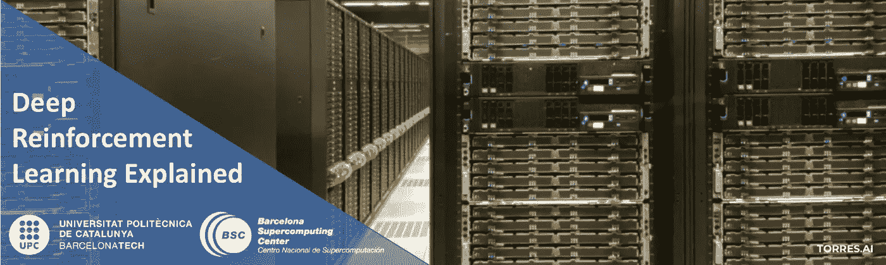
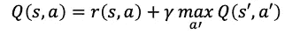
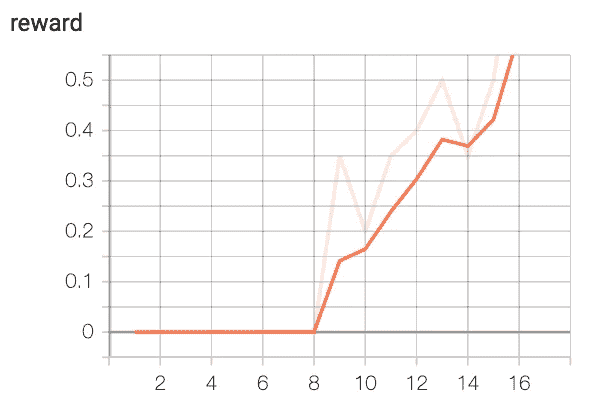

# Q-函数的值迭代

> 原文：<https://towardsdatascience.com/value-iteration-for-q-function-ac9e508d85bd?source=collection_archive---------47----------------------->

## [深度强化学习讲解— 11](https://towardsdatascience.com/tagged/deep-r-l-explained)

## Q 函数的冻结湖码



在[的上一篇文章](/value-iteration-for-v-function-d7bcccc1ec24)中，我们介绍了如何通过求解冰湖环境来实现计算状态值 V-function 的值迭代法。在本帖中，我们将回顾 Q 函数，并展示学习动作值以创建策略的值迭代方法。

正如我们将在本文后面看到的，Q 值在实践中更方便，对于代理来说，基于 Q 值做出行动决策比基于 V 值更简单。

> [本出版物西班牙文版](https://medium.com/aprendizaje-por-refuerzo/4-programaci%C3%B3n-din%C3%A1mica-924c5abf3bfc)

[](https://medium.com/aprendizaje-por-refuerzo/4-programaci%C3%B3n-din%C3%A1mica-924c5abf3bfc) [## 4.数字电视节目

### 请访问第 4 页的自由介绍

medium.com](https://medium.com/aprendizaje-por-refuerzo/4-programaci%C3%B3n-din%C3%A1mica-924c5abf3bfc) 

# Q 函数的值迭代

值迭代法可用于学习 V 值或 Q 函数。也就是说，将状态值或动作值存储在一个表中。在这里，我们将介绍如何使用值迭代方法来计算 Q 值，而不是上一篇文章中介绍的 V 值。

基于 V-function 的先前值迭代方法实现，在动作值的情况下，只需要对先前的代码进行微小的修改。最明显的变化是我们的价值表。在前一个例子中，我们保存了状态的值，所以字典中的键只是一个状态。现在我们需要存储 Q 函数的值，它有两个参数:state 和 action，所以值表中的键现在是一个复合键。

关于更新，在[关于贝尔曼方程的帖子](/the-bellman-equation-59258a0d3fa7)中，我们表明我们行动状态的最优值可以定义为:



接下来，我们将使用 Q 函数来求解冰湖环境。

# Q 函数的值迭代在实践中的应用

> 这篇文章的全部代码可以在 GitHub 上找到，而[可以通过这个链接](https://colab.research.google.com/github/jorditorresBCN/Deep-Reinforcement-Learning-Explained/blob/master/DRL_11_VI_Algorithm_for_Q.ipynb)作为一个谷歌笔记本来运行。

然后，我们将在用 Q-函数构成值迭代方法的代码中展示与 V-函数版本的主要区别。

保存我们的表和函数的中心数据，我们将在训练循环中使用，与前面的 V-function 示例相同。主要的变化是对`values`表的修改，这个字典现在将一个状态-动作对映射到这个动作的计算值。

在前一个例子中，我们保存了状态的值，所以字典中的键只是一个状态。现在我们需要存储 Q 函数的值，它有两个参数:state 和 action，所以值表中的键现在是一个复合键。这意味着另一个区别在于`calc_action_value`函数。我们只是不再需要它，因为我们的动作值存储在值表中。

最后，代码中最重要的变化是代理的`value_iteration()`方法。以前，它只是一个围绕`calc_action_value()`调用的包装器，完成贝尔曼近似的工作。现在，由于这个函数已经消失并被一个值表所取代，我们需要在`value_iteration()`方法中做这个近似。

# Q 函数的冻结湖码

让我们看看代码。由于与之前的实现几乎相同，我将直接跳到主要区别，读者可以在 [GitHub 代码](https://github.com/jorditorresBCN/Deep-Reinforcement-Learning-Explained/blob/master/DRL_11_VI_Algorithm_for_Q.ipynb)中了解细节。先说主要功能`value_iteration()`:

```
def value_iteration_for_Q(self):
    for state in range(self.env.observation_space.n):
        for action in range(self.env.action_space.n):
            action_value = 0.0
            target_counts = self.transits[(state, action)]
            total = sum(target_counts.values())
            for tgt_state, count in target_counts.items():
                key = (state, action, tgt_state)
                reward = self.rewards[key]
                best_action = self.select_action(tgt_state)
                val = reward + GAMMA * \
                      self.values[(tgt_state, best_action)]
                action_value += (count / total) * val
           self.values[(state, action)] = action_value
```

读者会注意到，该代码相当于前面实现中的`calc_action_value`代码。其思想是，对于给定的状态和动作，它需要使用我们通过函数`play_n_random_steps`收集的信息来计算动作值，该函数从环境中随机播放`N`步骤，用随机经验填充`reward`和`transits`表。

然而，在前面的实现中，我们将 V 函数存储在值表中，所以我们只是从该表中取出它。我们不能再这样做了，所以我们必须调用`select_action`方法，它将为我们选择 Q 值最大的最佳动作，然后我们将这个 Q 值作为目标状态的值。

事实上，这个方法的实现是不同的，因为它不再调用`calc_action_valu`方法，而是我们只是迭代动作，并在我们的值表中查找它们的值。

```
def select_action(self, state):
    best_action, best_value = None, None
    for action in range(self.env.action_space.n):
        action_value = self.values[(state, action)]
        if best_value is None or best_value < action_value:
           best_value = action_value
           best_action = action
    return best_action
```

正如你所注意到的，学习循环的代码和前一篇文章中的一样。以及测试客户端并在 TensorBoard 中绘制结果的代码:



最后，读者可以像以前一样，用 FrozenLake8x8 环境进行测试，或者测试其他超参数。

> **鸣谢:这篇文章中的代码灵感来自于马克西姆·拉潘的代码** [**，他写了一本关于**](https://github.com/PacktPublishing/Deep-Reinforcement-Learning-Hands-On-Second-Edition/tree/master/Chapter04) **主题的优秀实用书籍。**

# 结论

在实践中，Q 值要方便得多，对于代理来说，基于 Q 值做出关于动作的决策要比基于 V 值简单得多。在 Q 值的情况下，为了基于状态选择动作，代理只需要使用当前状态计算所有可用动作的 Q 值，并选择具有最大 Q 值的动作。

为了使用状态的值来做同样的事情， **V 值，**代理**不仅需要知道值，还需要知道转移的概率。**在实践中，我们很少预先知道它们，所以代理需要估计每个动作和状态对的转移概率。

在 V-函数的值迭代方法中，这种对概率的依赖给代理增加了额外的负担。也就是说，了解这种方法很重要，因为它们是高级方法的重要组成部分。

[下期见！](/reviewing-essential-concepts-from-part-1-e28234ee7f4f)

# 深度强化学习讲解系列

**由** [**UPC 巴塞罗那理工**](https://www.upc.edu/en) **和** [**巴塞罗那超级计算中心**](https://www.bsc.es/)

一个轻松的介绍性[系列](https://torres.ai/deep-reinforcement-learning-explained-series/)以一种实用的方式逐渐向读者介绍这项令人兴奋的技术，它是人工智能领域最新突破性进展的真正推动者。

[](https://torres.ai/deep-reinforcement-learning-explained-series/) [## 深度强化学习解释-乔迪托雷斯。人工智能

### 本系列的内容](https://torres.ai/deep-reinforcement-learning-explained-series/) 

# 关于这个系列

我在五月份开始写这个系列，那是在巴塞罗那的禁闭期。老实说，由于封锁，在业余时间写这些帖子帮助我到了[**#寄宿家庭**](https://twitter.com/hashtag/StayAtHome?src=hashtag_click) 。感谢您当年阅读这份刊物；这证明了我所做的努力。

**免责声明** —这些帖子是在巴塞罗纳封锁期间写的，目的是分散个人注意力和传播科学知识，以防对某人有所帮助，但不是为了成为 DRL 地区的学术参考文献。如果读者需要更严谨的文档，本系列的最后一篇文章提供了大量的学术资源和书籍供读者参考。作者意识到这一系列的帖子可能包含一些错误，如果目的是一个学术文件，则需要对英文文本进行修订以改进它。但是，尽管作者想提高内容的数量和质量，他的职业承诺并没有留给他这样做的自由时间。然而，作者同意提炼所有那些读者可以尽快报告的错误。