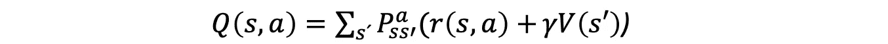
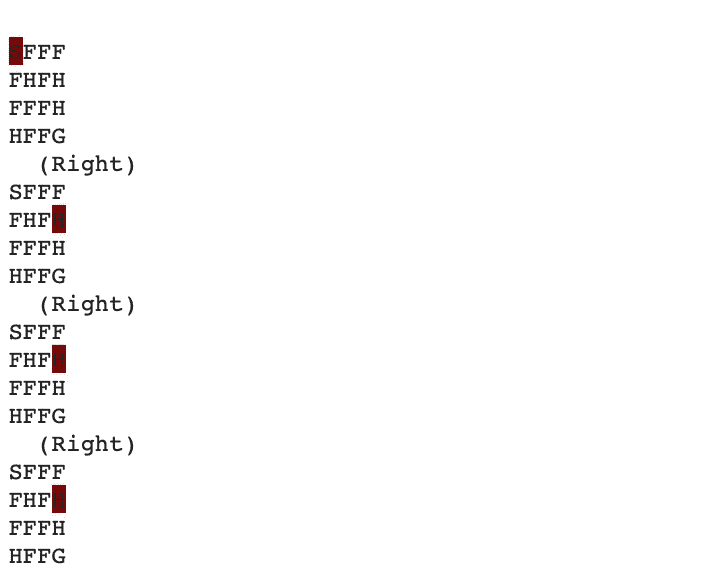
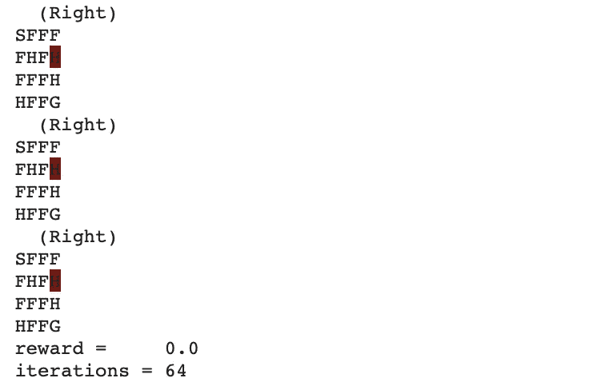
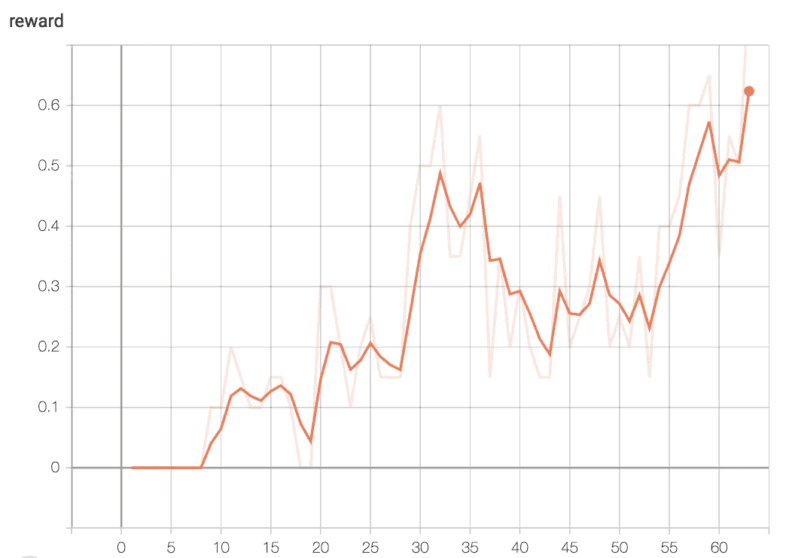
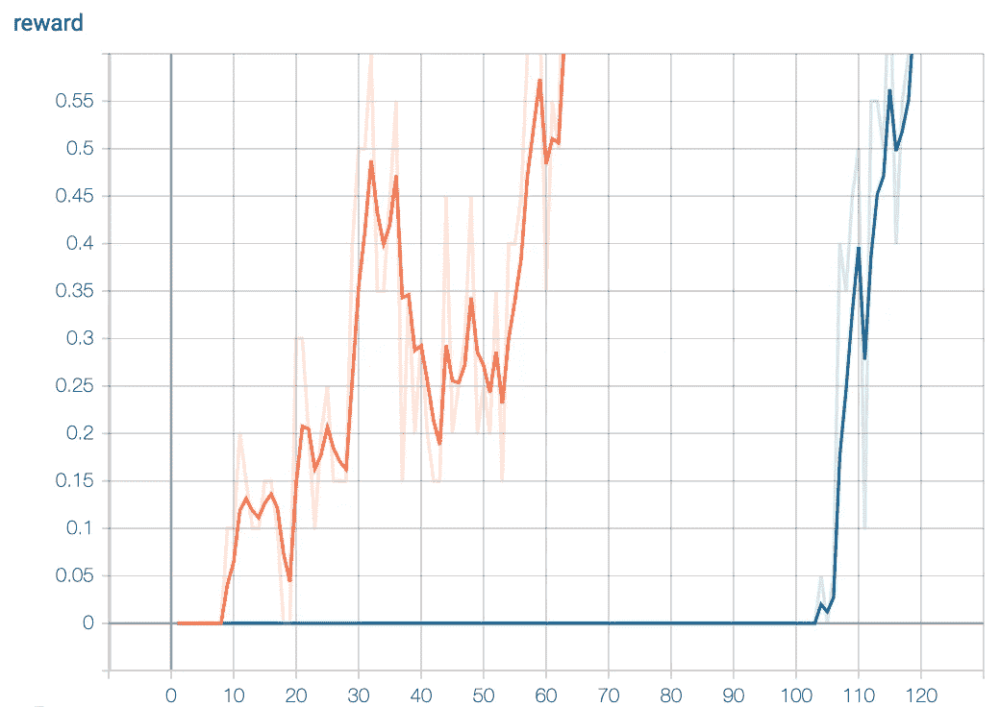

# V 函数的值迭代

> 原文：<https://towardsdatascience.com/value-iteration-for-v-function-d7bcccc1ec24?source=collection_archive---------33----------------------->

## [深度强化学习讲解—10](https://towardsdatascience.com/tagged/deep-r-l-explained)

## v 函数在冰湖环境中的应用


在[之前的帖子](/the-value-iteration-algorithm-4714f113f7c5)中，我们提出了**值迭代**方法来计算基于价值的代理所需的 V 值和 Q 值。在本文中，我们将介绍如何通过求解冰湖环境来实现计算状态值的值迭代法。

> [本出版物的西班牙语版本](https://medium.com/aprendizaje-por-refuerzo/4-programaci%C3%B3n-din%C3%A1mica-924c5abf3bfc)

[](https://medium.com/aprendizaje-por-refuerzo/4-programaci%C3%B3n-din%C3%A1mica-924c5abf3bfc) [## 4.数字电视节目

### 请访问第 4 页的自由介绍

medium.com](https://medium.com/aprendizaje-por-refuerzo/4-programaci%C3%B3n-din%C3%A1mica-924c5abf3bfc) 

# V 函数的值迭代在实践中的应用

> 这篇文章的[完整代码可以在 GitHub](https://github.com/jorditorresBCN/Deep-Reinforcement-Learning-Explained/blob/master/DRL_10_VI_Algorithm_for_V.ipynb) 上找到，并且[可以使用这个链接](https://colab.research.google.com/github/jorditorresBCN/Deep-Reinforcement-Learning-Explained/blob/master/DRL_10_VI_Algorithm_for_V.ipynb)作为一个 Colab google 笔记本运行。

接下来，我们将详细介绍组成我们在上一篇文章中介绍的值迭代方法的代码。所以让我们来看看代码。开始时，我们导入使用的库并定义主要的常量:

```
import gym
import collections
from torch.utils.tensorboard import SummaryWriterENV_NAME="FrozenLake-v0"GAMMA = 0.9
TEST_EPISODES = 20
N =100
REWARD_GOAL = 0.8
```

## 代理的数据结构

保存代理信息的主要数据结构有:

*   `rewards`:组合键为“源状态”+“动作”+“目标状态”的字典。价值是从眼前的奖励中获得的。
*   `transits`:一个表作为字典，保存所经历的转变的计数器。关键是复合“state”+“action”，值是另一个字典，它将目标状态映射到我们看到它的次数。
*   `values`:将一个状态映射到这个状态的计算值(V 值)的字典。
*   `state`:代理的当前状态。

主数据结构是在代理的类构造函数中创建的。

## 训练算法

我们训练算法的整体逻辑很简单。在未达到预期奖励目标之前，我们将执行以下步骤:

1.  从环境中随机选择 N 步来填充`reward`和`transits`表格。
2.  在这 N 个步骤之后，它对所有状态执行一个值迭代步骤，更新`value`表。
3.  然后，我们播放几集完整的剧集，使用更新后的值表来检查改进。
4.  如果这些测试的平均回报高于期望的界限，那么我们就停止训练。

在我们深入了解该代码的更多细节之前，先回顾一下代理的代码会有所帮助。

## 代理类

在`Agent`类构造函数中，我们创建了一个将用于数据样本的环境，获得了我们的第一个观察值，并定义了奖励、转换和值的表:

```
class Agent: 
      def __init__(self):
          self.env = gym.make(ENV_NAME) 
          self.state = self.env.reset()
          self.rewards = collections.defaultdict(float)
          self.transits = collections.defaultdict(
                        collections.Counter)
          self.values = collections.defaultdict(float)
```

## 玩随机步骤

请记住，在上一篇文章中，我们提出了转换和奖励的估计将通过代理与环境的交互历史来获得。

这是通过方法`play_n_random_steps`完成的，它从环境中随机播放`N`步骤，用随机体验填充`reward`和`transits`表格。

```
def play_n_random_steps(self, count):
    for _ in range(count):
        action = self.env.action_space.sample()
        new_state, reward, is_done, _ = self.env.step(action)
        self.rewards[(self.state, action, new_state)] = reward
        self.transits[(self.state, action)][new_state] += 1
        if is_done:
           self.state = self.env.reset()
        else:
           self.state = new_state
```

注意，我们不需要等到一集结束才开始学习；我们只是执行`N`步骤并记住它们的结果。这是之前一个帖子展示的值迭代和交叉熵方法的区别之一，需要全集学习。

## 行动的价值

下一个方法使用代理的`transits`、`reward`和`value`表计算 Q 函数，即来自一个状态的动作值。我们将把它用于两个目的:从状态中选择要执行的最佳动作，并根据值迭代算法计算状态的新值。

```
def calc_action_value(self, state, action):
    target_counts = self.transits[(state, action)]
    total = sum(target_counts.values())

    action_value = 0.0
    for tgt_state, count in target_counts.items():
        reward = self.rewards[(state, action, tgt_state)]
        val = reward + GAMMA * self.values[tgt_state]
        action_value += (count / total) * val
    return action_value
```

首先，从`transits`表中，我们提取方法作为参数接收的给定状态和动作的转换计数器。我们对所有的计数器求和，以获得我们从状态执行动作的总次数。然后，我们迭代我们的动作已经到达的每个目标状态，并使用贝尔曼方程文章中的公式计算它对总动作值的贡献:



该值等于即时奖励加上目标状态的贴现值，并将该总和乘以该转换的概率(单个计数器除以之前计算的总值)。我们将每次迭代的结果添加到一个变量`action_value`，这个变量将被返回。

## 选择最佳操作

为了从给定的状态中选择最佳的动作，我们有方法`select_action`，它使用前面的`calc_action_value`方法来做出决定:

```
def select_action(self, state):
    best_action, best_value = None, None
    for action in range(self.env.action_space.n):
        action_value = self.calc_action_value(state, action)
        if best_value is None or best_value < action_value:
           best_value = action_value
           best_action = action
    return best_action
```

该方法的代码迭代环境中所有可能的动作，计算每个动作的值，并返回具有最大 Q 值的动作。

## 值迭代函数

这里我们有一个主要功能，正如我们在上一篇文章中所描述的，值迭代方法所做的只是在环境中的所有状态上循环:

```
def value_iteration(self):
    for state in range(self.env.observation_space.n):
        state_values = [
              self.calc_action_value(state, action)
              for action in range(self.env.action_space.n)
        ]
   self.values[state] = max(state_values)
```

对于每个状态，我们用该状态可用的动作的最大值来更新它的值。

## 训练循环和监控代码

在介绍了代理的类及其方法之后，我们回来描述主循环。首先，我们创建将用于测试的环境，创建代理类的实例，TensorBoard 的摘要编写器，以及我们将使用的一些变量:

```
test_env = gym.make(ENV)
agent = Agent()
writer = SummaryWriter()iter_no = 0
best_reward = 0.0
```

记住值迭代法形式上需要无限次迭代才能精确收敛以获得最优值函数。实际上，在上一篇文章中，我们展示了一旦值函数在训练循环的迭代中仅发生少量变化，我们就可以停止。

在这个例子中，为了保持代码简单和迭代次数少，我们决定在达到某个奖励阈值时停止。但是其余的代码都是一样的。

我们代码的整体逻辑是一个简单的循环，它将迭代直到代理达到预期的性能(如果这些测试集的平均回报高于`REWARD_GOAL`界限，那么我们停止训练):

```
while best_reward < REWARD_GOAL:
        agent.play_n_random_steps(N)
        agent.value_iteration()

        ...
```

循环体由前面介绍的步骤组成:

步骤 1:播放调用方法`plays_n_random_steps.`的 N 个随机步骤

第 2 步:调用`value_iteration.`方法，对所有状态进行值迭代扫描

第三步:然后我们播放几集完整的剧集，使用更新后的值表来检查改进。为此，代码使用`agent.elect_action()`来寻找在新的`test_env`环境中采取的最佳行动(我们不想弄乱用于收集随机数据的主环境的当前状态)，以检查代理的改进:

```
iter_no += 1
reward_avg = 0.0
for _ in range(TEST_EPISODES):
    total_reward = 0.0
    state = test_env.reset()
    while True:
        action = Select_action(state)
        new_state, new_reward, is_done, _ = test_env.step(action)
        total_reward += new_reward
        if is_done: break
        state = new_state
    reward_test += total_reward
reward_test /= TEST_EPISODES
```

此外，代码将数据写入 TensorBoard，以便跟踪最佳平均奖励:

```
writer.add_scalar("reward", reward_test, iter_no)
if reward_test > best_reward:
    print("Best reward updated %.2f at iteration %d " % 
         (reward_test ,iter_no) )
    best_reward = reward_test
```

仅此而已！

## 运行程序

好，让我们运行我们的程序:

```
Best reward updated 0.40 in iteration 13 
Best reward updated 0.65 in iteration 20 
Best reward updated 0.80 in iteration 23 
Best reward updated 0.85 in iteration 28 
Best reward updated 0.90 in iteration 76
```

# 测试客户端

现在，如果我们尝试使用与交叉熵相同的客户端测试代码，我们可以看到我们构建的代理可以从一个不稳定的环境中学习:

```
new_test_env = gym.make(‘FrozenLake-v0’, is_slippery=True)
state = new_test_env.reset()
new_test_env.render()
is_done = False
iter_no = 0
while not is_done:
    action = Select_action(state)
    new_state, reward, is_done, _ = new_test_env.step(action)
    new_test_env.render()
    state = new_state
    iter_no +=1
print(“reward = “, reward)
print(“iterations =”, iter_no)
```



# . . .



# 结论

请注意，提出的算法是随机的，对于不同的执行，它采用不同的迭代次数来获得解决方案。然而，它可以从光滑的环境中学习，而不是前面提到的交叉熵。我们可以使用 Tensorboard 绘制它们，它会显示如下图所示的图形:



我们可以注意到，在所有情况下，最多需要几秒钟就可以找到一个在 80%的运行中解决环境问题的好策略。如果你还记得交叉熵方法，对于一个湿滑的环境，花了许多小时才达到只有 60%的成功率。

而且，我们可以把这个算法应用到更大版本的 FrozenLake 上，这个版本的名字是 FrozenLake8x8-v0。更大版本的 FrozenLake 可能需要更多的迭代来求解，根据 TensorBoard 图表，大多数时间它会等待第一个成功的情节(它需要至少有一个成功的情节来开始从有用值表学习)，然后它会很快达到收敛。下图比较了在 FrozenLake-4x4 和 8x8 版本上训练期间的奖励动态:



除了在`ENV_NAME`(“frozen lake-v 0”vs“frozen lake 8 x8-v 0”)中改变环境外，读者还可以使用不同的超参数值进行测试，如`GAMMA, TEST_EPISODE, REWARD_GOAL` 或`N`。你为什么不试试呢？

# 下一步是什么？

在下一篇文章中，我们将展示学习动作值的值迭代方法代码，而不是像我们在这里所做的那样学习状态值。下一个帖子见[！](/value-iteration-for-q-function-ac9e508d85bd)

> 这篇文章的[全部代码可以在 GitHub](https://github.com/jorditorresBCN/Deep-Reinforcement-Learning-Explained/blob/master/DRL_10_VI_Algorithm_for_V.ipynb) 上找到，并且[可以通过这个链接](https://colab.research.google.com/github/jorditorresBCN/Deep-Reinforcement-Learning-Explained/blob/master/DRL_10_VI_Algorithm_for_V.ipynb)作为 Colab google 笔记本运行。
> 
> **鸣谢:这篇文章中的代码灵感来自于 Maxim Lapan 的代码，他写了一本关于这个主题的优秀实用书籍** **。**

# 深度强化学习讲解系列

**由** [**UPC 巴塞罗那理工大学**](https://www.upc.edu/en) **和** [**巴塞罗那超级计算中心**](https://www.bsc.es/)

一个轻松的介绍性[系列](https://torres.ai/deep-reinforcement-learning-explained-series/)逐渐并以实用的方法向读者介绍这一令人兴奋的技术，这是人工智能领域最新突破性进展的真正推动者。

[](https://torres.ai/deep-reinforcement-learning-explained-series/) [## 深度强化学习解释-乔迪托雷斯。人工智能

### 本系列的内容](https://torres.ai/deep-reinforcement-learning-explained-series/) 

# 关于这个系列

我是在五月份开始写这个系列的，那是在巴塞罗纳的**封锁期。**老实说，由于封锁，在业余时间写这些帖子帮助了我 [**#StayAtHome**](https://twitter.com/hashtag/StayAtHome?src=hashtag_click) 。感谢您当年阅读这份刊物；这证明了我所做的努力。

**免责声明** —这些帖子是在巴塞罗纳封锁期间写的，目的是分散个人注意力和传播科学知识，以防对某人有所帮助，但无意成为 DRL 地区的学术参考文献。如果读者需要更严谨的文档，本系列的最后一篇文章提供了大量的学术资源和书籍供读者参考。作者意识到这一系列的帖子可能包含一些错误，如果目的是一个学术文件，则需要对英文文本进行修订以改进它。但是，尽管作者想提高内容的数量和质量，他的职业承诺并没有留给他这样做的自由时间。然而，作者同意提炼所有那些读者可以尽快报告的错误。