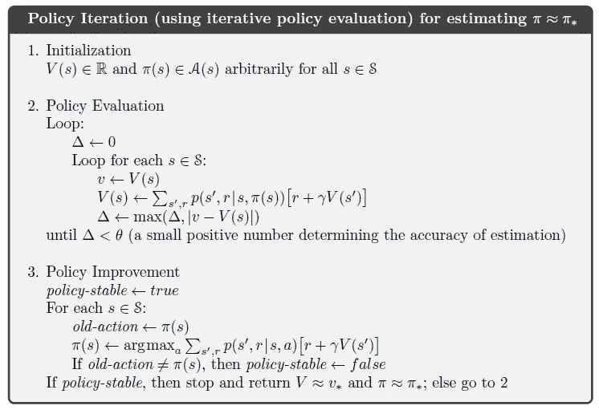

# 价值迭代求解 OpenAI 健身房的 FrozenLake

> 原文：<https://towardsdatascience.com/value-iteration-to-solve-openai-gyms-frozenlake-6c5e7bf0a64d?source=collection_archive---------10----------------------->

## 素君的承担…

## 从零开始理解和实现价值迭代…

在我的叙述下，我们将制定 ***值迭代*** 并实现它来解决 ***FrozenLake8x8-v0*** 环境来自 ***OpenAI 的健身房。***

这个故事有助于***强化学习的初学者*** 理解 ***值迭代*** 从零开始实现，并了解 ***OpenAI Gym 的*** 环境。

> **简介:FrozenLake8x8-v0 环境下，**是一个**离散有限 MDP。**

我们将计算出 ***最优策略*** 对于一个*(最佳可能 ***行动****给定 ***状态*** )在给定 ***环境下达到目标，*** 因此得到最大的 ***预期报酬*****

****

****哑代理使用随机策略****

> **代理控制一个角色在**【8x8】**网格世界中的移动。格子的有些瓷砖是可走的**【F】**，有些导致代理人落水**【H】**。此外，智能体的运动方向是不确定的**(未知策略)**，并且仅部分取决于所选择的方向**(环境动力学)**。代理人每走 **(0)** 步找到一条通往目标方块的可行走路径，将获得 **(1)** 奖励。**

****

**冰冻湖-v0**

*****action _ space:***离散(4)，agent 可以采取 4 个离散动作:左(0)，下(1)，上(2)，右(3)。**

*****状态 _ 空间:*** 离散(64)，离散 64 个网格单元。**

*****转移概率*** :由于环境的不确定性，以转移概率为例，给定 ***状态(0)动作(1)*** 将…**

****

*****环境的属性*** : ' **env.env.nA** '，' **env.env.nS** '给出了可能的动作和状态的总数。**

****P[s|a] = P[s']，s '，r，done****

**到达后继状态的概率(s ')及其回报(r)。**

**更多环境详情， [**FrozenLake8x8-v0**](https://github.com/openai/gym/blob/master/gym/envs/toy_text/frozen_lake.py) 。**

# **让我们来理解策略迭代:**

*****预测和控制*****

> ****策略评估:对于给定的策略(π)，确定状态值函数 Vπ(s)。****

**对于给定的策略 **(π)** ，初始近似值 **v0** 被任意选择，对于最终状态为‘0’，值函数的逐次近似值使用贝尔曼方程作为更新规则。**

****

****贝尔曼期望方程**作为更新规则**

**其中，**策略:** **π(a|s)** 是策略 **(π)** 下状态 **(s)** 下采取行动 **(a)** 的概率。**环境** **跃迁动力学:** **P(s '，r|s，a)** 是到达后继状态 **(s')** 并从状态 **(s)** 采取行动 **(a)** ，**γ**是一个折扣因子。**

****

**花一点时间来理解**迭代策略评估**的**伪代码****

**我们迭代更新规则，直到迭代**中的**值估计**变化变得可以忽略**。**

> ****策略控制:改进现有策略(π)****

**在我们的例子中，我们贪婪地对待期望值函数，这给了我们确定性的策略。从状态 **(s)** 中采取具有最高值的动作 **(a)** ，简单。**

****

****argmax()** 函数返回**动作**，该动作可以将我们带到**更高的值状态**。**

****

****arg max()的实现****

# **策略迭代:**

****

**策略评估和策略改进将针对每个状态迭代执行，以改进策略和值函数。**

****

**快速浏览一下**策略迭代**的**伪代码****

****哥们……****

**谁使用这种多步多扫的同步 DPs，让我们用“ ***【贝尔曼最优性方程】*** 把这两步结合起来，称之为 ***【值迭代】*** ，并说它属于 ***【广义策略迭代】*** 。**

****酷……****

# **价值迭代:**

**所以忘了一切，来个 ***值迭代*** (不，我只是开玩笑……别忘了什么)。**

**在价值迭代中，我们不运行策略评估直到完成。我们只对所有状态进行一次扫描，并贪婪地使用当前值函数。**

****

****实现**贝尔曼最优方程**的****

**当估计值的变化变得可以忽略不计时(<theta the="" given="" policy="" will="" strictly="" converge="" into="" optimal="" class="lc ja">伙计，我没这么说，贝尔曼说了。</theta>**

****

****贝尔曼最优性方程**作为更新规则**

****

****实现**值函数**的****

**因此， ***更新规则*** 不是指任何特定的策略 ***而是最大化当前值估计*** 的动作。**

**唯一等待的事情就是 *C* ***所有的价值函数*** 和评估 ***应用策略*** *:***

****

## **解决方案:**

**从策略中，我们从给定的状态中提取价值和要采取的行动。**

****

****确定性策略****

**我们将策略应用到环境中，并运行 100 集:**

****

****执行**政策**到 **FrozenLake8x8-v0******

## **结论:**

**我们看到了价值迭代的公式，并提取了达到目标的最优策略，并在 OpenAI 的 FrozenLake 环境上实现了相同的结果。**

****

****代理使用最优策略**并在**的 8 个步骤**中达到目标……但受到**环境动态**的影响**

## **带走:**

**即使我们得到了一个 ***严格收敛的最优策略*** ，给定了 ***环境动力学*** ，智能体总是达不到目标。**

**从下一篇文章开始，我们将使用能够更好地制定最优策略的算法。请继续收听更多…**

**获取[算法](https://github.com/SaiSugunSegu/Reinforcement-Learning-Journey)的完整代码。**

**参考资料:**

**[1] [强化学习:导论|第二版，作者理查德·萨顿&安德鲁·g·巴尔托](https://www.amazon.com/Reinforcement-Learning-Introduction-Adaptive-Computation/dp/0262039249/ref=pd_sbs_14_t_0/147-7865363-3852556?_encoding=UTF8&pd_rd_i=0262039249&pd_rd_r=96f1b22e-1339-4f4f-93ff-26c787125b93&pd_rd_w=vDJJ6&pd_rd_wg=y1LXN&pf_rd_p=5cfcfe89-300f-47d2-b1ad-a4e27203a02a&pf_rd_r=ACR43W905JY9PYNWDRRS&psc=1&refRID=ACR43W905JY9PYNWDRRS)。**

**[2] [大卫·西尔弗的 RL 课程:DeepMind](https://www.youtube.com/watch?v=2pWv7GOvuf0) 。**

**[3] [开艾健身房](https://gym.openai.com/)。**

**来源:**

**[4] [强化学习专业:阿尔伯塔大学](https://www.coursera.org/specializations/reinforcement-learning)。**

**[5] [深度强化学习:加州大学伯克利分校](http://rail.eecs.berkeley.edu/deeprlcourse/)**