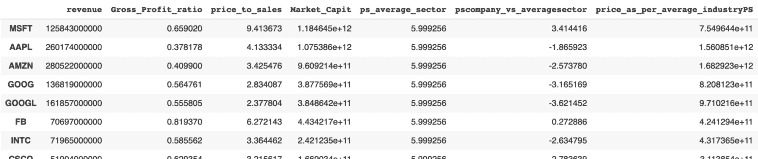

# 用 Python 评估一家公司

> 原文：<https://towardsdatascience.com/valuing-a-company-with-python-1ddab3e33502?source=collection_archive---------36----------------------->

## 使用价格销售比

销售价格是分析师用来比较类似股票价值的常用工具。在这篇文章中，我们将使用销售价格比来评估数百家科技行业的公司。这个 Python 脚本将让我们找到按照这个比例最便宜的公司。


照片由 [**凯雀罗查**发自](https://www.pexels.com/@kaiquestr?utm_content=attributionCopyText&utm_medium=referral&utm_source=pexels)[Pexels](https://www.pexels.com/photo/architecture-blur-building-escalator-125532/?utm_content=attributionCopyText&utm_medium=referral&utm_source=pexels)

# 价格与销售额的比率是多少？

**销售价格的计算方法是将公司的** [**市值除以年收入。**](https://www.investopedia.com/articles/fundamental/03/032603.asp) 它告诉我们需要多少年的收入才能覆盖一家公司目前的市值。

与市盈率不同([点击此处了解如何用 Python](https://codingandfun.com/price-earning-with-python/) 计算 PE 比率)，我们可以对没有任何收益的公司使用市盈率。由于这个原因，价格销售比对于那些在成长时期可能没有利润的成长型公司非常有用。

价格销售比本身并不能说明什么。因此，重要的是计算类似公司的行业平均价格销售比，以用作参考。

销售本身可能不足以做出投资决策。除了价格销售比之外，我们还将计算每家公司的毛利率，并结合价格销售比来使用。毛利率告诉我们一家公司在销售成本上赚了多少利润。一个拥有更大毛利率的公司，可以分配更多的资源到研发上来进一步发展公司。或者，它也可以向股东分配更多收益。

毛利率=(销售额—销货成本)/销售额

# 用 Python 计算销售价格

理论够了。让我们计算一下科技行业的一些公司的价格销售比和毛利率。我们将把我们的财务分析局限于市值超过 100 亿美元的公司。

对于我们的财务分析，我们将使用一个很棒的财务 API [fmpcloud](https://fmpcloud.io/) 。通过在他们那里开一个账户，你每天可以得到一些免费的 API 调用。让我们构建我们的脚本来逐步计算价格与销售额的比率:

首先，**我们得到所有的科技公司**，并把它们添加到 Python 列表中。我们使用下面的[API](https://fmpcloud.io/api/v3/stock-screener?sector=financial&marketCapMoreThan=10000000000&limit=100&apikey=demo)终点传递作为参数的*技术*部门和市值。

```
import requests 
import pandas as pd

import requests

demo= 'your_api key'

companies = requests.get(f'https://fmpcloud.io/api/v3/stock-screener?sector=technology&marketCapMoreThan=100000000000&limit=100&apikey={demo}')
companies = companies.json()

technological_companies = []

for item in companies:
  technological_companies.append(item['symbol'])

print(technological_companies)
#['MSF.BR', 'MSFT', 'AAPL', 'AMZN', 'GOOG', 'GOOGL', 'FB', 'INCO.BR', 'INTC', ...
```

然后，我们**遍历列表中的每只股票**，向 [API 发出 http 请求，然后**检索损益表数据**](https://fmpcloud.io/api/v3/income-statement/AAPL?apikey=demo) 。我们解析对**的响应，得到收入和毛利率**。请注意，我们请求年度损益表来获取年度收入。接下来，我们检索[最新市值](https://fmpcloud.io/api/v3/market-capitalization/AAPL?apikey=demo)。最后，我们计算价格与销售额的比率，并将它们添加到一个空字典中。

```
pricetosales = {}
for item in technological_companies:
    try:
      #annual income statement since we need anual sales
      IS = requests.get(f'https://fmpcloud.io/api/v3/income-statement/{item}?apikey={demo}')
      IS = IS.json()
      Revenue = IS[0]['revenue']
      grossprofitratip = IS[0]['grossProfitRatio']
      #most recent market capitliazation
      MarketCapit = requests.get(f'https://fmpcloud.io/api/v3/market-capitalization/{item}?apikey={demo}')
      MarketCapit = MarketCapit.json()
      MarketCapit = MarketCapit[0]['marketCap']

      #Price to sales
      p_to_sales = MarketCapit/Revenue

      pricetosales[item] = {}
      pricetosales[item]['revenue'] = Revenue
      pricetosales[item]['Gross_Profit_ratio'] = grossprofitratip
      pricetosales[item]['price_to_sales'] = p_to_sales
      pricetosales[item]['Market_Capit'] = MarketCapit
    except:
      pass

print(pricetosales)
#
{'AAPL': {'Gross_Profit_ratio': 0.37817768109,
  'Market_Capit': 1075385951640,
  'price_to_sales': 4.133333659935274,
  'revenue': 260174000000},
 'ADBE': {'Gross_Profit_ratio': 0.850266267202,
  'Market_Capit': 143222958000,
  'price_to_sales': 12.820620380963822,
  'revenue': 11171297000},
 'AMZN': {'Gross_Profit_ratio': 0.409900114786,
  'Market_Capit': 960921360000
```

最后，我们在 Python 字典中给出了每家公司的价格销售比和毛利比。然而，为了做进一步的分析，在熊猫的数据框架中有这些信息是很好的。我们可以从 _dict 中使用 Pandas DataFrame 方法，并将我们的字典作为参数传递。

```
price_to_sales_df = pd.DataFrame.from_dict(pricetosales, orient='index')
```

现在，我们**计算技术行业**的平均价格销售比，并将其添加到名为 *ps_average_sector* 的新列中。我们还使用价格销售比作为估价工具来计算额外信息，例如每个公司的价格:

```
price_to_sales_df['ps_average_sector'] = price_to_sales_df['price_to_sales'].mean()
price_to_sales_df['pscompany_vs_averagesector'] = price_to_sales_df['price_to_sales'] - price_to_sales_df['ps_average_sector']
price_to_sales_df['price_as_per_average_industryPS'] = price_to_sales_df['ps_average_sector'] * price_to_sales_df['revenue']
price_to_sales_df['price_difference'] = price_to_sales_df['price_as_per_average_industryPS'] - price_to_sales_df['Market_Capit']
```

# 包扎



在上面的图片中，我们可以看到我们生成的熊猫数据帧的样本。令人惊讶的是，像苹果和亚马逊这样的公司的价格销售比低于行业平均水平。仅分别为 4.12 和 3.42，而行业平均水平为 5.99。

列*根据平均行业价格*显示如果我们将*价格应用于销售行业平均价格*作为乘数以获得每只股票的价格，那么股票的市值应该是多少。

例如，通过使用苹果的*平均价格销售比*(平均 ps 比率*公司收入:5.99 *4.133)，我们得到的市值为 1.560851e+12，远低于其当前的真实市值。这是否意味着这是一个购买苹果的好机会？

在做出任何投资决定之前，需要进一步分析其他基本面因素。查看我的[Python for Finance——基本面分析](https://codingandfun.com/category/python-for-finance-data-science/fundamental-analysis-python/),了解其他不错的分析工具。

*原载于 2020 年 4 月 5 日*[*【https://codingandfun.com】*](https://codingandfun.com/valuing-a-company-price-to-sales-ratio-with-python/)*。*