# R 中的香草神经网络

> 原文：<https://towardsdatascience.com/vanilla-neural-networks-in-r-43b028f415?source=collection_archive---------30----------------------->

## 看看神经网络架构的引擎盖:从零开始，在 **R** 中设计并构建一个神经网络，而不使用任何深度学习框架或包

特别感谢:[亚历克斯·斯克里文](https://www.linkedin.com/in/alexjscriven/)

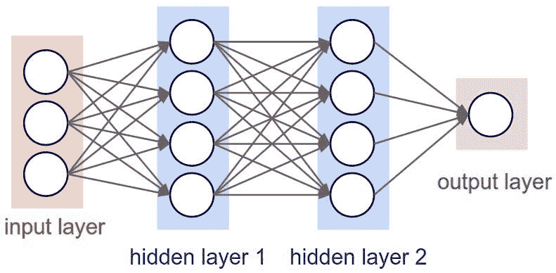

图片来源: [GitHub](https://github.com/karanvivekbhargava/vanilla-neural-network)

# 内容:

1.[简介](#b4fb)
2。[背景](#fce7)3。[语义](#9e09)
4。[设置](#7ed5)
5。[获取数据](#c655)
6。[检查数据](#556b)7
。[准备数据](http://266e)
8。[实例化网络](#6a04)
9。[初始化网络](#73a7)
10。[正向传播](#fa55)11。[计算成本](#485a)
12。[反向传播](#1c42)
13。[更新模型参数](#5208)14
。[端到端运行模型](#34e4)
15。[创建预测](#4ed9)16
。[结论](#9a35)
17。[帖子脚本](#cae5)

# 1.介绍

现代数据科学技术经常使用健壮的框架来设计和构建机器学习解决方案。在`[R](https://www.r-project.org/)`社区中，`[tidyverse](https://www.tidyverse.org/)`、`[caret](http://caret.r-forge.r-project.org/)`等包被频繁引用；并且在`[Python](http://127.0.0.1:17287/rmd_output/0/)`内，经常引用`[numpy](https://numpy.org/)`、`[pandas](https://pandas.pydata.org/)`、`[sci-kit learn](https://scikit-learn.org/)`等包。甚至有一些包已经被构建为可以在两种语言中使用，比如`[keras](https://keras.io/)`、`[pytorch](https://pytorch.org/)`、`[tensorflow](https://www.tensorflow.org/)`。然而，使用这些包的限制是'*黑盒* ' 现象，用户不理解幕后(或者说“引擎盖下”)发生了什么。用户知道如何使用这些功能，并且可以解释结果，但是不一定知道软件包是如何实现这些结果的。

本文的目的是创建一种“*回归基础*”的方法来设计深度学习解决方案。其意图不是创建最具预测性的模型，也不是使用最新最棒的技术(如[卷积](https://en.wikipedia.org/wiki/Convolutional_neural_network)或[递归](https://en.wikipedia.org/wiki/Recurrent_neural_network))；但其意图是创建一个*基本的*神经网络，从*开始*，使用*没有*的框架，并向*走过*的方法论。

**注意**:“香草神经网络”中的单词“*香草*”只是指它是从零开始构建的，并且在其构建中不使用任何预先存在的框架。

# 2.背景

## 2.1.语境

已经有很多网站和博客解释了这个过程是如何完成的。如 [Jason Brownlee](https://machinelearningmastery.com/about/) 的文章[如何用 Python 编写一个带反向传播的神经网络(从头开始)](https://machinelearningmastery.com/implement-backpropagation-algorithm-scratch-python/)，以及 [DeepLearning.ai](https://notebooks.azure.com/goldengrape/projects/deeplearning-ai) 的笔记本 [dnn_app_utils_v2.py](https://notebooks.azure.com/goldengrape/projects/deeplearning-ai/html/COURSE%201%20Neural%20Networks%20and%20Deep%20Learning/Week%204/Deep%20Neural%20Network%20Application_%20Image%20Classification/dnn_app_utils_v2.py) (上[微软 Azure 笔记本](https://notebooks.azure.com/)网)。但是，这些源码都是用 Python 写的。这很好，如果这是所需要的，并且有一些非常合理的理由使用`Python`而不是其他语言。但是这篇论文会写在`R`里。

选择`R`语言有两个原因:

1.  我熟悉这种语言。我会说`Python`(还有其他语言)；我选择了`R`来展示如何使用这种语言来实现。
2.  证明有很多不同的方法可以达到同样的结果。因此，虽然有时选择一种语言比选择另一种语言有合理的限制(业务遗产、技术可用性、系统性能等)，但有时选择一种语言只是因为它在风格上更可取。

因此，让我们看看如何在`R`中设计和构建一个香草神经网络。

## 2.2.什么不是

本文不涵盖*最新的*和*最伟大的*深度学习架构(如[卷积](https://www.tensorflow.org/tutorials/images/cnn)或[递归](https://www.tensorflow.org/guide/keras/rnn))。因此，如果使用这些其他架构，最终性能可能不会像*可能*的那样好。

这篇文章没有向读者讲授神经网络如何工作背后的理论数学概念。有很多其他的讲座教授这些信息(例如[神经网络背后的数学](https://www.youtube.com/watch?v=RiqWATOoos8))。事实上，本文假设读者有很多关于编程、微积分和神经网络概念背后的基础知识。

这篇文章不包括*为什么*神经网络以这样的方式工作，以及前馈结构背后的概念理解。有很多其他博客(例如[神经网络入门](https://medium.com/@purnasaigudikandula/a-beginner-intro-to-neural-networks-543267bda3c8))和视频(例如[神经网络系列](https://www.youtube.com/playlist?list=PLZHQObOWTQDNU6R1_67000Dx_ZCJB-3pi))涵盖了这些信息。

本文并没有向读者指出其他可能已经设置并运行这些信息的包和应用程序。像`[tensorflow](https://www.rdocumentation.org/packages/tensorflow)`和`[nnet](https://www.rdocumentation.org/packages/nnet)`这样的包已经包含了这一点。

这篇文章*实际上*是一个功能走查，如何创建一个香草神经网络(一个前馈网络)，从零开始，一步一步，用`R`编程语言。它包含大量代码和技术细节。

# 3.语义学

## 3.1.布局

这篇文章就是以这样一种方式来描述神经网络是如何从头开始构建的。它将完成以下步骤:

1.  访问并检查数据
2.  实例化和初始化网络
3.  向前传播
4.  计算成本
5.  反向传播
6.  更新模型
7.  建立一个训练方法来循环每一件事
8.  预测和评估绩效

为了简洁起见，这里定义的函数将不包括典型函数中应该包括的所有注释和验证。它们将只包括基本步骤和提示。然而，本文的源代码(位于[这里](https://github.com/chrimaho/VanillaNeuralNetworksInR/blob/master/Functions/functions.R))确实包含了所有适当的函数文档字符串和断言。

## 3.2.句法

在很大程度上，本文中的语法保留了`[dplyr](https://www.rdocumentation.org/packages/dplyr)`‘pipe’方法(使用了`%>%`符号)。然而，在某些部分使用了 R `[base](https://www.rdocumentation.org/packages/base)`语法(例如，在函数声明行中)。

在整篇文章中，编写了许多自定义函数。这些都带有前缀`get`、`let`和`set`。每个的定义如下。

*   `get_*()` :
    —它将`get`将来自对象的元数据的某些属性解析到此函数。
    —或将使用解析到该函数的信息来导出和`get`其他值或参数。
*   `set_*()` :
    —它将`set`(或‘更新’)解析到该函数的对象。
    —通常用于在正向和反向传播过程中更新网络。
*   `let_*()` :
    —与`get`类似，它使用解析到该函数的其他值来导出结果，但是`let`该值将被另一个对象或函数使用。
    —主要用于初始化和激活功能。

# 4.建立

## 4.1.加载包

第一步是导入相关的包。此列表包括整个过程中使用的主要软件包；并列出其主要用途。

请注意上面列出的关于不使用现有深度学习包的内容，然而`tensorflow`包却包括在内。为什么？嗯，这仅用于访问数据，这将在下一节讨论。`tensorflow`包不用于构建和训练任何网络。

```
library(tensorflow)  #<-- Only used for getting the data
library(tidyverse)   #<-- Used for accessing various tools
library(magrittr)    #<-- Extends the `dplyr` syntax
library(grDevices)   #<-- For plotting the images
library(assertthat)  #<-- Function assertions
library(roxygen2)    #<-- Documentation is important
library(caret)       #<-- Doing data partitioning
library(stringi)     #<-- Some string manipulation parts
library(DescTools)   #<-- To properly check `is.integer`
library(tictoc)      #<-- Time how long different processes take
library(docstring)   #<-- Makes viewing the documentation easier
library(roperators)  #<-- Conveniently using functions like %+=%
library(plotROC)     #<-- For plotting predictions
```

# 5.检索数据

## 5.1.下载数据

要使用的数据集是 [CIFAR-10](https://www.cs.toronto.edu/~kriz/cifar.html) 数据集。选择它有很多原因，包括:

1.  数据在图像上，非常适合深度学习目的；
2.  包含了相当数量的图像(总共 60，000 张图像)；
3.  所有图像都是相同的大小(32x32 像素)；
4.  这些图像被分为 10 个不同的类别；和
5.  通过`TensorFlow`包可以轻松访问它。

以下代码块具有以下过程步骤:

1.  获取数据
    —为了导入日期，通过`keras`元素访问，该元素包含`datasets`的套件，包括`cifar10`部分。
    —`load_data()`函数从在线 GitHub 存储库中检索数据。
2.  提取第二个元素
    —这里的`load_package()`返回两个不同的对象:
    — — 1。训练数据集(包含 50，000 幅图像)；
    — — 2。测试数据集(包含 10，000 张图像)。
    —提取第二个元素(通过使用`extract2(2)`功能),因为只需要 10，000 张图像。
    —本文将展示创建香草神经网络的*过程*；如果以后需要更多数据，可以在这里轻松访问。
3.  说出零件的名称
    —下载的数据包含另外两个元素:
    — — 1。图像本身(以 4 维阵列的形式)；
    ———2。图像标签(以二维单列数组的形式)。
    —该数据没有任何名称，因此使用`set_names()`函数设置名称。

```
# Download Data
# NOTE:
# - The first time you run this function, it download everything.
# - Next time you run it, TensorFlow will load from Cache.
cifar <- tf$keras$datasets$cifar10$load_data() %>% 
    extract2(2) %>% 
    set_names(c("images","classes"))
```

## 5.2.获取类定义

从`TensorFlow`包中访问这些数据的一个挑战是，对于每种类型的图像，这些类都只是数值(`0`到`9`)。这些图像的定义可以在 GitHub 上找到([GitHub>EN10>CIFAR](https://github.com/EN10/CIFAR#classes))。这些类在下面的代码块中定义。

```
# Define classes
ClassList <- c(
    "0" = "airplane",
    "1" = "automobile",
    "2" = "bird",
    "3" = "cat",
    "4" = "deer",
    "5" = "dog",
    "6" = "frog",
    "7" = "horse",
    "8" = "ship",
    "9" = "truck" 
)
```

# 6.检查数据

## 6.1.检查对象

检查数据是很重要的，以确保数据是正确生成的，并且所有信息看起来都没问题。为此，编写了一个自定义函数(`get_ObjectAttributes()`)，其源代码可以在[这里](https://github.com/chrimaho/VanillaNeuralNetworksInR/blob/master/Functions/functions.R)找到。如下面的代码块所示，`images` 对象是一个四维数字数组，包含`10,000`个图像，每个`32` x `32`个像素，以及`3`个颜色通道。整个物体超过`117 Mb`大。

```
# Check Images
cifar %>% 
    extract2("images") %>% 
    get_ObjectAttributes("cifar$images") %>% 
    cat()
```

它打印:

```
Name : cifar$images
 - Size : 117.2 Mb
 - Clas : array
 - Type : integer
 - Mode : numeric
 - Dims : 10000x32x32x3
```

当检查`classes` 对象时，它是一个 2 维数字数组(只有 1 列)，但是具有与`images` 对象相同数量的图像(这是预料中的)，每个类标签的频率恰好都具有`1000`图像。总尺寸小于`40 Kb`。

```
# Check classes
cifar %>% 
    extract2("classes") %>% 
    get_ObjectAttributes(name="cifar$classes", print_freq=TRUE) %>% 
    cat()
```

它打印:

```
Name : cifar$classes
 - Size : 39.3 Kb
 - Clas : matrix,array
 - Type : integer
 - Mode : numeric
 - Dims : 10000x1
 - Freq :
      label Freq
   1  0     1000
   2  1     1000
   3  2     1000
   4  3     1000
   5  4     1000
   6  5     1000
   7  6     1000
   8  7     1000
   9  8     1000
   10 9     1000
```

## 6.2.检查图像

在了解了内存中对象的大小之后，就有必要检查实际的图像本身了。作为人类，我们理解实际的图像和颜色，胜过理解数字。

为了可视化图像，编写了两个自定义函数，如下面的代码块所示。这些函数接收数据(作为一个 4 维数组)，并将图像可视化为一个图。

```
set_MakeImage <- function(image, index=1) {

    # Extract elements
    image.r <- image[,,1]
    image.g <- image[,,2]
    image.b <- image[,,3]

    # Make rgb
    image.rgb <- rgb(
        image.r, 
        image.g, 
        image.b, 
        maxColorValue=255
    )

    # Fix dimensions
    dim(image.rgb) <- dim(image.r)

    # Return
    return(image.rgb)

}plt_PlotImage <- function(images, classes, class_list, index=1) {

    # Slice images
    image <- images[index,,,]
    image %<>% set_MakeImage(index)
    lbl <- classes %>% 
        extract(index) %>% 
        as.character() %>% 
        class_list[[.]]

    # Create plot
    plot <- ggplot() + 
        ggtitle(lbl) +
        draw_image(image, interpolate=FALSE)

    # Return
    return(plot)

}
```

对前 16 幅图像运行该功能时，将显示以下内容。如图所示，这些图像非常像素化(这是意料之中的，因为它们每个只有`32` x `32`像素)，你可以看到每个图像是如何分类的。

```
# Set list
lst <- list()# Loop 16 images
for (index in 1:16) {
    lst[[index]] <- plt_PlotImage(
        cifar$images, 
        cifar$classes, 
        ClassList,
        index)
    }# View images
plt <- gridExtra::grid.arrange(grobs=lst, ncol=4)
```

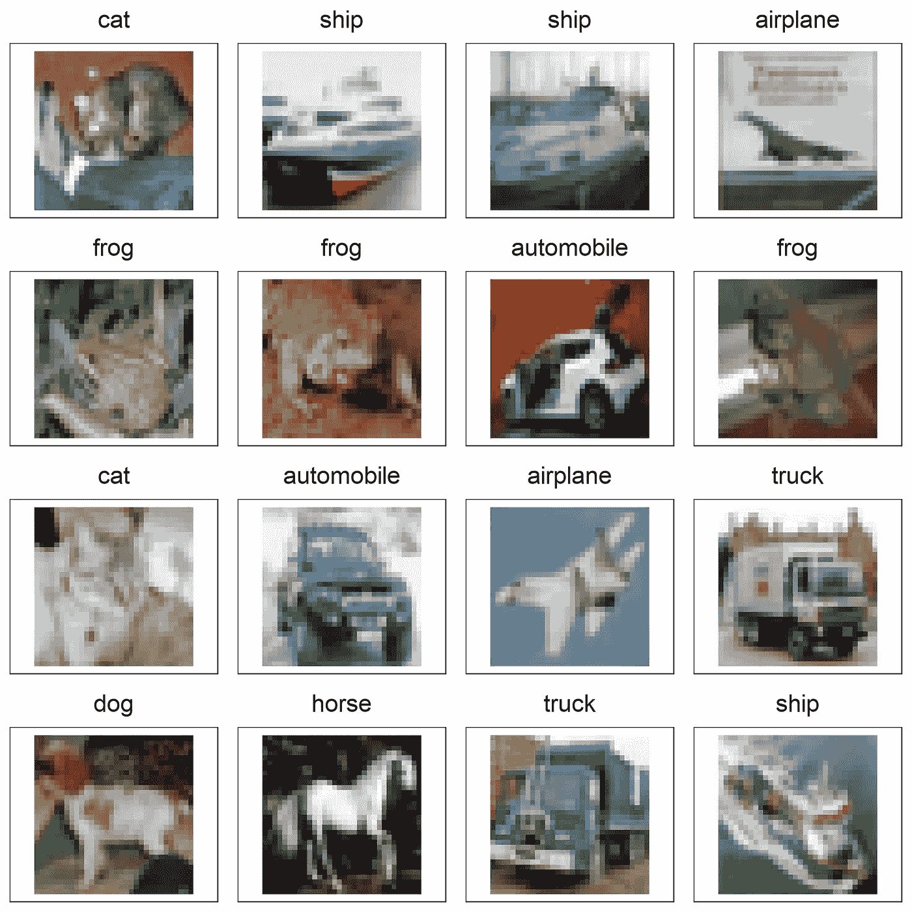

**图 1** :初始图像

# 7.准备数据

准备数据有四个步骤:

1.  把…重新分类
2.  裂开
3.  使再成形
4.  使标准化

## 7.1.把…重新分类

出于本文的目的，让我们假设我们正在尝试预测图片是`car`还是`not`。这将需要将数据转换为二进制分类问题，其中神经网络将从数据中预测`1`或`0`。这将意味着模型输出将是分数的概率分布，通过改变截止变量可以容易地对其进行分类。

第一步是对数据进行重新分类，使所有汽车的值都是`1`，其他的都是`0`。我们从之前定义的类中知道，汽车已经有了值`1`，这意味着只需要对所有其他类进行转换。

```
# Implement within a pipe
cifar[["classes"]] <- cifar %>%
    extract2("classes") %>% 
    (function(classes){

        # View initial classes
        classes %>% as.vector %>% head(40) %>% print

        # Reclassify
        classes <- ifelse(classes==1,1,0)

        # View reclassified classes
        classes %>% as.vector %>% head(40) %>% print

        # Return
        return(classes)
    })
```

它打印:

```
[1] 3 8 8 0 6 6 1 6 3 1 0 9 5 7 9 8 5 7 8 6 7 0 4 9 5 2 4 0 9 6
[1] 0 0 0 0 0 0 1 0 0 1 0 0 0 0 0 0 0 0 0 0 0 0 0 0 0 0 0 0 0 0
```

## 7.2.分割数据

下一个任务是将数据分成训练集和测试集。这样做的原因在其他地方有所涉及(如[维基百科的交叉验证](https://en.wikipedia.org/wiki/Cross-validation_%28statistics%29)和[谷歌的机器学习速成班:训练和测试集分割数据](https://developers.google.com/machine-learning/crash-course/training-and-test-sets/splitting-data))。

首先，为了理解当前的数据分割，下面的代码块使用`ggplot2`包可视化了这些数据。如图所示，数据目前分布在`90%`和`0`类别中，剩余的`10%`和`1`类别中。

```
# Print Plot
cifar %>% 
    extract("classes") %>% 
    table(dnn="classes") %>% 
    data.frame() %>% 
    ggplot(aes(classes, Freq, fill=classes)) + 
        geom_col(colour="black") +
        geom_label(
            aes(label=Freq),
            show.legend=FALSE
        ) +
        scale_y_continuous(breaks=seq(0,10000,1000)) +
        theme(panel.grid.minor.y=element_blank()) +
        labs(
            title="Count of Each Class"
        )
```

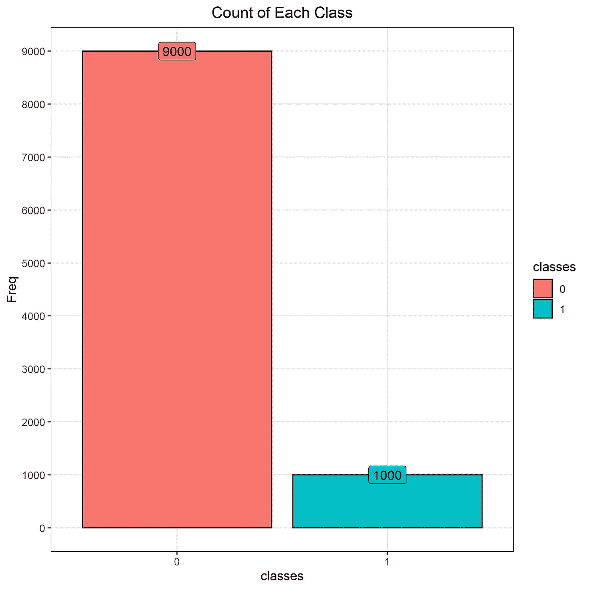

**图 2** :每一类的计数

为了实现这种数据分割，我们使用了`caret::createDataPartition()`函数。这将创建一个`partition`对象，然后使用它来相应地分离`cifar`数据。在`70%`任意选择拆分比例用于训练，其余用于测试。然而，这可能是合理的`80%`；这是一个超参数，可以在以后的阶段调整。

```
# Set seed for reproducibility
set.seed(1234)# Create partition
partition <- createDataPartition(cifar$classes, p=0.7, list=FALSE)# Split data
trn_img <- cifar$images[partition,,,]
tst_img <- cifar$images[-partition,,,]
trn_cls <- cifar$classes[partition]
tst_cls <- cifar$classes[-partition]
```

分割后，数据被重新绘制，很容易看出训练/测试分割在两个类别上实现了均匀的`70%`分布。

```
# Print Plot
rbind(
    trn_cls %>% table,
    tst_cls %>% table
) %>% 
    set_rownames(c("train","test")) %>% 
    data.frame() %>% 
    rename_all(str_remove_all, "X") %>% 
    rownames_to_column("data") %>% 
    pivot_longer(2:3, names_to="classes", values_to="Freq") %>% 
    mutate(
        label=paste(data, classes, sep=": "),
        data=factor(data, levels=c("train","test"))
    ) %>% 
    ggplot(aes(classes, Freq, fill=data), position="dodge") + 
        geom_col(colour="black", position="dodge") +
        geom_label(
            aes(label=Freq), 
            position=position_dodge(width=0.9),
            show.legend=FALSE
        ) +
        scale_y_continuous(breaks=seq(0,10000,1000)) +
        theme(panel.grid.minor.y=element_blank()) +
        labs(
            title="Count of Each Class",
            subtitle="Split by Train/Test"
        )
```

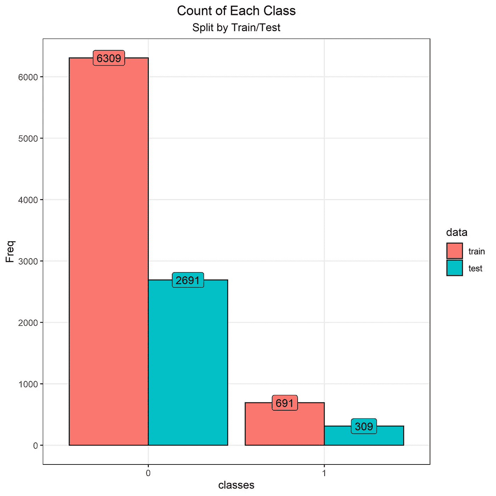

**图 3** :每类计数，按训练/测试划分

检查数据是否被正确分割的另一种方法是再次运行`get_ObjectAttributes()`函数，如下面的代码块所示。这里显示的信息与上面的图一致。有趣的是，训练图像数组`82 Mb`很大，这对于以后检查正向传播的性能很重要。

```
for (name in c("trn_img","tst_img","trn_cls","tst_cls")) {
    name %>% 
        get() %>% 
        get_ObjectAttributes(
            name, 
            if (name %in% c("trn_cls","tst_cls")) TRUE else FALSE
        ) %>% 
        cat()
    if (name != "tst_cls") cat("\n")
}
```

它打印:

```
Name : trn_img
 - Size : 82 Mb
 - Clas : array
 - Type : integer
 - Mode : numeric
 - Dims : 7000x32x32x3Name : tst_img
 - Size : 35.2 Mb
 - Clas : array
 - Type : integer
 - Mode : numeric
 - Dims : 3000x32x32x3Name : trn_cls
 - Size : 54.7 Kb
 - Clas : numeric
 - Type : double
 - Mode : numeric
 - Dims : 7000
 - Freq :
     label Freq
   1 0     6309
   2 1      691Name : tst_cls
 - Size : 23.5 Kb
 - Clas : numeric
 - Type : double
 - Mode : numeric
 - Dims : 3000
 - Freq :
     label Freq
   1 0     2691
   2 1      309
```

## 7.3.重塑数据

对于我们神经网络的第一个`input`层，我们希望是一个一维的节点。因此，有必要将数据从一个 4 维数组调整为一个 2 维数组。这个过程叫做展平，更多信息可以在这里找到:[多维数组的内存布局](https://eli.thegreenplace.net/2015/memory-layout-of-multi-dimensional-arrays)。

使用`array()`函数可以很容易地实现该方法，因为它有`dim=`参数，可以用来指定所需的尺寸。

期望的矩阵尺寸应该使每个*图像*在新的一行，每个*像素*在不同的一列。因为每个*像素*由第 2、第 3 和第 4 维组成，我们需要取这三个数的*乘积*，并使用它来指定所需的列数。实际上，我们正在运行这个等式:`32` × `32` × `3`，这相当于拥有`3072`列。这个等式是在下一个代码块中以编程方式内嵌实现的。

```
# Reshape data
trn_img %<>% array(dim=c(
    dim(.) %>% extract(1),
    dim(.) %>% extract(2:4) %>% prod()
))tst_img %<>% array(dim=c(
    dim(.) %>% extract(1),
    dim(.) %>% extract(2:4) %>% prod()
))trn_cls %<>% array(dim=c(
    length(.),
    1
))tst_cls %<>% array(dim=c(
    length(.),
    1
))
```

当再次检查对象属性时，您将看到图像数据已经被正确地处理，以行数作为图像的数量，以列数作为像素的数量。

```
for (name in c("trn_img","tst_img","trn_cls","tst_cls")) {
    name %>% 
        get() %>% 
        get_ObjectAttributes(name, FALSE) %>% 
        cat()
    if (name != "tst_cls") cat("\n")
}
```

它打印:

```
Name : trn_img
 - Size : 82 Mb
 - Clas : matrix,array
 - Type : integer
 - Mode : numeric
 - Dims : 7000x3072Name : tst_img
 - Size : 35.2 Mb
 - Clas : matrix,array
 - Type : integer
 - Mode : numeric
 - Dims : 3000x3072Name : trn_cls
 - Size : 54.9 Kb
 - Clas : matrix,array
 - Type : double
 - Mode : numeric
 - Dims : 7000x1Name : tst_cls
 - Size : 23.6 Kb
 - Clas : matrix,array
 - Type : double
 - Mode : numeric
 - Dims : 3000x1
```

## 7.4.标准化数据

准备数据的最后一步是标准化数据，以便所有元素都在`0`和`1`之间。这样做的原因是为了防止在后面的步骤中出现爆炸和消失的梯度，因为神经网络将试图拟合所有的波峰和波谷，这是由于数据在`0`到`255`的值范围内引起的。

如 [TensorFlow](https://www.tensorflow.org/api_docs/python/tf/keras/datasets/cifar10/load_data) 网站所述， [CIFAR10](https://www.cs.toronto.edu/~kriz/cifar.html) 数据集由 RGB 图像数据组成。并且，正如[维基百科](https://en.wikipedia.org/wiki/RGB_color_model)上记载的，RGB 数据都是在`0`和`255`之间的值。

所以要做的就是把所有的元素除以`255`，必然会产生一个在`0`和`1`之间的值。由于图像数据当前在一个数组中，下面代码块中的函数将作为一个*矢量化函数*在整个数组中运行，相应地将所有元素除以`255`。

```
trn_img <- trn_img/255
tst_img <- tst_img/255
```

数据现已准备好，可用于网络。下一步是建立网络。

# 8.实例化网络

## 8.1.定义架构

关于网络*实际上*是什么的一些快速注释:

*   整体架构是一个`list`。
*   主`list`的每一个`element`都是另一个`list`，这些将构成整体*网络*的每一个*层*。
*   第一层永远是`input`层。
*   最后一层将永远是`output`层。
*   中间的每一层都将是`hidden`层，这些层的名称简单地用数字命名。
*   每层的每个元素都将被标记为相同，定义如下:
*   — `nodz`:本层节点数。
*   — `inpt`:输入矩阵。又名`A_prev`。这是前一层激活的副本，因此对于大型网络，需要考虑这一点。
*   — `wgts`:权重矩阵。又名`W`。
*   — `bias`:偏置向量。又名`b`。
*   — `linr`:线性矩阵。又名`Z`。这是`inpt`、`wgts`和`bias`之间的线性代数的结果。
*   — `acti`:激活矩阵。又名`A`。将激活函数应用于`linr`矩阵的结果。
*   — `acti_func`:使用的激活功能。
*   — `cost`:车型的整体成本。这是一个单一的值(模型的总成本)，但被复制到模型的每一层。
*   — `back_cost`:成本向量的梯度。又名`dA_cost`。
*   — `back_acti`:激活矩阵的梯度。又名`dA`。应用反向传播后的微分结果。具有给定的成本函数。
*   — `back_linr`:线性代数矩阵的梯度。又名`dZ`。向后线性微分反向传播的结果。
*   — `back_wgts`:权重矩阵的梯度。又名`dW`。也是背撑的结果。
*   — `back_bias`:偏置向量的梯度。又名`db`。也是背撑的结果。

## 8.1.设置实例化功能

对于下面的代码块，定义了函数`set_InstantiateNetwork()`。它只有三个输入参数，用于指定每层中使用的节点数。基于这些信息，模型将被实例化并返回，为下一步的初始化做好准备。

```
set_InstantiateNetwork <- function(
    input=50, 
    hidden=c(30,20,10), 
    output=1
    ) { # Set up
    model = list()
    layers = c(
        "input",
        1:length(hidden),
        "output"
    )

    # Loop
    for (layer in layers) {

        # Make layer
        model[[layer]] <- list(
            "nodz"      = "",
            "inpt"      = "",
            "wgts"      = "",
            "bias"      = "",
            "linr"      = "",
            "acti"      = "",
            "acti_func" = "",
            "cost"      = "",
            "back_cost" = "",
            "back_acti" = "",
            "back_linr" = "",
            "back_wgts" = "",
            "back_bias" = "" 
        )

        # Set nodes
        if (layer=="input") {
            model[[layer]][["nodz"]] <- input
        } else if (layer=="output") {
            model[[layer]][["nodz"]] <- output
        } else {
            layer_index <- layer %>% as.numeric()
            model[[layer]][["nodz"]] <- hidden[layer_index]
        }

    }

    # Return
    return(model)

}
```

## 8.1.创建网络

下面的代码块实例化了网络。该模型将在每层中设置以下数量的节点:

*   层将有 T2 节点，和上面计算的一样多。
*   从`100`到`20`音符，每个`hidden`层的节点数量会逐渐减少。
*   `output`层会有`1`节点，因为这一个节点会是`0`和`1`之间的浮点数，用来预测相关图像是不是汽车。

```
network_model <- set_InstantiateNetwork(
    input=3072, 
    hidden=c(100,75,50,30,20), 
    output=1
)
```

## 8.1.将网络可视化

有一个非常好的网站可以让神经网络可视化:[http://alexlenail.me/NN-SVG/AlexNet.html](http://alexlenail.me/NN-SVG/AlexNet.html)。下图是刚刚创建的网络的示意图。

一旦网络完全初始化并向前传播，可以进行进一步的可视化。详见 [**章节检查模型形状**](#de5b) 。

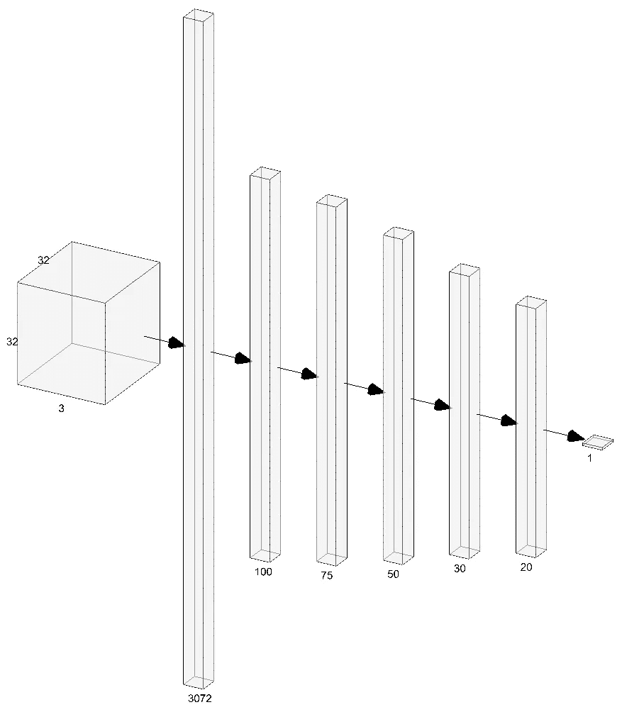

**图 4** :网络的可视化

# 9.初始化网络

初始化网络有四个步骤:

1.  设置重量初始化功能
2.  设置层初始化功能
3.  设置模型初始化功能
4.  运行初始化

## 9.1.重量初始化

在其核心，权重初始化只是生成一个随机的正常数字(用`μ=0`和`σ=1`)。然而，通过仅使用这个随机生成的数字，当试图训练更深的神经网络时，发现模型梯度爆炸或消失。因此，这些权重在被初始化后需要被缩放，以便足够健壮以继续在更深的层被训练。

有许多算法可用于重量初始化。两个比较常见的是 [Xavier](https://prateekvjoshi.com/2016/03/29/understanding-xavier-initialization-in-deep-neural-networks/) 算法和 [He](https://medium.com/@prateekvishnu/xavier-and-he-normal-he-et-al-initialization-8e3d7a087528) 算法。理解这些算法背后的细节的一些好资源包括:

*   [神经网络中的权重初始化](/weight-initialization-in-neural-networks-a-journey-from-the-basics-to-kaiming-954fb9b47c79)
*   [了解训练深度前馈神经网络的难度](http://proceedings.mlr.press/v9/glorot10a/glorot10a.pdf)
*   [在 ImageNet 分类上超越人类水平的性能](https://arxiv.org/pdf/1502.01852.pdf)

9.1.1。泽维尔算法

Xavier 初始化的公式为:

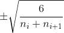

**等式 1** : Xavier 初始化算法

其中:

*   *nᵢ* 是进入这一层的节点数量。也称为“扇入”。
*   *nᵢ₊₁* 是从这一层出去的节点数。也称为“扇出”。

9.1.2。何算法

he 初始化的公式为:

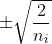

**等式 2** :初始化算法

其中:

*   nᵢ是进入这一层的节点数量。

## 9.1.初始化功能

出于编程目的，这些函数是用`order`值作为函数参数的一部分编写的。这意味着方程的数量级可以在稍后阶段改变，并用作超参数。

```
let_InitialiseXavier <- function(nodes_in, nodes_out, order=6) {

    # Do work
    numer <- sqrt(order)
    denom <- sqrt(nodes_in + nodes_out)
    output <- numer/denom

    # Return
    return(output)

}let_InitialiseHe <- function(nodes_in, nodes_out, order=2) {

    # Do work
    numer <- order
    denom <- nodes_in
    output <- sqrt(numer/denom)

    # Return
    return(output)

}
```

## 9.3.层初始化

下一步是构建一个函数，该函数将初始化一个单独层的所有相关方面。这一步很重要，因为这是创建权重矩阵的地方，并且这些权重矩阵必须以某种方式构建，以确保维度允许成功的向前传播。

层构造的步骤如下:

1.  确定当前层的层名(`layer`)和前一层的层名(`layer_prev`)。
    —用于从`network_model`列表中访问相关配置。
2.  确定馈入本层的节点数(`nodes_in`)和馈出当前层的节点数(`nodes_out`)。
    —用于解析初始化算法。
3.  创建权重矩阵。
    —尺寸如下:
    ———1。行数是前一层中的节点数。
    ———2。列数是当前层中的节点数。
    —使用`rnorm()`函数创建每个元素，该函数使用`μ=0`和`σ=1`在正常曲线上生成一个随机数。
4.  确定要使用的初始化算法。
    —解析到该函数中的 value 值是与相关算法相关的小写单词。
    —强制转换为标题大写，然后赋予前缀`let_Initialise`。
    —该值然后被解析到`get()`函数中，该函数然后调用该函数，并执行解析到该函数的参数。
    —这是一种灵活调用不同算法的编程方式，基于解析到函数的值。
5.  缩放权重矩阵。
    —通过将每个元素乘以初始化算法。
6.  创建偏差矩阵。
    —尺寸如下:
    — — 1。行数是当前层中的节点数。
    ———2。只有一列。
    —每个元素都有值`0`。
7.  将重量和偏差矩阵重新应用到`network_model`上。
8.  返回更新后的`network_model`对象。

为了实现这一点，函数使用的函数参数包括:

1.  `network_model`本身。
2.  该层的`layer_index`(其中`1`为`input`层，每个递增的数字为每个后续层)。
3.  `initialisation_algorithm`，或者是值`NA`，或者是值`xavier`或者是相关算法的值`he`。
4.  `initialisation_order`，它是一个整数值，在相关算法中用作分子。

```
set_InitialiseLayer <- function(
    network_model,
    layer_index,
    initialisation_algorithm=NA,
    initialisation_order=6
    ) {

    # Get layer names
    layer_prev <- names(network_model)[layer_index-1]
    layer <- names(network_model)[layer_index]

    # Get number of nodes
    if (layer_index == 1) {
        nodes_in <- 0 #First layer is 'input'
    } else {
        nodes_in <- network_model %>% 
            extract2(layer_prev) %>% 
            extract2("nodz")
    }
    nodes_out <- network_model %>% 
        extract2(layer) %>% 
        extract2("nodz")

    # Set the seed of reproducibility
    set.seed(1234)

    # Initialise weight matrix
    w_matrix <- matrix(
        data=rnorm(nodes_in * nodes_out), 
        nrow=nodes_in,
        ncol=nodes_out
    )

    # Get initialisation algorithm
    if (!is.na(initialisation_algorithm)) {
        algorithm <- paste0(
            "let_Initialise", 
            str_to_title(initialisation_algorithm)
        )
    }

    # Scale weights
    if (layer_index != 1) {
        if (is.na(initialisation_algorithm)) {
            w_matrix <- w_matrix
        } else {
            w_matrix <- w_matrix * 
                get(algorithm)(
                    nodes_in=nodes_in, 
                    nodes_out=nodes_out, 
                    order=initialisation_order
                )
        }
    }

    # Initialise bias matrix
    b_matrix <- matrix(
        data=network_model %>% 
            extract2(layer) %>% 
            extract2("nodz") %>% 
            replicate(0),
        nrow=network_model %>% 
            extract2(layer) %>% 
            extract2("nodz"),
        ncol=1
    )

    # Place data back in to the model
    network_model[[layer]][["wgts"]] <- w_matrix
    network_model[[layer]][["bias"]] <- b_matrix

    # Return
    return(network_model)

}
```

## 9.4.模型初始化

`set_InitialiseModel()`功能的目的是循环通过`network_model`对象中的每一层，根据模型本身的参数设置对其进行初始化。该功能将获取节点数(由`set_InstantiateNetwork()`功能设置)。

该函数将只接受三个输入参数:

1.  `network_model` :
    —由`set_InstantiateNetwork()`函数实例化的网络。
2.  `initialisation_algorithm` :
    —用于网络初始化的算法。
    —这应该是值`NA`、`xavier`或`he`。
3.  `initialisation_order` :
    —用于等式分子的顺序值。
    —这可以是一个数值，或者是字符串`layers`，表示顺序应该是网络中隐藏层的数量。

```
set_InitialiseModel <- function(
    network_model, 
    initialisation_algorithm="xavier", 
    initialisation_order="layers"
    ) {

    # Redefine 'initialisation_order'
    if (initialisation_order == "layers") {
        initialisation_order <- get_CountOfElementsWithCondition(
            names(network_model), 
            function(x){is.integer(as.numeric(x))}
        )
    }

    # Initialise each layer
    for (layer_index in 1:length(names(network_model))) {
        network_model <- set_InitialiseLayer(
            network_model=network_model, 
            layer_index=layer_index, 
            initialisation_algorithm=initialisation_algorithm,
            initialisation_order=initialisation_order
        )
    }

    # Return
    return(network_model)

}
```

注意，该函数使用了用户自定义函数`get_CountOfElementsWithCondition()`。该函数允许计算模型中隐藏层的数量。该功能的源代码可以在这里[找到。](https://github.com/chrimaho/VanillaNeuralNetworksInR/blob/master/Functions/functions.R)

## 9.5.网络初始化

下面的代码块使用上面定义的函数初始化网络。使用的方法是`%<>%`，它在`magrittr`包中定义，说明它用于更新左侧的值，首先通过管道将它输入右侧的第一个参数位置，然后将结果赋回左侧的对象。

```
network_model %<>% set_InitialiseModel()
```

## 9.6.检查模型参数

为了快速检查，下面的代码块检查已定义模型的参数数量。这再次使用了一个定制函数`get_ModelParametersCount()`，它的定义可以在本文的源代码中找到(位于[这里](https://github.com/chrimaho/VanillaNeuralNetworksInR/blob/master/Functions/functions.R))。

```
network_model %>% 
    get_ModelParametersCount() %>% 
    format(big.mark=",")
```

它打印:

```
[1] "320,846"
```

该神经网络中有超过`320,000`个参数。这些参数中的每一个都需要训练，并且每一个都会对最终结果产生影响。在接下来的部分中，我们将继续介绍如何实现这一点。

# 10.正向传播

## 10.1.该理论

有一个非常好的网站概述了矩阵乘法中实际发生的事情:[矩阵乘法](http://matrixmultiplication.xyz/)。

正向传播方法的理论如下:

1.  应用矩阵乘法
    — 1。第一个矩阵是来自前一层的激活矩阵。
    — 2。第二个矩阵是当前层的权重矩阵。
    — 3。第三矩阵是当前层的(第一)线性激活矩阵。
2.  应用偏置矩阵
    — 1。第一矩阵是当前层的(第一)线性激活。
    — 2。第二个矩阵是当前层的偏差矩阵。
    — 3。第三矩阵是当前层的(第二)线性激活矩阵。
3.  应用激活算法
    — 1。第一矩阵是当前层的(第二)线性激活矩阵。
    — 2。激活功能由用户在功能运行期间确定。可以是`relu`激活、`sigmoid`激活或任何其他激活功能。
    — 3。第三个矩阵是当前层的激活矩阵。

**10.1.1。第一步**

为了说明，下面的矩阵显示了正向传播的第一步，使用了虚拟数字。

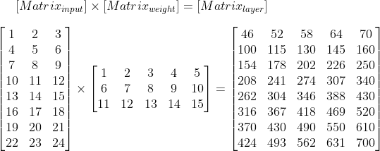

**图五**:前进道具，第一步

下面的代码显示了这个过程是如何以编程方式实现的。

```
# Declare First matrix
matrix_input <- matrix(
    data=1:24, 
    nrow=8, 
    ncol=3, 
    byrow=TRUE
)# Declare Weight matrix
matrix_weight <- matrix(
    data=1:15, 
    nrow=3, 
    ncol=5, 
    byrow=TRUE
)# Apply matrix manipulation
matrix_layer <- matrix_input %*% matrix_weight
```

它打印:

```
matrix_input:
     [,1] [,2] [,3]
[1,]    1    2    3
[2,]    4    5    6
[3,]    7    8    9
[4,]   10   11   12
[5,]   13   14   15
[6,]   16   17   18
[7,]   19   20   21
[8,]   22   23   24matrix_weight:
     [,1] [,2] [,3] [,4] [,5]
[1,]    1    2    3    4    5
[2,]    6    7    8    9   10
[3,]   11   12   13   14   15matrix_layer:
     [,1] [,2] [,3] [,4] [,5]
[1,]   46   52   58   64   70
[2,]  100  115  130  145  160
[3,]  154  178  202  226  250
[4,]  208  241  274  307  340
[5,]  262  304  346  388  430
[6,]  316  367  418  469  520
[7,]  370  430  490  550  610
[8,]  424  493  562  631  700
```

**10.1.2。第二步**

下图显示了如何应用偏置矩阵。如图所示，偏置矩阵中的每个元素水平应用于初始矩阵的每个元素。这张图表显示了它是如何工作的。

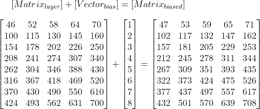

**图 6** :前进支柱，第二步

下面的代码显示了这个过程是如何以编程方式实现的。

```
# Declare Bias matrix
vector_bias <- matrix(1:8, 8, 1)# Apply Bias matrix
matrix_biased <- sweep(matrix_layer, 1, vector_bias, "+")
```

它打印:

```
matrix_layer:
     [,1] [,2] [,3] [,4] [,5]
[1,]   46   52   58   64   70
[2,]  100  115  130  145  160
[3,]  154  178  202  226  250
[4,]  208  241  274  307  340
[5,]  262  304  346  388  430
[6,]  316  367  418  469  520
[7,]  370  430  490  550  610
[8,]  424  493  562  631  700vector_bias:
     [,1]
[1,]    1
[2,]    2
[3,]    3
[4,]    4
[5,]    5
[6,]    6
[7,]    7
[8,]    8matrix_biased:
     [,1] [,2] [,3] [,4] [,5]
[1,]   47   53   59   65   71
[2,]  102  117  132  147  162
[3,]  157  181  205  229  253
[4,]  212  245  278  311  344
[5,]  267  309  351  393  435
[6,]  322  373  424  475  526
[7,]  377  437  497  557  617
[8,]  432  501  570  639  708
```

10.1.3。第三步

激活功能是在运行该功能时定义的功能。该算法应用于初始矩阵的每个元素。在这种情况下，使用初始矩阵的简单乘法。

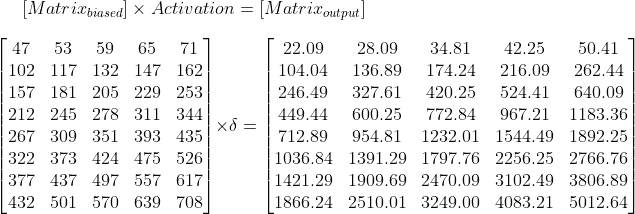

**图 7** :前进道具，第三步

下面的代码显示了这个过程是如何以编程方式实现的。

```
# Apply Activation function
matrix_output <- matrix_biased * (0.01 * matrix_biased)
```

它打印:

```
matrix_biased:
     [,1] [,2] [,3] [,4] [,5]
[1,]   47   53   59   65   71
[2,]  102  117  132  147  162
[3,]  157  181  205  229  253
[4,]  212  245  278  311  344
[5,]  267  309  351  393  435
[6,]  322  373  424  475  526
[7,]  377  437  497  557  617
[8,]  432  501  570  639  708matrix_output:
        [,1]    [,2]    [,3]    [,4]    [,5]
[1,]   22.09   28.09   34.81   42.25   50.41
[2,]  104.04  136.89  174.24  216.09  262.44
[3,]  246.49  327.61  420.25  524.41  640.09
[4,]  449.44  600.25  772.84  967.21 1183.36
[5,]  712.89  954.81 1232.01 1544.49 1892.25
[6,] 1036.84 1391.29 1797.76 2256.25 2766.76
[7,] 1421.29 1909.69 2470.09 3102.49 3806.89
[8,] 1866.24 2510.01 3249.00 4083.21 5012.64
```

## 10.2.线性分量

当组合在一起时，线性代数函数只用三行代码就实现了，如下面的`set_LinearForward()`函数中的代码块所示。

```
set_LinearForward <- function(inpt, wgts, bias) {

    # Perform matrix multiplication
    linr <- inpt %*% wgts

    # Add bias
    linr <- sweep(linr, 2, bias, "+")

    # Return
    return(linr)

}
```

## 10.3.非线性分量

神经网络的真正力量来自于它们的激活函数。现在，网络能够捕捉非线性方面，这就是强调其预测能力的原因。

根据网络的目的，激活功能可以是许多不同算法中的一种。激活的选择可以是在稍后阶段选择的超参数。 [Desmos](https://www.desmos.com/) 网站提供了一种极好的交互方式来查看不同类型的激活:[激活功能](https://www.desmos.com/calculator/rhx5tl8ygi)。

每个激活函数都是单独定义的，并且每个函数只接受一个参数，这是一个将被激活的矩阵。为了简洁起见，这里提供了四种比较流行的激活方式；但是还有很多很多其他的方法可以使用。还提供了如何计算这些函数的资源和等式:

`**sigmoid**` **:**

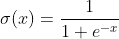

**方程式 3** :乙状结肠激活

来源:
1。[如何在 Python 中计算一个 logistic sigmoid 函数](https://kite.com/python/answers/how-to-calculate-a-logistic-sigmoid-function-in-python)
2。[使用 Numpy 实现 sigmoid 函数](https://www.geeksforgeeks.org/implement-sigmoid-function-using-numpy/)

`**relu**` **:**

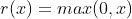

**方程式 4** : Relu 激活

来源:
1。[带 Sigmoid、ReLu 和 Softmax 激活功能的 NumPy 初学者指南](https://medium.com/ai%C2%B3-theory-practice-business/a-beginners-guide-to-numpy-with-sigmoid-relu-and-softmax-activation-functions-25b840a9a272)

`**softmax**`T25:

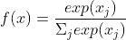

**方程式 5:** Softmax 激活

来源:
1。 [Softmax 激活功能说明](/softmax-activation-function-explained-a7e1bc3ad60)

`**swish**` **:**

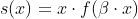

**方程式 6** :嗖嗖激活

来源:
1。[搜索激活功能](https://arxiv.org/pdf/1710.05941.pdf)
2。[在 Keras 中实现 Swish 激活功能](https://www.bignerdranch.com/blog/implementing-swish-activation-function-in-keras/)

这些激活函数以编程方式定义如下:

```
let_ActivateSigmoid <- function(linr) {

    # Do work
    acti <- 1/(1+exp(-linr))

    # Return
    return(acti)

}let_ActivateRelu <- function(linr) {

    # Do work
    acti <- sapply(linr, max, 0) %>% 
        structure(dim=dim(linr))

    # Return
    return(acti)

}let_ActivateSoftmax <- function(linr) {

    # Do work
    expo <- exp(linr)
    expo_sum <- sum(exp(linr))
    acti <- expo/expo_sum

    # Return
    return(acti)

}let_ActivateSwish <- function(linr, beta=0.1) {

    # Do work
    acti <- linr * (beta * linr)

    # Return
    return(acti)

}
```

## 10.4.设置正向传播函数

`set_ForwardProp()`函数集合了上面提到的所有组件。它执行以下步骤:

1.  循环通过`network_model`的每一层。
2.  获取当前图层的图层名称。
3.  对`input`层实施一个“通过”过程。
4.  提取相关信息，包括:
    —1。*上一层*的层名
    —2。*上一层*的激活矩阵
    —3。*当前*层
    — 4 的权重矩阵。*电流*层的偏置矩阵
5.  应用线性代数组件。
6.  应用非线性激活组件。
7.  请注意隐藏层的激活和最终层的激活之间的差异。
8.  将相关信息应用回网络。
9.  返回`network_model`对象。

为了实现这个过程，这个函数只有四个参数:

1.  `network_model`:待更新的网络模型。
2.  `data_in`:训练图像的 4 维数组，如上定义。
3.  `activation_hidden`:应用于隐藏层的激活功能。
4.  `activation_final`:应用于最终(`output`)层的激活功能。

```
set_ForwardProp <- function(
    network_model, 
    data_in, 
    activation_hidden="relu", 
    activation_final="sigmoid"
    ) {

    # Do work
    for (index in network_model %>% names() %>% length() %>% 1:.) {

        # Define layer name
        layr <- network_model %>% 
            names() %>% 
            extract(index)

        if (layr=="input") {

            # Pass-thru for 'input' layer
            network_model[[layr]][["inpt"]] <- data_in
            network_model[[layr]][["acti"]] <- data_in

        } else {

            # Extract data
            prev <- names(network_model)[index-1]
            inpt <- network_model %>% 
                extract2(prev) %>% 
                extract2("acti")
            wgts <- network_model %>% 
                extract2(layr) %>% 
                extract2("wgts")
            bias <- network_model %>% 
                extract2(layr) %>% 
                extract2("bias")

            # Calculate
            linr <- set_LinearForward(inpt, wgts, bias)

            # Activate
            if (layr=="output") {
                func <- activation_final %>% 
                    str_to_title() %>% 
                    paste0("let_Activate", .) %>% 
                    get()
                acti <- func(linr)
                network_model[[layr]][["acti_func"]] <- activation_final
            } else {
                func <- activation_hidden %>% 
                    str_to_title() %>% 
                    paste0("let_Activate", .) %>% 
                    get()
                acti <- func(linr)
                network_model[[layr]][["acti_func"]] <- activation_hidden
            }

            # Apply back to our model
            network_model[[layr]][["inpt"]] <- inpt
            network_model[[layr]][["linr"]] <- linr
            network_model[[layr]][["acti"]] <- acti

        }

    }

    # Return
    return(network_model)

}
```

## 10.5.向前传播

正向传播过程的最后一步是实际运行函数。在下面的代码块中，实现了`tic()`和`toc()`函数来计算进程运行的时间。

```
tic()
network_model %<>% set_ForwardProp(trn_img, "relu", "sigmoid")
toc()
```

它打印:

```
7.05 sec elapsed
```

如上面 [**分割数据**](#b95f) 部分所述，`trn_img`对象超过`82 Mb`大，模型超过`320,000`参数。向前传播的整个端到端过程仅用了`7 seconds`来运行；令人印象深刻，证明了数学的力量。

## 10.6.检查模型形状

现在可以使用自定义功能`get_PrintNetwork()`打印网络。这个函数在一个单独的盒子中返回每一层，包含关键信息，如矩阵的相关形状和使用的激活函数。该功能的源代码可以在[这里](https://github.com/chrimaho/VanillaNeuralNetworksInR/blob/master/Functions/functions.R)找到。

```
# Print the Network
network_model %>% 
    get_PrintNetwork() %>% 
    cat()
```

它打印:

```
+--------------------------------+
|      Layer : input             |
|      Nodes : 3,072             |
| Inpt Shape : 7,000 x 3,072     |
| Wgts Shape :     0 x 3,072     |
| Outp Shape : 7,000 x 3,072     |
| Activation :                   |
+--------------------------------+
               |
               V
+--------------------------------+
|      Layer : 1                 |
|      Nodes : 100               |
| Inpt Shape : 7,000 x 3,072     |
| Wgts Shape : 3,072 x   100     |
| Outp Shape : 7,000 x   100     |
| Activation : relu              |
+--------------------------------+
               |
               V
+--------------------------------+
|      Layer : 2                 |
|      Nodes : 75                |
| Inpt Shape : 7,000 x   100     |
| Wgts Shape : 100   x    75     |
| Outp Shape : 7,000 x    75     |
| Activation : relu              |
+--------------------------------+
               |
               V
+--------------------------------+
|      Layer : 3                 |
|      Nodes : 50                |
| Inpt Shape : 7,000 x    75     |
| Wgts Shape : 75    x    50     |
| Outp Shape : 7,000 x    50     |
| Activation : relu              |
+--------------------------------+
               |
               V
+--------------------------------+
|      Layer : 4                 |
|      Nodes : 30                |
| Inpt Shape : 7,000 x    50     |
| Wgts Shape : 50    x    30     |
| Outp Shape : 7,000 x    30     |
| Activation : relu              |
+--------------------------------+
               |
               V
+--------------------------------+
|      Layer : 5                 |
|      Nodes : 20                |
| Inpt Shape : 7,000 x    30     |
| Wgts Shape : 30    x    20     |
| Outp Shape : 7,000 x    20     |
| Activation : relu              |
+--------------------------------+
               |
               V
+--------------------------------+
|      Layer : output            |
|      Nodes : 1                 |
| Inpt Shape : 7,000 x    20     |
| Wgts Shape : 20    x     1     |
| Outp Shape : 7,000 x     1     |
| Activation : sigmoid           |
+--------------------------------+
```

# 11.计算成本

一旦前向传播部分完成，就有必要测量模型的错误程度。这将用于在反向传播步骤中更新模型参数。

## 11.1.设置成本函数

第一步是编写用于获取模型成本的函数。最终，第一轮训练的结果有多差并不重要；记住，模型是用随机数初始化的。重要的是，成本函数应该确定网络成本的单个*值*，并且该单个函数将被用于反向传播步骤中使用的导数函数。

请注意，这里使用了一个非常小的ε值(`epsi`)，它有效地调整了模型做出的完美预测。这样做的原因不是我们不希望模型预测一个完美值，而是我们希望模型预测一个完美值的概率。此外，不可能取一个`0`的对数值，因此有必要将它调整为*稍微偏离零点一点。*

```
get_ComputeCost <- function(pred, true, epsi=1e-10) {

    # Get number of samples
    samp <- length(true)

    # Instantiate totals
    total_cost <- 0

    # Loop for each prediction
    for (i in 1:samp) {

        # Adjust for perfect predictions
        if (pred[i]==1) {pred[i] %<>% subtract(epsi)}
        if (pred[i]==0) {pred[i] %<>% add(epsi)}

        # Calculate totals
        total_cost <- total_cost - 
            (
                true[i] * log(pred[i]) 
                + 
                (1-true[i]) * log(1-pred[i])
            )

    }

    # Take an average
    cost <- (1/samp) * total_cost

    # Return
    return(cost)

}
```

然后，必须将成本应用回网络。为此，将完全相同的值应用于网络的每一层。

```
set_ApplyCost <- function(network_model, cost) {

    # Apply back to the model
    for (layer in network_model %>% names) {
        network_model[[layer]][["cost"]] <- cost
    }

    # Return
    return(network_model)
}
```

## 11.2.运行成本函数

下面的代码块运行成本函数，利用上面定义的函数。

```
network_model %<>% set_ApplyCost(
    get_ComputeCost(network_model[["output"]][["acti"]], trn_cls)
)
```

# 12.反向传播

反向传播函数旨在获取模型的成本，然后区分网络中的每个权重和偏差矩阵，以确定网络中的每个参数对最终成本值的贡献程度。要做到这一点，流程从结束到开始反向工作，遵循以下步骤:

1.  区分最终成本值
2.  区分激活矩阵
3.  线性代数矩阵的微分
4.  继续上一层。

反向传播过程中的每一步都需要微积分来导出值，最终的函数在这里实现。由于本文并不打算展示如何推导方程，而是更多地展示如何运行函数，因此这里不包括必要的代数步骤。

## 12.1.区分成本

与用于获取成本的函数类似，首先计算成本差值，然后将其应用于网络的每一层。

```
get_DifferentiateCost <- function(pred, true) {

    # Do work
    diff_cost <- -(
        divide_by(true, pred) - divide_by(1-true, 1-pred)
    )

    # Return
    return(diff_cost)

}set_ApplyDifferentiateCost <- function(
    network_model, 
    cost_differential
    ) {

    # Do work
    for (layer in names(network_model)) {
        network_model[[layer]][["back_cost"]] <- cost_differential
        if (layer=="output") {
            network_model[[layer]][["back_acti"]] <- network_model %>% 
                extract2(layer) %>% 
                extract2("back_cost") %>% 
                t()
        }
    }

    # Return
    return(network_model)

}
```

## 12.2.差异化激活

因为每个激活都有自己的函数，所以也有一个可以用微积分计算的函数的导数。

```
let_BackwardActivateRelu <- function(diff_acti_curr, linr_curr) {

    # Do work
    diff_linr_curr <- diff_acti_curr
    diff_linr_curr[linr_curr<=0] <- 0

    # Return
    return(diff_linr_curr)

}let_BackwardActivateSigmoid <- function(diff_acti_curr, linr_curr) {

    # Do work
    temp <- 1/(1+exp(-linr_curr))
    diff_linr_curr <- t(diff_acti_curr) * temp * (1-temp)

    # Return
    return(t(diff_linr_curr))

}
```

## 12.3.微分线性

到目前为止，已经定义了所有这些，下一步是组合成一个单一的函数，它可以在每层使用一次，运行必要的反向传播微分函数。

注意这里的输出实际上是三个元素的列表。这是`R`和`python`的关键区别。在`R`中，函数只能输出单个元素；相比之下`python`能够从每个函数返回多个元素。

```
get_DifferentiateLinear <- function(
    back_linr_curr,
    acti_prev,
    wgts,
    bias
    ) {

    # get number of samples
    samp <- acti_prev %>% dim %>% extract(2)

    # Differentiate weights
    diff_wgts <- 1/samp * (back_linr_curr %*% acti_prev)

    # Differentiate bias
    diff_bias <- 1/samp * rowSums(back_linr_curr, dims=1)

    # Differentiate activation
    diff_acti_prev <- wgts %*% back_linr_curr

    # Consolidate in to one list
    list_linr <- list(
        diff_acti_prev, 
        diff_wgts, 
        diff_bias
    )

    # Return
    return(list_linr)

}
```

## 12.4.反向传播

在定义了微分函数之后，接下来需要将这些单独的函数组合成一个单一的组合函数，该函数可以每层运行一次。

首先，我们将设置函数，其次我们将运行它。

**12.4.1。设置反向传播功能**

待定义的反向传播函数(`set_BackwardProp()`)必须设计为通过以下步骤运行:

1.  沿*反*方向穿过每一层。这是必要的，因为从逻辑上讲，反向传播函数需要反向运行。
2.  提取图层名称。
3.  跳过`input`层。同样，这也很符合逻辑，因为这一层位于网络的起点，不需要反向传播。
4.  提取上一层的名称。
5.  提取相关矩阵用于后续计算。
6.  提取该特定层的相关激活函数。
7.  设置一些空矩阵，这些空矩阵将存放相关的微分矩阵。
8.  求*当前*层的`activation`矩阵的微分
9.  区分`linear`矩阵，包括:当前层的
    — `weight`矩阵。
    — `bias`当前层的矩阵。
    — `activation`前一层的矩阵。
10.  将信息应用回`network_model`中的相关位置。
11.  返回更新后的`network_model`。

```
set_BackwardProp <- function(network_model) {

    # Loop through each layer in reverse order
    for (layr_indx in network_model %>% names() %>% length() %>% 1:. %>% rev) {

        # Get the layer name
        layr_curr <- network_model %>% 
            names() %>% 
            extract(layr_indx)

        # Skip the 'input' layer
        if (layr_curr == "input") next

        # Get the previous layer name
        layr_prev <- network_model %>% 
            names %>% 
            extract(layr_indx-1)

        # Set up the existing matrices
        linr_curr <- network_model %>% 
            extract2(layr_curr) %>% 
            extract2("linr")
        wgts_curr <- network_model %>% 
            extract2(layr_curr) %>% 
            extract2("wgts")
        bias_curr <- network_model %>% 
            extract2(layr_curr) %>% 
            extract2("bias")
        acti_prev <- network_model %>% 
            extract2(layr_prev) %>% 
            extract2("acti")
        diff_acti_curr <- network_model %>% 
            extract2(layr_curr) %>% 
            extract2("back_acti")

        # Get the activation function
        acti_func_back <- network_model %>% 
            extract2(layr_curr) %>% 
            extract2("acti_func") %>%
            str_to_title %>% 
            paste0("let_BackwardActivate", .)

        # Set up the empty matrices
        diff_linr_curr <- matrix()
        diff_acti_prev <- matrix()
        diff_wgts_curr <- matrix()
        diff_bias_curr <- matrix()

        # Differentiate activation
        diff_linr_curr <- get(acti_func_back)(
            diff_acti_curr,
            linr_curr
        )

        # Differentiate linear
        list_linr <- get_DifferentiateLinear(
            back_linr_curr=diff_linr_curr,
            acti_prev=acti_prev,
            wgts=wgts_curr,
            bias=bias_curr
        )
        diff_acti_prev <- list_linr %>% extract2(1)
        diff_wgts_curr <- list_linr %>% extract2(2)
        diff_bias_curr <- list_linr %>% extract2(3)

        # Apply back to model
        network_model[[layr_prev]][["back_acti"]] <- diff_acti_prev
        network_model[[layr_curr]][["back_linr"]] <- diff_linr_curr
        network_model[[layr_curr]][["back_wgts"]] <- diff_wgts_curr
        network_model[[layr_curr]][["back_bias"]] <- diff_bias_curr

    }

    # Return
    return(network_model)

}
```

12.4.2。运行反向传播功能

定义了这个函数之后，下一步是运行这个函数。下面的代码块用`tic()`和`toc()`函数包装，以确定函数运行需要多少时间。

```
tic()
network_model %<>% set_BackwardProp()
toc()
```

它打印:

```
8.84 sec elapsed
```

如图所示，运行这个函数大约需要 9 秒钟。考虑到有超过`320,000`个参数需要更新(参见 [**检查模型参数**](#0f41) 一节)，这是相当可观的。

# 13.更新模型参数

## 13.1.语境

在模型参数被差分后，在通过重新运行前向传播函数再次重新训练网络之前，需要更新网络的相关参数(权重和偏差)。

用于更新这些参数的方法被称为[随机梯度下降](https://en.wikipedia.org/wiki/Stochastic_gradient_descent)。更多信息，参见[神经网络中的随机梯度学习](https://leon.bottou.org/publications/pdf/nimes-1991.pdf)或[反向传播和随机梯度下降法](https://www.sciencedirect.com/science/article/abs/pii/092523129390006O)。

当然，还有其他实现神经网络优化的方法。文献在这方面已经花费了大量的精力。存在诸如 [RMSProp](/understanding-rmsprop-faster-neural-network-learning-62e116fcf29a) 和 [Adam](/adam-latest-trends-in-deep-learning-optimization-6be9a291375c) 的算法，这些算法实现了智能方法以实现更快的收敛和更精确的最终结果。这方面的一些好资料来源包括[机器学习模型优化器的经验比较](https://heartbeat.fritz.ai/an-empirical-comparison-of-optimizers-for-machine-learning-models-b86f29957050)和[神经网络不同优化器的概述](https://medium.com/datadriveninvestor/overview-of-different-optimizers-for-neural-networks-e0ed119440c3)。为了进一步增强和优化，探索这些优化选项非常重要。

## 13.2.过程

尽管如此，实现随机梯度下降的过程实际上非常简单:

1.  在`0`和`1`之间指定一个给定的*学习率*(通常是很小的数字，例如`0.001`)。
2.  取差分后的*权重*和*偏差*矩阵，在**负**方向上乘以*学习率*。
3.  将更新的差分*权重*和*偏差*矩阵相加，并添加到原始的*权重*和*偏差*矩阵。
4.  逐层重复这个过程。

## 13.3.设置更新模型功能

为了设置用于更新模型参数的功能，使用以下步骤:

1.  指定`learning_rate`作为函数的参数。
2.  正向循环通过网络中的每一层。
3.  提取图层名称。
4.  跳过`input`层(因为它不需要更新)。
5.  定义`back_wgts`和`back_bias`矩阵的梯度步骤。
6.  将梯度步骤应用于原始的`wgts`和`bias`矩阵。
7.  返回更新的模式。

```
set_UpdateModel <- function(network_model, learning_rate=0.001) {

    # Do work
    for (index in network_model %>% names() %>% length() %>% 1:.) {

        # Get layer name
        layr <- network_model %>% 
            names() %>% 
            extract(index)

        # Skip 'input' layer
        if (layr=="input") next

        # Define gradient steps for the weight
        grad_step_wgts <- -1 * 
            (
                learning_rate * network_model[[layr]][["back_wgts"]]
            ) # Define gradient steps for the bias
        grad_step_bias <- -1 * 
            (
                learning_rate * network_model[[layr]][["back_bias"]]
            )

        # Take steps
        network_model[[layr]][["wgts"]] <- network_model %>% 
            extract2(layr) %>% 
            extract2("wgts") %>% 
            add(t(grad_step_wgts))
        network_model[[layr]][["bias"]] <- network_model %>% 
            extract2(layr) %>% 
            extract2("bias") %>% 
            add(grad_step_bias)

    }

    # Return
    return(network_model)

}
```

## 13.4.运行更新模型功能

定义了函数之后，我们运行网络模型。

```
network_model %<>% set_UpdateModel(0.01)
```

# 14.端到端运行模型

现在，是时候把这一切结合起来了。端到端运行模型实质上意味着:

1.  应用正向传播。
2.  计算成本。
3.  运行反向传播。
4.  更新模型参数。
5.  重复…

这种重复的每一次被称为一个*时期*。对于网络来说，很典型的是经过许多时代才被更新。有时数百个，有时数千个纪元；运行的确切历元数由数据科学家根据众多变量自由决定。

这里需要添加一个额外的步骤，那就是*批处理*数据。为此，我们可以考虑在每个历元内，将数据分批到可等分的组中，并用于后续处理。在这种情况下，模型参数将在每批之后更新。当全部数据都完整地通过模型时，这就被认为是一个时期。

# 14.1.设置列车模型功能

为了以编程方式说明这一点，编写了以下函数。

注意，这里包含了许多自定义函数(每个函数的源代码可以在[这里](https://github.com/chrimaho/VanillaNeuralNetworksInR/blob/master/Functions/functions.R)找到)。这些功能包括:

*   `get_Modulus()`
*   `get_BatchIndexes()`
*   `get_VerbosityValues()`
*   `get_TimeDifference()`
*   `plt_PlotLearningCurve()`

该功能的步骤包括:

1.  开始计时。
2.  声明将返回哪些信息。
3.  实例化网络。
4.  初始化网络。
5.  循环通过每个时期。
6.  循环每个批次。
7.  对该特定批次的数据进行子集划分。
8.  向前传播。
9.  计算成本。
10.  将成本应用于网络。
11.  区分成本。
12.  运行反向传播。
13.  更新模型参数。
14.  运行下一批。
15.  在纪元结束时节省总成本。
16.  打印相关纪元编号处的更新(来自`verbosity`参数)
17.  贯穿下一个纪元。
18.  保存更新的网络。
19.  打印学习曲线。
20.  返回输出。

```
let_TrainModel <- function(
    x_train,y_train,
    input_nodes=dim(x_train)[2], 
    hidden_nodes=c(100, 50, 10), 
    output_nodes=1,
    initialisation_algorithm="xavier",
    initialisation_order="layers",
    activation_hidden="relu", 
    activation_final="sigmoid",
    batches=get_Modulus(dim(x_train)[1])[4], 
    epochs=500, 
    learning_rate=0.001,
    verbosity=NA,
    print_learning_curve=TRUE
    ) {

    # Begin the timer
    time_begin <- Sys.time()

    # Set return values
    output <- list(
        network_model=network_model,
        results=list(
            cost=vector()
            # Can add more, such as accuracy or specificity.
        )
    )

    # Instantiate
    network_model <- set_InstantiateNetwork(
        input=input_nodes,
        hidden=hidden_nodes, 
        output=output_nodes
    )

    # Initialise
    network_model <- set_InitialiseModel(
        network_model=network_model, 
        initialisation_algorithm=initialisation_algorithm, 
        initialisation_order=initialisation_order
    )

    # Loop each epoch
    for (epoch in 1:epochs) {

        # Loop each batch
        for (batch in 1:batches) {

            # Set indices
            batch_indexes <- get_BatchIndexes(
                vector=1:dim(x_train)[1], 
                batches=batches, 
                batch=batch,
                seed=1234
            )

            # Set data
            x_train_batch <- x_train[batch_indexes,]
            y_train_batch <- y_train[batch_indexes]

            # Forward Prop
            network_model <- set_ForwardProp(
                network_model = network_model, 
                data_in = x_train_batch, 
                activation_hidden = activation_hidden, 
                activation_final = activation_final
            )

            # Get cost
            cost <- get_ComputeCost(
                pred = network_model[["output"]][["acti"]], 
                true = y_train_batch, 
                epsi = 1e-10
            )

            # Apply cost
            network_model <- set_ApplyCost(
                network_model = network_model, 
                cost = cost
            )

            # Differentiate cost
            network_model <- set_ApplyDifferentiateCost(
                network_model = network_model, 
                cost_differential = get_DifferentiateCost(network_model[["output"]][["acti"]], y_train_batch)
            )

            # Backprop
            network_model <- set_BackwardProp(network_model)

            # Update parameters
            network_model <- set_UpdateModel(
                network_model = network_model, 
                learning_rate = learning_rate
            )

        }

        # Save cost
        output[["results"]][["cost"]] %<>% c(cost)

        # Print update
        if (!is.na(verbosity)) {
            if (epoch %in% get_VerbosityValues(epochs, verbosity)){
                if (epoch == verbosity) {
                    "Learning rate: {}\n" %>% 
                        str_Format(learning_rate) %>% 
                        cat()
                }
                "Epoch {}, Cost: {}, Time: {}\n" %>% 
                    str_Format(
                        epoch, 
                        round(cost, 5), 
                        get_TimeDifference(time_begin)
                    ) %>% 
                    cat()
            }
        }

    }

    # Re-apply back to the output list
    output[["network_model"]] <- network_model

    # Print the results
    if (print_learning_curve == TRUE) {

        tryCatch(
            expr={
                output %>% 
                    extract2("results") %>% 
                    extract2("cost") %>% 
                    plt_PlotLearningCurve(
                        input_nodes=input_nodes, 
                        hidden_nodes=hidden_nodes, 
                        output_nodes=output_nodes,
                        initialisation_algorithm=
                            initialisation_algorithm, 
                        initialisation_order=initialisation_order,
                        activation_hidden=activation_hidden, 
                        activation_final=activation_final,
                        epochs=epochs, 
                        learning_rate=learning_rate, 
                        verbosity=verbosity,
                        run_time=get_TimeDifference(time_begin)
                    ) %>% 
                    print()
            },
            warning=function(message){
                writeLines("A Warning occurred:")
                writeLines(message)
                return(invisible(NA))
            },
            error=function(message){
                writeLines("An Error occurred:")
                writeLines(message)
                return(invisible(NA))
            },
            finally={
                #Do nothing...
            }
        )

    }

    # Return
    return(output)

}
```

## 14.2.运行列车模型功能

已经设置了培训功能，现在让我们运行它。

请注意:

1.  仅使用训练数据(参见 [**分割数据**](#b95f) 部分)。
2.  使用 he 初始化算法，阶数为 2。
3.  relu 激活算法用于隐藏层，sigmoid 激活算法用于输出层。
4.  有 56 个批次，50 个纪元。
5.  每 10 个时期打印一次模型结果。
6.  学习曲线打印在最后。

```
training_output <- let_TrainModel(
    x_train=trn_img, 
    y_train=trn_cls,
    input_nodes=dim(trn_img)[2], 
    hidden_nodes=c(100,75,50,30,20), 
    output_nodes=1,
    initialisation_algorithm="he", 
    initialisation_order=2,
    activation_hidden="relu", 
    activation_final="sigmoid",
    batches=56, epochs=50, 
    learning_rate=0.01,
    verbosity=10, 
    print_learning_curve=TRUE
)
```

它打印:

```
Learning rate: 0.01
Epoch 10, Cost: 0.32237, Time: 4.86 mins
Epoch 20, Cost: 0.30458, Time: 9.58 mins
Epoch 30, Cost: 0.28903, Time: 12.23 mins
Epoch 40, Cost: 0.29525, Time: 14.87 mins
Epoch 50, Cost: 0.29884, Time: 17.43 mins
```

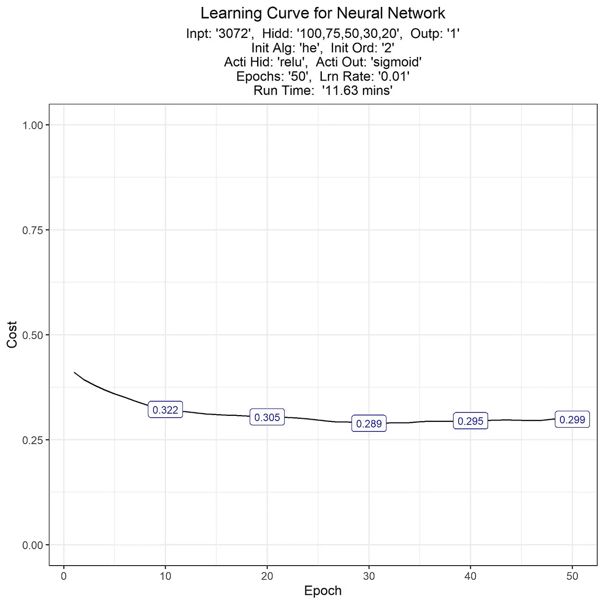

**图 8** :神经网络学习曲线

有用！这个情节证明了模型是在训练的，随着时间的推移，它在继续学习，提高性能。

请注意，成本线大约从`0.4`开始，并在 20 个时期后迅速下降到`0.3`。为了完成全部 50 个纪元，这大约需要`12 minutes`。这可以看作是一种成功。

## 14.3.进一步的实验

由于这些功能已经被设置的性质，进一步的实验和优化是非常容易的。

尝试以下方法可能是合理的:

1.  不同的隐藏层数或每层的节点数(改变`hidden_nodes`参数)，
2.  不同的初始化算法或初始化顺序(改变`initialisation_alghorithm`或`initialisation_order`参数)，
3.  隐藏层上的不同激活功能(改变`activation_hidden`参数)，
4.  每个时期不同的批次数量(更改`batches`参数)，
5.  不同数量的时期(改变`epochs`参数)，
6.  不同的学习率(改变`learning_rate`参数)，
7.  获取更多数据(回想在 [**下载数据**](#64db) 部分，仅`10,000`图像被下载；但是还有另一个`50,000`图像可用于进一步训练)。

这是一个尝试不同参数的实验。注意结果是如何变化的。这下一轮训练花了`34 minutes`跑。

```
training_output <- let_TrainModel(
    x_train=trn_img, 
    y_train=trn_cls,
    input_nodes=dim(trn_img)[2],
    hidden_nodes=c(100,75,50,30,20), 
    output_nodes=1,
    initialisation_algorithm="xavier", 
    initialisation_order="layers",
    activation_hidden="relu", 
    activation_final="sigmoid",
    batches=56, epochs=100, 
    learning_rate=0.001,
    verbosity=20, 
    print_learning_curve=TRUE
)
```

它打印:

```
Learning rate: 0.001
Epoch 20, Cost: 0.33354, Time: 5.4 mins
Epoch 40, Cost: 0.29891, Time: 10.26 mins
Epoch 60, Cost: 0.30255, Time: 15.2 mins
Epoch 80, Cost: 0.29968, Time: 20.84 mins
Epoch 100, Cost: 0.29655, Time: 26.09 mins
```

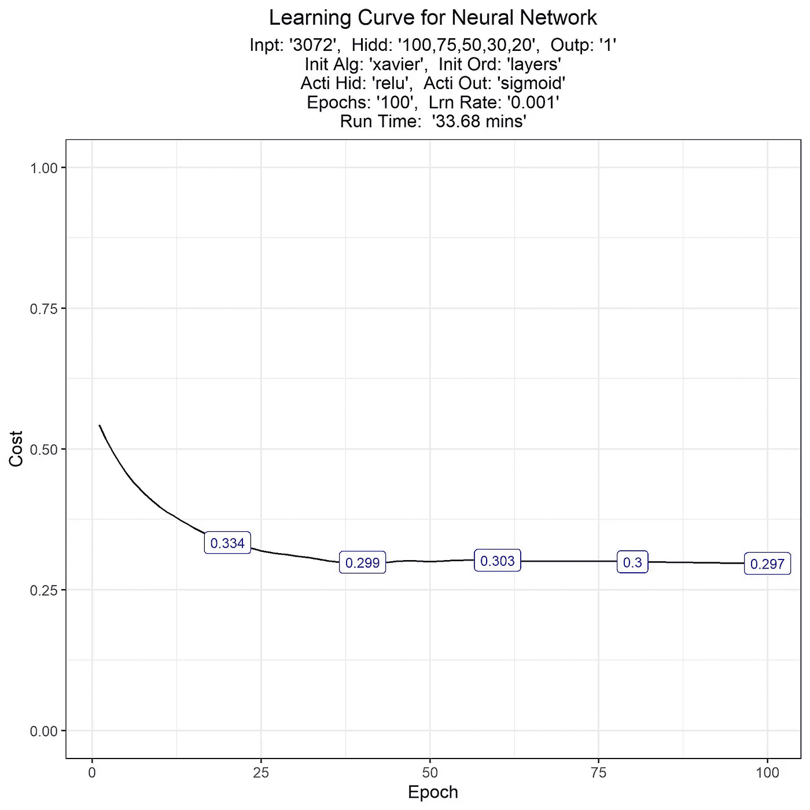

**图 9** :神经网络的第二条学习曲线

然后，数据科学家的工作是确定这些参数的最佳配置，以实现更好的性能比率。参见[机器学习模型中的超参数优化](https://www.datacamp.com/community/tutorials/parameter-optimization-machine-learning-models)了解更多详情。

然而，由于这篇文章不是为了让*达到*最佳结果，而是为了让*展示*如何达到所述结果，以及所涉及的过程/方法。因此，本文不再做进一步的实验。

# 15.创建预测

训练完网络后，下一步是将它应用于`test`数据，看看它能多准确地预测未知数据。

## 15.1.设置预测

第一步是编写两个自定义函数。第一个将接受测试数据和训练模型，并将返回包含预测值和真实值的数据框。然后以一种`ggplot`风格的输出漂亮地打印出混淆矩阵。

```
get_Prediction <- function(
    x_test, 
    y_test, 
    network_model, 
    threshold=0.5
    ) {

    # Create prediction
    predic <- set_ForwardProp(
        network_model=network_model, 
        data_in=x_test, 
        activation_hidden="relu", 
        activation_final="sigmoid"
    )

    # Extract probabilities
    probas <- predic %>% 
        extract2("output") %>% 
        extract2("acti")

    # Define results
    result <- data.frame(
        probs=probas,
        truth=y_test
    )

    # Add prdic
    result %<>% 
        mutate(prdic=ifelse(probas>threshold, 1, 0))

    # Return
    return(result)

}plt_ConfusionMatrix <- function(confusion_matrix) { # Do work
    plot <- confusion_matrix %>% 
        extract("table") %>% 
        as.data.frame() %>% 
        rename_all(str_remove_all, "table.") %>% 
        rename("Prediction"=1, "Reference"=2) %>% 
        mutate(
            goodbad = ifelse(
                Prediction == Reference, 
                "good", 
                "bad"
            )
        ) %>%
        group_by(Reference) %>% 
        mutate(prop = Freq/sum(Freq)) %>% 
        ungroup() %>% 
        {
            ggplot(., 
                aes(
                    x = Reference, 
                    y = Prediction, 
                    fill = goodbad, 
                    alpha = prop
                )) +
                geom_tile() +
                geom_text(
                    aes(label = Freq), 
                    vjust = .5, 
                    fontface  = "bold", 
                    alpha = 1
                ) +
                scale_fill_manual(
                    values=c(good="green", bad="red")
                ) +
                scale_x_discrete(
                    limits=levels(.$Reference), 
                    position="top"
                ) +
                scale_y_discrete(
                    limits=rev(levels(.$Prediction))
                ) +
                labs(
                    title="Confusion Matrix",
                    subtitle=paste0(
                        "For: '", 
                        .$Prediction[1], 
                        "' vs '", 
                        .$Prediction[2], 
                        "'"
                    )
                )
        }

    # Return
    return(plot)

}
```

## 15.2.运行预测

下一步是实际运行预测。这一步是不言自明的。该函数的参数包括测试数据和训练模型。

```
# Create prediction
Prediction <- get_Prediction(
    tst_img, 
    tst_cls, 
    training_output[["network_model"]], 
    0.1
)
```

## 15.3.视图预测

创建了这个预测之后，接下来需要可视化输出。与 [**检查图像**](#5d00) 部分相同，以下代码块显示了前 16 个图像，并为每个图像返回一个标签。

正如所见，该模型显然能够识别一些，但它也犯了其他错误。

```
# Define classes
ClassList <- c("0"="Not", "1"="Car")# Set list
lst <- list()# Loop 16 images
for (image in 1:16) {
    lst[[image]] <- plt_PlotImage(
        cifar$images[-partition,,,], 
        Prediction[["prdic"]], 
        ClassList,
        image
    )
}# View images
gridExtra::grid.arrange(grobs=lst, ncol=4)
```

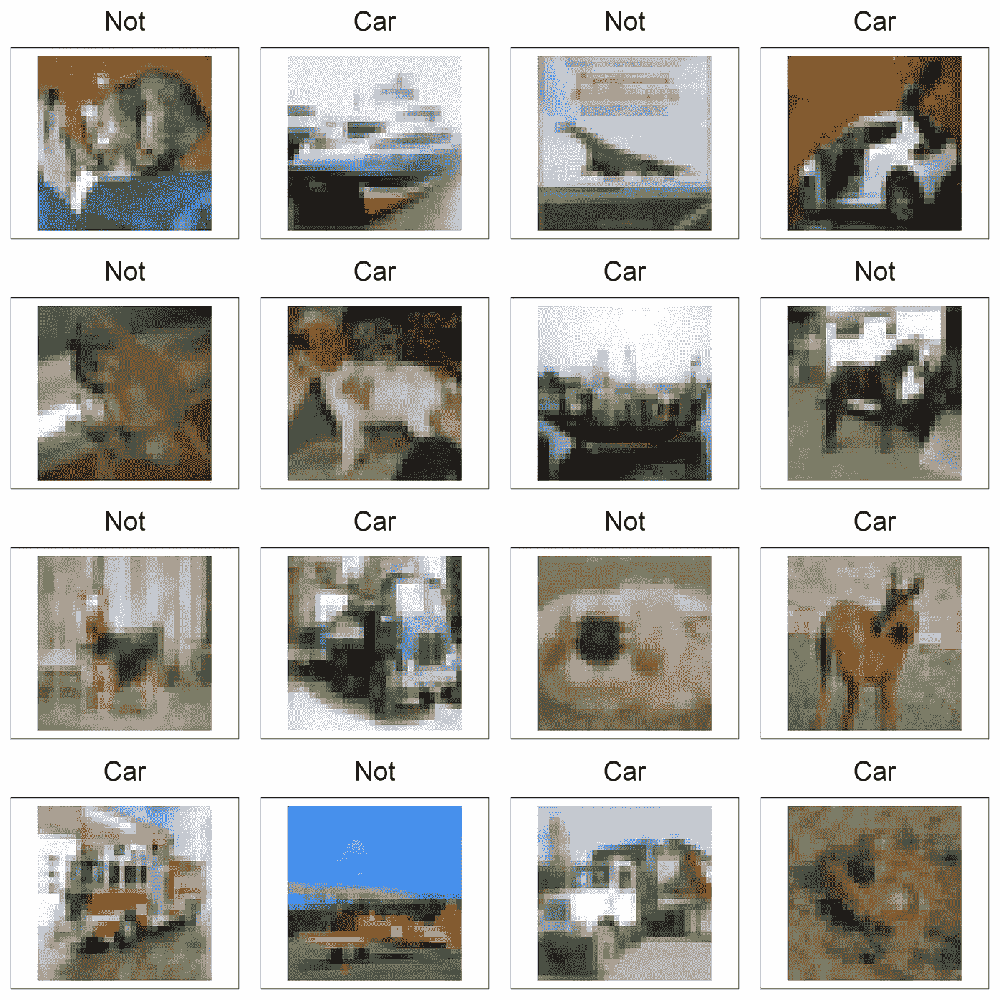

**图 10** :预测图像

## 15.4.检验预测

下一步是对数据进行统计测试，看看它有多准确。为此，使用了`confusionMatrix()`功能(来自`caret`包)。根据该输出，可以选择适当的度量，以便进一步优化神经网络。

因为这篇文章仅仅是关于*展示*这个方法，所以我们不会在这里进行更多的优化。

```
# Set Up
ConfusionMatrix <- Prediction %>% 
    mutate_at(c("truth","prdic"), ~ifelse(.==1,"car","not")) %>% 
    select(prdic,truth) %>% 
    table %>% 
    caret::confusionMatrix()# Print
ConfusionMatrix %>% print()
```

它打印:

```
Confusion Matrix and Statisticstruth
prdic  car  not
  car  188 1118
  not  121 1573

               Accuracy : 0.587              
                 95% CI : (0.569, 0.605)     
    No Information Rate : 0.897              
    P-Value [Acc > NIR] : 1                  

                  Kappa : 0.079              

 Mcnemar's Test P-Value : <0.0000000000000002

            Sensitivity : 0.6084             
            Specificity : 0.5845             
         Pos Pred Value : 0.1440             
         Neg Pred Value : 0.9286             
             Prevalence : 0.1030             
         Detection Rate : 0.0627             
   Detection Prevalence : 0.4353             
      Balanced Accuracy : 0.5965             

       'Positive' Class : car
```

下一步是绘制混淆矩阵。理解和解释混淆矩阵的一个很好的来源可以在这里找到:[混淆矩阵](https://en.wikipedia.org/wiki/Confusion_matrix)。在这个网站中，它还包括一个图像(也复制在下面)，以获得非常好的视觉理解。

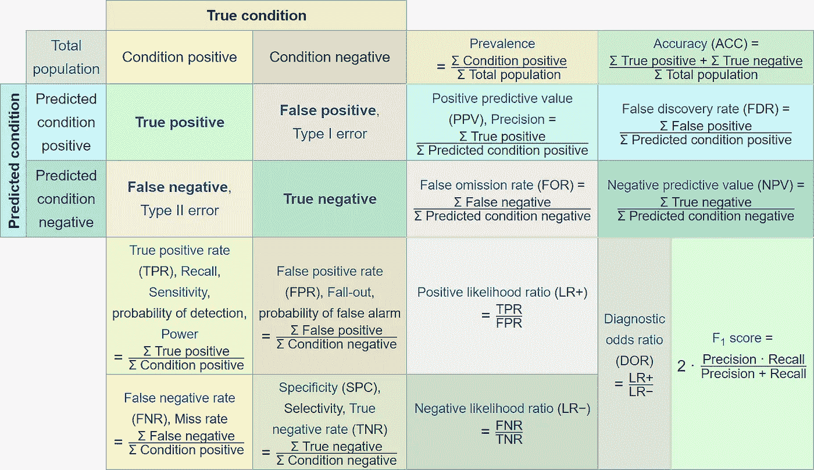

**图 11** :混淆矩阵度量

当我们可视化我们的模型的混淆矩阵时，我们可以看到它成功地预测了大多数图像。然而，最大数量的坏分类是当它预测图像是一辆汽车时，而它实际上不是。

```
# Plot Confusion Matrix
ConfusionMatrix %>% 
    plt_ConfusionMatrix()
```

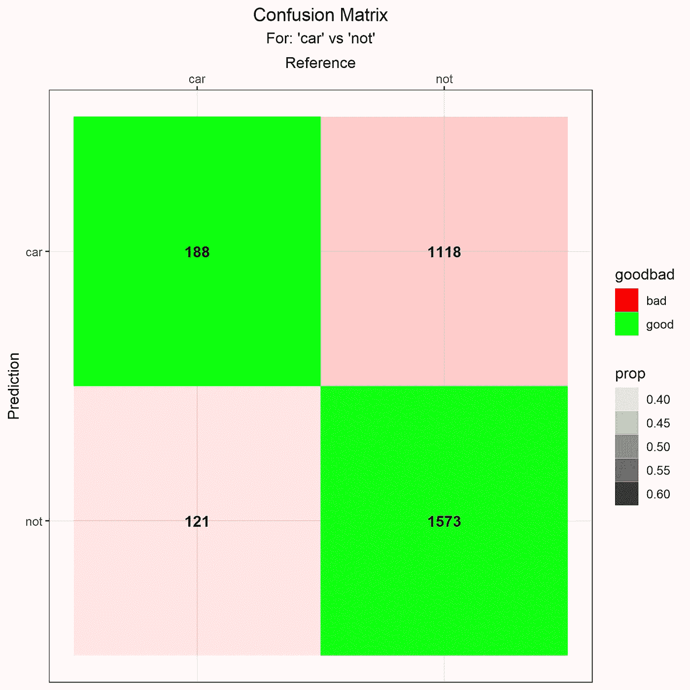

**图 11** :生成混淆矩阵

另一个好的分析和绘图工具是使用 ROC 曲线(接收机工作特性)。一条 ROC 曲线是一个图表，它说明了一个二元分类器系统的诊断能力，因为它的区分阈值是变化的(见[接收器操作特性](https://en.wikipedia.org/wiki/Receiver_operating_characteristic))。

本质上，一个创建完美预测的模型将使曲线完美地“拥抱”该图的左上角。由于我们的模型没有做到这一点，显然进一步的训练和优化是必要的。为此，有必要继续进行 [**进一步实验**](#4af2) 一节中提到的实验。

```
# Print ROC
Prediction %>% 
    ggplot() +
    plotROC::geom_roc(aes(m=probs, d=truth), n.cuts=0) +
    plotROC::style_roc(
        theme=theme_grey,
        ylab="True Positive Rate",
        xlab="False Positive Rate"
    ) +
    theme(
        plot.title = element_text(hjust=0.5),
        plot.subtitle = element_text(hjust=0.5)
    ) + 
    labs(
        title="ROC Curve",
        y="True Positive Rate",
        x="False Positive Rate"
    )
```

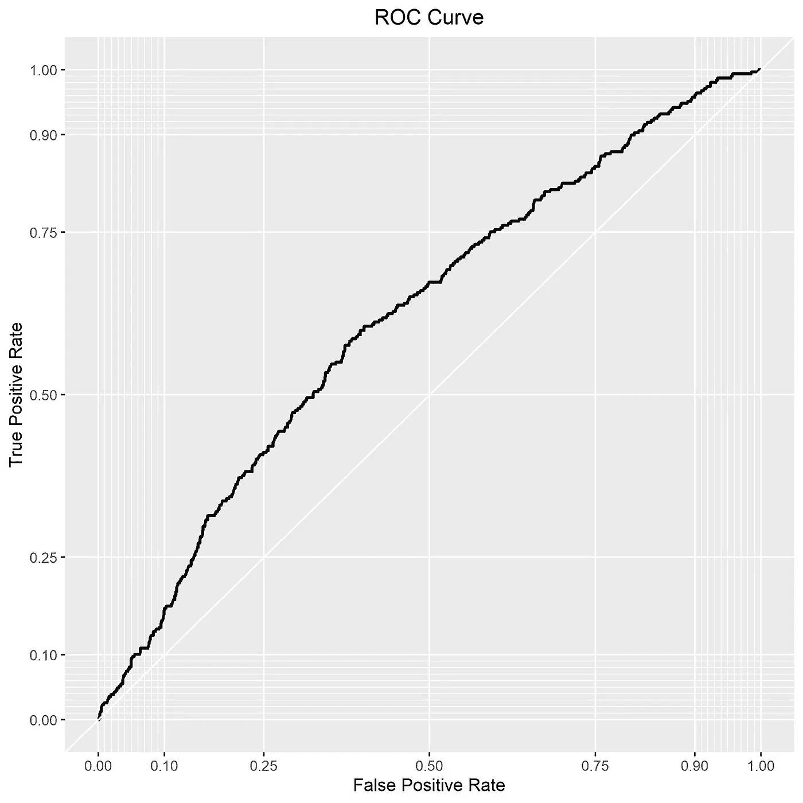

**图 12** : ROC 曲线

# 16.结论

这是如何在`R`中构建香草神经网络的有效表示。在这里，我们展示了如何:

1.  访问并检查数据
2.  实例化和初始化网络
3.  向前传播
4.  计算成本
5.  反向传播
6.  更新模型
7.  建立一个训练方法来循环每一件事
8.  预测和评估绩效

它还展示了如何完全在`R`中做到这一点，而不使用任何预定义的深度学习框架。当然，有其他的包可以执行所有的步骤，并且可能以一种计算效率更高的方式。但是这些包的使用不是本文的目标。在这里，目的是消除“黑箱”现象，并展示如何从头开始创建这些深度学习框架。

如图所示，这些前馈神经网络的架构有效地使用了[矩阵乘法](https://en.wikipedia.org/wiki/Matrix_multiplication)和[微分](https://en.wikipedia.org/wiki/Differential_calculus)来调整网络的“权重”，并增加其预测能力。它确实需要大量的数据，也确实需要很长时间来训练和优化。此外，还有许多(许多，*许多*)不同的架构可供选择，所有这些都由应用该方法的数据科学家决定。

说到底，这篇文章已经证明了深度学习绝对可以在`R`中实现。从而破除了“为了做深度学习，你必须使用`Python`”的迷思。当然，深度学习在`Python`有很多成功的实现；比如:[用 Python 从零开始构建前馈神经网络](https://hackernoon.com/building-a-feedforward-neural-network-from-scratch-in-python-d3526457156b)。在 Swift 中也有实现相同目标的例子([Swift 中的深度神经网络，经验教训](https://www.tooploox.com/blog/deep-neural-networks-in-swift-lessons-learned))，在 C++中也有实现相同目标的例子([从零开始用 C++实现神经网络](https://www.geeksforgeeks.org/ml-neural-network-implementation-in-c-from-scratch/))，在 Java 中也有实现相同目标的例子([用纯 Java 实现人工神经网络(无外部依赖性)](https://medium.com/coinmonks/implementing-an-artificial-neural-network-in-pure-java-no-external-dependencies-975749a38114))。因此，所使用的具体语言实际上是不相关的。重要的是用例、环境、业务工件以及数据科学家感到舒适的语言。

# 17.附言

**鸣谢**:本报告是在他人的帮助下编写的。致谢:
— [亚历克斯·斯克里文](https://www.linkedin.com/in/alexjscriven/)

**出版物**:本报告同时在以下网站发布:
—RPubs:[RPubs/chrimaho/VanillaNeuralNetworksInR](https://rpubs.com/chrimaho/VanillaNeuralNetworksInR)
—GitHub:[GitHub/chrimaho/VanillaNeuralNetworksInR](https://github.com/chrimaho/VanillaNeuralNetworksInR)
—Medium:[Medium/chrimaho/VanillaNeuralNetworksInR](https://medium.com/@chrimaho/43b028f415?source=friends_link&sk=f47b3d6f9f539e907d272966fa88bcb8)

**变更日志**:本出版物在以下日期修改:
—02/11/2020:原始出版日期。