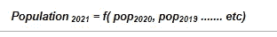
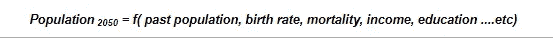
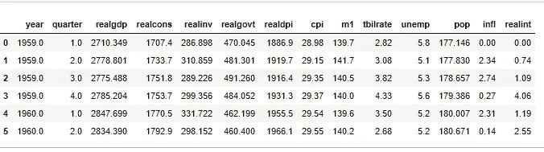
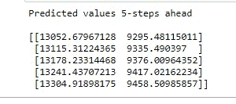
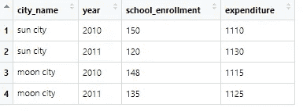
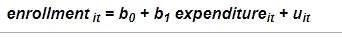
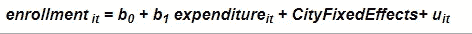
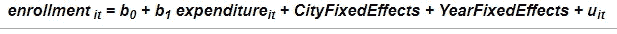
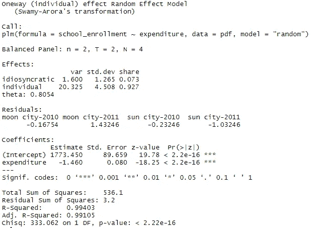

# VAR 和面板数据模型——多元预测技术的发电站

> 原文：<https://towardsdatascience.com/var-and-panel-data-models-the-powerhouse-of-multivariate-forecasting-techniques-22b8d8888141?source=collection_archive---------28----------------------->

[艾伦蔡](https://unsplash.com/@aycai?utm_source=medium&utm_medium=referral)在 [Unsplash](https://unsplash.com?utm_source=medium&utm_medium=referral) 上的照片

## 时间序列

## 超越单变量时间序列预测

我们来做一个思维实验。

你是一家专门从事销售预测的预测分析公司。您的客户是一家大型食品连锁店，他要求您预测未来 30 天的销售量。

现在，您将寻找哪些信息来进行预测？

当然是过去的销售数据。假设你得到了他们过去两年的销售数据。所以你的预测模型变成了这样:

> *未来销售额= f(过去销售额)*

现在想想，你能有多自信地说，只用这一个历史数据集，你就能做出一个好的、合理的预测？

在现实世界中当然不是这样。在现实世界中，预测历史销售额只是一条信息，但你还会寻找商店位置、法定假日、任何特殊事件、广告支出或促销活动等，事实上，每一条影响销售的信息。

这些信息的每一部分实质上都成为了预测模型中的一个变量:

> 未来销售额= f(过去的销售额、特殊事件、假期、促销……)

这就是多元预测的力量所在。现实世界是相互联系的，一个过程的结果通常是多个输入和动作的结果。因此，难怪数据科学家会寻找与构建预测模型相关的每一条信息。

在本文中，我将讨论两个强大的多变量时间序列预测模型——向量自回归(VAR)和面板数据模型——并用两种不同的编程语言——Python 和 r——的代码片段演示它们的应用。

所以让我们开始吧。

# 一.向量自回归模型

## a)什么是向量自回归？

在定义*向量自回归*之前，让我们了解一下什么是*自回归*。顾名思义，它是一个变量对自身的回归，对它过去的值的回归——就像我刚刚在引言中写的那样。在这种情况下，独立变量是被预测的同一个单变量数据序列的过去值。

*向量自回归*概括了这一单变量概念，并允许在模型中包含额外的相关变量。在这种情况下，每个变量都使用其自身的过去值(滞后值)以及外部因素的滞后值进行预测。

## **a)风险值模型的工作原理**

在单变量预测技术中，未来值被预测为过去值的函数。所以，如果你想预测一个城市在 2021 年的人口，你需要一个简单的单变量预测方法:

但如果你想在更长的时间范围内做出预测(比如 2050 年的人口)，我们知道还有许多其他因素需要考虑——出生率、死亡率、教育、收入等等。这些因素被称为外源因素或*协变量*。在短期内，这些外部因素的影响不是很大，所以我们可以忽略它们，但从长期来看，它们的影响是复合的，并产生了可测量的差异。

VAR 就是这样一种在建模过程中融入外生变量的多变量预测模型。在此过程中，因变量使用其自身的过去(滞后)值以及外部因素的滞后值进行预测。

## c)用 Python 实现

为了演示它是如何工作的，我使用了一个由 14 个不同变量组成的美国宏观经济数据集。这是从 1959 年到 2009 年的季度数据。然而，出于演示的目的，我只使用了两个变量:国内生产总值(realgdp)和个人消费支出(realcons)。您可以按照下面代码片段中的代码访问数据集。

用于 VAR 实施的完整数据集的几行

我将使用一个 Python 环境来利用其非常丰富的`statsmodels`库，这是一个非常灵活的 VAR 实现选项的来源。演示的数据集也来自这个 API。

所以这个练习的目标是对未来的*实际 gdp* 和*实际成本*进行 5 个时间步的预测。

# 二。面板数据模型

## a)什么是面板数据？

如果你之前没有听说过*面板数据*你并不孤单。但是我确信你以前见过这种数据，你只是不知道它有一个名字。以下是面板数据的正式定义:

*一个* ***面板数据*** *是一个观察值的多维数据，随着时间的推移被反复测量。*

简单地说，一个面板数据是对同一个对象或个体的重复观察。看看下面这些虚构的数据，它们可能比阅读定义更直观:

**图:假想面板数据表**

## b)面板数据模型如何工作？

从概念的角度来看，面板数据很像多元 OLS 回归，但比正常的 OLS 更有效。使用上述数据集，假设您对以下问题感兴趣:

> **城市支出增加了入学人数吗？**

通过运行 OLS，我们可以快速检查城市支出和学校招生之间是否存在关联，并构建一个模型:

*支出= f(学校招生)*

然而，数据集不是普通的数据框架；这是一个面板数据，有两个额外的列——城市名称和年份——我们也可以在模型中使用。下面是三种不同的方法来构建模型，每种方法都增加了额外的可变效果。

***汇集 OLS 模式***

***固定特效模式***

***随机效果模型***

## c)在`R`中的实施

我喜欢 Python，但这是我在 r 上看到的为数不多的情况之一。它有一个强大的库叫做`plm`,你可以用它只用几行代码构建面板数据模型。而且非常直观。

下面我正在创建一个关于随机效果模型的演示，但是你可以通过将模型类型(第 16 行)从“随机”改为“池化”或“内化”以及一些其他的建模变化来玩代码。

**图:模型输出汇总**

## 最后的想法

本文的目的是展示两种强大的多元预测技术——向量自回归和面板数据模型——在现实应用中的价值。为什么要多元预测？因为单变量预测有其自身的局限性。认为未来完全依赖于过去是一个过于简单的假设。

建立模型的目的是为了重现和模仿现实世界。现实世界是复杂且相互关联的，因此这需要在我们的模型中得到反映。