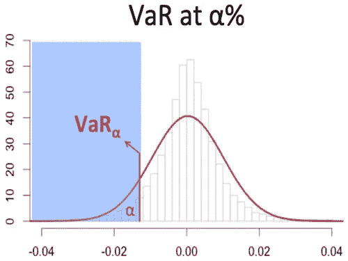
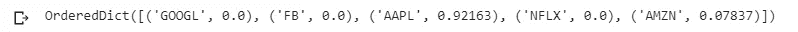
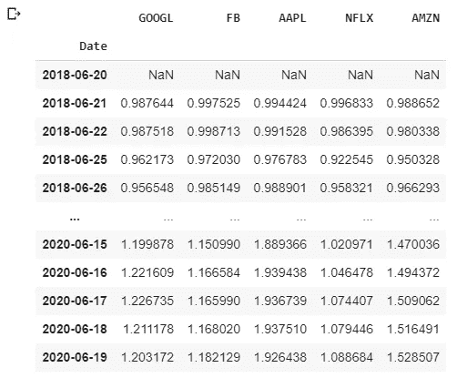
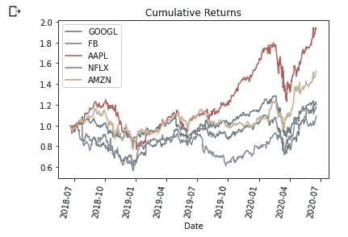
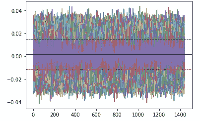
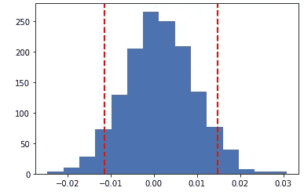
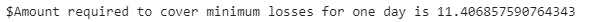

# 使用蒙特卡罗模拟的投资组合风险管理

> 原文：<https://towardsdatascience.com/var-calculation-using-monte-carlo-simulations-40b2bb417a67?source=collection_archive---------7----------------------->

## 如何使用 Python 和蒙特卡罗模拟自动计算风险价值(VaR)来管理投资组合或股权和股票的金融风险


在 [Unsplash](https://unsplash.com?utm_source=medium&utm_medium=referral) 上由 [Austin Distel](https://unsplash.com/@austindistel?utm_source=medium&utm_medium=referral) 拍摄的照片

## 金融和投资组合风险管理中的 VaR？

VaR 是“风险价值”的首字母缩写，是许多公司和银行用来确定其公司内部金融风险水平的工具。风险值是为一家公司的投资计算的，或者可能是为了检查由银行财富管理部门或精品公司管理的投资组合的风险水平。

该计算可以被认为是孤立的统计测量。也可以简化为下面的语句示例-

> VaR 是在一定概率水平(置信区间)下发生的最小损失或在一定概率水平下实现的最大损失。



图片来源——SP 咨询 LLP 公司

上图显示了一家公司在α **%** 信心下可能面临的最大损失。在个人层面上，VaR 可以帮助你预测或分析你的投资组合可能面临的最大损失——这是我们将很快分析的内容。

## 蒙特卡洛模拟

蒙特卡洛模型是斯坦尼斯瓦夫·乌拉姆和约翰·诺伊曼的发明，他们在第二次世界大战后开发了这个模型。该模型是以摩纳哥的一个赌博城市命名的，这是因为赌博中面临的机会和随机遭遇。

蒙特卡洛模拟是一种概率模型，它生成与经济因素(预期回报、波动性——在基金投资组合的情况下)一起使用的随机变量，以预测大范围内的结果。虽然不是最准确的，但该模型通常用于计算风险和不确定性。

我们现在将使用蒙特卡洛模拟来为我们的资产组合生成一组预测回报，这将帮助我们找出我们投资的风险值。

## **用 Python 计算 VaR**

我们将首先通过导入所需的库和函数来设置笔记本

```
#Importing all required libraries
#Created by Sanket Karve
import matplotlib.pyplot as plt
import numpy as np
import pandas as pd
import pandas_datareader as web
from matplotlib.ticker import FuncFormatter
!pip install PyPortfolioOpt
#Installing the Portfolio Optimzation Libraryfrom pypfopt.efficient_frontier import EfficientFrontier
from pypfopt import risk_models
from pypfopt import expected_returns
from matplotlib.ticker import FuncFormatter
```

为了我们项目的目的，我考虑了过去两年的‘FAANG’股票。

```
tickers = ['GOOGL','FB','AAPL','NFLX','AMZN']
thelen = len(tickers)
price_data = []
for ticker in range(thelen): prices = web.DataReader(tickers[ticker], start='2018-06-20', end = '2020-06-20', data_source='yahoo') price_data.append(prices[['Adj Close']])df_stocks = pd.concat(price_data, axis=1)
df_stocks.columns=tickers
df_stocks.tail()
```

下一步，我们将计算每项资产的投资组合权重。我已经通过使用为达到最大夏普比率而计算的资产权重做到了这一点。我已经发布了下面计算的代码片段。

```
#Annualized Return
mu = expected_returns.mean_historical_return(df_stocks)
#Sample Variance of Portfolio
Sigma = risk_models.sample_cov(df_stocks)#Max Sharpe Ratio - Tangent to the EF
from pypfopt import objective_functions, base_optimizer
ef = EfficientFrontier(mu, Sigma, weight_bounds=(0,1)) #weight bounds in negative allows shorting of stocks
sharpe_pfolio=ef.max_sharpe() #May use add objective to ensure minimum zero weighting to individual stocks
sharpe_pwt=ef.clean_weights()
print(sharpe_pwt)
```



最大夏普比率的资产权重

资产权重将用于计算预期投资组合回报。

```
#VaR Calculation
ticker_rx2 = []#Convert Dictionary to list of asset weights from Max Sharpe Ratio Portfoliosh_wt = list(sharpe_pwt.values())
sh_wt=np.array(sh_wt)
```

现在，我们将把投资组合的股票价格转换成累计回报，这也可以被认为是该项目的持有期回报(HPR)。

```
for a in range(thelen): ticker_rx = df_stocks[[tickers[a]]].pct_change()
  ticker_rx = (ticker_rx+1).cumprod()
  ticker_rx2.append(ticker_rx[[tickers[a]]])ticker_final = pd.concat(ticker_rx2,axis=1)
ticker_final
```



```
#Plot graph of Cumulative/HPR of all stocksfor i, col in enumerate(ticker_final.columns):
  ticker_final[col].plot()plt.title('Cumulative Returns')
plt.xticks(rotation=80)
plt.legend(ticker_final.columns)#Saving the graph into a JPG file
plt.savefig('CR.png', bbox_inches='tight')
```



现在，我们将挑选出每项资产的最新 HPR，并用*将收益乘以计算出的资产权重。点()*功能。

```
#Taking Latest Values of Returnpret = []
pre1 = []
price =[]for x in range(thelen):
  pret.append(ticker_final.iloc[[-1],[x]])
  price.append((df_stocks.iloc[[-1],[x]]))pre1 = pd.concat(pret,axis=1)
pre1 = np.array(pre1)
price = pd.concat(price,axis=1)
varsigma = pre1.std()
ex_rtn=pre1.dot(sh_wt)print('The weighted expected portfolio return for selected time period is'+ str(ex_rtn))#ex_rtn = (ex_rtn)**0.5-(1) #Annualizing the cumulative return (will not affect outcome)price=price.dot(sh_wt) #Calculating weighted value
print(ex_rtn, varsigma,price)
```

计算出预期投资组合回报和波动性(预期回报的标准差)后，我们将建立并运行蒙特卡洛模拟。我用了 1440(一天中的分钟数)的时间进行了 10，000 次模拟运行。时间步长可以根据要求而改变。我使用了 95%的置信区间。

```
from scipy.stats import normimport mathTime=1440 #No of days(steps or trading days in this case)lt_price=[]final_res=[]for i in range(10000): #10000 runs of simulation daily_return=                     (np.random.normal(ex_rtn/Time,varsigma/math.sqrt(Time),Time))
  plt.plot(daily_returns)plt.axhline(np.percentile(daily_returns,5), color='r', linestyle='dashed', linewidth=1)plt.axhline(np.percentile(daily_returns,95), color='g', linestyle='dashed', linewidth=1)plt.axhline(np.mean(daily_returns), color='b', linestyle='solid', linewidth=1)plt.show()
```



一天 1440 分钟的回报范围|红色虚线-最小损失|绿色虚线-最小收益

可视化回报的分布图为我们呈现了下面的图表

```
plt.hist(daily_returns,bins=15)plt.axvline(np.percentile(daily_returns,5), color='r', linestyle='dashed', linewidth=2)plt.axvline(np.percentile(daily_returns,95), color='r', linestyle='dashed', linewidth=2)plt.show()
```



打印上限和下限的精确值，并假设我们的投资组合价值为 1000 美元，我们将计算出应该保留以弥补最小损失的资金量的估计值。

```
print(np.percentile(daily_returns,5),np.percentile(daily_returns,95)) #VaR - Minimum loss of 5.7% at a 5% probability, also a gain can be higher than 15% with a 5 % probabilitypvalue = 1000 #portfolio valueprint('$Amount required to cover minimum losses for one day is ' + str(pvalue* - np.percentile(daily_returns,5)))
```



每天的最小损失为 1.14%，概率为 5%

得出的金额将意味着弥补你每天损失所需的金额。结果也可以解释为你的投资组合以 5%的概率面临的最小损失。

## 结论

上述方法显示了我们如何计算投资组合的风险价值(VaR)。复习使用现代投资组合理论(MPT) 计算一定投资金额的投资组合[，将有助于巩固您对投资组合分析和优化的理解。最后，VaR 与蒙特卡洛模拟模型相结合，也可用于通过股价预测损益。这可以通过将生成的每日回报值乘以相应股票的最终价格来实现。](/automating-portfolio-optimization-using-python-9f344b9380b9)

*所有表达的观点都是我自己的。这篇文章不被视为专家投资建议。*

*随时联系我*[*LinkedIn*](https://www.linkedin.com/in/sanketkarve/)*|*[*Twitter*](https://twitter.com/Go0n3r)*给我留言*