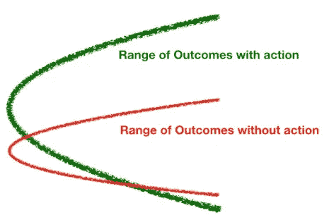
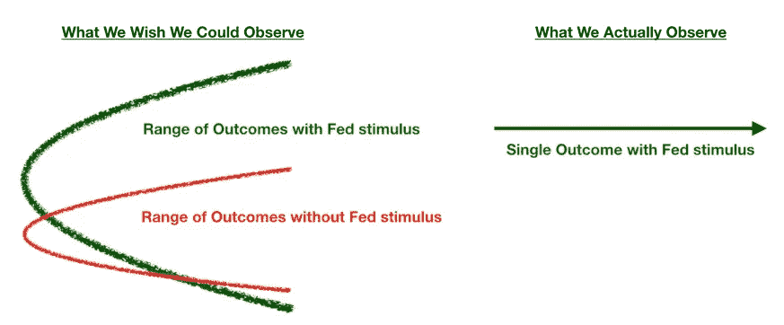

# 注入差异的思维

> 原文：<https://towardsdatascience.com/variance-infused-thinking-49f3e780890d?source=collection_archive---------52----------------------->


Riho Kroll 在 [Unsplash](https://unsplash.com?utm_source=medium&utm_medium=referral) 上拍摄的照片

## 要成为一名成功的数据科学家或分析从业者，我们需要练习从概率的角度看待世界

历史看起来是确定的，而且经常被这样解释。本世纪初的科技泡沫显然是一个泡沫，正如所有泡沫都会发生的那样，它最终破裂了。20 世纪 80 年代的日本房地产，2008 年的美国房地产，20000 美元的比特币，杂草股等等也是如此。在崩盘后的几年里，历史学家关注的是风险有多明显，最终的内爆有多不可避免。

成功的故事也是如此。迈克尔·乔丹作为篮球运动员的无与伦比的成功基本上是命中注定的，这要归功于他独特的运动能力和竞争力的完美结合。谷歌和亚马逊世界一流的算法和执行能力意味着万亿美元的市值是不可避免的。

我可能有点夸大其词，但是很多人看待历史的一个主要缺陷是他们通过决定论的视角来看待历史。部分原因是历史是线性的——只有一系列事件导致了今天，而这一系列事件就是历史书上所描述的。历史书不会深究如果，比如如果四年前特朗普输给了克林顿会怎样；相反，他们关注(可能过度关注)过去和现在。

# 决定性思维的陷阱

我经常想知道为什么概率被认为是数据科学家的必修知识。日复一日，我很少使用概率——在我的日常工作中，我更多地使用统计学、矩阵代数和机器学习。我得出的答案是:概率很重要，因为数据科学家需要学习概率思维。**概率性思维意味着认识到结果的序列不是确定的——而是每一个结果本身都是因果关系(或相关性)和机会的混合产物。**

下表显示了这种差异。假设我们观察到以下事件序列(只观察了一次):A，然后 B，然后 C。观察世界的确定性方法会得出结论，A 导致 B，B 导致 C。在未来，如果我们再次看到 A，我们会假设 C 就在眼前。这种想法有三个陷阱:

1.  我们在不该推断的时候推断出强因果关系(特别是考虑到我们只有一个样本)。
2.  我们没有意识到机遇对结果的巨大影响。
3.  我们只根据结果来判断过程。

```
**Deterministic:** A ----> B ----> C
```

另一方面，一种看待事物的概率方法认为，如果 A 出现(也有可能 A 不会出现)，那么它后面可能是 B 或 E(或其他)。无论发生哪种情况，B 或 E，都可能导致一系列后果。因此，即使 A -> B -> C 是我们所观察到的，这并不意味着下一次我们再次看到 A 时，我们应该期待 C。

```
**Probabilistic:** if A ----> B ----> C
         \       \----> D
          \   
           \--> E ----> F
            \    \----> G
             \    \---> H
              \
               \------> Other
```

相反，实际发生的事情，C，可能是最不可能的结果。例如，不久前赫兹(一家破产公司)的股票风靡一时。比方说，我买了一些赫兹看涨期权(对股票的杠杆化押注)，几天后卖出，获得了可观的利润。**同样为了完整起见，假设 Hertz 的股票上涨了 100%，我的期权将上涨 300%——因此，如果我下注 1000 美元，Hertz 翻倍，我将净赚 3000 美元。**赚钱后，我的大脑大概会经历以下想法:

```
Buy HTZ calls ----> Make money ----> I'm a good investor
```

但这将是一个错误。我甚至可能再次走运，在其他一些蹩脚的破产公司身上下注赚钱；但在某个时候，小鸡会回家休息，我会失去一切。这是因为我没有诚实地思考我的赫兹赌注的可能结果范围，也就是结果锥(我也没有考虑如果我投资其他地方会发生什么)。相反，我过于关注积极的结果。更现实和全面的评估将实现以下目标:

*   赫兹是一家破产的公司。因此，如果提振股票的动物精神突然蒸发，就没有实际的商业价值来保护我的投资不成为零。
*   由于标的股票的波动性，赫兹期权非常昂贵，其每日波动幅度超过 100%(上下波动)。这意味着股票必须大幅上涨，期权才能兑现——这不是一个很可能的结果。

我们可以用概率画出一个更真实更完整的结果树(下图)。既然我们已经描绘出了可能的结果范围，我们可以看到我的赌博是多么愚蠢。我有 5%的机会扭亏为盈，95%的机会亏损(因为你失去了期权到期时你支付的全部溢价)。此外，由于期权非常昂贵(由于波动性)，对我有利的巨大波动的回报只有 3:1——但基于波动的低赔率，**我应该要求 20:1 的回报。考虑回报也很重要——即使回报的概率很小，如果回报的大小超过了补偿，那么期望值仍然可以是正的。**

所以总而言之，不，我根本没有做好投资，我只是经历了一场幸运的赌博——这绝对是一个运气掩盖了可怕过程的案例，从长远来看，这是不可持续的。

```
Buy HTZ calls ---> Stock up a lot (Pr. =5%) ----> Options up
          \
           \-----> Stock up a bit (Pr. =15%) ---> Options worthless
            \
             \---> Stock no change (Pr. =20%) --> Options worthless
              \
               \-> Stock down (Pr. =60%) -------> Options worthless
```

以这种方式陈述时，听起来非常明显——如此明显，你可能会想，谁会愚蠢到这样想呢？但是很多人都这样做。我想到的最明显的例子是某个总统因股市飙升而邀功:

```
Becomes president ----> Makes economy great ----> Stocks go up
```

每当他在推特上发布股价创纪录上涨或创历史新高的消息时，就会有成千上万的人陷入确定性思维的陷阱——他们开始相信股市肯定上涨了，因为经济表现良好；多亏了总统，经济发展得很好。但他们没有认识到以下事件的替代顺序和同样可信的解释:

*   股票市场通常与经济脱节。即使在经济低迷的时候，股票有时也会因为纯粹的机会而上涨(股票价格经常以违背理性和解释的方式波动)。因此，总统可能只是运气好(尽管他对经济造成了损害，但股票却不太可能上涨)，他正试图为这种运气邀功。这里有一个更现实的结果树(看起来很明显，我知道)，它也包括了可能发生的情况:

```
Becomes president ----> Hurts economy ----> Stocks go up anyway
                        with Trade War
                        and pandemic 
                        response                                  
                                  \-------> Stocks go sideways
                                   \
                                    \-----> Stocks go down
```

*   股票可能会上涨，因为自 2008 年崩盘以来，前所未有的大量流动性被注入金融系统，**，这与现任总统**无关(与央行政策关系更大)。此外，重要的是要认识到，即使美联储的印钞机全速运转，股价上涨也不是唯一的结果。这可能是最有可能的结果，但也有其他可能的和不太有利的结果。

```
Fed prints money ----> Stocks go up
                \
                 \---> Stocks go sideways
                  \
                   \-> Stocks go downPresident happens to be elected at the same time (unrelated)
```

# 正确的思考方式

从分析角度思考未来的正确方式是问:

> 如果我把这个游戏玩很多次，可能会有什么样的结果？



把未来想象成一个圆锥形的结果

我们应该总是从分布的角度来思考，把未来想象成一个以我们行动的预期结果为中心的潜在结果的圆锥(或任何最合理地接近分布的形状)。**此外，我们还需要考虑如果不采取行动的后果。**这就是像 [A/B 测试这样的受控实验背后的原理——一个实验有一个控制组和一个实验组，适当地隔离出要测试的因素(或行为)](/data-science-fundamentals-a-b-testing-cb371ceecc27)。

受控实验类似于模拟，允许我们反复观察如果我们采取行动(上图中的绿色圆锥)和如果我们不采取行动(红色圆锥)会发生什么。如果我们实验的样本量足够大，那么我们就可以对可能的结果范围有一个很好的认识，这使我们能够正确地评估所考虑的行动的预期效果(**它是否使我们朝着更理想的平均结果前进？**)和围绕行动效果的不确定性(**)它是否扩大了圆锥并引入了过度的风险？**)。

不幸的是，在现实世界中，我们经常没有足够的时间或数据来正确地做这件事。例如，如果美联储没有在 2008 年后向经济注入这么多资金，我们永远不会知道会发生什么。我们只能观察到发生的一组事件——所以我们不仅错过了红色圆锥(没有美联储印钞的结果)，我们甚至没有观察到绿色圆锥的变化(我们只看到一条绿线)。这就是为什么学者和专家可以争论到面红耳赤，量化宽松和大规模财政刺激是否真正有效，但事实是没有人真正知道(尽管大萧条提供了有用的教训，但它不是 2008 年的可比对照案例)。



事实上，我们只看到一系列事件

# 结论

如果听起来很累，那是因为确实很累。想得太多太累了！但我们做得越多，它就越成为习惯或根深蒂固的肌肉记忆。它提高了我们的分析能力——最重要的是，它提高了我们独立于过程产生的结果评估过程的能力。

良好的决策(无论是在个人、团体还是公司层面)需要一个强大的、可重复的分析过程。但是每一个决定，无论多么精明，仍然是一个赌注——即使是最有利的赌注也仍然受到偶然事件的影响。通过正确认识机会的作用，我们防止结果扭曲我们的过程(或模型)。通过磨练我们现实地预测采取行动(或不采取行动)的结果范围(以及概率)的能力，我们可以做到即使在不确定的世界中，胜算也是对我们有利的。