# 方差:样本与总体

> 原文：<https://towardsdatascience.com/variance-sample-vs-population-3ddbd29e498a?source=collection_archive---------26----------------------->

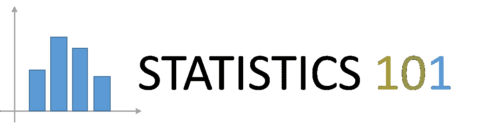

## 统计 101

## ML 中 EDA 的区别以及为什么使用一个而不是另一个


克里斯·贾维斯在 [Unsplash](https://unsplash.com/s/photos/abacus?utm_source=unsplash&utm_medium=referral&utm_content=creditCopyText) 上的照片

在统计学和机器学习中，当我们谈论人口时，我们指的是随机变量的可能值的整个宇宙。如果你知道总体总是可行的，计算平均值和方差如下:

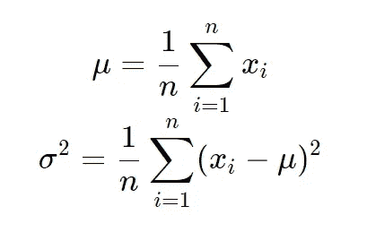

其中 *n* 是总体的*基数*(元素的数量)。

大多数时候，我们不能使用整个人口，因为它太复杂了，或者根本不可行。例如，考虑一个问题，当你想分析森林中橡树的高度时。当然，您可以测量森林中的每一棵树，从而收集整个森林的统计数据，但这可能非常昂贵，并且需要很长时间。相反，你可以获取一个样本，比如说，20 棵树，并尝试将样本统计数据和种群统计数据联系起来。因此，对于 *N* 个样本，我们有:

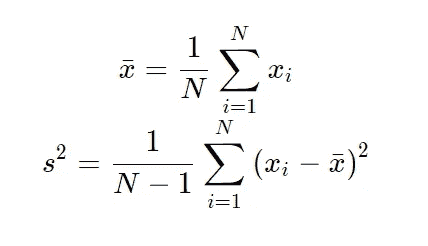

你现在可以问了:为什么 *N-1* 而不是 *N* ？要回答这个问题，我们需要做一些计算。首先，我们计算 *s* 2 的期望值:

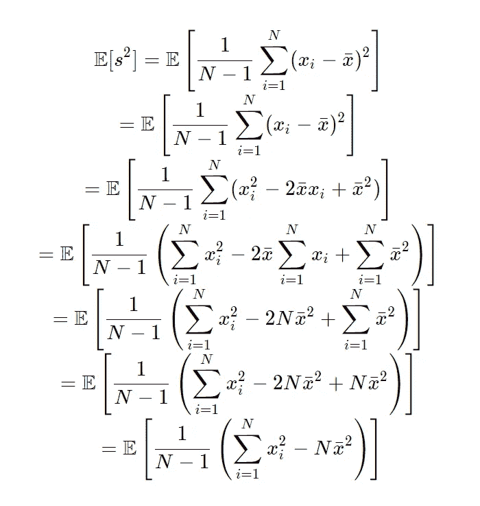

然后，用一点代数知识:

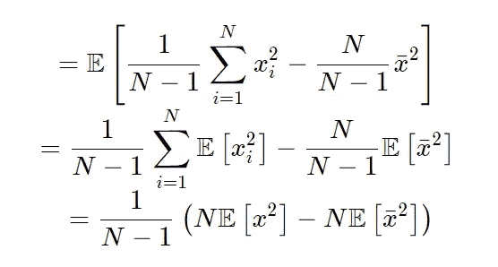

现在，记住:

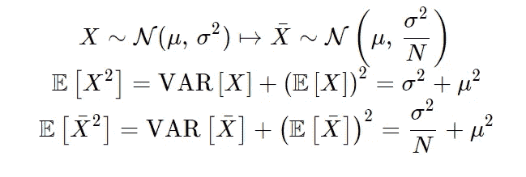

我们有:

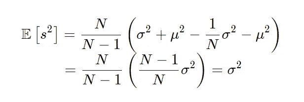

这是什么意思？ ***使用 N-1 的公式得出样本方差，平均起来等于未知总体方差。*** 所以，同样用很少的样本，我们就可以得到一个实际但未知的总体分布参数的合理估计。

如果我们用 *N* 而不是 *N-1* 来计算会怎么样？让我们看看:

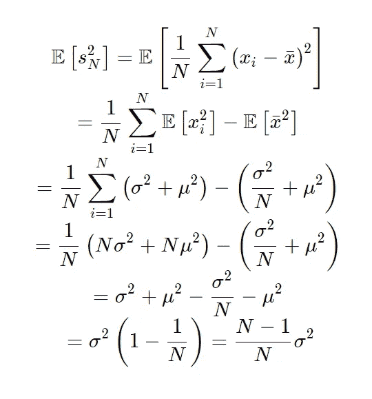

因此，当我们使用 *N* 而不是 *N-1，*时，我们会有一个称为*统计偏差*的误差，这意味着样本方差(估计量)与真实总体参数(在本例中为方差)存在系统性差异。

校正因子 *N/(N-1)* 被称为 ***贝塞尔因子*** 并允许获得无偏方差 s 的平均值作为有偏方差的函数:

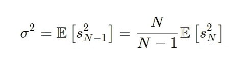

如何在机器学习问题上应用它？当我们试图对一个 ML 问题建模时，我们首先查看数据(在监督和非监督学习中)，搜索模式，统计参数，维度减少，特征选择等。这被称为*探索性数据分析*或 *EDA* 。无论是数值特征还是分类特征，我们首先要看观察值的分布。所以，最初，我们必须估计两个参数:平均值和方差。如果 *N* ，即观察值的数量很小，我们必须应用贝塞尔因子来更好地估计真实方差。如果 *N* 很大(我们会看到有多大)，我们可以省略这一项，因为 N/(N-1)大约等于 1。

所以，在一个问题上:

*   很少观察到
*   要素的值非常少(因为我们有一个有偏差的数据集)

我们必须应用校正因子。

在任何情况下，我们都不能对结果有信心，因为我们使用的是样本而不是总体。我们所能做的最好的事情是估计一个范围的值，在这个范围内实际方差落在(总体方差的*置信区间*)内。

让我们看一个例子。想象一片有 10000 棵橡树的森林:这是全部人口。我们想估计高度的分布。假设我们不知道身高呈正态分布，平均值为 10m，标准差(方差的平方根)为 2m。这些是整个人口的统计参数。我们试图通过随机抽取的 20 棵橡树样本来估算这些值。我们重复这个实验 100 次。以下是 Python 中的代码:

```
import numpy as np
import pandas as pd
from random import sample,choice
import matplotlib.pyplot as plt
import seaborn as sns
import scipynp.random.seed(1234)
mu = 10
sigma = 2
pop = np.random.normal(mu, sigma, 10000)
count, bins, ignored = plt.hist(pop, 100, density=True, color = 'lightgreen')
sns.set_style('whitegrid')
tests = 100
sam = []
mean =[]
std_b = []
std_u = []
fig, axs = plt.subplots(ncols=2)
sns.kdeplot(pop, bw=0.3, ax=axs[0])
for i in range(tests):
    sam_20 = np.random.choice(pop, 20)
    sns.kdeplot(sam_20, bw=0.3, ax=axs[1])
    sam.append(sam_20)
    mean.append(np.mean(sam_20))
    std_b.append(np.std(sam_20))
    std_u.append(np.std(sam_20, ddof=1))frame = {'mean':mean, 'std_b': std_b, 'std_u': std_u}
table = pd.DataFrame(frame)
```

这样，我们为 100 个实验*中的每一个实验获得样本均值"*均值"*标准差(有偏)" *std_b"* 和无偏( *ddof=1* 与 *(N-1)* 相同，而不是 *N* )标准差" *std_u"* 。从图形上看，我们得到:*

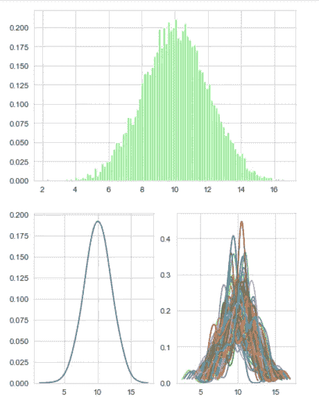

假设 20 个样本是 10000 个总体项目的一个很小的子集，每次我们运行测试，我们都会得到不同的分布。无论如何，*平均起来*，我们得到了真实均值和标准差的合理估计。我们可以在 Python 中使用以下命令看到这一点:

```
table.describe()
```

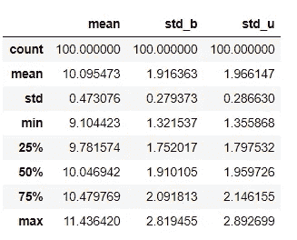

如您所见，平均而言，无偏样本标准差比有偏样本标准差更接近总体参数的值。

通过*置信度分析*来衡量这些评估的质量，我们将在下一次讨论。

## 结论

在本文中，我们已经看到了样本方差受统计偏差的影响，这是由于与整个总体的基数相比，很少观察到的数据发生了失真。我们学习了一种通过贝塞尔因子来减少这种误差的方法，并给出了一个例子。