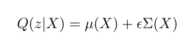
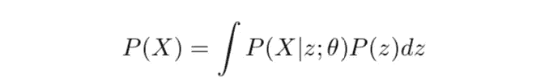
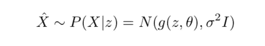
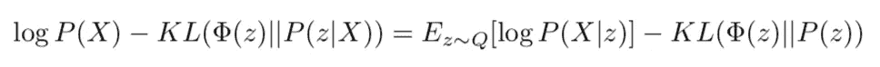
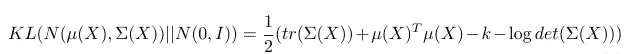

# 可变自动编码器

> 原文：<https://towardsdatascience.com/variational-autoencoders-63191b75c576?source=collection_archive---------17----------------------->

## VAE 和在哪里找到他们

因此，在过去两年的机器学习面试中，我被要求解释变分自动编码器(VAE)大约五次。对于某个公司来说，这个问题实际上是在同一天由两个不同的面试官重复提出的。

为什么 VAE 是如此受欢迎的面试问题？嗯，它们确实涵盖了概率论和信息论中的一些有趣的主题，而且它们被广泛使用，被认为是相对普通的知识。这些模型有一个独特的规格和一个长期的衍生。这意味着他们可以花 30 分钟走一遍，但仍然很容易让面试官验证。此外，人们通常只了解 VAE 背后的直觉，所以这是一个很好的面试问题(在我看来)。

显然，我真的不喜欢把 VAE 作为一个面试问题，但我也认为他们的申请由于其他原因被夸大了。在以后的文章中，我将推导出我所看到的这类“优化游戏”的真正的潜在机制。现在，让我们彻底了解一下 VAE，作为 VAE 召回的一站式商店。

# **自动编码器**

首先，自动编码器是神经网络的一种形式，其使用一些损失函数 L(x，r(x))专门训练重构函数 r = g(f (x))，以便产生更多信息和/或更低维度的数据重构。这个重构函数是编码函数 z = f(x，θ)和解码函数 x = g(z，θ)的组合，编码函数将数据映射到学习的潜在空间，解码函数 x = g(z，θ)充当生成函数，在潜在空间中为 z 产生 x。这种重建是通过无监督学习创建的，并且通常独立于任何标记或预测任务。

虽然神经网络最常用于生成高维参数化函数以解决判别任务，但自动编码器被训练来重新生成模型被训练的数据。如果我们对我们的损失函数进行正则化，并对我们的网络进行战略性结构调整，我们可以改变自动编码器的行为。

通过引入正则化子ω，我们可以影响我们的自动编码器学习的空间类型。一种这样的增强是稀疏自动编码器(SAE ),它学习稀疏潜在表示。考虑正则化损失函数项 L(x，r(x))+ω(z)，其中ω(z)=λ∑| z _ I |惩罚我们的潜在表示的分量的幅度。这种损失使自动编码器的编码函数 z = f (x，θ)发生偏移，以根据λ的标度为潜在表示的尽可能多的分量产生零或小的值。

作为正则化损失函数的一种替代方法，我们也可以考虑对输入到自动编码器的数据进行正则化。去噪自动编码器(DAE)旨在通过最小化准则 L_DAE = E[L(x，r(N(x))]]来生成简化的重建 r(x)，其中对于某些高斯误差ε = N (0，σ)，N(x) = x + ε。输入到网络中的数据本质上是被破坏的，模型学习过滤掉噪声，以便再现源数据。[1]

这些模型使用什么类型的信息来产生这些潜在的表征？自动编码器学习训练数据的概率密度 p(x)的流形结构
∂对数 p(x)/∂x。这种流形结构有助于引导数据潜在空间的构建。形式上，对于去噪自动编码器，可以示出我们产生以下最优重构函数 r*(x) = x + σ^2 ∂对数 p(x)/∂x + o(σ),其行为渐近于高斯噪声的方差。渐近行为(r *(x)-x)/σ→∂对数 p(x)/∂x 为
σ → 0 允许我们通过 p(x)上的诱导流形确定 x 的信息表示。[2]

# 可变自动编码器

变分自动编码器(VAE)产生了我们的潜在代表符合给定分布的愿望，以及变分推理过程的简单近似使计算易处理的观察。我们将回顾定义潜在空间分布的步骤，以及使用变分推论来训练我们的模型的步骤。

VAE 的嵌入机制是一种学习的编码分布 z = q(x ),可以更好地对数据集的潜在结构进行排序。根据这种分布，可以构建概括的推理模型，以便重现数据。通过概括，我们意味着当通过给定的生成函数 g(z)馈送时，从在潜在空间 Z 中的样本 Z 上学习的分布 P(Z)中抽取的样本更有可能产生我们的原始数据集 X 的样本。母函数 g(z)可以被视为参数化函数 g(z，θ)或数据 P(X | z；θ).形式上，当我们构建我们的潜在空间时，我们试图最大化观察每个 X 的概率，用于由下式定义的生成过程:

为了评估这个函数，我们需要建立假设的先验分布 P(Z ),以及训练的分布 P(X | Z；θ).先验分布通常假设为正态分布，使得 P(Z) = N(0，I)。

对于 VAE，解码网络用于生成 P(X|z，θ)的样本。我们假设的输出服从(通常为多元正态)分布，均值为 g(z，θ),方差为σ2∫I，如下所示

为了评估这些样本有多精确，我们需要建立一些简化的方法来评估变分推断积分。显然，在 g 的每一个优化步骤中，在整个区域内对样本进行充分的积分计算是非常昂贵的。

为了简化对 P(X|z)的评估，我们只关注(近似地)对那些可能产生 X 的 z 进行采样，服从生成过程 g。我们选择用来表示该采样的分布是 Q(z|X)，由我们的编码函数 f 实现。然后我们用下式近似 P(X|z)

现在，我们需要把期望 E[P(X|z)]和 P(X)联系起来。我们可以通过对潜在空间上任意分布φ(z)的 KL 散度和交叉熵公式进行一些代数操作来做到这一点。

从 KL(φ(z)| | P(z | X))，我们可以导出(在一些对数、互信息和交叉熵替换之后)

如果我们设置φ(z)= Q(z | X)，我们可以看到 log P(X)由我们的编码器 f∞Q(z | X)、我们的解码器 g∞P(X | z)和我们假设的先验分布 P(z)决定。变分自动编码器的主要工程发展是可以有效地优化上述等式的右边。如果 Q(z|X)和 P(z)都假定为高斯分布，KL(Q(z|X)||P(z))有一个封闭形式的解。我们可以引入函数μ(X，θ)和σ(X，θ)，作为编码神经网络层，这又允许我们指定 Q(z|X) = N(μ(X)，σ(X))。VAE 损耗方程的闭合形式的 KL 发散项 KL(Q(z|X)||P(z))是[3]

我们如何强制我们的编码分布 Q(z|X)遵循正态分布 N(μ(X)，σ(X))的约束？在训练期间从
Q(z|X) = μ(X，θ)+εσ(X，θ)采样，噪声项为ε ~N(0，1)，允许我们强制我们的样本表现为 Q 上的期望正态分布。这被称为*重采样技巧。*在评估期间，我们只需要设置ε=0，我们的输出就是确定性的。

# 结尾部分

现在我们有了 VAE 损失函数的推导，以及 VAE 建筑核心力学的概率解释的基本内容。

在实践中，特别是对于更复杂的层，实际上很难证明由变分体系结构产生的表示实际上遵循其公式中使用的先验分布。这部分是因为在进行任何类型的降维时都会丢失信息。然而，我也认为大多数类似 VAE 的模型在学术数据集之外不太适合他们的先验知识。

在任何情况下，我都会在以后的文章中，试着回顾一下我对变分步骤的更多理论上的抱怨。

## 参考

[1]伊恩·古德费勒，约舒阿·本吉奥和亚伦·库维尔。*深度学习。*麻省理工学院出版社。2016.

[2]纪尧姆·阿兰和约舒阿·本吉奥。*正则化自动编码器从数据生成分布中学习到什么。2014 年*

[3]卡尔·多尔什。变型自动编码器教程。 2016 年。