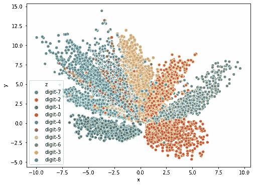
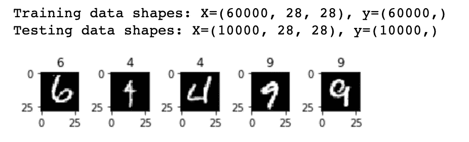
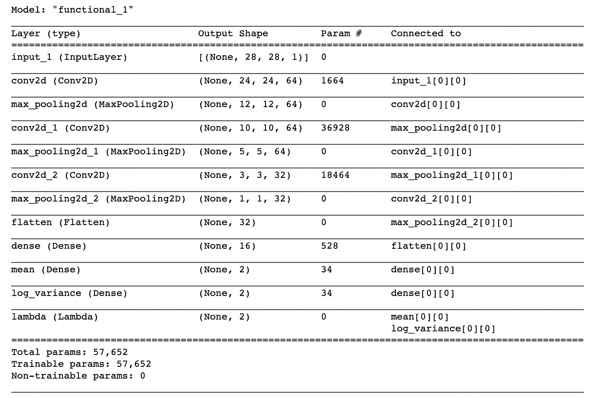
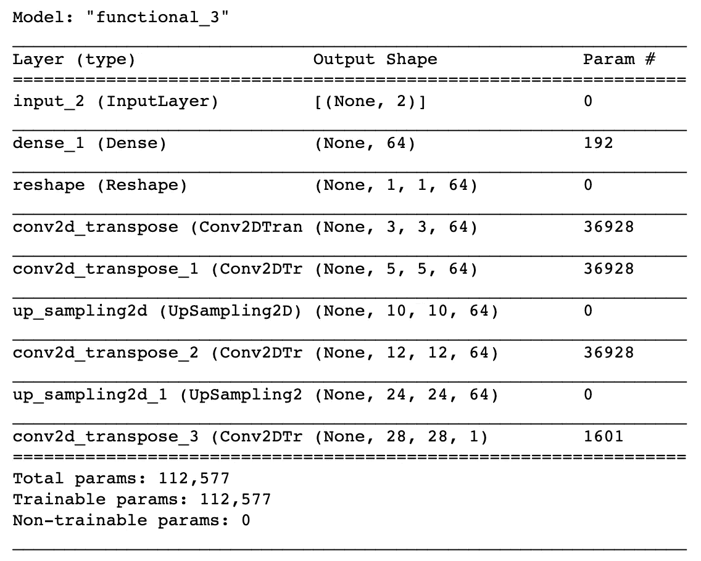
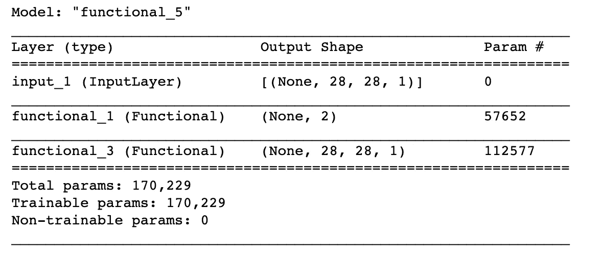
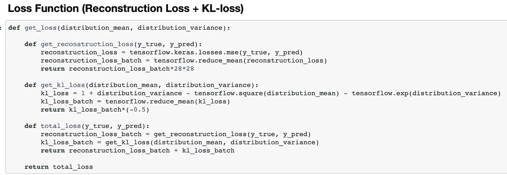
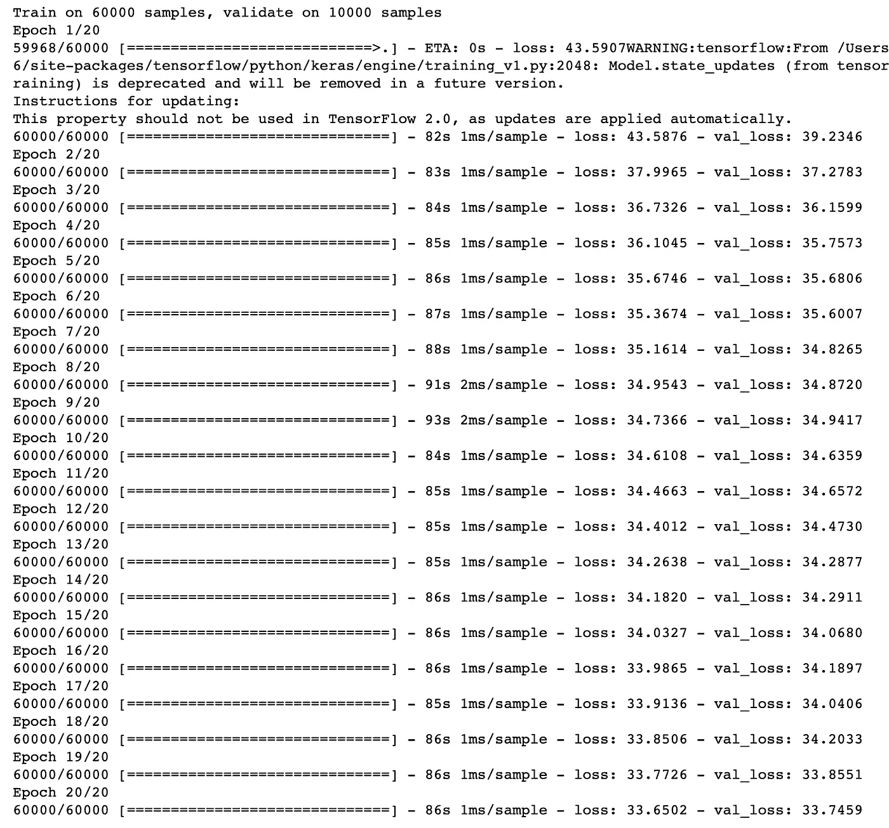
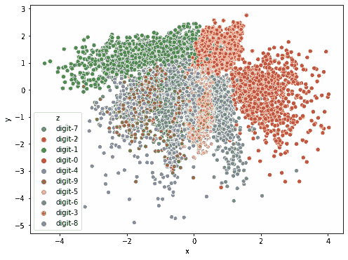
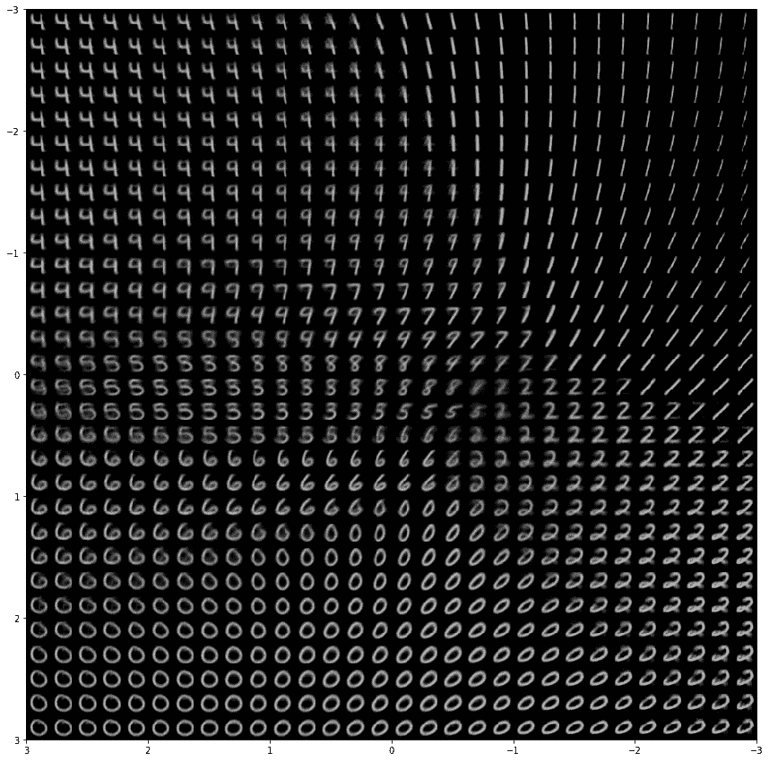

# 使用 Keras 作为生成模型的可变自动编码器

> 原文：<https://towardsdatascience.com/variational-autoencoders-as-generative-models-with-keras-e0c79415a7eb?source=collection_archive---------8----------------------->


使用 Keras 的可变自动编码器和图像生成|图片由[“我的镜头生活”](https://unsplash.com/@bamagal)来自 Unsplash | [图片来源](https://unsplash.com/photos/bq31L0jQAjU)

## [实践教程](https://towardsdatascience.com/tagged/hands-on-tutorials)

## 引入变分自动编码器和使用 Keras 生成图像

## 概观

本文旨在让读者对变型自动编码器有一些基本的了解，并解释它们在机器学习和人工智能方面与普通自动编码器的不同之处。不同于普通的自动编码器(如稀疏自动编码器、去噪自动编码器。etc)，变分自动编码器(VAEs)是类似 GANs ( [生成对抗网络](https://en.wikipedia.org/wiki/Generative_adversarial_network))的生成模型。这篇文章主要集中在变化的自动编码器上，我将很快在我即将发布的帖子中写关于生成敌对网络的内容。

在本教程中，我们将讨论如何从头开始用 Keras(TensorFlow，Python)训练一个变分自动编码器(VAE)。我们将以一个简单 VAE 的生成能力的演示来结束我们的研究。

本教程的其余内容可分为以下几类-

1.  ***背景:变分自动编码器***
2.  ***在喀拉斯建造 VAE***
3.  ***在 MNIST 数据集上训练 VAE***
4.  ***结果***
5.  ***图像生成能力***
6.  ***汇总***
7.  ***延伸阅读和资源***

# 1.变分自动编码器

## 背景

自动编码器基本上是一种神经网络，它将高维数据点作为输入，将其转换为低维特征向量(即潜在向量)，并且稍后仅利用潜在向量表示来重构原始输入样本，而不会丢失有价值的信息。任何给定的自动编码器都由以下两部分组成——编码器和解码器。模型的编码器部分获取输入数据样本，并将其压缩成潜在向量。而解码器部分负责从学习的(由编码器在训练期间学习的)潜在表示中重建原始输入样本。要了解更多基础知识，请查看我关于 Keras 中的[自动编码器和深度学习](https://dropsofai.com/autoencoders-in-keras-and-deep-learning/)的文章。

> 让我们继续考虑，直到现在我们都在同一页上。

普通自动编码器的一个问题是它们独立地编码每个输入样本。这意味着属于同一类的样本(或属于同一分布的样本)可能学习到非常不同的(潜在空间中的远距离编码)潜在嵌入。理想情况下，同类的潜在特征应该有些相似(或者潜在空间上更接近)。这是因为我们没有明确强制神经网络学习输入数据集的分布。由于这个问题，我们的网络可能不太擅长重建相关的看不见的数据样本(或不太可归纳)。

在过去关于 Keras 中的[自动编码器和深度学习](https://dropsofai.com/autoencoders-in-keras-and-deep-learning/)的教程中，我们训练了一个普通的自动编码器，并学习了 MNIST 手写数字图像的潜在特征。当我们在具有相应标签的潜在空间中绘制这些嵌入时，我们发现相同类别的学习嵌入有时出现相当随机，并且在不同类别的嵌入聚类之间没有清晰可见的边界。下图显示了分布情况-



使用 Keras 的可变自动编码器和图像生成|作者图片| [图片来源](https://dropsofai.com/autoencoders-in-keras-and-deep-learning/)

## 可变自动编码器

变分自动编码器本质上略有不同。它不是直接从输入样本中学习潜在特征，而是实际学习潜在特征的分布。假设输入数据的潜在特征遵循标准正态分布。这意味着学习到的潜在向量应该是以零为中心的，并且它们可以用两个统计量来表示——均值和方差(因为标准正态分布可以仅用这两个统计量来表示)。

因此，变分自动编码器(vae)计算每个样本的潜在向量的均值和方差(而不是直接学习潜在特征),并迫使它们遵循标准的正态分布。因此，网络的瓶颈部分用于学习每个样本的均值和方差，我们将定义两个不同的全连接(FC)层来计算这两个值。VAEs 确保潜在空间中彼此非常接近的点代表非常相似的数据样本(相似的数据类别)。我们将在本教程中证明这一事实。

在进入实现细节之前，让我们首先了解一下 KL-divergence，它将被用作我们模型中的两个优化度量之一。

## 库尔贝克-莱布勒(KL)散度

在上一节中，我们讨论了对输入数据集的潜在要素实施标准正态分布。这可以使用 KL-散度统计来实现。 [KL-divergence](https://en.wikipedia.org/wiki/Kullback%E2%80%93Leibler_divergence) 是两个概率分布之间差异的统计度量。因此，我们将利用 KL-散度值作为目标函数(连同重建损失),以确保学习分布非常类似于真实分布，我们已经假设真实分布是标准正态分布。

在这种情况下，最终目标可以写成-

```
*Objective = Reconstruction Loss + KL-Loss*
```

这里，重建损失项将鼓励模型学习正确重建原始图像(如果不完全相同，则为同一类别的图像)所需的重要潜在特征。而 KL 散度损失项将确保学习的分布类似于真实分布(标准正态分布)。这进一步意味着分布以零为中心，并且在空间中分布均匀。我们将在教程的后半部分证明这一点。

# 2.在喀拉斯建造 VAE

最后一节解释了机器学习(ML)和人工智能(AI)中可变自动编码器(VAEs)背后的基本思想。在这一节中，我们将使用 Python 中的 Keras 构建一个卷积变分自动编码器。该网络将在 Keras 数据集中可用的 MNIST 手写数字数据集上进行训练。

为逐步理解和简化起见，本节可分为以下几个部分

1.  ***数据准备***
2.  ***建筑编码器***
3.  ***潜在分布和采样***
4.  ***建筑解码器***
5.  ***建筑 VAE***
6.  ***损失***

## 数据准备

在本节中，我们将下载 MNIST 手写数字数据集并将其加载到我们的 Python 笔记本中，以开始准备数据。

这是预先加载的依赖项-

```
**import** numpy as np
**import** matplotlib.pyplot as plt
**import** pandas as pd
**import** seaborn as sns
**import** warningswarnings.filterwarnings('ignore')
**%**matplotlib inline
```

以下 python 代码可用于下载 MNIST 手写数字数据集。下面还显示了一些示例图像-

```
**from** tensorflow.keras.datasets **import** mnist(trainX, trainy), (testX, testy) **=** mnist.load_data()print('Training data shapes: X=%s, y=%s' **%** (trainX.shape, trainy.shape))print('Testing data shapes: X=%s, y=%s' **%** (testX.shape, testy.shape))**for** j **in** range(5):
    i **=** np.random.randint(0, 10000)
    plt.subplot(550 **+** 1 **+** j)
    plt.imshow(trainX[i], cmap**=**'gray')
    plt.title(trainy[i])
plt.show()
```

数据集已经分为定型集和测试集。训练数据集具有分辨率为 28*28 的 60K 手写数字图像。尽管测试数据集由具有相似尺寸的 10K 手写数字图像组成



MNIST 数据集|使用 Keras 的可变自动编码器和图像生成

数据集中的每个图像都是一个 2D 矩阵，表示从 0 到 255 的像素强度。我们将首先归一化像素值(使它们在 0 和 1 之间)，然后为图像通道添加一个额外的维度(由 Keras 的 Conv2D 层支持)。以下是 python 中的预处理代码-

```
train_data **=** trainX.astype('float32')**/**255
test_data **=** testX.astype('float32')**/**255train_data **=** np.reshape(train_data, (60000, 28, 28, 1))
test_data **=** np.reshape(test_data, (10000, 28, 28, 1))print (train_data.shape, test_data.shape)Out[1]: (60000, 28, 28, 1) (10000, 28, 28, 1)
```

## 建筑编码器

在这一节中，我们将定义 VAE 模型的编码器部分。当输入数据类型是图像时，自动编码器的编码器部分通常包括多个重复的卷积层，然后是池层。变型自动编码器的编码器部分也非常相似，只是瓶颈部分与上面讨论的略有不同。

这里是编码器部分的 python 实现，带有 Keras-

```
**import** tensorflowinput_data **=** tensorflow.keras.layers.Input(shape**=**(28, 28, 1))encoder **=** tensorflow.keras.layers.Conv2D(64, (5,5), activation**=**'relu')(input_data)encoder **=** tensorflow.keras.layers.MaxPooling2D((2,2))(encoder)encoder **=** tensorflow.keras.layers.Conv2D(64, (3,3), activation**=**'relu')(encoder)encoder **=** tensorflow.keras.layers.MaxPooling2D((2,2))(encoder)encoder **=** tensorflow.keras.layers.Conv2D(32, (3,3), activation**=**'relu')(encoder)encoder **=** tensorflow.keras.layers.MaxPooling2D((2,2))(encoder)encoder **=** tensorflow.keras.layers.Flatten()(encoder)encoder **=** tensorflow.keras.layers.Dense(16)(encoder)
```

上面的片段压缩了图像输入，并将其降低到 16 值特征向量，但这些不是最终的潜在特征。下一节将通过添加潜在特征计算逻辑来完成编码器部分。

## 潜在分布和抽样

该部分负责从上一部分中提取复杂的特征，并计算潜在特征的平均值和对数方差(因为我们已经假设潜在特征遵循标准正态分布，并且该分布可以用平均值和方差统计值来表示)。两个独立的全连接(FC 层)层用于计算给定数据集的输入样本的平均值和对数方差。

标准正态分布(SND)的这些属性(平均值和对数方差)随后用于估计相应输入数据点的潜在编码。下面定义的函数 *sample_latent_features* 取这两个统计值并返回一个潜在编码向量。该潜在编码被传递给解码器作为图像重建目的的输入。

```
def sample_latent_features(distribution):
    distribution_mean, distribution_variance = distribution
    batch_size = tensorflow.shape(distribution_variance)[0]
    random = tensorflow.keras.backend.random_normal(shape=(batch_size, tensorflow.shape(distribution_variance)[1]))
    return distribution_mean + tensorflow.exp(0.5 * distribution_variance) * random

distribution_mean = tensorflow.keras.layers.Dense(2, name='mean')(encoder)distribution_variance = tensorflow.keras.layers.Dense(2, name='log_variance')(encoder)latent_encoding = tensorflow.keras.layers.Lambda(sample_latent_features)([distribution_mean, distribution_variance])
```

这些潜在特征(从学习的分布计算)实际上完成了模型的编码器部分。现在编码器模型可以定义如下

```
encoder_model **=** tensorflow.keras.Model(input_data, latent_encoding)encoder_model.summary()
```



编码器非常简单，只有大约 57K 个可训练参数。

## 建筑解码器

该模型的编码器部分将图像作为输入，并将该图像的潜在编码向量作为输出，该输出是从输入数据集的学习分布中采样的。解码器的工作是将该嵌入向量作为输入，并重新创建原始图像(或与原始图像属于相似类别的图像)。由于潜在向量是特征的非常压缩的表示，解码器部分由多对去卷积层和上采样层组成。去卷积层基本上与卷积层相反。上采样层用于恢复图像的原始分辨率。通过这种方式，它可以重建原始尺寸的图像。

下面是用 TensorFlow 的 Keras API 实现的解码器部分的 python 实现

```
decoder_input = tensorflow.keras.layers.Input(shape=(2))
decoder = tensorflow.keras.layers.Dense(64)(decoder_input)
decoder = tensorflow.keras.layers.Reshape((1, 1, 64))(decoder)
decoder = tensorflow.keras.layers.Conv2DTranspose(64, (3,3), activation='relu')(decoder)

decoder = tensorflow.keras.layers.Conv2DTranspose(64, (3,3), activation='relu')(decoder)
decoder = tensorflow.keras.layers.UpSampling2D((2,2))(decoder)

decoder = tensorflow.keras.layers.Conv2DTranspose(64, (3,3), activation='relu')(decoder)
decoder = tensorflow.keras.layers.UpSampling2D((2,2))(decoder)

decoder_output = tensorflow.keras.layers.Conv2DTranspose(1, (5,5), activation='relu')(decoder)
```

解码器模型对象可以定义如下

```
decoder_model **=** tensorflow.keras.Model(decoder_input, decoder_output)decoder_model.summary()
```



解码器同样简单，具有 112K 可训练参数。

## 构建 VAE(可变自动编码器)

最后，可以通过组合编码器和解码器部分来定义变分自动编码器(VAE)。下面是你如何通过在编码器后面粘贴解码器来创建 VAE 模型对象。

```
encoded **=** encoder_model(input_data)decoded **=** decoder_model(encoded)autoencoder **=** tensorflow.keras.models.Model(input_data, decoded)autoencoder.summary()
```



整个设置非常简单，只有 170，000 个可训练模型参数。写目标(或优化函数)函数的时间。

## 失败

如前所述，变分自动编码器(VAE)的最终目标(或损失)函数是数据重建损失和 KL 损失的组合。在本节中，我们将通过结合这两个统计数据来定义我们的自定义损失。

*get_loss* 函数的以下实现返回一个 *total_loss* 函数，它是重建损失和 KL-loss 的组合，定义如下



[Github 链接](https://github.com/kartikgill/Autoencoders)

最后，让我们编译模型，为培训做好准备-

```
autoencoder.compile(loss=get_loss(distribution_mean, distribution_variance), optimizer='adam')
```

# 3.训练 VAE(可变自动编码器)

就像普通的自动编码器一样，我们将通过输入和输出完全相同的图像来训练它。该模型被训练 20 个时期，批次大小为 64。

这是训练总结-

```
autoencoder.fit(train_data, train_data, epochs=20, batch_size=64, validation_data=(test_data, test_data))
```



我希望它可以被训练得更好一点，但这是验证损失没有太大变化的地方，我继续进行。

# 4.结果

在本节中，我们将在测试图像上看到我们的模型的重建能力。以下 python 脚本将从测试数据集中选取 9 幅图像，我们将为它们绘制相应的重建图像。

```
offset**=**400
print ("Real Test Images")# Real Images**for** i **in** range(9):
    plt.subplot(330 **+** 1 **+** i)
    plt.imshow(test_data[i**+**offset,:,:, **-**1], cmap**=**'gray')
plt.show()# Reconstructed Imagesprint ("Reconstructed Images with Variational Autoencoder")**for** i **in** range(9):
    plt.subplot(330 **+** 1 **+** i)
    output **=** autoencoder.predict(np.array([test_data[i**+**offset]]))
    op_image **=** np.reshape(output[0]*****255, (28, 28))
    plt.imshow(op_image, cmap**=**'gray')
plt.show()
```

这是输出-


结果|使用 Keras 的可变自动编码器和图像生成

上述结果证实了该模型能够以相当高的效率重建数字图像。然而，这里要注意的一件重要事情是，一些重建图像在外观上与原始图像非常不同，而类别(或数字)总是相同的。发生这种情况是因为重建不仅仅依赖于输入图像，它是已经学习的分布。并且这种学习到的分布是模型输出中引入变化的原因。这很有趣，不是吗！

这里要注意的第二件事是输出图像有点模糊。这是变化的自动编码器的常见情况，由于潜在向量(瓶颈)非常小，并且如前所述，存在学习潜在特征的单独过程，它们经常产生有噪声的(或质量差的)输出。变分自动编码器(vae)实际上不是为了重建图像而设计的，真正的目的是学习分布(这给了他们生成假数据的超能力，我们将在后面的帖子中看到)。

## 潜在特征聚类

如前所述，变分自动编码器(vae)学习潜在特征的潜在分布，这基本上意味着属于同一类的样本的潜在编码在潜在空间中不应彼此相距太远。其次，总体分布应该是标准正态的，应该是以零为中心。

让我们为所有的测试图像生成潜在嵌入，并绘制它们(相同的颜色代表属于相同类别的数字，取自地面真实标签)。这是 python 代码-

```
x = []
y = []
z = []for i in range(10000):
    z.append(testy[i])
    op = encoder_model.predict(np.array([test_data[i]]))
    x.append(op[0][0])
    y.append(op[0][1])df = pd.DataFrame()
df['x'] = x
df['y'] = y
df['z'] = ["digit-"+str(k) for k in z]plt.figure(figsize=(8, 6))
sns.scatterplot(x='x', y='y', hue='z', data=df)
plt.show()
```



基于 Keras 的变分自动编码器和图像生成

上图显示分布以零为中心。相同类别数字的嵌入在潜在空间中更接近。数字分离边界也可以很容易地画出来。这正是我们想要从可变自动编码器中实现的。让我们跳到最后一部分，测试我们模型的生成能力。

# 5.伪图像生成

可变自动编码器可以用作生成模型。前面的部分显示了输入数据的潜在编码遵循标准的正态分布，并且对于不同类别的数字存在明显的界限。

请想一想——如果我们已经知道，空间的哪一部分用于哪个类，我们甚至不需要输入图像来重建图像。这意味着我们实际上可以通过从空间(潜在分布空间)传递随机点来生成与训练数据集具有相似特征的数字图像。以这种方式，变分自动编码器可以用作生成模型，以便生成假数据。

正如我们所看到的，潜在编码的范围在[-3 到 3 之间，在 x 轴上也是-3 到 3]。让我们用只属于这个范围的随机潜在编码生成一串数字。

```
generator_model **=** decoder_modelx_values **=** np.linspace(**-**3, 3, 30)
y_values **=** np.linspace(**-**3, 3, 30)figure **=** np.zeros((28 ***** 30, 28 ***** 30))**for** ix, x **in** enumerate(x_values):
    **for** iy, y **in** enumerate(y_values):
        latent_point **=** np.array([[x, y]])
        generated_image **=** generator_model.predict(latent_point)[0]
        figure[ix*****28:(ix**+**1)*****28, iy*****28:(iy**+**1)*****28,] **=** generated_image[:,:,**-**1]plt.figure(figsize**=**(15, 15))
plt.imshow(figure, cmap**=**'gray', extent**=**[3,**-**3,3,**-**3])
plt.show()
```



生成的数据|使用 Keras 的可变自动编码器和图像生成

你可以在上面的图像矩阵中找到所有的数字(从 0 到 9 ),因为我们试图从潜在空间的所有部分生成图像。生成变化的笔迹的能力是不是太棒了！

# 6.摘要

本教程解释了深度学习和人工智能中的可变自动编码器。通过一个基本的介绍，展示了如何用 python 中的 Keras 和 TensorFlow 实现 VAE。在 MNIST 手写数字数据集上进一步训练该模型，并给出重建结果。

我们已经看到，潜在的编码遵循标准的正态分布(全部归功于 KL-divergence ),以及如何将模型的训练解码器部分用作生成模型。我们已经通过仅使用模型的解码器部分生成假数字来证明了这一说法。

> 如果你有兴趣阅读我关于去噪自动编码器的文章
> 
> [*卷积去噪图像降噪自动编码器*](https://dropsofai.com/convolutional-denoising-autoencoders-for-image-noise-reduction/)

***Github 代码链接:***[https://github.com/kartikgill/Autoencoders](https://github.com/kartikgill/Autoencoders)

原载于 [**滴艾**](https://dropsofai.com/variational-autoencoders-and-image-generation-with-keras/) **。**

感谢阅读！希望这对你有帮助。请在下面评论，让我知道你的反馈。下一篇文章再见。

# 阅读下一篇>>>

1.  [Keras 和深度学习中的自动编码器](https://dropsofai.com/autoencoders-in-keras-and-deep-learning/)(简介)
2.  [优化者解释训练神经网络](https://dropsofai.com/optimizers-explained-for-training-neural-networks/)
3.  [用量化技术优化张量流模型](https://dropsofai.com/optimizing-tensorflow-models-with-quantization-techniques/)
4.  [用 PyTorch 进行深度学习:简介](https://dropsofai.com/deep-learning-with-pytorch-introduction/)
5.  [用 PyTorch 进行深度学习:第一个神经网络](https://dropsofai.com/deep-learning-with-pytorch-first-neural-network/)

# 参考

1.  [如何在 Keras 中构建一个可变的自动编码器](https://blog.paperspace.com/how-to-build-variational-autoencoder-keras/)
2.  [变型自动编码器](https://www.jeremyjordan.me/variational-autoencoders/)
3.  【https://keras.io/examples/generative/vae/ 

# 相关研究论文

1.  [语法变分自动编码器](https://arxiv.org/abs/1703.01925)
2.  [用于分子图生成的连接树变分自动编码器](https://arxiv.org/abs/1802.04364)
3.  [图像、标签、字幕深度学习的变分自动编码器](http://papers.nips.cc/paper/6528-variational-autoencoder-for-deep-learning-of-images-labels-and-captions)
4.  [使用重构概率的基于变分自动编码器的异常检测](http://dm.snu.ac.kr/static/docs/TR/SNUDM-TR-2015-03.pdf)
5.  [用于文本生成的混合卷积变分自动编码器](https://arxiv.org/abs/1702.02390)