# 用于假人的可变自动编码器(VAEs)——循序渐进教程

> 原文：<https://towardsdatascience.com/variational-autoencoders-vaes-for-dummies-step-by-step-tutorial-69e6d1c9d8e9?source=collection_archive---------3----------------------->

## DIY 实践指南与实践代码的建设和培训与 Keras 的名人脸上的 VAEs

本文介绍了您需要从生成模型中获得的一切。我们提供了如何在大型图像数据集上训练条件值并使用它们生成新的标记图像的分步指南。

Pladicon 在 [Pixabay](https://pixabay.com/images/id-4899802/) 拍摄的照片

# 动机

既然已经有这么多数据，为什么我们还需要生成新的数据？据 [IDC](https://www.forbes.com/sites/tomcoughlin/2018/11/27/175-zettabytes-by-2025/#6af1bdb35459) 称，目前有超过 18 兆字节的数据。

大多数机器学习任务都需要标记数据。获取高质量、有标签的数据是困难的。如果我们自己生成这些数据，我们就可以随心所欲地利用它们。新的数据可以给我们想法和选择。

> 如何生成看不见的图像？

在这篇文章中，你将学习什么是**变分自动编码器**，以及如何创建自己的变分自动编码器来生成新的和看不见的图像。我们不用数学来解释潜在的概念和直觉。

使用我们的 VAE 码(自创)的图像及其重建的例子

# 数据

我们将使用知名名人数据集的子集来帮助我们建立面部生成模型。数据集可以按照[名人脸网站](http://mmlab.ie.cuhk.edu.hk/projects/CelebA.html)上的描述下载。它提供了一个大规模的人脸属性数据集，包含超过 20 万张名人图片，每张图片都有 40 个属性注释。

*   10177 个身份，
*   202，599 个面部图像，
*   5 个地标位置，以及
*   每个图像 40 个二进制属性注释。

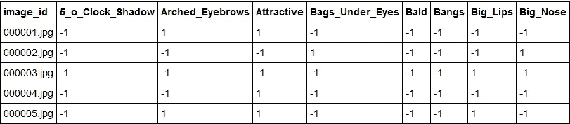

下面我们从名人数据集中随机挑选一些面孔，并显示他们的元数据(属性)。图像高度为 218 像素，宽度为 178 像素，有 3 个颜色通道。

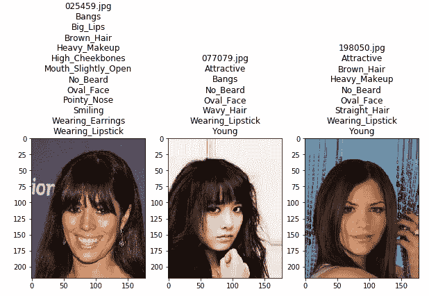

# 什么是自动编码器(AE)？

通过观察数以千计的名人面孔，神经网络可以学习生成不存在的人的面孔。

神经网络是我们可以用来获得函数近似值的许多可能方法之一。他们受欢迎的一个原因是他们学习表达的能力。假设我们为网络提供了正确的标签，网络可以学习在将图像分类为狗或猫时重要的特定表示。这是监督学习。

在某些情况下，我们没有这些标签。然而，我们可以训练两个网络，一个学习表示，另一个通过最小化重建损失函数从表示中重建。这是一个自动编码器。它之所以有这个名字，是因为它会自动找到编码输入的最佳方式，以便解码后的版本尽可能接近输入。

自动编码器由一对两个相连的神经网络组成:编码器模型和解码器模型。它的目标是找到一种方法将名人的脸编码成一种压缩的形式(潜在空间)，以这种方式重建的版本尽可能接近输入。

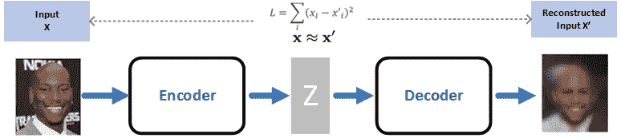

自动编码器的工作组件(自行创建)

编码器模型将输入 *x* 转换为小型密集表示 *z* ，类似于卷积神经网络通过使用滤波器来学习表示的工作方式。

解码器模型可以被视为能够生成特定特征*x’*的生成模型。

编码器和解码器通常作为一个整体来训练。损失函数惩罚网络创建不同于输入面的输出面。

因此，编码器学会在有限的潜在空间中保存尽可能多的相关信息，并巧妙地丢弃不相关的部分，例如噪声。

解码器学习获取压缩的潜在信息，并将其重建为完整的名人脸。

自动编码器也可以用于维度减少和[图像去噪](/why-deep-learning-works-289f17cab01a)，但也可以成功用于[无监督机器翻译](https://arxiv.org/pdf/1710.11041.pdf)。

# 什么是变分自动编码器(VAE)？

通常，编码器产生的潜在空间 *z* 人口稀少，这意味着很难预测该空间中值的分布。在 2D 制图表达中，值是分散的，空间似乎得到了很好的利用。

这对于压缩系统来说是一个非常好的特性。然而，对于生成新的名人图像，这种稀疏性是一个问题，因为找到解码器将知道如何产生有效图像的潜在值几乎是不可能的。

此外，如果空间在簇之间有间隙，并且解码器从那里接收到变化，它将缺乏生成有用的东西的知识。

**变分自动编码器**通过使潜在空间更可预测、更连续、更少稀疏来工作。通过强制潜在变量成为正态分布，VAEs 获得对潜在空间的控制。

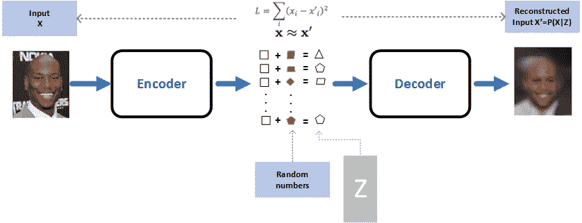

从 AE 到 VAE 使用随机变量(自创)

VAEs 不是将潜在值直接转发给解码器，而是使用它们来计算平均值和标准偏差。然后从相应的正态分布中对解码器的输入进行采样。

在训练过程中，VAEs 通过在损失函数中包含 kull back-lei bler 散度，迫使该正态分布尽可能接近标准正态分布。VAE 将会改变或探索脸部的变化，而且不只是以随机的方式，而是朝着一个期望的、特定的方向。

**条件变分自动编码器**允许基于潜在变量 z 和附加信息(如面部元数据(微笑、眼镜、肤色等))对输入进行建模。).

# **图像数据生成器**

让我们建立一个(有条件的)可以在名人脸上学习的 VAE。我们使用定制的 Keras 内存高效生成器来处理我们的大型数据集(202599 张图像，ca。每个 10KB)。这背后的想法是在训练过程中即时获得批量图像。

# **VAE 网**

我们希望编码器是一个卷积神经网络，它获取图像并输出分布参数 *Q(z|[x，c])* 其中 *x* 是人脸的输入图像， *c* 是条件变量(人脸的属性)，而 *z* 是潜在变量。对于本文，我们使用一个由两个卷积层和一个池层组成的简单架构。

解码器是一个反过来构建的卷积神经网络。它是一个生成网络，向似然分布 *P([x，c]|z)* 输出参数。

整个 VAE 网络的架构创建如下。

# 培养

下图显示了 celebA 数据集中图像的 VAE 模型的学习过程。代码在使用 1 个 GPU 的 AWS 实例上运行了大约 8 个小时。

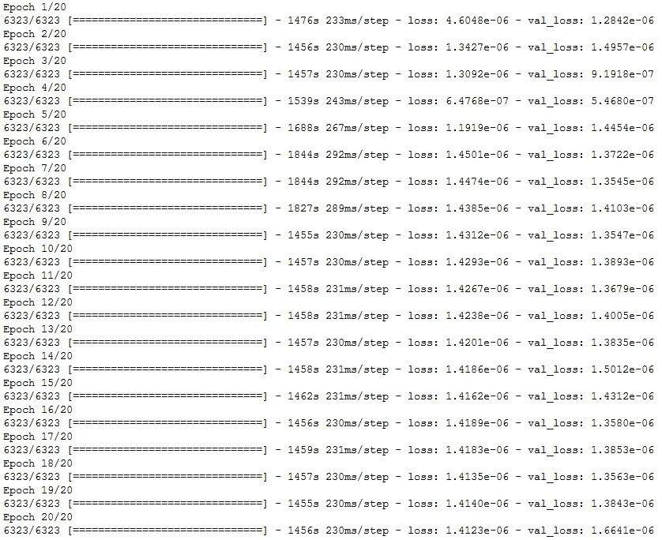

# 可视化潜在表征

经过训练后，我们现在可以从我们的数据集中随机选取一幅图像，并使用经过训练的编码器来创建图像的潜在表示。

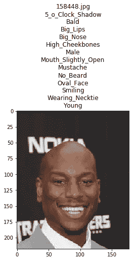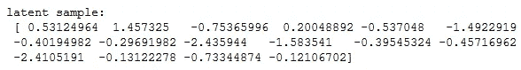

使用 16 个实数的向量的潜在表示，我们可以可视化解码器如何重建原始图像。

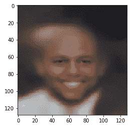

虽然重建的图像很模糊，但我们可以看到与原始图像有很强的相似性:性别、衣服颜色、头发、微笑、肤色。

# 生成看不见的面孔

条件值能够改变潜在空间以产生新数据。具体来说，我们可以使用解码器生成一个不可见图像的随机计数，同时根据给定的属性对其进行调节。

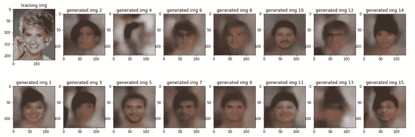

虽然我们的变分自动编码器产生了模糊和非真实感的人脸，但我们可以识别那些从未存在过的人类的性别、肤色、微笑、眼镜、头发颜色。

# 给人们一个微笑

条件值可以在属性之间进行插值，使一张脸微笑，或者在以前没有眼镜的地方添加眼镜。下面，我们从数据集中随机选择一张名人脸，并利用潜在表征的改变，将其从女性脸变形为男性脸。我们也改变这些脸来展示原本不存在的微笑。

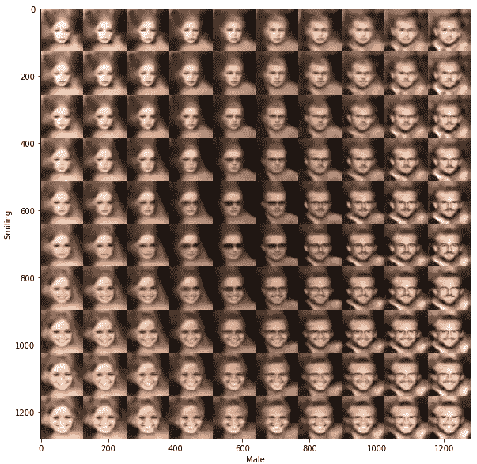

# 结论

在本文中，我们介绍了条件变分自动编码器，并演示了它们如何学习如何生成新的标记数据。

我们提供了 Python 代码，用于在大型名人图像数据集上训练 VAEs。该方法和代码可以扩展到多个其他用例。

生成敌对网络(GANs)往往会产生更好看的图像，因为它们学会了区分什么对人类来说是真实感的，什么不是。

 [## 虚拟生成对抗网络(GAN)——循序渐进教程

### 用防弹 Python 代码理解、构建和训练 GANs 的终极初学者指南。

towardsdatascience.com](/generative-adversarial-network-gan-for-dummies-a-step-by-step-tutorial-fdefff170391) 

> **应认真考虑使用和 GAN 技术制作虚假图像、视频或新闻的道德问题，应负责任地使用这些技术******。****

**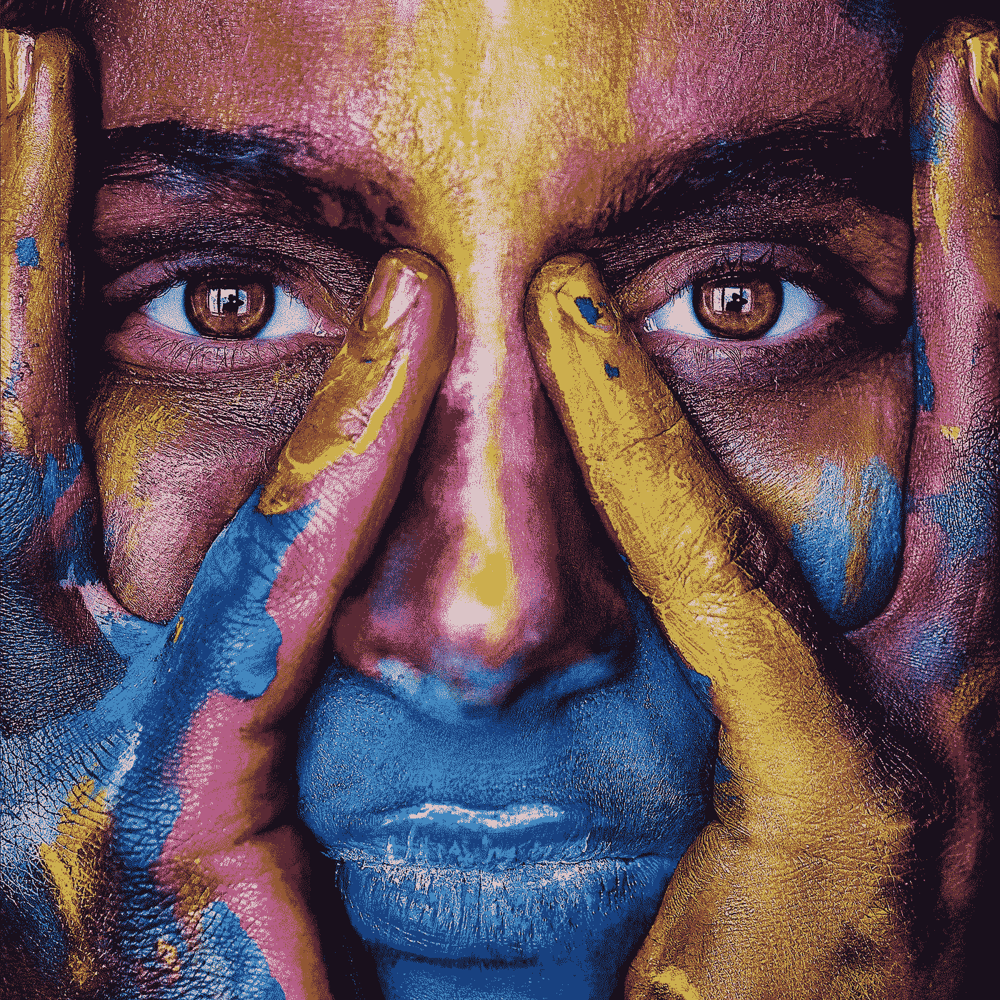**

**伊万诺夫·古德在 [Pixabay](https://pixabay.com/photos/girl-face-colorful-colors-artistic-2696947/) 上的照片**

**非常感谢 Vincent Casser 的[精彩代码](https://github.com/Harvard-IACS/2019-computefest/blob/master/Wednesday/auto_encoder/VAE_Solutions.ipynb)，在他的博客中提供了一种更先进的实现图像处理卷积自动编码器的方法。我获得了文森特的明确授权，为这篇文章改编他的 VAE 代码。从头开始构建一个可用的 VAE 相当棘手。功劳归于文森特·卡瑟。**

**我推荐阅读 Joseph Rocca 的后续文章:[了解变分自动编码器(VAEs)](/understanding-variational-autoencoders-vaes-f70510919f73) 。**

**感谢安妮·邦纳的编辑笔记。**

**保持健康和安全！**