# 变分高斯过程(VGP)——当事物不是高斯分布时该怎么办

> 原文：<https://towardsdatascience.com/variational-gaussian-process-what-to-do-when-things-are-not-gaussian-41197039f3d4?source=collection_archive---------7----------------------->

来自 Pixabay 的[图片](https://pixabay.com/photos/bouquet-animal-bird-nature-sky-4243189/)

人们可能会有这样的印象，贝叶斯方法只有在一切都是高斯的情况下才有效。不是这样的。现代贝叶斯机器学习可以轻松处理非高斯分布。

我将描述高斯过程二元分类模型。它使用高斯先验和伯努利似然。我将解释为什么伯努利分布阻止我们使用贝叶斯规则计算后验概率。我们称这样的后验*为难处理的*。不管棘手与否，我们都需要后验来做预测。然后，我将提出解决方案——变分推论——来逼近难以处理的后验概率。

# 二元分类问题

我们有一些训练数据 *(X，Y)* :

*X* 为实数值； *Y* 是作为标签的二进制值。任务是设计一个模型，从输入 *X* 预测标签 *Y* 。这是一个二元分类问题。让我们绘制数据，并考虑如何使用高斯过程来构建二元分类器:

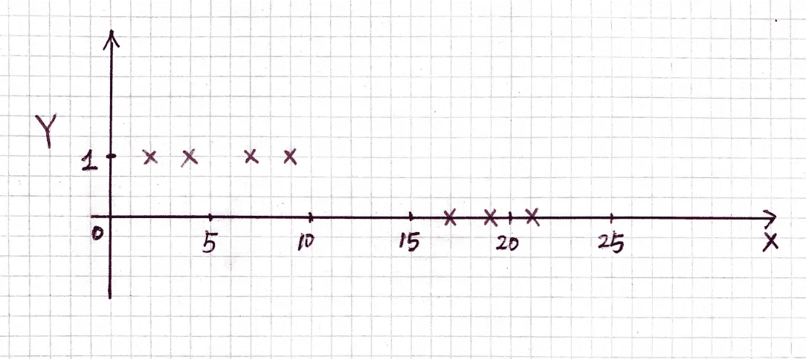

在上图中，红叉表示训练数据点。我们意识到，如果我们使用高斯过程回归来对数据建模，就会出现问题:高斯过程回归对连续函数 *f(x)* 进行建模。我们不能要求这样的函数只返回 1 或 0。高斯过程回归模型可能在某些 *x* 位置返回 1.1，在其他位置返回 0.3。

这个问题很容易解决。我们使用伯努利分布来模拟二进制输出。伯努利分布只有一个参数，即介于 0 和 1 之间的概率，它描述了事件发生的可能性。为了在这个概率和我们的高斯过程函数 *f(x)* 之间建立联系，我们定义了函数 *g(f(x))* ，它将实值高斯过程函数 *f(x)* 压缩为范围[0，1]内的一个值。

*g* 这种方式定义的是 *x* 的函数。就像当你有 *f(x) = x+1* 并定义 *g(f(x)) = f(x)* 时，那么 *g* 就是 *x* : *g(x) = (x+1)* 的函数。

许多挤压函数(检查 [sigmoid 函数](https://en.wikipedia.org/wiki/Sigmoid_function))都可以工作，我们选择 logit 函数是因为它被广泛使用并且它的数学属性很容易解释:

下图说明了这一想法:

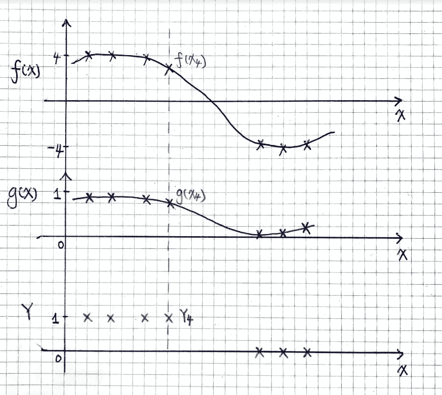

该图有三个部分:

1.  顶部是黑色的高斯过程函数 *f(x)* 。它在对应标签为 1 的 *x* 位置经历一些大的实数值(相对于范围[0，1])。并且它在 *x* 位置经过一些小值，在这些位置对应的标签是 0。
2.  中间部分用蓝色显示了 *g(x)* 函数。它将 *f(x)* 函数的值压缩到范围[0，1]内。
3.  底部用红色显示我们的训练数据。

让我们浏览一个示例数据点—图中突出显示的数据点*(y₄=1 x₄=9)*。对于这一点，顶部的读数为 *f(9)=3* 。在中间部分，挤压功能 *g(9)* 为:

伯努利分布以 0.98 为参数，表示 *Y₄=1 的概率为 0.98* 。根据底部，标签 *Y₄* 确实是 1 *。*这个模式不错。

顺便说一下，这种使用挤压函数的想法与我们如何构建神经网络分类器非常相似:一个 [softmax](https://en.wikipedia.org/wiki/Softmax_function) 函数将最后一个隐藏层中神经元的输出值(全实线中的值)转换为 0 到 1 之间的概率。

受到这个例子的鼓舞，我们正式定义了这个贝叶斯模型。但首先，一些符号。

# 一些符号

中支持文本中的 Unicode。这让我可以写很多数学下标符号，比如 X₁和 Xₙ.但是我不能写下其他的下标。例如:

所以在文中我会用一个下划线“_”来引出这样的下标，比如 *X_** 和 *X_*1* 。

如果一些数学符号在你的手机上显示为问号，请尝试从电脑上阅读这篇文章。这是某些 Unicode 呈现的已知问题。

# 二元分类模型

贝叶斯模型总是由两部分组成:先验和似然。

## 院长

顾名思义，高斯过程先验总是多元高斯分布。它模拟了上图顶部的函数。为了刷新你的记忆，看一看[理解高斯过程，苏格拉底方式](/understanding-gaussian-process-the-socratic-way-ba02369d804)。

GP 先验是两个随机变量向量 *f(X)* 和 *f(X_*)* 之间的联合多元高斯分布:

*   *f(X)* 为长度为 *n* 的随机变量向量， *n* 为训练数据点的个数。 *f(X)* 代表训练位置 *X* 的函数值。
*   *f(X_*)* 是另一个随机变量向量。它表示测试位置 *X_*，*的函数值，即您希望模型进行预测的位置。 *f(X_*)* 的长度与测试位置 *X_** 的数量相同。

我用 *f* 作为 *f(X)* 的简写。该向量中第*个*随机变量的 *fᵢ* ，对应于第*个第*个训练数据点。同样， *f_** 是 *f(X_*)* 的简写。

GP prior 使用以下核函数 *k(x，X*’)来定义位置 *x* 处的两个独立随机变量 *f(x)* 与位置*X’*处的*f(X’)*之间的相关性(位置集合 *x* 和*X’*都可以位于位置集合 *X* 或 *X_*)*

其中 *exp* 是指数函数。 *l* 和 *σ* 为*内核参数*。 *l* 称为长度刻度， *σ* 称为信号方差。 *l* 和 *σ* 是标量。由于它们是我们引入模型的参数，我们也称它们为*模型参数*。内核函数 *k* 提到了我们在协方差块 *k(X，X)* 中的训练位置 *X* 和在协方差块 *k(X_*，X_*)* 中的测试位置 *X_** 以及在 *k(X_*，X)* 中的 *X 和 X_** 。 *k* 不提训练数据 *Y* 。

简而言之，GP 先验在训练位置引入随机变量 *f* ，在测试位置引入随机变量 *f_** ，并使用核函数 *k* 来定义任意两个独立随机变量之间的相关性。这种相关性使模型能够通过使用训练位置的随机变量的信息来推断测试位置的随机变量的值，换句话说，进行预测。

尽管 GP prior 是 *f* 和 *f_*，*的联合分布，但只有 *f* 与我们的训练数据有关联。我们可以在导出边际分布 *p(f)* 之前将多变量高斯边际化规则应用于 GP，只是对于 *f.* 和几个段落之后，我们将通过似然性建立从训练数据 *Y* 到 *f* 的联系。

下面是被边缘化的 *f* ，其中 *K* 是 *k(X，X)的简称:*

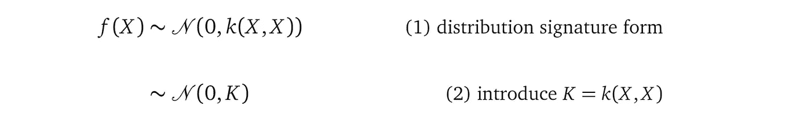

或者，以概率密度函数的形式:

与符号 *p(f)* 相比，符号*p(f；l，σ )* 强调这个分布是在随机变量 *f* 之上；并提及模型参数 *l* 和 *σ。*它们来自于 *K* 中提到的指数平方核函数。 *det* 是矩阵行列式运算符。

注意在本文中，我们不把 *l* 和 *σ* 当作随机变量。我们将它们视为模型的标量参数。作为标量，每个模型参数可以取一个*单个*具体值，如 *l=10.4* 。我们现在不知道这个值。我将介绍一个参数学习来为 *l* (以及其他模型参数)找到单个值。这个具体值称为点估计。

还有其他的参数学习方法存在，比如我们可以把 *l* 和 *σ* 看成随机变量，可以取一个值的分布。这被称为完全贝叶斯治疗，是未来文章的主题。

# 可能性

让我们引入一个新的随机变量向量 *y(X)* ，我将其简称为*y。*我们将我们的观察值 *Y* 建模为随机变量中的样本 *y —* 每个 *Yᵢ* 都是来自相应随机变量 *yᵢ.的样本* *y* 的长度为 *n* ，其中 *n* 为训练数据点数。

由于 *y* 是我们有观测值的随机变量，我们称之为*观测随机变量*。相反，随机变量 *f* 和 *f_** 没有关联观测值，我们称之为*潜在随机变量*。

表示为 *p(y|f，f_*)* 的可能性是一个条件分布。它描述了观察随机变量 *y* 的概率，给出了 GP 先验的潜在变量 *f* 和 *f_** 。

但是我们不应该设计我们的模型，使得有观测值的随机变量依赖于没有观测值的随机变量。所以我们强制要求 *y* 不依赖于 *f_** 。这通过在以下条件下丢弃不相关的 *f_** 来产生可能性 *p(y|f)* :

由于我们的观察值 *Yᵢ* 是一个二进制值，我们将其建模为来自伯努利随机变量 *yᵢ.的样本*yᵢ的概率密度函数为:

其中 g *ᵢ* 是伯努利分布的唯一参数。 *gᵢ* 是函数应用 *g(fᵢ)* 的简称。通过为 *yᵢ* 插入值 *Yᵢ* ，我们可以评估 *yᵢ* 获得该值的概率。所以 *y* 是伯努利随机变量的向量。

让我们进一步破译伯努利概率密度: *gᵢ* ，是 *g(fᵢ的简写，*代表观察随机变量 *yᵢ* 的值为 1 的概率。由于 *yᵢ* 只能取 0 或 1，那么 *yᵢ* 取值为 0 的概率就是 *1-gᵢ* 。上面的表达式是一个简洁的形式，它将这两种情况结合成一个公式。

上述伯努利密度函数建立了从观测值 *Yᵢ* 到观测随机变量 *yᵢ.的联系通过调用函数 *g* 并以 *fᵢ* 为参数，我们建立了从 *Yᵢ到*fᵢ的连接:*

该函数具有以下形状，x 轴绘图 *fᵢ* 和 y 轴绘图*g(fᵢ*:

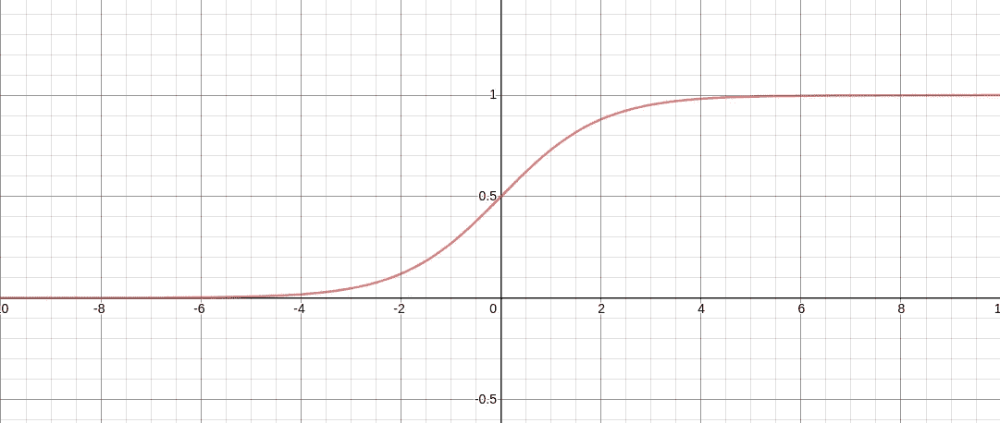

让我们来看看这个可能性函数在一个地点的全部细节 *Xᵢ:*

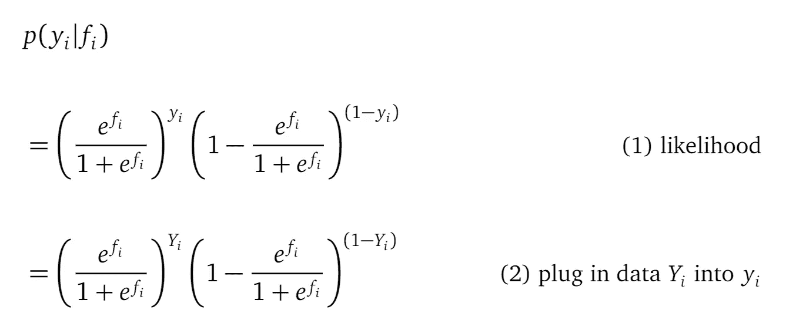

第(1)行是在给定随机变量 *fᵢ* 的情况下，在单个位置*xᵢ*的可能性函数的完整公式，该公式来自我们的 GP prior *。*

第(2)行将实际观察值 *Yᵢ* 插入随机变量 *yᵢ.*

这个可能提到了我们的训练数据 *Yᵢ* ，但是没有提到训练数据 *Xᵢ* 。与之前的 GP 相比，它提到了数据 *Xᵢ* 而不是 *Yᵢ* 。而随机变量 *fᵢ* 是先验和似然之间的桥梁，将 *Xᵢ* 和 *Yᵢ* 连接在一起。

我们希望我们的模型给可能性一个高值。所以我们来分析一下，当可能性评估为高值时。让我们来关注一下 *Yᵢ=1* 时的情况(Yᵢ=0 的情况也类似)。当 *Yᵢ=1* 时，可能性简化为:

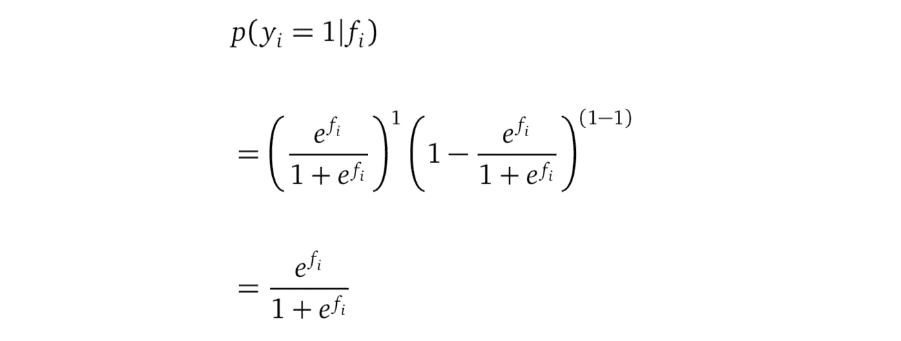

为了使这个数量尽可能高(最大值是 1)，我们需要 *fᵢ* 有一个更大的平均值，并且希望方差小。这样， *fᵢ的期望值*就是一个大值。与此同时，上述公式的期望值将更接近于 1，即其最大值。

注意，我们并不关心 *fᵢ.的确切平均值只要可能性评估为高概率数字，我们就高兴，不管平均值是 4 还是 7。我们可以想象 fᵢ回归到一些潜在的数据空间。*

在我们理解了单个数据点 *(Xᵢ，Yᵢ)* 的可能性之后，就很容易理解所有训练数据点的可能性了。我们假设观察值相互独立，因此所有观察随机变量 *p(y|f)* 的可能性是所有 *n* 个个体可能性的乘积，其中 *n* 是训练数据点的数量:

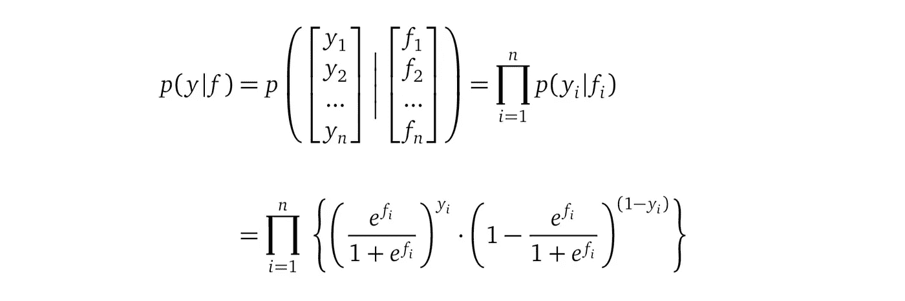

这里，似然 *p(y|f)* 没有提到任何模型参数， *l* 或 *σ* 。但一般来说，似然函数可以引入新的模型参数。

现在你已经学会了如何将非高斯分布纳入你的可能性。同样，您可以引入其他非高斯分布，如 student-t 来处理异常值。

# 后面的

在我们描述了先验 *p(f)* 和似然 *p(y|f)* 之后，就到了后验 *p(f|y)* 的时候了。贝叶斯规则根据先验和似然性给出了后验的概率密度函数:

后面提到了我们的两个模型参数 *l，σ* 。它们来自 prior *p(f)* 内部的内核函数 *k* 。有时我们用 p(f | y；l，σ ) 来强调这些模型参数。

分母叫做边际可能性。这是一个 n 维积分，每维是随机变量向量 *f* 中的一个随机变量。我们必须首先计算这个积分的结果，然后我们可以评估后验 *p(f|y)* 作为一个函数，例如，进行预测。

计算积分意味着计算出积分结果的*解析表达式*。例如，我们算出 *∫ x dx* 的结果为 *x* 。表达式 *x 是*解析的——我们可以插入一个值 *x* 来得到积分的结果。

然而，我们不知道如何计算这个积分。积分符号内的函数是 *p(y|f)* 中的伯努利概率密度函数和 *p(f)* 中的一个多元高斯概率密度函数的乘积。你不能从你的微积分书中找到一个规则来计算这个积分。人们称之为棘手的整合。

你可能想知道，后验不应该是来自 GP 先验的同一组随机变量 *f_** 和 *f* 的分布吗？所以不是 *p(f|y)* ，后验应该是 *p(f_*，f|y)* ，不是？你是对的。但是我们所需要的就是和 p(f|y) 一起工作，因为:

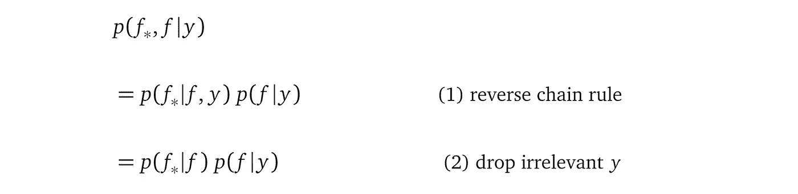

换句话说，我们决定将联合后验概率 *p(f_*，f|y)* 分解为条件概率 *p(f_*|f)* 和边际概率 *p(f|y)* 。通过将多元高斯条件规则应用于 GP 先验，我们知道了 *p(f_*|f)* 的公式。所以我们只需要用 *p(f|y)* 就可以了。

# 变分推理

我们不知道如何推导后验 *p(f|y)，*的解析表达式，换句话说，我们不知道后验*的结构。*下一个最好的方法是用另一个分布来近似后验概率，该分布的结构在我们的控制中*。所以通过设计，我们知道这个新分布的概率密度函数的解析表达式。*

请注意，我们希望使用一个新的分布来逼近后验概率 *p(f|y)* ，而不是逼近边际可能性 *p(y) = ∫ p(y|f) p(f) df。*后验概率是*对 *f 的概率分布*。*我们需要这个分布来做预测。边际可能性是在贝叶斯规则的右侧引入的一个*数*，以确保左侧是一个积分为 1 的适当概率密度函数。当我们使用一个新的分布来逼近后验概率 p(f|y) 时，我们自然会考虑边际可能性，因为这个新的分布在设计上是合适的*。*

*下面是我对“用另一种分布逼近后验概率”这句话的理解:*

1.  *这个新分布的概率密度函数覆盖与后验概率相同的一组随机变量 *f* 。所以这个新的分布可以被插入到后验概率出现的地方。*
2.  *这种新分布的行为类似于后验分布。这意味着对于一个 *f* ，新分布返回的概率与真实后验概率返回的概率相似。这样，这个新分布的概率密度函数的形状类似于后验分布。*

*为了理解短语*“新发行版的结构在我们的控制之中”*，让我们首先进一步发展这个近似概念。*

## *变分分布 q*

*我们称我们用来近似后验的分布为*变分分布。* 我们用 *q(f)到*表示它的概率密度函数。 *q(f)* 应该是什么样子？*

*我们希望 *q(f)* 看起来像后验 *p(f|y)* ，但是我们不知道后验的结构。我们提出 *q* 是一个均值 *μ* 协方差矩阵*σ的多元高斯分布如何？**

*均值和协方差矩阵完全决定了多元高斯分布的形状。随着它们的改变，多元高斯分布的形状也随之改变。因此我们可以找到 *μ* 和*σ*的具体值，使得 *q(f)* 的形状类似于 *p(f|y)的形状。*我们使用符号*q(f；μ，σ)*来强调这两个参数。我们称它们为*变分参数*。*

*下图说明了制作*形状 q(f；μ，σ)*接近于*p(f | y；l，σ )* ，其中 *f* 是单个随机变量，而不是随机变量向量:*

*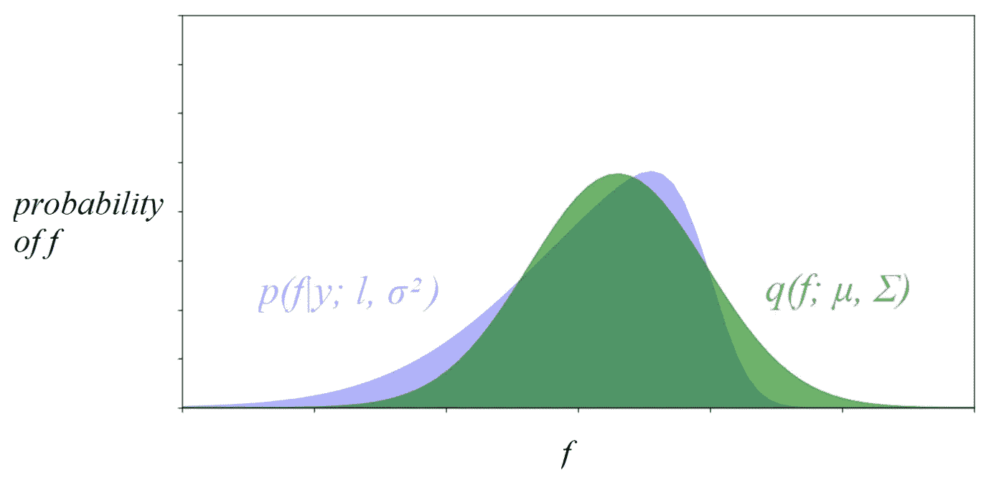*

*紫色分布呈不规则形状，说明后部的结构我们不知道。绿色分布是钟形的，说明了变分分布，这是一个多元高斯分布。我们调整 *μ* 和*σ*的值，使绿色尽可能与紫色重叠，使*q(f；μ，σ)*近似 *p(f|y)* 。*

*我们这里有两个非常重要的假设:*

1.  *我们假设存在一些具体的变分参数值，使得我们的多元高斯分布*q(f；μ，σ)*类似于非高斯后验*p(f | y；l，σ)。**
2.  *我们假设可以通过参数学习*为 *μ* 和*σ*找到这些具体值中的至少一个。**

*这两种假设在现实中都可能是错误的。所以对于某些数据集，我们可能无法找到好的 *q(f)* 的后验近似。这意味着我们可能找不到一个好的贝叶斯模型来很好地拟合训练数据——机器学习任务失败了。这很糟糕，但它发生了。*

*顺便说一下，变分推理在现代机器学习中非常重要，是一个你无法逃脱的话题。参见其在[时间序列预测](https://medium.com/towards-data-science/demystifying-tensorflow-time-series-local-linear-trend-9bec0802b24a)和[人脸生成](/understanding-the-denoising-diffusion-probabilistic-model-the-socratic-way-445c1bdc5756)中的应用。*

## *我们通过 *μ和σ*来控制 q 的形状*

*在多元高斯建议下，*的概率密度函数 q(f；μ，σ)*是:*

**

*其中 *n* 是训练数据点的数量， *det* 是矩阵行列式运算符。*σ*⁻是协方差矩阵*σ*的逆。*

*这个公式也显示了解析公式的重要性——它可以在插入未知数的具体值后进行评估: *f* ，这是一个浮点向量， *μ* ，这是一个浮点向量，*σ*，这是一个大小为 *n×n* 的浮点矩阵。当我们有了这三个的一些具体值后，上面的公式计算出一个单一的概率数——多元高斯分布*下 *f* 的概率。**

*变分分布 *q* 为多元高斯的提议现在看起来是纯粹的猜测，但稍后你会看到这种结构有很大的优势。*

*变分分布*q(f；μ，σ)*具有固定的结构——全多元高斯分布的结构。“满”意味着*σ*是没有零的密集矩阵*。*让我们稍后在参数学习部分回到这个问题。现在对我们来说重要的是，我们可以通过两个变化参数 *μ* 和*σ*来改变它的形状。理论上，通过改变 *μ* 和*σ*的值，我们可以得到随机变量向量 *f* 上任何可能的高斯分布。这就是为什么 *q 的结构在我们掌控之中。**

*一旦我们决定了 *μ* 和*σ*的具体值，我们就有了完全指定的 *q* ，我们可以用它作为真实后验概率的近似值。但是我们如何决定将哪些具体值赋给 *μ* 和*σ*？显而易见的答案是选择 *μ* 和*σ*的值，使得*q(f；μ，σ)*尽可能靠近后 *p(f|y，l，σ )* 。*

*我们意识到我们需要一个从分布 *q(f)* 到后验 *p(f|y)* 的“接近度”度量。我们需要一种方法来最小化这种亲密度。*

## *kull back-lei bler 散度和证据下界*

*因为我们希望我们的变分分布*q(f；μ，σ)*向后方靠近*p(f | y；l，σ )* ，我们需要一个他们之间的贴近度。我们可以使用 kull back-lei bler 散度(KL 散度)来定义一个分布与另一个分布的接近程度。变分分布之间的 KL 散度公式*q(f；μ，σ)*和后验*p(f | y；l，σ )* 是:*

*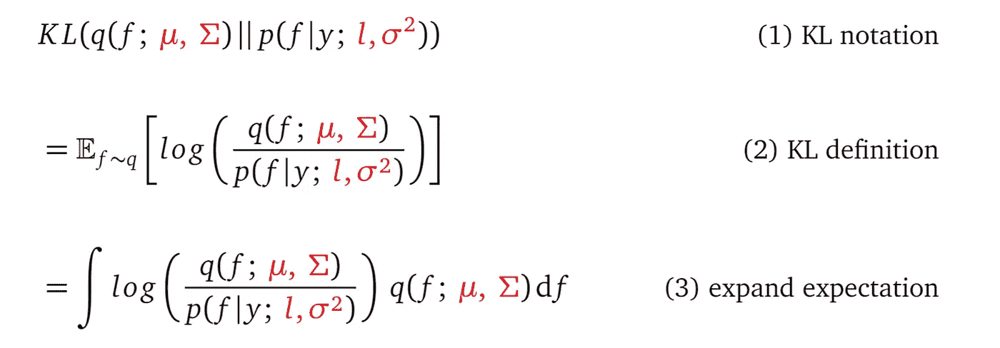*

*在上面的推导中，我将模型参数(核参数和变分参数)涂成红色。*

*线(1)是 KL 发散的符号。KL 运算符内的双竖线||分隔我们要计算距离的两个分布。*

*第(2)行定义了 KL 背离的含义。它是两个分布之间的预期*对数*概率比。如果对于某些 *f* 、 *q(f)* 和 *p(f|y)* 评估为相同的概率，那么它们的比值为 1， *log(1)* 为 0。所以这个特殊的 *f* 对总的散度度量没有贡献。另一方面，如果该比率不是 1，则该 *f* 有助于最终的散度测量。因此 KL 散度是在*对数*标度中 *f* 的概率密度之间的平均差。*

*第(3)行用它的数学计算——积分——代替了期望值。它显示被积函数(插入训练数据 *X* 和 *Y* )有 4 个未知数: *l，σ，μ，σ*，这是全套模型参数*。*随机变量 *f* 被积分出来。*

*我们要的是 *q 的形状(f；μ，σ)*尽可能接近*p(f | y；l，σ )* 尽可能。KL 散度 *KL(q(f)||p(f|y))* 编码这种接近度，并且它是模型参数的函数。使 *q(f)* 尽可能接近 *p(f|y)* 的方法是最小化关于模型参数的 KL 发散:*

**

*你内心一定有个疑问在燃烧——我们不知道后验*p(f | y)*的解析形式，如何才能最小化提到它的 KL 散度？*

*为了回答这个问题，我们需要继续操作公式，但是现在为了节省空间，我忽略了推导中的模型参数。请记住，无论我们如何操纵 *q(f)* 和 *p(f|y)* 之间的 KL 散度，它始终是四个模型参数的函数。*

*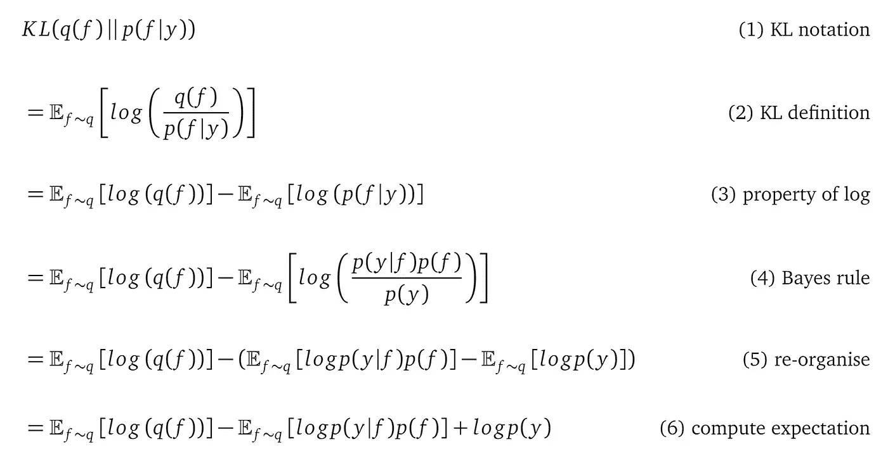*

*在第(6)行，我们不写 *log p(y)* 周围的期望运算，因为 *log p(y)* 没有提到随机变量 *f* ，忽略的期望是相对于 *f* 的。所以期望评估为 *log p(y)* 。我们对 *log p(y)* 有一个著名的名字——对数边际可能性。*

*上面的推导，尤其是第(6)行，证实了我们不能计算这个 KL 散度。这是因为它要求我们计算对数边际可能性*log p(y)*，但是 *p(y)* 是一个难以处理的积分，它首先阻止我们使用贝叶斯规则来计算后验概率:*

**

*既然无法计算 *logp(y)* ，那就勇敢一点，把它去掉，尽量把剩下的两项最小化。*

*等价的，我们可以最大化的否定这两个项。我们给这种否定命名为**证据下界**，或 *ELBO* :*

*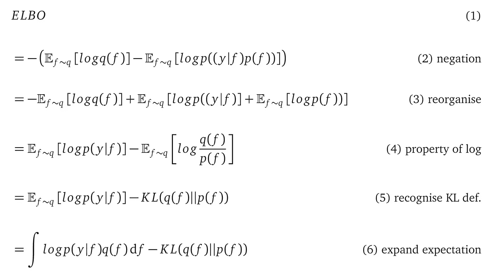*

*第(2)行否定了上面 KL 散度公式的前两项，去掉了第三项 *log p(y)* ，我们无法计算。*

*第(3)行和第(4)行使用 *log* 的属性和期望的线性来重新组织术语，即对于两个随机变量 *a* 和 *b* ，使用*E【a+b】= E【a】+E【b】*。*

*行(5)认识到第二项是变分分布 *q(f)* 和**之间的 KL-散度，GP 先于 *p(f)*** 。*

*第(6)行将第一项中的期望扩展到其实际的数学定义——积分。*

*从现在开始， *ELBO* 将是我们最大化的目标函数，以使变分分布 *q(f)* 尽可能接近后验 *p(f|y)* 。*

## *为什么可以删除 log p(y)？*

*随着 *EBLO* 的定义，我们有了这个等式:*

**

*注意 *ELBO* 前面的减号。*

*我们的理想目标是最小化 *KL(q(f)||p(f|y))* ，但是因为我们不能计算 *log p(y)* ，我们最小化 *-ELBO* ，或者等价地，最大化 *ELBO* 作为*的替代*。*

*你可能会问为什么可以去掉 log 边际可能性 *log p(y)* ？回答这个问题，我可以引用“[所有的模型都是错的，但有些是有用的](https://en.wikipedia.org/wiki/All_models_are_wrong)”。我们知道丢弃 *log p(y)* 是错误的，但是如果我们保留它，我们就无法计算公式。*

*玩笑归玩笑，我认为你的问题的潜在含义是:丢弃 *log p(y)* 我们会失去什么信息？这种信息丢失是可以容忍的吗，这样剩下的模型仍然有能力发挥作用？为了回答这个新问题，让我们考虑一下 *log p(y)* 包括哪些信息——它是由先前的 *p(f)* 加权的可能性 *p(y|f】、*之和:*

**

*下面再次显示的 *ELBO* 公式也包括出现在第一项中的可能性信息和出现在第二项中的先验信息:*

**

*因此，通过丢弃 *log p(y)* ，我们并没有失去一切，这是重要的一点。当然，剩余的信息没有以加权和的形式出现，所以我们有一些信息损失。这就是我们使用可计算的替代公式而不是理想的、但不可计算的公式所付出的代价。*

## *ELBO 背后的直觉*

*从上面看第(6)行，我们对 ELBO 有一个直观的解释，复制到这里:*

**

*第一项是相对于随机变量 *f* 的期望似然性，现在来自变分分布 *q(f)。*第二项是 *q(f)* 与 GP 前 *p(f)* 之间的 KL 背离——注意，不是后 *p(f|y)* ，记住一个 KL 背离是[非负](https://stats.stackexchange.com/questions/335197/why-kl-divergence-is-non-negative) *。**

*我们想要最大化 *ELBO* 。要做到这一点，我们需要期望的可能性大，KL 距离小。这个数学意义很好地符合我们的意图:*

*   *我们希望我们的模型 *q(f)* 能够通过很大的可能性很好地解释训练数据。*
*   *同时，我们希望 *q(f)* 通过 *q(f)* 和 *p(f)* 之间的小 KL 距离，保持接近我们的先验。这是因为我们相信我们先前的模型如何生成训练数据。后验仅重新加权来自前验的函数，使得很好地解释训练数据的函数获得更高的概率。理解 KL(q(f)||p(f))项的另一个角度是它是一个正则项。*

**ELBO* 提到先前的*p(f；l，σ )* 和变分分布*q(f；μ, Σ).因此它仍然是这四个模型参数的函数。在第一项中，*对数似然*项只提到了变分参数 *μ* 和*σ*。第二项，即 *KL(q||p)* 项，提到了所有四个模型参数。**

*你可能会想，既然我们放弃了我们无法计算的项——在*KL(q(f)| | p(f | y)】*公式中的 *logp(y)* 项，为什么我们不能在意识到有一个难以处理的积分的第一时间放弃它呢？那时我们试图用贝叶斯法则来计算后验概率:*

**

*并且我们意识到 *p(y)=∫p(y|f)p(f)df* ，也就是分母，很难处理。但是我们不能把它放在这里，因为我们会得到一个没有分母的分数，这是不良的。*

*我们现在可以去掉 *logp(y))* 项，因为 KL-divergence*KL(q(f)| | p(f | y))*由其他项组成。*

*你可能会奇怪，既然 KL 散度衡量的是两个分布之间的相似性，为什么我们选择做 *KL(q(f)||p(f|y))* ，而不是 *KL(p(f|y)||q(f))* ？*

*   *第一， [KL 散度不对称](https://stats.stackexchange.com/questions/188903/intuition-on-the-kullback-leibler-kl-divergence)，意思是 *KL(q(f)||p(f))* 不等于 *KL(p(f)||q(f))* 。*
*   *第二，如果我们使用 *KL(p(f)||q(f))* ，我们会有问题:*

*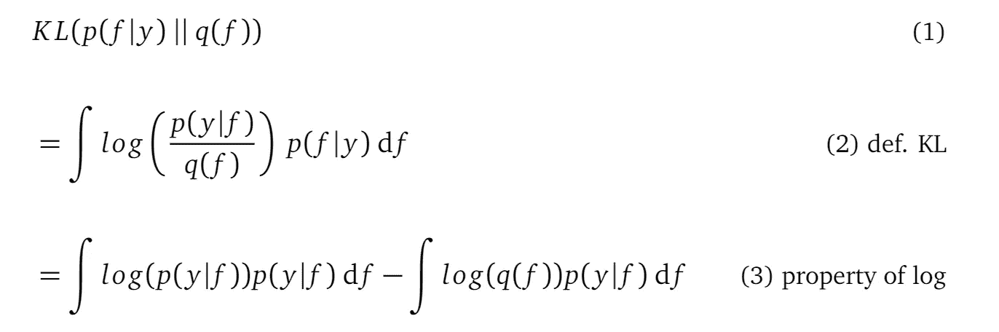*

*从第(3)行我们可以看到，两个积分都提到了我们无法计算的后验 *p(y|f)* 。*

*好了，现在我们有了关于模型参数最大化的 *ELBO* 函数。因此 *ELBO* 是我们的优化目标。寻找具体值以最大化该目标的过程称为*参数学习*。*

## *从对数边际似然角度看*

*您可能还记得，在高斯过程回归设置中，参数学习最大化的目标函数是 *log* 边际似然 *logp(y)* ，在该设置中， *logp(y)* 是易处理的。*

*现在在分类中，我们最大化 *ELBO* ，这两个目标函数是如何关联的？事实上，你可以从*对数*的边际可能性观点中推导出 *ELBO* :*

*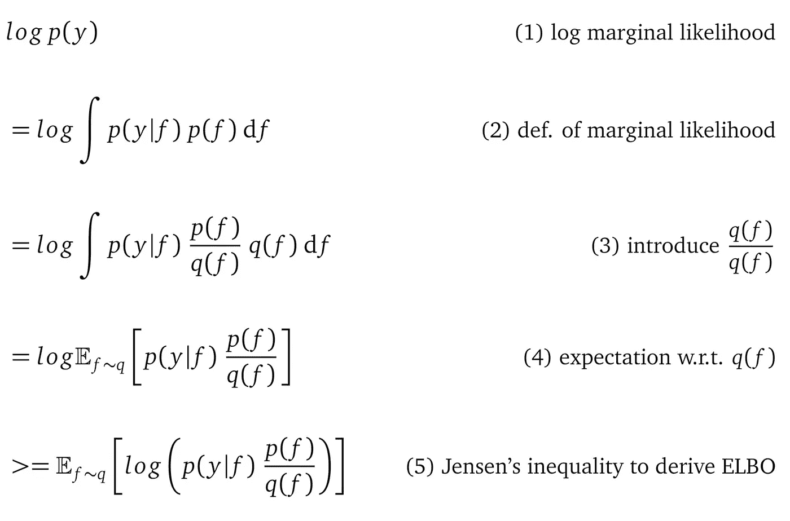*

*线(1)是对数边际可能性的符号。*

*第(2)行将定义 *p(y)* 扩展为一个积分。*

*第(3)行引入了数量 *q(f)/q(f)* ，其计算结果为 1。所以这个量不会改变积分的结果。这是一个著名的操作——它将变分分布 *q(f)* 带入图像。*

*第(4)行把第(3)行中的积分改写成关于来自变分分布 *q(f)* *的随机变量 *f* **的一个期望。****

*第(5)行应用[詹森不等式](https://en.wikipedia.org/wiki/Jensen%27s_inequality)将 *log* 函数从预期之外移到预期之内。由此产生的期望是 *ELBO* 的公式。我们使用詹森不等式给我们计算带来方便——一个*对数*的期望比一个期望的*对数*更容易操作。*

## *ELBO 是一个下界*

*请注意在应用詹森不等式后，从等号变为大号或等号。它揭示了 *ELBO* 小于我们真正希望最大化的 *log* 边际可能性 *log(p(y))* 。这个边际可能性也被称为[模型证据](https://en.wikipedia.org/wiki/Marginal_likelihood)。而我们的 *ELBO* 比这个证据低，因此得名证据下界。*

*你可能会问，这个 *ELBO* 下界和我们真正想要最大化的 *log* 边际似然 *log p(y)* 有什么区别？我们已经从前面的等式中知道了这种差异:*

**

*差异是变分分布 *q(f)* 和真实后验分布 *p(f|y)* 之间的 KL 散度。重新排列一些术语后，我们有:*

**

*注意一个 KL 散度是非负量，所以 *KL(q(f)||p(f|y)) ≥0* 。这个等式证实了最大化 *ELBO* 等价于最小化 *q(f)* 和 *p(f|y)* 之间的 KL 散度，因为更大的 *ELBO* 意味着更小的 *KL(q(f)||p(f|y))* 。为了正确理解这一点，我们需要了解一些微妙之处:*

1.  **log(p(y))* 是提及核参数 lengthscale *l* 和信号方差 *σ* 的表达式。*
2.  **ELBO* 是提及核参数以及变分参数 *μ* 和*σ的表达式。**
3.  **KL(q(f)||p(f|y))* 是提及核参数以及变分参数 *μ* 和*σ的表达式。**

*通过改变 *l、σ、μ、*和*σ*的值来最大化 *ELBO* 将同时改变 *log p(y)* 的值。在参数学习过程中，不能将 *log p(y)* 视为常数。但是无论参数学习过程为 *l，σ，*选择哪个值，一旦 *ELBO* 在这个模型参数值配置中最大化，这个配置就给你一个最小化的 *KL(q(f)||p(f|y))* 。*

# *ELBO 的解析表达式*

*我们再来看看*爱尔博*公式:*

**

**ELBO* 是一个以模型参数为自变量的函数。我们需要推导出 *ELBO* 的解析表达式，因为我们想要使用梯度下降法来找到使 *ELBO* 最大化的那些模型参数的具体值。梯度下降仅适用于分析函数，因为它计算该函数相对于其参数的梯度。*

## *KL 项已经是解析的了*

*由于 *q(f)* 和 *p(f)* 都是多元高斯概率密度函数，它们的 KL-散度的解析形式是已知的。**这是选择 *q(f)* 做多元高斯的好处之一。稍后，我会给你看这个 KL 项的解析表达式。***

## *可能性项不是分析性的*

*可能性项是一个积分，所以还不是分析性的。让我们稍微操作一下:*

**

*以上表达式由结构相同的 *n* 项组成。为了导出整个似然项的解析表达式，我们可以关注任意项，比如第 I 个*项*项。下面是一个**非常重要的引出**:*

*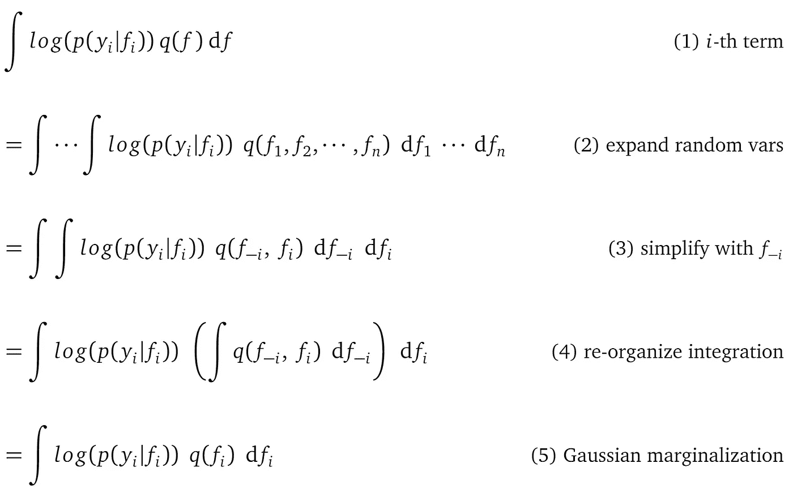*

*第(1)行是似然项中第*个*项的公式。它是对随机变量向量 *f* 的一个 *n* 维积分。 *n* 是训练数据点的数量。这是因为这个积分是计算*【log(p(yᵢ|fᵢ】)*相对于变分分布 *q(f)* 的期望，这是一个 *n* 维多元高斯。注*)*在 *fᵢ* 中只提到了单个随机变量，而 *q(f)* 提到了所有 *n* 个随机变量。*

*第(2)行将随机变量向量 *f* 扩展成单个随机变量 *f₁* 到 *fₙ.*在 *f* 中有 *n 个*随机变量，所以有 *n 个*一维积分。*

*第(3)行引入一个名字 *f₋ᵢ* 来表示随机变量*【f₁，f₂，…，fᵢ₋₁，fᵢ₊₁，…，fₙ】*的向量。这是一个长度为 n-1 的向量。包含 *f* 中除 *fᵢ.外的所有随机变量*我们引入 *f₋ᵢ* 来简化公式。*

*第(4)行将 *n* 个积分重新分组为两个积分:一个在单变量 *fᵢ* 上，另一个在随机变量向量 *f₋ᵢ* 上。原因是我们想要应用多元高斯边缘化规则来计算 *f₋ᵢ* 上的内部积分。*

*第(5)行应用多元高斯边际化规则来计算对 *f₋ᵢ* 的内部积分，结果为 *q(fᵢ).令人惊讶的是，我们知道 q(fᵢ的解析表达式。这一步需要更多的解释。**

*召回*q(f；μ，σ)*是均值向量 *μ* 和协方差矩阵*σ的多元高斯分布。*这里我显式地展示了 *f* 、 *μ* 和*σ*的条目 *:**

*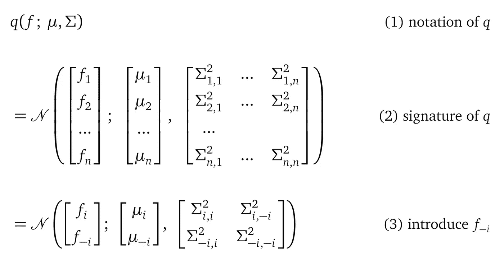*

*第(3)行的上述推导将分布 *q* 中的随机变量重新组织到 *fᵢ、f₋ᵢ* 块中。在这一行:*

1.  **μᵢ* 是一个浮点值；它是随机变量 *fᵢ.的平均值**
2.  **μ₋ᵢ* 是一个长度为 *n-1* 的浮点向量；它是向量 *f₋ᵢ.中随机变量的平均值**
3.  **σᵢ,ᵢ*是一个浮点值；它是随机变量 *fᵢ* 的方差*
4.  **σᵢ,₋ᵢ*和*σ₋ᵢ,ᵢ*是大小为 *(n-1)×(n-1)的矩阵；它们是互相转置的。它们代表随机变量 *f₋ᵢ* 和随机变量 *f₋ᵢ.之间的协方差***
5.  **σ₋ᵢ,₋ᵢ*是一个大小为 *(n-1)×(n-1)，*的矩阵，它是 *f₋ᵢ.中随机变量之间的协方差**

*随着分布 *q* 以这种方式重新表述，让我们回过头来看看随机变量 *f₋ᵢ* 的内部积分:*

**

*这个积分从联合分布 *q(fᵢ，f₋ᵢ)* 中整合出随机变量 *f₋ᵢ* ，得到 *q(fᵢ)* ，一个单一随机变量 *fᵢ.的分布*这就是概率论中边缘化的含义。*

*由于 *q(fᵢ，f₋ᵢ)* 是多元高斯分布，我们可以应用多元高斯边际化法则，繁琐地推导出 *q(fᵢ)* 的解析表达式，相当于计算上述积分。**这是选择 *q(f)* 为多元高斯分布的另一个好处。***

*多元高斯边际化规则表示边际化分布 *q(fᵢ)* 仍然是高斯分布，其均值和方差等于联合分布中用红框突出显示的部分:*

**

*突出显示的部分是随机变量 *fᵢ* 的一维高斯分布，具有均值 *μᵢ* 和方差*σᵢ,ᵢ。μᵢ* 是 *μ* 向量的第*I*项，σᵢ,ᵢ*是**矩阵*σ的对角线***的第*I*项。*概率密度函数 *q(fᵢ)* 为:*

*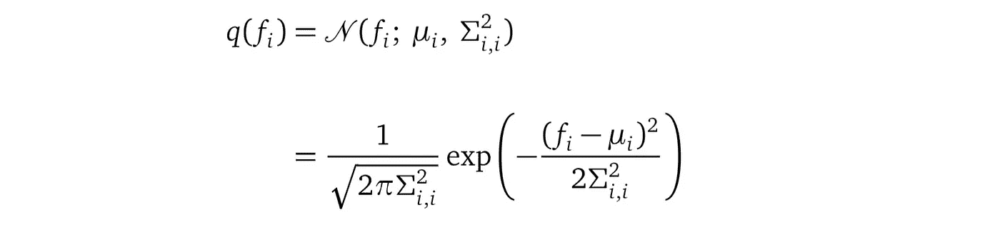*

*由此，我们可以看出第 *i 个*似然项为:*

*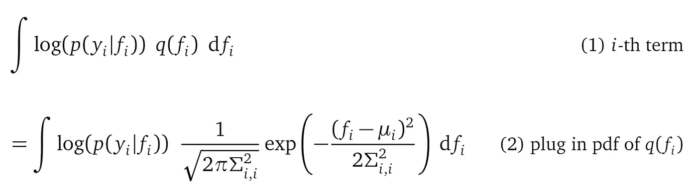*

*这个函数在 *μ* 中只提到一个 *μᵢ* 条目，在*σ中只提到一个*σᵢ,ᵢ*条目。*推广到所有的似然项，我们知道总体似然提及向量 *μ* 中的所有条目，并且仅提及*σ的对角线条目。**

## *似然项提到了哪些模型参数？*

*重要的是，在似然项中只提到了变分参数 *μ* 和变分参数*σ*中的对角线项。在似然项中没有提到*σ*中的非对角线条目。在似然项*中也没有提到核参数 *l* 和 *σ* 。**

## *可能性是 n 个一维积分的总和*

*上述公式揭示了第*个*似然项是单个随机变量 *fᵢ* 的一维积分。推广到似然性中的任意项，我们知道它们都是一维积分，每个积分针对 *f* 中不同的随机变量。*

*因此，如果我们能够计算出代表第*个*个可能性项的积分结果的解析表达式，我们就能够计算出整个可能性的解析表达式。KL 项已经是解析的，我们将得到整个 *ELBO 的解析表达式。*这将使我们能够使用梯度下降进行参数学习。*

*第 *i 个*似然项是一维积分的事实非常重要。因为这个可能性项是一个积分。我们之前说过，它是一个运算，而不是一个我们可以求值的解析表达式。这种一维积分也很难计算。但是由于它是一维的，我们可以应用一种叫做高斯求积的方法，以解析的方式来近似这个积分的结果。*

# *高斯正交*

*高斯求积法则，或者更具体地说，[高斯-埃尔米特求积法则](https://en.wikipedia.org/wiki/Gauss%E2%80%93Hermite_quadrature)，如下所示，表示左手侧的特定结构的积分结果可以通过右手侧的 *m* 项的和来近似，其中 *F(t)* 是 *t* 的函数:*

**

*在右侧， *wⱼ* 和 *tⱼ* 是预先计算的，我们可以从[高斯正交表](https://keisan.casio.com/exec/system/1281195844)中查找它们。 *F(tⱼ)* 是 *F* 在 *tⱼ* 位置的评价。右手边是一个解析表达式，因为我们可以查找 wⱼ和 tⱼ，我们可以计算 F(tⱼ).左侧和右侧都计算出一个数字。*

*请区分我们介绍的两种近似值:*

1.  *之前我们引入了变分分布 *q(f)* 来逼近真实的后验概率 *p(f|y)* 。我们迫使 *q(f)* 接近 *p(f|y)* 的方法就是最大化 *ELBO* 。这是一个分布到分布的近似值。*
2.  *现在我们需要推导出*ELBO*中第 I 个似然项的解析表达式。由于积分很难计算，我们想用高斯求积来近似这种积分的结果。这是一个数字对数字的近似值。*

*现在，请接受高斯正交近似是有意义的。事实上，这个近似值通常非常接近积分的真实结果。从这个意义上说，高斯正交近似是真实积分值的估计量。因为近似值与积分结果不同，所以这个估计量有一个偏差，由近似值与真实积分结果之间的差异来衡量。如果选择足够大的 *m* ，偏差可以任意小，代价是更多的计算*。**

## *高斯求积背后的直觉*

*我会写另一篇文章来解释为什么高斯求积是有意义的。但是现在为了让你好奇的心平静下来，这里有一个简单的解释。*

*您可以将积分结果理解为无限多个等宽矩形的总和，如下图所示。每个矩形都有一个无限小的宽度，其高度是被积函数在该矩形 x 位置的值。*

*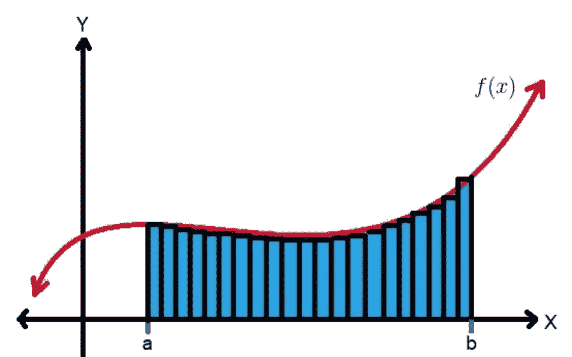*

*图片来自[此处](https://www.instructables.com/id/How-to-Make-a-Numerical-Integration-Program-in-Pyt/)*

*我们可以通过在不同的 x 位置仔细选择几个(而不是无限多个)矩形，并给这些矩形不同的宽度，来近似积分的结果。在函数缓慢移动的区域，矩形较宽，在函数快速移动的区域，矩形较窄。下图说明了这一想法。*

*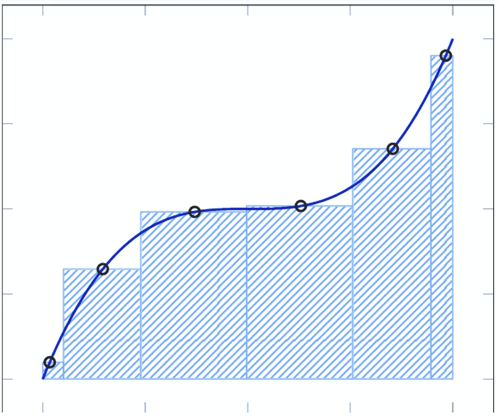*

*图片来自[这里](https://www.researchgate.net/figure/Integration-by-Gauss-Chebyshev-quadrature-of-the-function-hx-x-3-1-dark-blue_fig9_280664508)*

*高斯求积公式中的加权和结构正好实现了上述思想。求积理论告诉你如何选择位置 *tⱼ* 来计算被积函数，以及这个矩形的宽度 *wⱼ* 应该是多少。这些位置和宽度已经在[的表格](https://keisan.casio.com/exec/system/1281195844)中计算出来了。你只需要决定你想要多少个矩形，那就是 *m* 的值。你想要的矩形越多，近似越精确，但是计算越昂贵。*

*很神奇，不是吗？*

## *用高斯求积逼近第 I 个似然项*

*现在，让我们使用高斯求积来推导近似第*个*似然项的结果的解析表达式。*

*再看集成:*

**

*这不是高斯求积法则左侧尺寸所要求的格式:*

**

*我们需要将这个积分转换成高斯求积规则所要求的格式。很多时候，我们在数学中做的事情是模式匹配。*

*由于*第 I 个*似然项中的积分是关于一个高斯随机变量 *fᵢ ~ 𝒩(μᵢ，σᵢ,ᵢ)*的一个期望，我们先应用积分中的变量变化规则，将其转化为关于一个标准高斯分布 *𝒩(0，1)的一个期望。*我们引入一个新的一维随机变量 *u* 来自标准高斯分布: *u~𝒩(0，1)。**

*我们可以将随机变量 *fᵢ* 定义为:*

**

*使用高斯线性变换规则，很容易验证以这种新方式定义的 *fᵢ* 仍然来自分布 *𝒩(μᵢ，σᵢ,ᵢ)*:*

*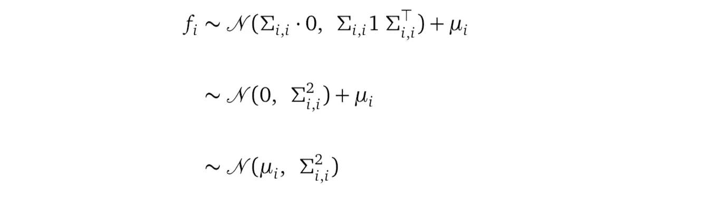*

*你可以看我的另一篇文章[揭开 Tensorflow 时间序列的神秘面纱:局部线性趋势](/demystifying-tensorflow-time-series-local-linear-trend-9bec0802b24a)了解更多关于高斯线性变换规则的信息。*

*利用这个新的随机变量 *u* ，我们将第*个*似然项转换为:*

*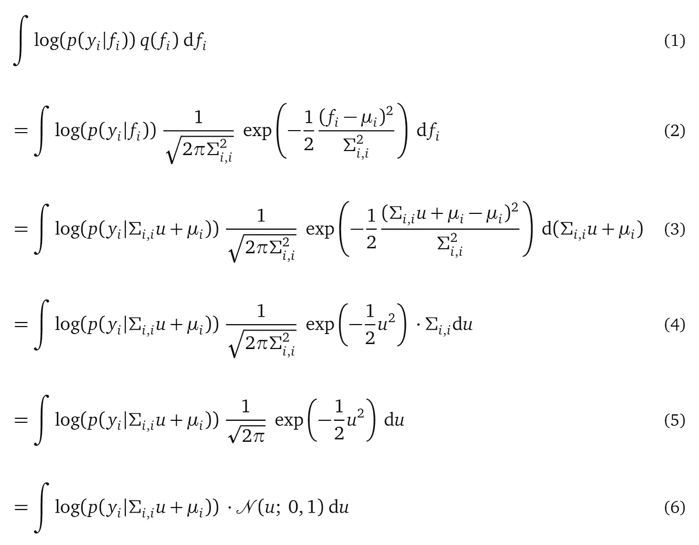*

*线(2)扩展了 *fᵢ.的概率密度函数**

*第(3)行应用变量改变规则将积分变量从 *fᵢ* 改变为 *u* 。*

*第(4)和(5)行简化了公式。在第(5)行，出现了标准高斯分布的概率密度函数。*

*第(6)行认识到，现在第*个*似然项是关于标准高斯随机变量 *u* 的期望。*

*我们意识到第(5)行的公式仍然不是我们应用高斯求积所需的格式。但是理想的格式只是另一个变量的变化。我们引入一个新变量 *t* :*

**

*并将*第 I 个*似然项变换为:*

*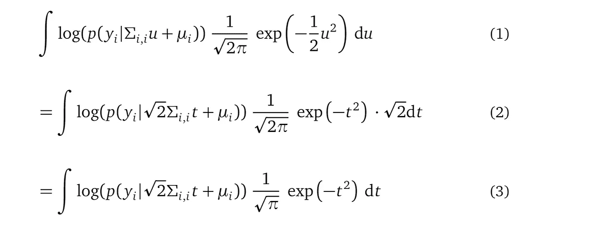*

*我们最终将第一个*似然项转换为高斯求积规则所要求的格式，其中:**

**

*在变量变化的这两个应用中，所有新旧变量 *fᵢ、*和 *t、*的定义域都是从-∞到+∞，所以这些运算不会改变积分的边界，所以我们一起忽略了边界。*

*通过应用我们期待已久的高斯求积公式，我们可以得出:*

*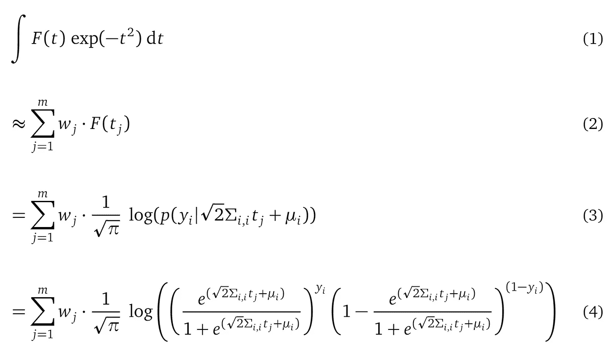*

*第(1)和(2)行是高斯求积公式。*

*线路(3)插入 *F(t)* 。*

*第(4)行写出了所有的可能性。让我们仔细阅读它，因为它揭示了重要的信息:*

1.  *这个公式是解析的，因为我们可以在将 *Yᵢ* 插入 *yᵢ* 后评估其值，决定值 *m* ，并用高斯求积表中的值替换所有 *wⱼ* 和 *tⱼ* 。它计算出一个实数值。*
2.  *由于每个*第 I 个*似然项由 *m 个*项组成，所以整个似然项由 *m×n 个*项组成，其中 *n* 为训练数据点的个数。这个好像是很多项，比如说 *m* 是 40，训练点数是 1000，我们对于似然项就有 40000 项。但这是可以承受的，因为项数与 n 成线性比例关系，比例系数为 m。对于高斯过程来说，任何线性变化都是好消息。*
3.  *这个表达式是一个函数，它提到了变分参数 *μ* 和来自*σ*的对角元素。因为这个表达式是 *ELBO* 的一部分，ELBO 是我们要最大化的目标函数，它确实满足了我们对目标函数的要求——它至少需要提到我们的一些模型参数。 *ELBO* 中的似然项只提到了部分变分参数，并没有提到来自 GP 先验的核参数。请记住这一点，我们稍后会详细说明。*

## *求积公式中的常数*

*为了让您对高斯求积表有所了解，当我们选择 *m=10* 时，位置 *tⱼ* 和权重 *wⱼ* 的值为:*

*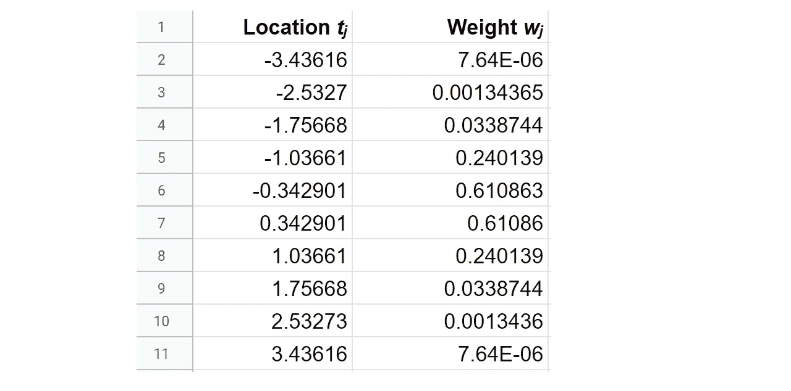*

*使用的项数越多(m*越大*)，近似值就越精确，但计算成本也就越高。经验法则是使用 *m=40* 。*

*恭喜你！我们推导出了整个 *ELBO* 的解析表达式，我们为参数学习做好了准备。在此之前，一个负责任的机器学习实践者会问几个问题。*

## *高斯求积是一个好的近似吗？*

*由于我们使用高斯求积为我们提供了一个解析表达式来近似第 I 个 T2 似然项中的积分结果，我们需要知道这种近似有多好，以及它的计算负担能力如何。*

*高斯求积非常精确。你可以看看视频[高斯正交的魔力——比第二好的东西](https://www.youtube.com/watch?v=k-yUdqRXijo)好十亿倍来说服自己。事实上，高斯求积的偏差可以忽略不计。高斯正交近似结果与积分的真实值之间几乎没有差别。*

*高斯求积是一个确定性的过程，在近似值中没有方差——您调用高斯求积方法任意次，都会得到相同的结果。*

*因此，高斯求积是第*个*似然项的一个很好的近似。*

## *为什么所有的模型参数都可以从训练数据中学习？*

*我们看到*第 I 个*似然项的解析表达式只提到了变分参数 *μ* 和另一个变分参数*σ*的对角线上的条目。也没有提到内核参数 *l* 和 *σ* ，这两个参数来自 GP previous*。**

*此外，我们注意到在 *ELBO* 中，只有可能性项提到了训练数据 *Y* 。你可能会问，*σ*的非对角条目和内核参数 *l* 和 *σ* 如何从数据中学习？这是一个非常重要的问题。我们的训练数据与所有模型参数之间的联系是一个必要条件，使得这些模型参数可以通过梯度下降从训练数据中学习。*

*要回答这个问题，我们需要考察 *ELBO* 中另一项的解析表达式，变分分布*q(f；μ，σ)*和先验的*p(f；l，σ )* 。*

*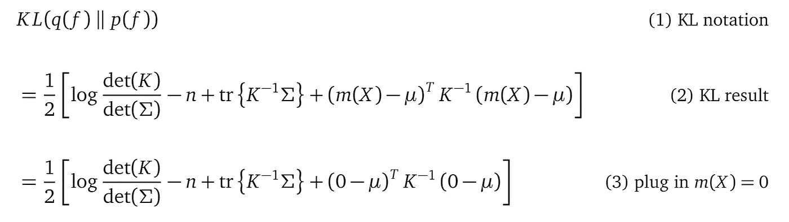*

*首先要注意的是矩阵求逆 *K⁻* ，其中 *K* 是来自 GP 先验的协方差矩阵。K 的形状为 *n×n* ，其中 *n* 为训练数据点的个数。所以这种倒置是非常昂贵的。这也意味着，我们的模型不能扩展到大型数据集。*

*线(2)给出了在*q(f；μ，σ)*和*p(f；l，σ )* 。两者都是相同随机变量 *f* 的多元高斯分布。[计算](https://stats.stackexchange.com/questions/60680/kl-divergence-between-two-multivariate-gaussians)有点复杂，请接受这是可以做到的，而且是分析性的。 *n* 是训练数据点的数量。 *tr* 代表[跟踪算子](https://en.wikipedia.org/wiki/Trace_(linear_algebra))，它是一个方阵对角线上的元素之和。 *K* 是 GP prior 中定义的 *n×n* 协方差矩阵。 *det(K)* 代表 *K* 的行列式。 *K⁻* 是 *K* 的逆。而 *m(X)* 是我们给 GP 先验的均值函数，通常情况下， *m(X)=0* 。*

*第(3)行将零均值函数 0 插入公式以简化它。*

*让我们用两个训练数据点 *(X₁，Y₁)，(X₂，Y₂)* 来研究第(3)行的公式。例如:*

*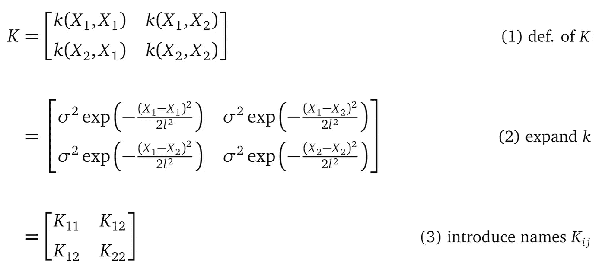*

*协方差矩阵 *K* 在训练数据中只提到了 *X* ，没有提到 *Y* 。作为协方差矩阵的 *K* 是对称的。并且 *K* 提到了内核参数 *l* 和 *σ。**

*让我们看看我们的变分分布(这里，为了节省空间，我把协方差矩阵的一个条目写成*σᵢⱼ*，而不是我以前使用的符号*σᵢ,ⱼ*:*

**

*有了上面的定义，我们可以使用微积分中的规则 *:* 计算行列式 *det(K)* ，*det(σ)*和逆 *K⁻**

***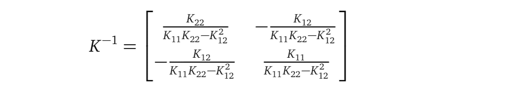*

*现在，我们可以写下 KL 散度公式中的各项:*

***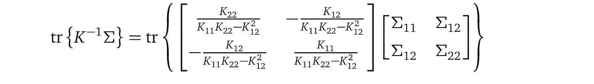**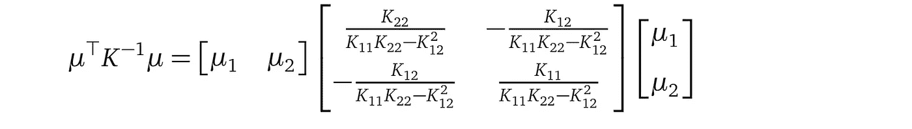*

*我们只需要浏览一下这些项，就可以看到在 KL 散度项中:*

1.  *所有模型参数，包括来自变分分布的 *μ* 中的所有条目和*σ*中的所有条目(对角线以及非对角线)，以及来自 GP prior 的 *l* 和 *σ* ，都纠缠在一起。*
2.  *由于这种纠缠，似然项中提到的模型参数部分(即 *μ* 和*σ*的对角线条目)会影响似然项中没有提到的其余模型参数(GP prior 中的*σ*和 *l* 和 *σ* 的非对角线条目)。*
3.  *并且，训练数据 *Y* 可以影响所有模型参数。*

*这就是为什么所有模型参数都可以从训练数据中学习到。*

## *模型可扩展性*

*从 *q(f)* 到 *p(f)* 的 KL 散度中的矩阵求逆 *K⁻* 计算起来很昂贵。运算的次数，比如矩阵中的倍数或者两个数相加，与 *n* 成比例。 *n* 是训练数据点的数量。对于现代标准的微小数据集 *n=1000* ，反演需要数十亿次运算。*

*这意味着我们的变分高斯过程无法扩展到大型数据集——计算 *K⁻需要太长时间。*我的下一篇文章将讨论[稀疏和变分高斯过程](/sparse-and-variational-gaussian-process-what-to-do-when-data-is-large-2d3959f430e7)，这是一个可以扩展到大型数据集的模型。*

## ***我们可以用高斯求积来计算后验概率吗？***

*你可能会问，我们在 *ELBO* 中用高斯求积来近似似然项，是否可以用它来近似贝叶斯法则中的边际似然？*

*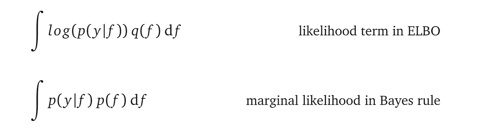*

*变分分布 *q(f)* 和 GP 先验都是多元高斯分布。所以结构上，这两个整合是一样的。为什么不用高斯求积来近似边际似然呢？我完全理解这个问题——它也让我抓狂。*

*但是在 *ELBO* 似然项中的*log(p(y | f)】*和边际似然项中的 *p(f|y)* 有着至关重要的区别。边际可能性前面没有*日志*。所以我们不能使用属性 *log(ab) = log(a) + log(b)* 将边际似然分解成更小项的和。没有这一点，我们不能将多元高斯边际化规则应用于边际似然，以将对 f 的 n 维积分减少到对单个随机变量 fᵢ.的单个积分之和*

*因此，边际似然仍然是一个 *n-* 维积分，其高斯正交近似需要 *mⁿ* 项，即*m*n 项的幂——总项数随着训练数据点的数量异常增长。即使对于一个小的数据集来说，这也是一个不切实际的大数字。这就是我们不能在直接计算后验概率时使用高斯求积的原因。*

*本文的附录向您展示了为什么高斯求积需要 *mⁿ* 项来逼近边际似然。*

# *参数学习*

*现在我们已经推导出了 ELBO T1 的解析表达式。这个表达式是一个函数，其中我们的所有模型参数都是未知的——核心参数 *l，σ，*和变分参数 *𝜇，σ*。参数学习使用梯度下降来最大化 *ELBO* 以找到这些模型参数的最佳值。这是梯度下降的直接应用。但是仔细思考这种优化提出了一些有趣的问题。*

*先总结一下我们的模式。*

## *完整的模型*

*我们的二元分类模型包含以下组件:*

1.  *多元高斯先验*p(f；l，σ )* ，其中引入了潜在随机变量向量 *f* ，以及核参数 *l* 和 *σ。**
2.  *伯努利似然 *p(y|f)* ，引入观测随机变量向量 *y* ，不引入任何参数。*
3.  *变分分布*q(f；μ，σ)*，其中引入了变分参数 *μ* 和*σ。*我们要求*q(f；μ，σ)*向后方靠近*p(y | f；l，σ )* 在 KL-散度意义上。*

*在数学语言中，模型显示为(红色的模型参数):*

*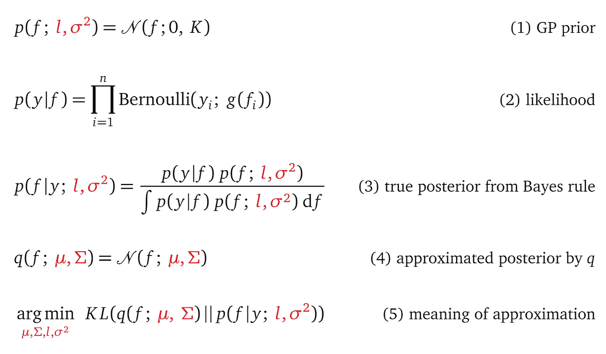*

*第(1)行是 GP 优先。第(2)行是可能性。第(3)行定义了由 Bayes 规则计算的真实但难以处理的后验概率。第(4)行引入了近似真实后验概率的变分分布。第(5)行使用 KL 散度来定义通过变分分布来近似真实后验概率的含义。这种 KL 差异也是难以处理的，所以我们最终最大化 *ELBO* 作为最小化这种 KL 的代理。*

## *我们需要学习多少标量？*

*我们的模型有四个不同形状的参数(形状在张量形状的意义上):*

*   *长度刻度 *l* 为标量。*
*   *信号方差 *σ* 也是标量*。**
*   **q(f)的*均值向量 *μ* 是一个长度为 *n* 的向量，所以它有 n 个标量项。*
*   **q(f)的*协方差矩阵*σ*是一个大小为 *n×n，*的矩阵，它是对称的，所以有 *n(n+1)* 自由标量项。*

*这个模型总共有 *2+n+ n(n+1)* 个标量，这些标量的值需要通过参数学习来决定。不要忽略列出所有模型参数的任务——这是一个健全性检查，以便您理解模型。*

*我知道你想喊出来: *2+n+ n(n+1)* 是很多标量，它比训练数据点的数量 *n* ！*

*既然大部分标量来自于变分分布 *q* 的参数，那我们能不能用更少的标量参数化 *q* ？是的，这就是平均场参数化。*

## *q 的平均场参数化*

*我们的变分分布*q(f；μ，σ)*是完全多元高斯分布，因为*σ*是没有零点的完全协方差矩阵。如果我们要求*σ*是对角矩阵，那么 *q(f)* 就变成了*平均场*分布。*

*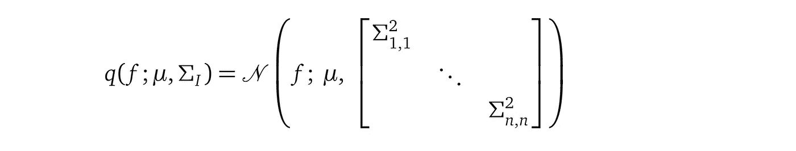*

*使用平均场 *q(f)* 的动机是有较少的变化参数要学习。代替来自全协方差矩阵的 *n(n+1)* 自由标量，我们现在只有来自平均场协方差矩阵对角线的 *n* 自由标量，因为它是对角方阵。在平均场配置中，我们需要学习的标量总数是 *2+2n* 。模型参数越少，参数学习过程越容易，这意味着优化停止得越快。*

*这种平均场近似的缺点是，它只能模拟更小的分布子集——约束所有随机变量相互独立的子集。然而，在现实中，真实后验概率中的随机变量通常是相互关联的。这意味着平均场近似与具有全协方差矩阵的变分分布相比是更粗略的近似。*

*这是我们必须决定的模型容量和计算成本之间的权衡。通常的做法是从平均场近似开始。如果学习模型在预测中表现不佳，请使用更昂贵的全协方差近似值。*

*当变分分布*q(f；μ，σ)*具有平均场结构，即*σ*是一个对角矩阵，在 *f* 中的所有单个随机变量都是相互独立的——它们之间没有任何关系。因此，关于一个个体随机变量的信息，比如说 fᵢ的*和 fⱼ的*不能用来推断另一个个体随机变量。你可能想知道我们的模型是如何做出预测的。*

*我们的模型可以在测试位置 *X_** 进行预测，因为即使位于训练位置 *X、*的 *f* 中的随机变量之间的相关性为零，但是 *f* 与测试位置 *X_** 的随机变量 *f_** 之间的相关性不为零。这个非零相关性是我们通过先验强加的条件概率 *p(f_*|f)* 。它使模型能够通过使用来自 *f* 的信息来推断 *f_** 的值。我们将在*做出预测*部分更清楚地看到这一点。*

## *参数太多的模型？*

*在统计了需要学习的标量数量后，我们意识到一个问题——我们的模型要学习的标量( *2+n+ n(n+1)* 在全高斯配置中， *2+2n* 在平均场配置中)比训练数据点的数量多，也就是 *n* 。*

*这很糟糕，因为模型现在有能力精确地拟合训练数据-模型可以只使用其参数来记住训练数据在哪里。但是这个模型不能推广到新的数据。人们用术语**过度拟合**来指这种模型任意地很好地拟合了训练数据，但是对测试数据做出了糟糕的预测的情况。*

*顺便说一下，模型具有足够的参数来任意地很好地拟合训练数据，并不意味着梯度下降可以找到那些参数的具体值来很好地拟合训练数据。模型的参数越多，梯度下降在参数值空间中导航就越困难。梯度下降可能收敛到一些甚至不适合训练数据的模型参数值。*

*理想情况下，我们希望模型有足够数量的参数和足够的模型结构(核函数、似然函数等)。)使得模型可以很好地总结训练数据的潜在特征，而不是记住训练数据在哪里。这种总结还使模型能够归纳出新的测试数据。但是从设计上来说，我们的二元分类模型，参数太多，不是一个好的模型。真扫兴。*

*事实上，你学习这个模型的真正原因是为了让你熟悉如何将变分推断应用于高斯过程模型。这是为了让你为实际的实用模型——稀疏变分高斯过程模型(SVGP 模型)做好准备。有关 SVGP 模型的更多信息，请访问:[稀疏和变分高斯过程——当数据很大时该怎么办](/sparse-and-variational-gaussian-process-what-to-do-when-data-is-large-2d3959f430e7)。现在我建议你先完成这篇文章。*

## *没有随机梯度下降？*

**ELBO* 由似然项和 KL 项组成。这两个术语都需要完整的数据来评估。如下所示，可能性项需要完整的 *Y* 。*

**

*而 KL 项，如下所示，需要所有的训练数据来计算:*

**

*第(3)行的公式提到了先前的协方差矩阵 *K=k(X，X)* 。 *K* 需要整个 *X* 来计算。*

*因此，在每个优化步骤中，梯度下降算法需要检查所有训练数据，以计算 *ELBO* 及其梯度。这就是为什么我们不能在我们的变分模型上使用随机梯度下降。随机梯度下降在每个优化步骤中只使用一批训练数据，因此它需要的内存少得多，而且通常收敛得更快。*

*好消息是，我将在下一篇文章中讨论的[稀疏和变分高斯过程](/sparse-and-variational-gaussian-process-what-to-do-when-data-is-large-2d3959f430e7)模型可以利用随机梯度下降。所以请继续关注，一切终将解决。*

## *梯度下降压力太大？*

*我们使用梯度下降来最大化目标函数 *ELBO* 。如果我们仔细想想， *ELBO* 实际上在一个公式中编码了两种优化:*

1.  *找到核参数 *l* 和 *σ* 的值，使得真实后验很好地解释了训练数据。*
2.  *找到变分参数 *μ，σ*的值，使得变分分布*q(f；μ，σ)*非常接近真实的后验。*

*这对于梯度下降来说要求太高了。这在数学上意味着: *ELBO* 可以是高度非凹的，有很多局部极大值。梯度下降法作为一种局部优化方法，会卡在一个局部最大值上，不一定是一个好的局部最大值。那么我们如何优化这样的模型就成了它自己的艺术/科学:*

*   *使用哪些优化器？*
*   *我们如何降低学习率？*
*   *我们如何在优化开始前初始化模型参数？*
*   *我们如何处理数值不稳定性？对于高斯过程模型，当我们对一个矩阵求逆时，这意味着乔莱斯基分解失败。*

*这是一个很大的话题，我将在不久的将来发表几篇文章来解释它。*

# *做预测*

*现在我们有了随机变量 *f* 的后验 *p(f|y )* ，它在训练位置 *X* 。其实我们没有 *p(f|y)。我们有类似于后验概率的变分分布 q(f)* 。不过还是继续用 *p(f|y)* 吧，好像我们知道一样。*

## *使用后验概率进行预测*

*先说清楚为什么需要后验来做预测。*

*我们的完整模型由三个随机变量组成， *f_*，f* ，和 *y* 。 *f_** 和 *f* 是潜在随机变量，它们没有相应的观测值。 *y* 是一个观察型随机变量，它有来自我们训练数据的观察值 *Y* 。*

*通过 GP prior *p(f_*，f)* 我们对随机变量 *f* 和 *f_** 施加了一些特征。通过似然 *p(y|f)* ，我们建立了潜在随机变量 *f* 和观察随机变量 *y* 之间的联系。*

*贝叶斯规则使用观测值 *Y* 以后验分布 *p(f_*，f|y)* 的形式给出 *f* 和 *f_** 的更新特征。这就是我们要使用后验概率进行预测的原因，后验概率会对先验概率中的所有函数进行重新加权，以便更好地解释训练数据的函数获得更高的概率。*

*后验 *p(f_*，f|y)* 是随机变量 *f_** 和 *f* 的分布。但是我们只需要对 *f_** 进行预测，换句话说，我们只需要对 *f_** 进行分布。因此，我们对来自 *p(f_*，f|y)* 的随机变量 *f* 进行积分，得到预测分布 *p(f_*|y)* 。*

*注意，即使我们的模型由三个随机变量 *f_** 、 *f* 和 *y* 组成。我们不需要知道它们三个的联合概率密度，记为 *p(f_*，f，y)* 。在整篇文章中，这个联合分布 *p(f_*，f，y)* 从未出现过*。*我们可以计算出我们需要的，也就是预测分布 *p(f_*|y)* ，而不需要 *p(f_*，f，y)。这是一件好事，因为 p(f_*，f，y) = p(f_*，f|y) p(y)* 我们知道边际可能性 *p(y)* 不是一个容易处理的量。我们以定义的方式定义了我们的模型，以确保我们不必触及联合分布 *p(f_*，f，y)* 。*

## *高斯分布形式的后验*

*为了在测试位置 *X_** 进行预测，我们需要推导随机变量 *f_** 在测试位置的后验 *p(f_*|y)* 。*

*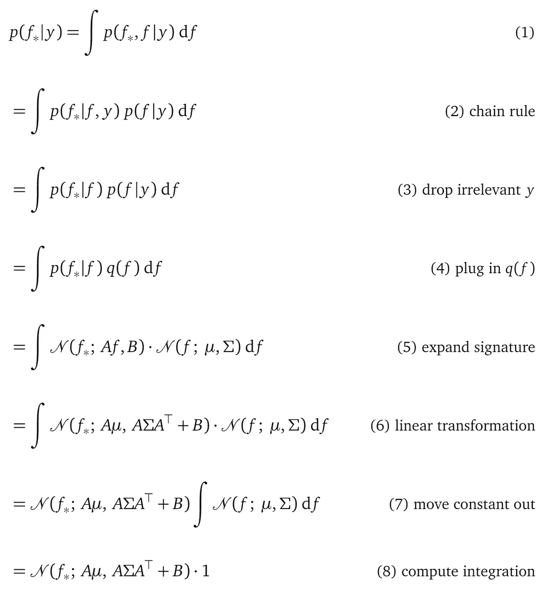*

*第(2)行逆向使用概率论中的链式法则来拆分联合分布。*

*线(3)在 *p(f_*|f，y)的条件下下降 *y* 。*我们可以这样做，因为 GP prior 只提到了 *f* 和 *f_** 。所以给定 *f* ， *f_** 独立于 *y* 。 *y* 在可能性中被介绍。*

*线(4)用我们知道的变分分布 *q(f)* 代替我们不知道的后验 *p(f|y)* 。这是**重要的一步:***

*   **q(f)* 与后验 *p(f|y)具有相同的 API。*还有，*
*   *在最小 KL 散度意义上，它的行为类似于后一种情况。*

*所以我们可以用 *q(f)* 代替 *p(f|y)* ，这就是变分推理*的全部意义。**

*在第(5)行，在积分符号内， *p(f_*)|f)* 是通过对 GP 先验应用多变量高斯条件规则(此处为[更多](/understanding-gaussian-process-the-socratic-way-ba02369d804)该规则的细节)而导出的条件分布:*

*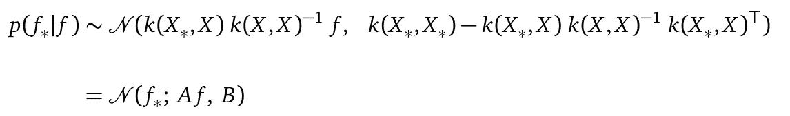*

*并且我们引入名称 *A* 和 *B* 来缩短公式，用:*

**

**A* 和 *B* 都提到了训练位置 *X* 和测试位置 *X_** 。它们建立了从 *f* 到 *f_** 的连接。*

*第(6)行应用多元高斯线性变换规则，通过仅使用来自*q(f；μ，σ)*不提 *f* 。*

*第(7)行将 *f_** 的概率密度函数移到积分之外，因为它没有提到积分变量 *f* ，所以它可以被视为积分的常数。*

*第(8)行将积分计算为 1，因为随机变量定义域上的概率密度函数的积分计算为 1。*

*结果是随机变量 *f_** 在测试位置 *X_*的后验分布 *p(f_*|y)* 。*我们也称之为预测分布。如果 *f_** 是一维的就是一维高斯分布，如果 *f_** 是多维的就是多元高斯分布。*

## *预测分布*

*扩展了 *A* 和 *B* 的预测分布的完整公式为:*

**

*使用:*

*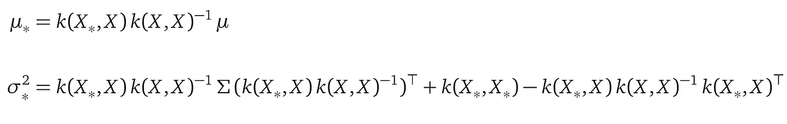*

*需要注意几件重要的事情:*

*首先，预测分布没有提到训练数据 *Y* 。您可能还记得在[高斯过程回归模型(*计算后验*部分)](/understanding-gaussian-process-the-socratic-way-ba02369d804)中，预测分布的平均值是训练数据 *Y.* 的加权和，但是在我们的变分模型中，预测分布的平均值是来自变分分布 *q* 的平均值 *μ* 的加权和。在参数学习过程中， *Y* 的信息被完全吸收到 *μ* 的值中。*

*第二，预测分布提到了训练数据 *X —* 你可以看到 *X* 遍布在预测分布的均值和方差中。这是因为模型需要使用训练位置 X 和测试位置 X_*之间的距离来计算变量 *f(X)* 和 *f(X_*) —* 之间的相关性 *X* 和 *X_** 之间的距离越远，相关性越小，模型给予 *f(X)* 的权重越小，以预测 *f(X_*)* 的值*

*最后，我们理解我们的模型如何能够做出预测，即使变分分布 *q* 具有平均场结构，在这种情况下，*σ*是对角矩阵。我们的模型使用相关性矩阵 *k(X_*，X)* 将训练位置 *X* 处的随机变量 *f* 和测试位置 *X_** 处的随机变量 *f_** 联系在一起。通过条件概率 *p(f_*|f)* 引入相关性 *k(X_*，X)*；它不关心 *f* 中的单个随机变量是否相互独立。*

## *伯努利分布形式的后验*

*在二元分类设置中，我们需要以伯努利分布的形式进行预测，而不是以高斯分布的形式。*

*为了构造伯努利后验概率，我们需要决定它的单个参数的值:*

**

*假设只有一个测试点，那么 *X_** 是一个标量，而不是一个矢量。所以 *f_** 是来自我们后验 *p(f_*|y)的一维高斯随机变量。*以这种方式定义， *g(f_*)* 是一个随机变量，但是伯努利分布需要一个标量作为其参数，因此我们计算 *g(f_*)* 相对于 *f_*:* 的期望值*

**

*你会很高兴地意识到线(3)是一个积分，你可以用高斯求积来近似。*

*计算出 *g_** 后， *y_** 的伯努利概率密度为:*

**

*或者相当于:*

**

*上述伯努利概率密度函数是我们对测试位置的最终预测。你可能会问，难道不是所有来自高斯过程模型的预测都带有不确定性度量吗？是的，伯努利分布确实有它的不确定性度量，继承自高斯后验分布。由于伯努利分布是离散分布，其不确定性被编码在概率参数 *g_*:* 中*

*   **g_** 接近 1:模型确定事件 *y_*=1。**
*   **g_** 接近 0:模型确定事件 *y_*=0* 。*
*   **g_** 接近 0.5:模型不确定要预测哪个标签。*

*记住 *g_** 是一个导出量。它从后验的 *p(f_*|y)中得到它的值。**p(f _ * | y)*的均值和方差是决定 *g_*值的两个东西(连同测试位置 *X_** )。*因此*，*它们决定了伯努利预测的不确定性。*

# *实验结果*

*我用[这个代码](https://gist.github.com/jasonweiyi/17adf7f08f919e8d88f9dffdc4a3d2f6)创建了一个变分高斯过程模型。它使用了 [gpflow](https://github.com/GPflow/GPflow) ，这是一个用于高斯过程模型的 Python 库。*

*下图显示了模型在参数学习后对我们的训练数据 *(X，Y)* 的预测。*

*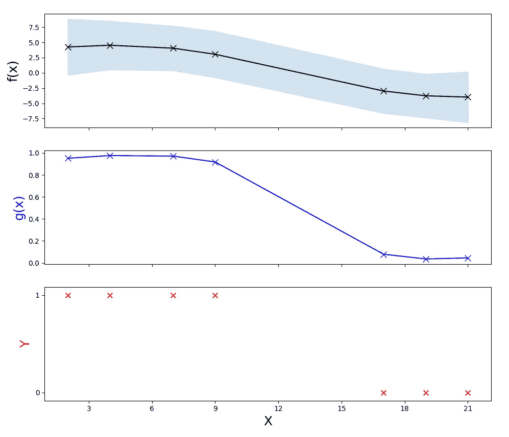*

*顶部子图显示了来自高斯后验 *f(x)* = *p(f|y)的预测。*预测的形式是均值和方差。所以上面的子图用黑色显示平均值，用青色显示 95%的置信区间。可以看到，对于标签为 1 的数据点， *f(x)* 值在 4 左右，对于标签为 0 的数据点， *f(x)* 值在-4 左右。*

*中间的子图用蓝色显示挤压函数 *g(x)* 。我们可以看到，对于标签为 1 的数据点，它的值接近 1，对于标签为 0 的数据点，它的值接近 0。*

*底部的子图用红色显示了我们的训练数据。*

*这个情节和本文开头的手绘情节很像。*

# *结论*

*这里我总结了我们的变分高斯过程模型的主要步骤:*

1.  *该模型使用多元高斯先验 *p(f)* ，并使用伯努利似然 *p(y|f)* 对二元观察值进行建模。*
2.  *当可能性是非高斯的时候，贝叶斯规则会导致一个难以处理的后验 *p(f|y)* 。*
3.  *使用变分分布 *q(f)* 来近似后验 *p(f|y)* 。我们通过要求 KL 散度 *KL(q(f)||p(f|y))* 最小来定义一个好的近似。*
4.  **KL(q(f)||p(f|y))* 的公式也很难处理。所以我们使用 *ELBO* 公式作为 *KL(q(f)||p(f|y))* 最小化任务*的代理。我们需要最大化 ELBO。*艾尔博的公式很容易理解。我们需要推导出 *ELBO* 的解析表达式，这是一个提到所有模型参数的表达式。这样，我们可以使用梯度下降来最大化关于模型参数的 *ELBO* 以找到那些模型参数的具体值。*
5.  **ELBO* 由两项组成，似然项和 KL 项 *KL(q(f)||p(f))* 。KL 项已经是解析的了。但是可能性项是一个很难计算的积分。*
6.  *似然项是一个 *n* 维积分，可以分解成 *n* 维一维积分。高斯求积为每个一维积分的结果提供了一个解析近似。*
7.  *梯度下降使 *ELBO* 的解析表达式最大化，以找到具体的模型参数值。*
8.  *最后，我们指出，我们的模型包含的参数比训练数据点的数量多。这不是一个实用的模型。它为我们接下来将要学习的真正实用模型——稀疏和变分高斯过程模型[做准备。](/sparse-and-variational-gaussian-process-what-to-do-when-data-is-large-2d3959f430e7)*

# *支持我*

*如果你喜欢我的故事，如果你考虑支持我，通过这个链接成为灵媒会员，我将不胜感激:[https://jasonweiyi.medium.com/membership](https://jasonweiyi.medium.com/membership)。*

*我会继续写这些故事。*

# *参考*

*[变分高斯过程](https://arxiv.org/abs/1511.06499)*

# *附录:可以用高斯求积来近似边际似然吗？*

*在这里，我给出的推导表明，贝叶斯规则的边际似然的高斯正交逼近需要 *mⁿ* 项。目标是让你相信使用高斯求积来近似边际似然项是不实际的。我建议你仔细阅读这些推导，因为它们是非常好的贝叶斯统计实践。*

*这又是贝叶斯法则:*

**

*我们之前说过，我们不能用这个规则来计算后验概率，因为分母的积分是很难处理的。现在让我们尝试使用高斯求积来近似这个积分。*

*可能性 *p(y|f)* 是 *n* 伯努利概率密度函数的乘积，如我们之前推导并在此再次显示的:*

**

*由于在 *p(y|f)* 之前没有 *log* ，我们不能使用 *log* 的属性将似然分解为*n**log*Bernoulli 概率密度函数之和，每个函数针对单个数据点。这将导致高斯求积规则产生指数数量的项。要理解为什么，让我们继续分析。*

*让我们通过应用变量变化规则来操纵这种集成:*

*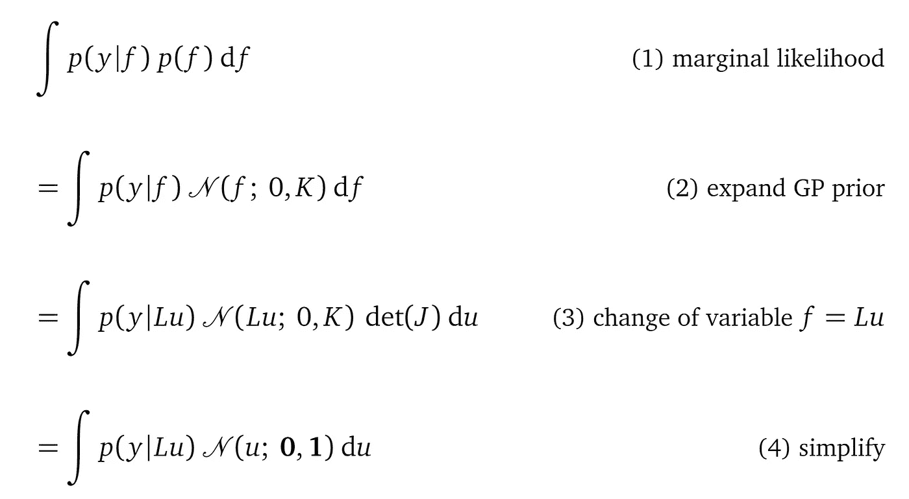*

*第(1)行是我们想要导出解析表达式的分母中的积分。被积函数是伯努利似然 *p(y|f)* 乘以 GP 先验 *p(f)* 。*

*第(2)行写出了 GP 先验的分布，它是一个均值为 0、协方差矩阵为 *K* 的多元高斯分布。*

*第(3)行通过引入新变量 *u* 并将原始积分变量 *f* 重写为 *Lu* ，其中 *L* 是协方差矩阵 *K* 的乔莱斯基分解的下三角矩阵，从而在积分中应用变量变化规则。并且 *u* 是具有 **0** 均值和恒等协方差矩阵 **1** 的 *n* 维标准高斯分布。 **0** 是长度为 *n* 的 0 向量， **1** 是形状为 *n×n* 的单位矩阵。*

*第(4)行简化了第(3)行。我们需要更多关于如何导出这种简化的解释，但首先，我们验证重新定义为 *Lu* 的 *f* 仍然来自同一个高斯分布 *𝒩(0，k)。*由于 *f* 是从 *u* 的线性变换，我们用高斯线性变换规则把 *f* 的分布写成从 *u* 的分布，这是一个多维的标准正态分布 *𝒩(* **0** *、* **1** *。**

**

*有关高斯线性变换规则的更多详情，请参见[揭秘张量流时间序列:局部线性趋势](/demystifying-tensorflow-time-series-local-linear-trend-9bec0802b24a)，搜索“线性变换”。*

*现在我们已经验证了 *f* 仍然来自 GP prior。为了说明我们如何在上面的第(4)行得到积分，让我们用一个有 3 个数据点的例子。因此*

**

*扩展到:*

**

*为了应用变量变化积分规则，我们需要计算雅可比矩阵，然后计算雅可比矩阵的行列式:*

*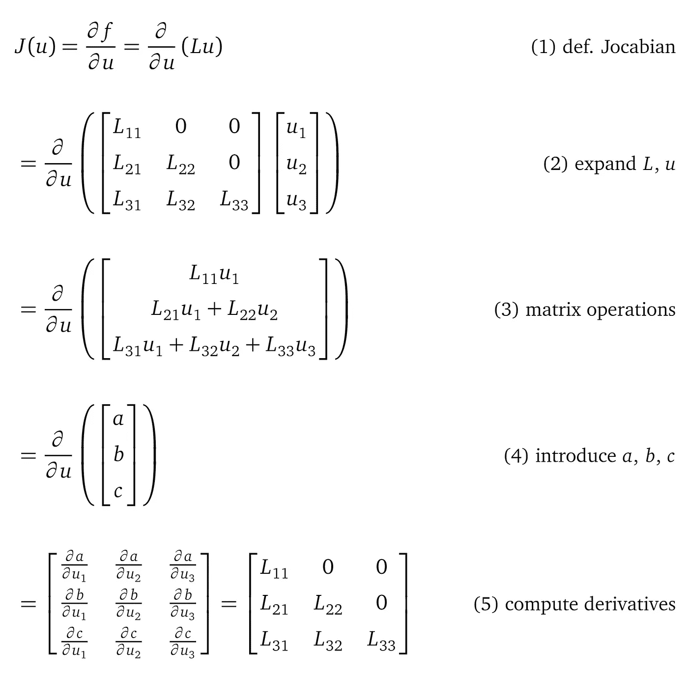*

*以上所有推导都很简单。在第(4)行引入名称 *a* 、 *b、*和 *c* 以缩短公式，因此所有内容都在一行中。*

*这个推导表明，雅可比矩阵等于来自乔莱斯基分解的下三角矩阵 *L* 。所以 *det(J(u)) = det(L)* 。*

*现在让我们看看变量变化 *f=Lu* 对 GP 优先 *p(f)* 的影响:*

*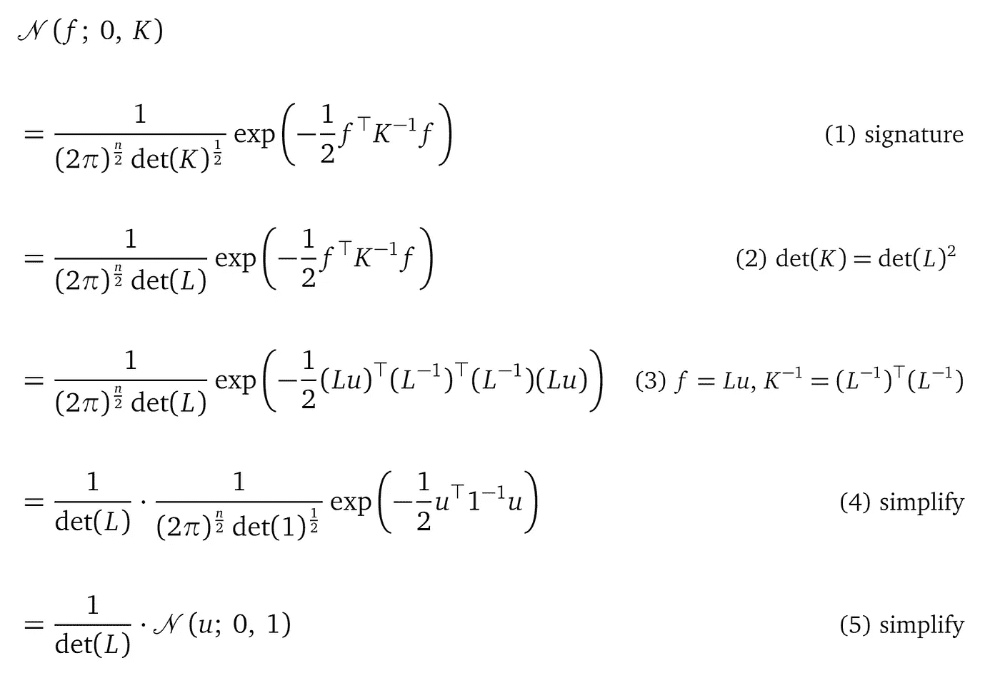*

*第(2)行使用[属性](https://math.stackexchange.com/questions/3158303/using-cholesky-decomposition-to-compute-covariance-matrix-determinant) *det(K) = det(L)。这是来自乔莱斯基分解的一处不错的房产。**

*线路(3)插入 *f* = *Lu* 并使用同样来自乔莱斯基分解的属性:*

**

*第(4)行简化了公式。它将 *det(L)* 移出原来的分母，加上*det(****1****)*，等于 1 *。*这是因为我们要构造单位多元高斯的公式。*

*第(5)行认为公式等于概率密度 *u* ，由 *1/det(L)* 缩放。而我们将愉快地认识到 *1/det(L)* 取消了来自*det(J(u)】*的 *det(L)* 。*

*在我们结束变量变化推导之前，我们需要验证变量变化运算前后的积分边界。*

*原始积分将 *f* 作为其积分变量。 *f* 是一个高斯随机变量的向量。所以 *f* 中的每个随机变量都有一个全实直线的定义域。我们应用变量变化规律后，积分变量变成 *u* ，也是一个多变量高斯随机变量，全实域。这就是为什么我们对导数中的边界是隐式的。*

## *使用高斯求积*

*现在我们有了以下积分，我们希望使用高斯求积来给出近似其结果的解析表达式:*

*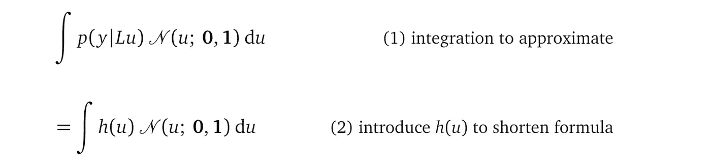*

*第(1)行是要近似的积分。第(2)行引入了 name *h(u) = p(y|Lu)* 来缩短下面推导的公式。*

*在我们的 3 个数据点示例中， *u* 是一个三维标准正态分布，因此上面是一个三维积分。但是高斯求积法则只适用于一维积分。*

*标准多元高斯 *𝒩(u 的好处是:* **0** *，* **1** *)* 是所有的个体随机变量 *u₁* ， *u₂* ， *u₃* 因为恒等式协方差矩阵 **1** 而相互独立。于是联合分发*𝒩(u；* **0** *，* **1** *)* 分解成:*

**

*通过这种分解，我们有:*

*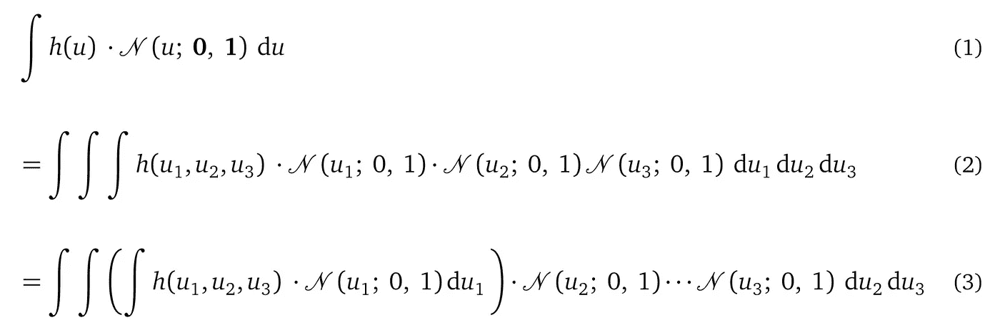*

*第(2)行将 *u* 扩展为单个随机变量及其概率密度函数。可能性 h( *u₁* 、 *u₂* 、 *u₃)* 是所有三个随机变量的函数。*

*第(3)行将关于随机变量 *u₁* 的积分分成一对括号。因为我们将首先解决这个最内部的整合。*

*这就是:*

*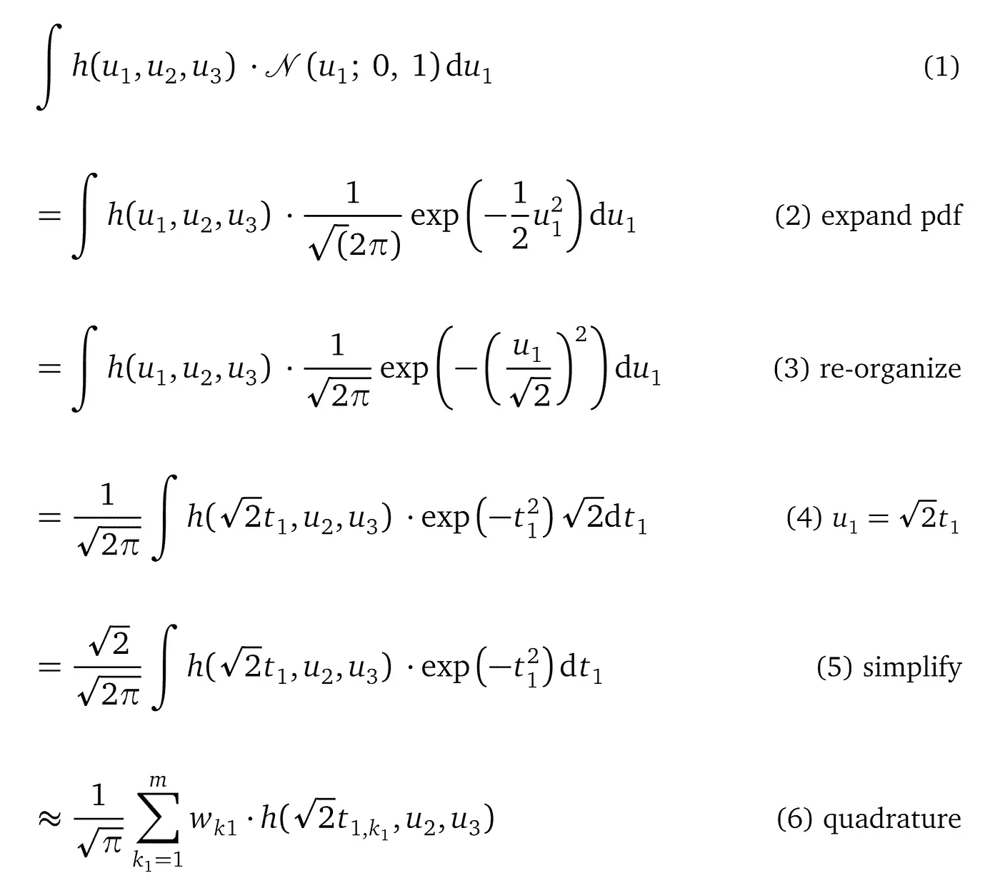*

*第(2)行扩展了𝒩(u₁的概率密度函数；0，1) 。*

*第(3)行重新组织指数函数中的项，为下一行中变量的变化做准备。*

*第(4)行应用积分中的变量变化规则，新变量 *t₁* 使得 *u₁=√2 t₁.**

*第(5)行将公式简化为我们可以应用高斯求积规则的形式。*

*第(6)行应用高斯求积规则来近似具有 *m* 项的积分。*

## *术语数量呈指数增长的原因*

*注意第(6)行，即使随机变量 *u₁* 已经被高斯正交“积分”出来，函数 *h* 仍然包含随机变量 *u₂* 和 *u₃.这就是指数数量的术语的来源。因为现在我们必须应用高斯求积法则，一次又一次，一个接一个地积分随机变量。每次，我们积分出一个随机变量，接下来是 u₂的*和 u₃的*。每一次，被积函数变得越来越长。**

*例如，对于相对于 *u₂* 的集成，我们有:*

*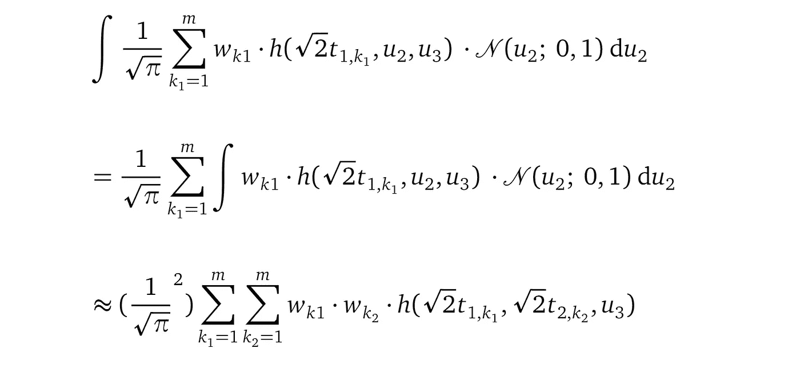*

*由于双重求和，上述表达式有 *m* 项。*

*我们需要应用高斯求积规则三次来整合所有三个随机变量。之后，我们得到了整个边际似然项的最终解析表达式:*

*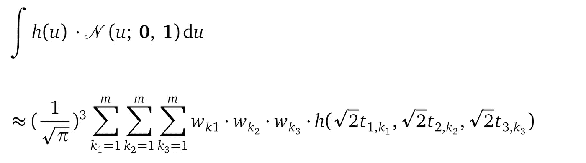*

*这个最终近似值有 *m* 项。*

*为了将其推广到具有 *n* 个训练点的数据集，我们将在近似边际似然项的分析表达式中有*个 mⁿ* 个求积项。因此，术语的数量与数据点的数量成指数关系。它很快变得大得不切实际。这就是为什么我们不能使用高斯求积来近似贝叶斯规则中的边际似然项。*