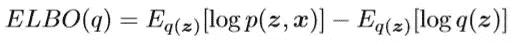
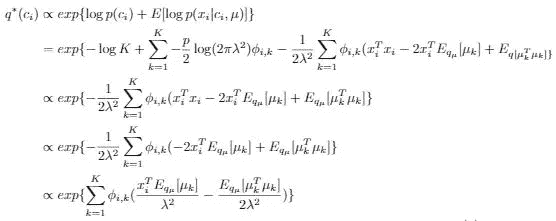
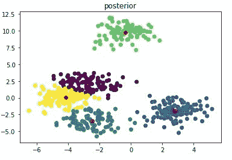

# 贝叶斯多元高斯混合模型中的变分推断

> 原文：<https://towardsdatascience.com/variational-inference-in-bayesian-multivariate-gaussian-mixture-model-41c8cc4d82d7?source=collection_archive---------16----------------------->

变分推理是贝叶斯统计中的一种近似推理方法。给定一个模型，我们经常想要推断它的后验密度。然而，关于后验密度的精确推断需要通过所有不相关的参数进行边缘化，这通常在计算上是难以处理的。VI 的主要思想是使用简单分布来近似查询密度。为了简化问题，我们用一个分布来近似每个单独的目标参数，并假设我们用于近似的分布是独立的。这种方法叫做平均场近似法。

等式 1

说到近似，我们自然会想到 KL 散度，它衡量两个分布之间的相似性。但是 KL 散度本身就包含了我们要推断的后验密度。因此，这又是一个棘手的问题。然后我们介绍**证据下界(ELBO)。**可以证明 KL 散度的最小化等价于 ELBO 的最大化。

等式 2

现在优化是可能的。我们所做的是，我们遵循与期望最大化相似的程序( **EM** )，一次更新一个近似分布。原来更新函数的表达式相当简单，如下图所示。

等式 3

注意，z 是我们想要近似其分布的参数。

上面提到的方程是我们进行变分推理所需要的。让我们看看它们在贝叶斯多元高斯混合模型中的具体应用。该模型的图示如下所示。

每个节点的分布如下:

这个模型的直觉是，观察值或数据是从高斯分布生成的。这个高斯分布的参数由另外两个分布控制。首先，我们有 k 个μ选择，它也是由高斯分布产生的。其次，我们有一个分类分布，它决定 k 个生成的μ中的哪个均值负责生成数据。概括地说，生成数据的分布是多元的，这意味着我们的观察值 x 不止一个维度。我们用 p 来表示数据的维数。

这里的异议是，我们想用平均场近似来近似 p(μ，c)。

注意，根据概率图形理论，这里的μ和 c 不是独立的，因为数据是观察到的。然而，当我们设计近似函数时，我们可以使我们的近似分布相互独立。如你所见，这里的第一件事是找到所有 q 分布的形式。虽然我们可以使用任何我们想要的发行版，但是我们希望尽可能地简化它们。自然，我们希望使用与原始参数相同的分布(实际上，为了数学上的方便，我们希望先验与后验共轭。但这里不讨论。).所以，我们把近似分布设计成，

因此，我们的工作变成了优化 mk、sk 和ϕi.

让我们看看我们的 ELBO 长什么样

对于 ELBO 中的每一项，我们可以导出一个封闭形式。

**第一期**

因为我们假设，

所以，

**第二学期**

**第三期**

因为

所以，

**第四项**

**期限 5**

对 ELBO 的上述计算表明它是易处理的，并且可以通过监视它是否在增加来跟踪参数的更新。

现在我们使用等式 3 来导出参数的更新函数。

**对于 q(c)** ，

通过使用来自图形模型的联合分布，

所以，

**对于 q(μ)** ，

而且，

所以，

因为

所以，

还有，

然后，我们有了所有近似参数的更新函数。

我们可以在数据维数为 2 的情况下测试我们的理论。结果如下所示。

