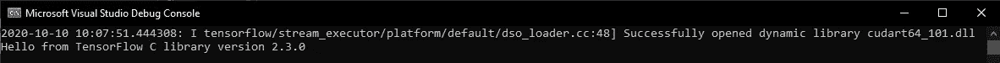
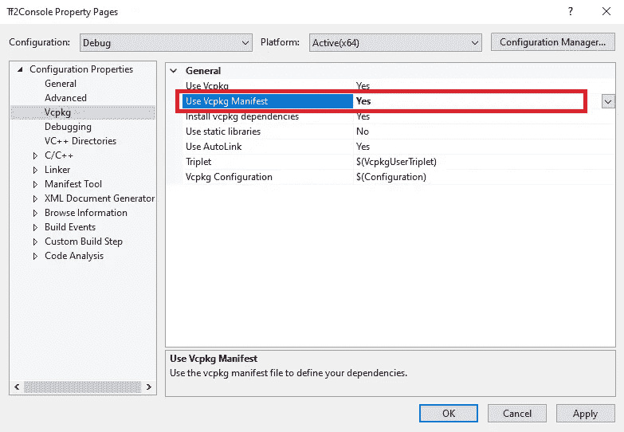
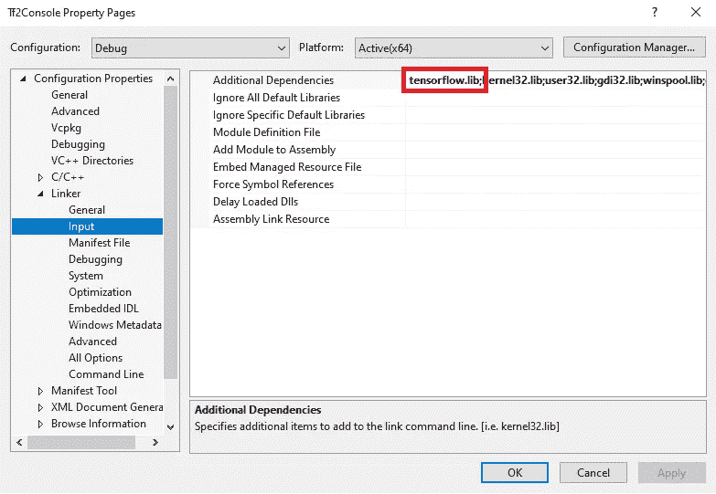

# vcpkg:用于机器学习的 C++包管理器

> 原文：<https://towardsdatascience.com/vcpkg-c-package-manager-for-machine-learning-16c3b18c1ef2?source=collection_archive---------27----------------------->

## 使用 vcpkg 安装和使用 C++ ML 库



使用 TensorFlow C API 的控制台应用程序

Vcpkg 是微软提供的一个很棒的 C++包管理器。它极大地简化了 Windows、Linux 和 macOS 上第三方库的获取和安装。

要在您的 C++项目中使用它，您首先需要将存储库克隆到您的本地机器上。仓库位于[这里](https://github.com/microsoft/vcpkg)。克隆时，选择一个在路径上容易找到的文件夹很重要。类似于 **C:\dev\vcpkg** 的东西。在命令提示符下，您可以这样做:

```
git clone [https://github.com/microsoft/vcpkg.git](https://github.com/microsoft/vcpkg.git)
```

将存储库克隆到本地文件夹后，转到该文件夹并发出以下命令来构建可执行文件(vcpkg.exe):

```
.\bootstrap-vcpkg.bat
```

现在您已经构建了可执行文件，您可以使用它将 vcpkg 集成到您的构建环境中(如 Visual Studio 2019)。从命令行执行以下操作:

```
.\vcpkg integrate install
```

假设您想在您的计算机上安装 OpenCV4，这样您就可以将它集成到您的 C++程序中。你会这样做:

```
.\vcpkg install opencv4 --triplet x64-windows
```

三元组描述了您希望为其安装软件包的架构和环境。如果这是您安装的第一个软件包，vcpkg 将下载并安装一个兼容的 cmake，然后使用它来构建软件包。一旦完成，它将计算出 opencv4 的所有依赖项，并首先构建它们。最后，它将构建 opencv4 包并将其存储在包缓存中。一旦你安装了一个包，你就可以在你的 c++项目中使用它。

## 创建自己的包

创建自己的包非常简单。我在这里举一个例子，我用 TensorFlow 团队创建的预打包文件为 TensforFlow C API(见 https://www.tensorflow.org/install/lang_c[)创建了一个。在命令提示符下，执行以下操作:](https://www.tensorflow.org/install/lang_c)

```
.\vcpkg create tensorflow-c-gpu https://storage.googleapis.com/tensorflow/libtensorflow/libtensorflow-gpu-windows-x86_64-2.3.0.zip libtensorflow-gpu-windows-x86_64-2.3.0.zip
```

在这里，您已经将您的包命名为 **tensorflow-c-gpu** ，并告诉它从哪里下载 zip 文件，以及您将在本地将其命名为什么。发出这个命令将创建一个 cmake 文件，用于构建您的包。在我们的示例中，该文件将是*ports \ tensor flow-c-GPU \ tensor flow-c-GPU . cmake*。每个包还需要一个名为 vcpkg.json 的元数据文件。要开始编辑这些文件，您可以从命令提示符发出以下命令:

```
.\vcpkg edit tensorflow-c-gpu
```

对于我们的例子来说, *vcpkg.json* 文件应该是这样的:

您还应该编辑创建的 cmake 文件，以使用下载的 zip 文件，并将它放在正确的位置。下面是我的 tensorflow-c-gpu.cmake 文件的样子:

从这个文件中可以看出，这个包只支持 Windows 上的 x64 版本。但这就是我现在所需要的🙂

## 使用包

让我们创建一个使用这个包的控制台应用程序。在 Visual Studio 中创建一个 C++控制台应用程序。我把我的叫做 **TfConsole** 。我将在本文末尾包含一个源代码链接。

一旦你创建了这个应用程序，添加一个名为 **vcpkg.json** 的新文件。这将描述应用程序及其所有依赖项:

你可以看到我们已经指定这个项目需要我们之前定义和安装的 **tensorflow-c-gpu** 项目。

您需要更改项目的构建属性，以包含此清单文件:



TfConsole 生成属性

将使用 **Vcpkg 清单**选项更改为**是**，如此处所示。

如果您在配置属性中没有看到 Vcpkg 选项，这意味着您还没有运行前面显示的“integrate install”命令。

您还需要添加 **tensorflow.lib** 库作为链接器的输入:



链接器属性

在 *main.cpp* 中，我们将对 tensorflow C API 进行简单的包含，然后使用它来显示 tensorflow 版本号:

需要注意的一点是，该包包含 TensorFlow 2.3.0 的 GPU 版本，因此您必须在您的机器上安装 CUDA 10.1。

如果一切顺利，您将在控制台输出中看到版本号。应该是 2.3.0。


控制台应用程序正在运行

## 结论

我认为微软的 vcpkg 管理器是一个很棒的包管理器，越来越多的包被添加到它里面。我还向您展示了如何添加您自己的，一旦您知道自己在做什么，这可能会非常简单。我正计划写一系列关于在 Windows 环境下生产中使用机器学习模型的文章。它将涵盖一个 Windows 前端(这将是一个 WPF C#桌面应用程序)使用各种不同的后端。其中一个后端将使用 tensor flow C API——由于没有相关的文档和很少的使用示例，它被证明是非常核心的！但是它也非常快(它的推理速度比我的 Python 代码还要快)。

观看此空间…

## 资源

1.  https://docs.microsoft.com/en-us/cpp/build/vcpkg?view=vs-2019
2.  VCP kg GitHub:[https://github.com/Microsoft/vcpkg](https://github.com/Microsoft/vcpkg)
3.  TF console:[https://github.com/ianormy/TfConsole](https://github.com/ianormy/TfConsole)