# 预测时间序列的向量自回归

> 原文：<https://towardsdatascience.com/vector-autoregressive-for-forecasting-time-series-a60e6f168c70?source=collection_archive---------10----------------------->

## VAR 捕捉发展和相互依赖性

## 包含多个时间序列的经济计量模型

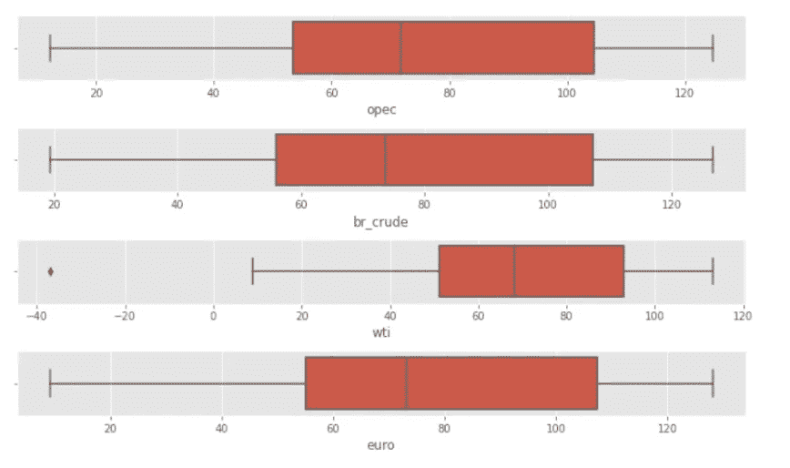

作者图片

[https://sarit-maitra.medium.com/membership](https://sarit-maitra.medium.com/membership)

V 向量自回归(VAR)时间序列模型在计量经济预测模型中有着广泛的应用；VAR 可以捕捉多个时间序列之间的演化和相互依赖关系。VAR 中的所有变量都是对称处理的，每个变量都包含一个方程，根据其自身的滞后和模型中所有其他变量的滞后来解释其演变。我们可以称之为交易策略的科学方法。

> 使用科学方法进行交易策略设计的优势在于，如果策略在前一段盈利期后失败，则有可能重新审视最初的假设并重新评估它，从而潜在地产生新的假设，使策略重新盈利。

布伦特原油有四个时间序列。美国和欧洲价格，西德克萨斯原油价格和石油输出国组织原油价格。我们将开发一个回归模型，并尝试预测布伦特原油，美国价格给定的所有系列在我们的模型。

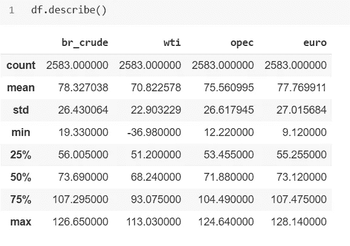

```
plt.plot(df['opec'], label="opec")
plt.plot(df['euro'], label="Euro")
plt.plot(df['br_crude'], label="Brent Crude Oil")
plt.plot(df['wti'], label="West Texas")plt.legend(bbox_to_anchor=(1.05, 1), loc=2, borderaxespad=0.)
plt.title('Opec Oil, Europe Brent Crude, Brent Crude Oil & West Texas Price over Time')
plt.show()
```

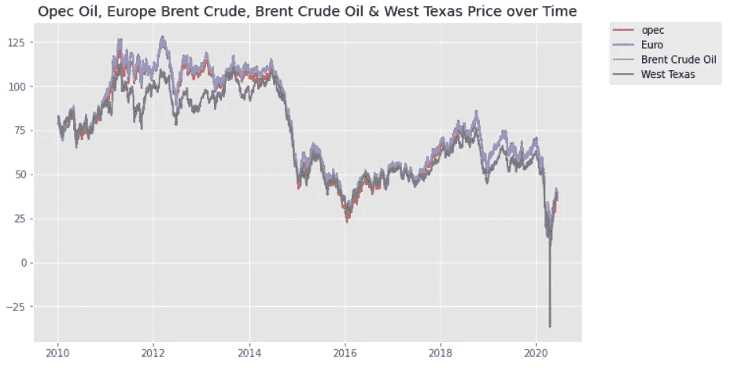

我们可以看到，所有的序列都遵循一个随机趋势，表现出更强的跨时变化和更大的下降；更重要的是，所有的系列似乎都有某种联系。这两个系列的水平看起来都不稳定。它们似乎有一个共同的趋势，表明它们可能是共同整合的。

## IQR 绘制所有变量:

```
plt.title('IQR plot for all variables')
sns.boxplot(x=df)
plt.show()
```

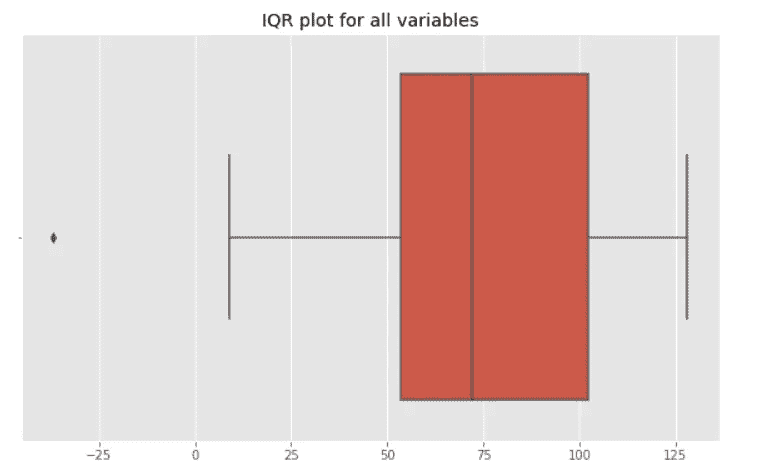

我们可以在数据中看到一个小的异常值，可以忽略不计。

VAR 模型描述了平稳变量之间的动态相互关系。因此，时间序列分析的第一步应该是单位根检验，以确定序列是否平稳。

## 相关性检查:

```
pearsoncorr = df.corr(method='pearson')
sns.heatmap(pearsoncorr,
xticklabels=pearsoncorr.columns,
yticklabels=pearsoncorr.columns,
cmap='RdBu_r',
annot=True,
linewidth=0.5)
plt.show()
```

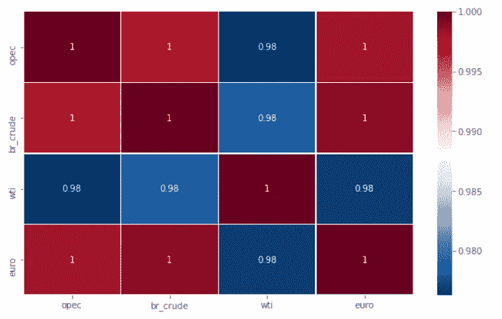

尽管相关性经常用于所有多变量金融时间序列用例，但是相关性可能非常不稳定。此外，ADF 或 Hurst 指数有助于我们从统计上确认该序列是否均值回复。然而，我们无法从这些测试中确定形成线性组合所需的套期保值比率，它们只会告诉我们，对于特定的情况，线性组合是否是稳定的。另一种安排是协整，这可能是两个金融序列之间联系的一个更稳健的措施。

## 增强型迪基-富勒(ADF):

ADF 检验表明，如果一个价格序列具有均值回复，那么下一个价格水平将与当前价格水平成比例。在数学上，ADF 是基于测试自回归时间序列样本中单位根的存在的思想。

```
def adfuller_test(series, signif=0.05, name='', verbose=False):
  r = adfuller(series, autolag='AIC') output = {'test_statistic':round(r[0], 4), 'pvalue':
round(r[1], 4), 'n_lags':round(r[2], 4), 'n_obs':r[3]}
  p_value = output['pvalue']
def adjust(val, length= 6): 
  return str(val).ljust(length)print(f'Augmented Dickey-Fuller Test on "{name}"', "\n   ", '-'*47)
print(f'Null Hypothesis: Data has unit root. Non-Stationary.')
print(f'Significance Level = {signif}')
print(f'Test Statistic = {output["test_statistic"]}')
print(f'No. Lags Chosen = {output["n_lags"]}')for key,val in r[4].items():
  print(f' Critical value {adjust(key)} = {round(val, 3)}') if p_value <= signif:
    print(f" => P-Value = {p_value}. Rejecting Null Hypothesis.")
    print(f" => Series is Stationary.")
  else:
    print(f" => P-Value = {p_value}. Weak evidence to reject the Null Hypothesis.")
    print(f" => Series is Non-Stationary.")
```

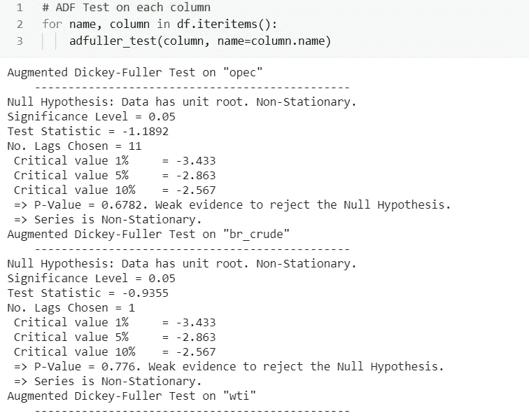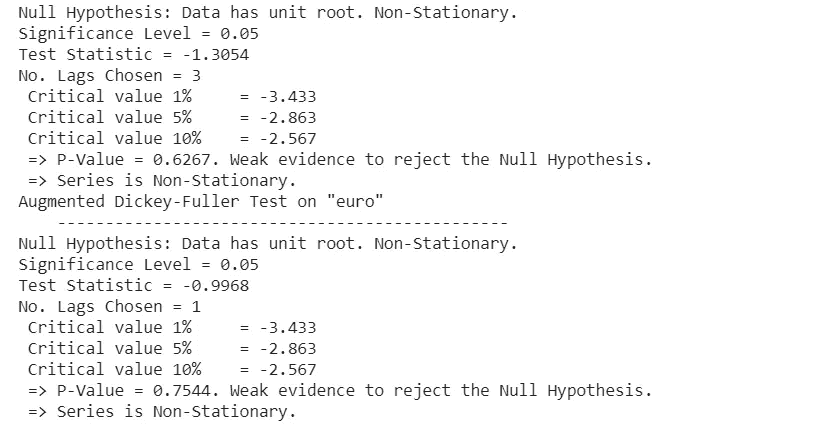

没有一个统计数据接近 5%的显著水平。因此，我们可以自信地说，级数在水平上是非平稳的。研究了它们的协整关系，在每种情况下(p 值> 0.05)，不能在任何合理的显著性水平上拒绝非平稳性的零假设。

## 协整检验:

协整检验过程中的步骤:

1.  使用单变量单位根检验，比如 ADF、PP 检验，分别检验每个成分序列的单位根。
2.  如果单位根不能被拒绝，那么下一步就是检验成分之间的协整，即检验αYt 是否为 I(0)。

如果我们发现时间序列是一个单位根，那么我们就进入协整过程。协整检验主要有三种方法:Johansen 方法、Engle-Granger 方法和 Phillips-Ouliaris 方法。我们将使用恩格尔-格兰杰检验。通过使用协整检验，我们将检验 wti 价格指数和 br_crude 价格指数之间是否存在协整的长期关系。数学上，我们将考虑协整关系:

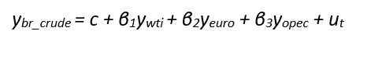

Engle & Granger 的两步残差检验程序首先估计一个横截面回归，然后使用具有修正临界值的 ADF 分布检验该回归的残差。

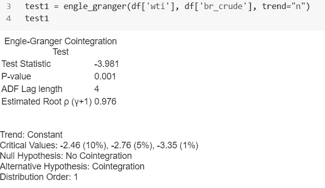

这里记录了每个时间点的观测向量。在这种情况下，可能有一些构成平稳时间序列的向量的线性组合和其他非平稳的线性组合。

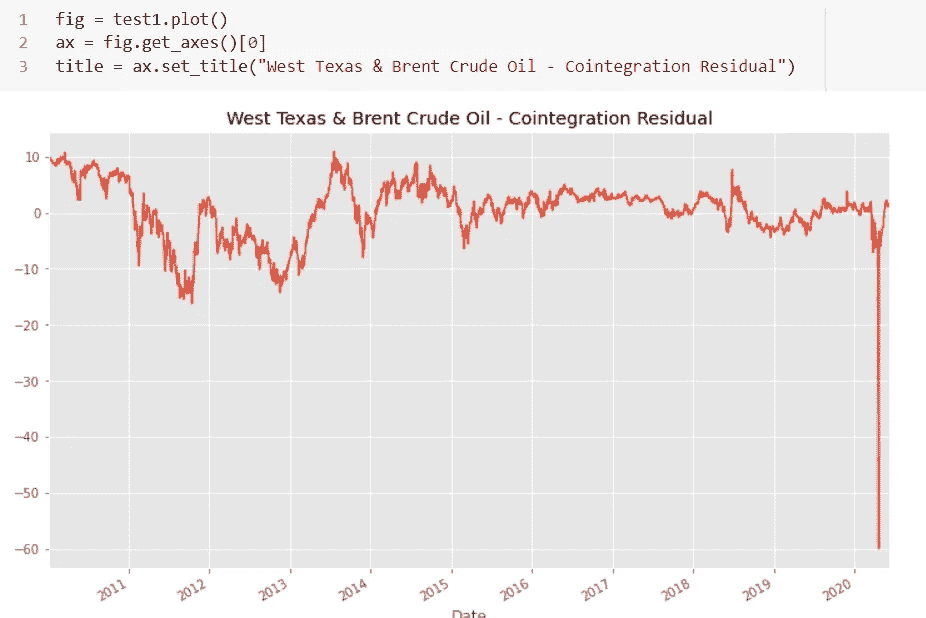

从上面的模型残差图来看，平均值为 0，这可能是一个趋势。

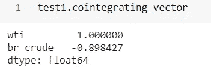

估计的协整向量非常接近[+1，1]，表明存在简单的无套利关系。让我们用一个常数和一个时间趋势(*“CT”*)重新运行测试。我们在 5% (-3.79)和 10% ( 3.50)水平的临界值的测试统计为-4.231<；p 值< 0.05，我们可以拒绝无协整的零假设。

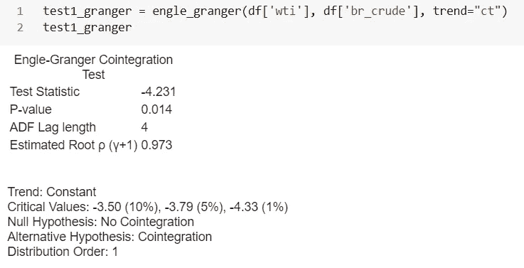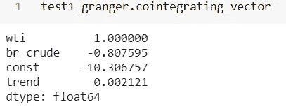

残差明显为零，但显示了当前年份(2020 年)的结构性突变的证据。

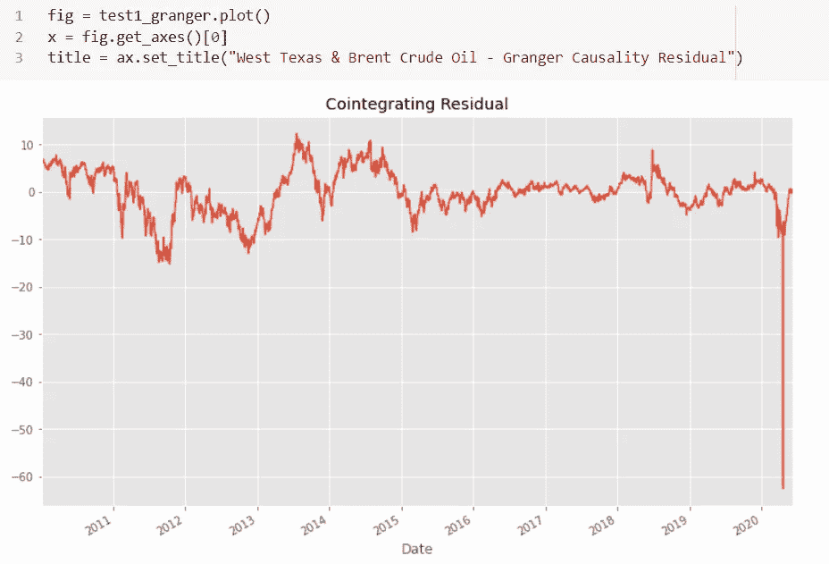

同样，我们测试了其他可能的配对组合，以获得类似的输出。

> 虽然 *Engle-Granger* 方法很容易使用，但是它的一个主要缺点是它只能估计变量之间的一个协整关系。

这里，我们有 1 个以上的变量，可能有一个以上的线性独立的协整关系。

## p 值的重要性:

现实生活中商业案例的 p 值一直是争论的焦点。p 值在发表的文章上可能看起来不错，但它从来没有像今天这样被使用过。更多详情请阅读这篇有趣的 [*文章*](http://The P value was never meant to be used the way it's used today.) 。传统上， *p-* 值< 0.05 是显著性的标准。

## OLS 回归:

现在，我们将使用 OLS 拟合时间序列之间的回归，并可视化残差图。如果残差是平稳的，我们可以有把握地假设，给定的序列确实是协整的。

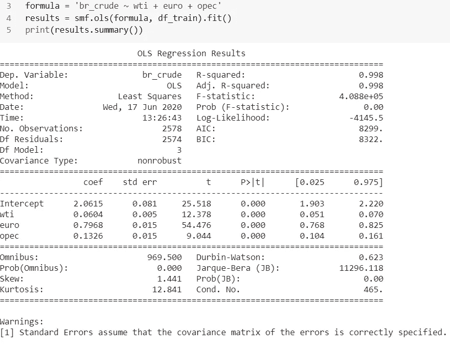

```
residuals = results.resid
br_crude_fit = results.fittedvaluesfig = plt.figure(1)
ax1 = fig.add_subplot(111)
ax1.plot(br_crude_fit, label='Linear Prediction')
ax1.plot(df['br_crude'], label='Brent Crude-USA')
ax1.set_xlabel('Date')
ax1.legend(loc=0)
ax2 = plt.twinx()
ax2.set_ylabel('Residuals')
ax2.plot(residuals, label='Residuals')
ax2.legend(loc=0)
plt.grid(True)
plt.show()
```

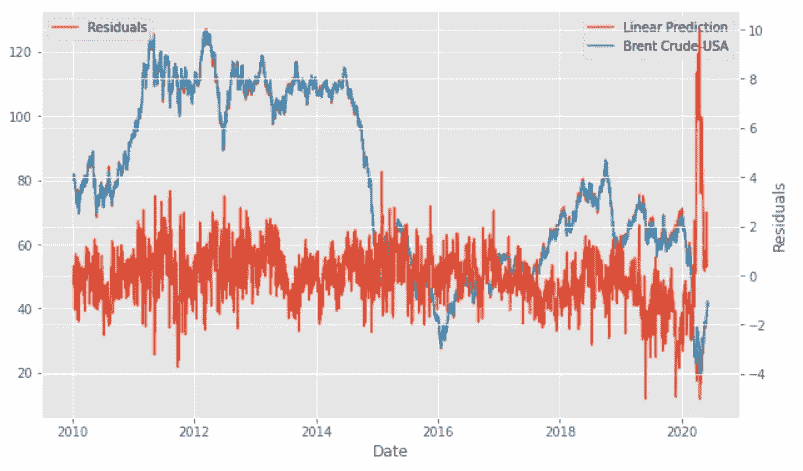

残差的级别(红线)，它看起来比原始序列(蓝线)更像一个平稳序列。在这里，我们可以看到，实际和拟合线是难以区分的。

现在让我们对残差序列进行 ADF 检验。我们使用 DFGLS 测试，并指定 12 个滞后作为 DFGLS 回归的最大滞后阶数。

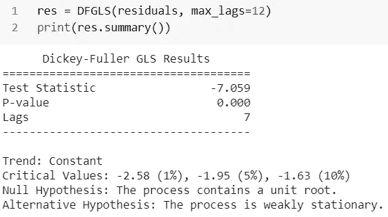

滞后的数量表明最佳滞后长度为 7。我们的测试统计(–7.059)< Critical Values at 1%, 5% & 10% and null hypothesis of no cointegration can be rejected.

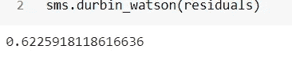

## *breus ch-Godfrey*(BD)测试:

BD 比 DW 更通用，允许我们测试高阶自相关。

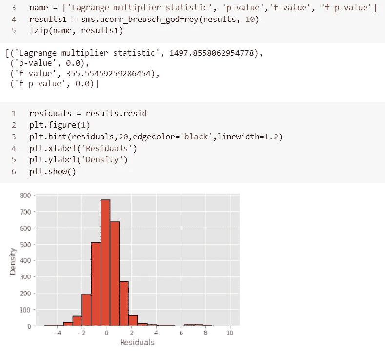

残差的分布看起来像一个钟形，尽管有一些可能导致偏斜的异常值。

## *Jarque-Bera* 正态性检验:

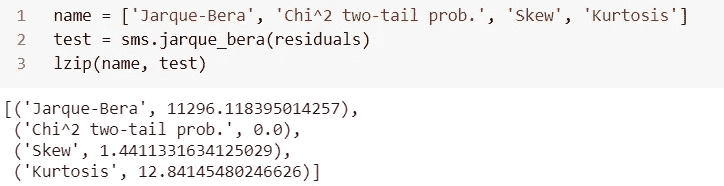

χ2 检验的双尾 p 值等于零意味着我们接受残差的零假设总体上是正态分布的，即峰度和偏度都是正态分布的。

# 向量自动回归(VAR):

VAR 方法使用 AR 模型对每个时间序列的下一步进行建模。模型的符号包括将 AR(p)模型的阶数指定为 VAR 函数{VAR(p)}的参数。

让我们先来看看这个系列的第一个不同点，然后再试试 ADF。通常，如果水平时间序列不是平稳的，第一个差异将是。数据差异或多或少是计算时间序列从一个值到下一个值的变化量。

```
df = df [['br_crude', 'wti', 'opec', 'euro']]
nobs = 5
df_train, df_test = df[0:-nobs], df[-nobs:]print(df_train.shape)
print(df_test.shape)df_tr_diff = df_train.diff()
df_tr_diff.dropna(inplace=True)
print(df_tr_diff.head())df_tr_diff.plot(figsize=(10,6), linewidth=5, fontsize=20)
plt.show()
```

考虑到时间因素，为时间序列问题创建一个训练和测试集是很棘手的。在这个阶段任何错误的举动都会打乱这个系列的格局。创建测试集时应该考虑日期和时间值。

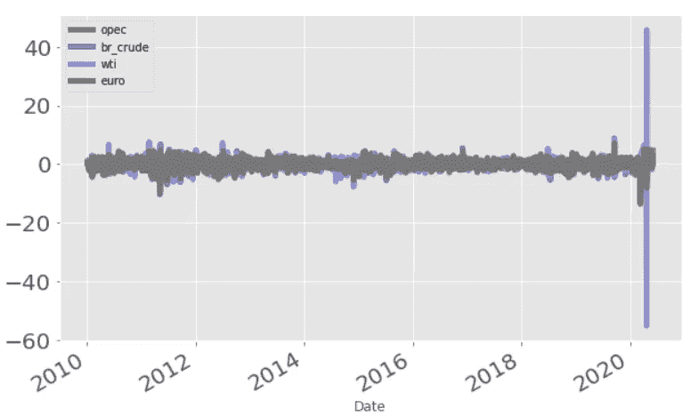

现在，我们对数据帧的第一差重复上述所有步骤。

```
# ADF Test on each column
for name, column in df_tr_diff.iteritems():
adfuller_test(column, name=column.name)
```

这里，我们看到所有的级数在一阶差分后都是平稳的。

## 风险值模型:

```
var_model = smt.VAR(df_tr_diff)
res = var_model.select_order(maxlags=10)
print(res.summary())
```

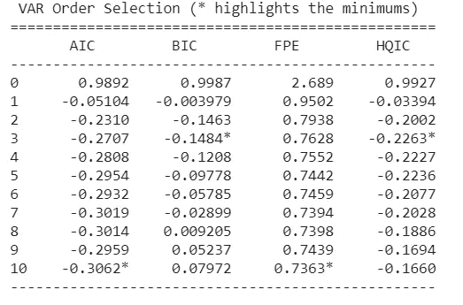

```
#Fit VAR model
var_model = VAR(endog=df_tr_diff)
var_model_fit = var_model.fit(maxlags=10)#Print a summary of the model results
var_model_fit.summary()
```

我们在模型总结中真正想要关注的是 br_crude 的等式，其中 br_crude 根据自身的滞后值和其他变量的滞后价格来估计其他价格。t 统计值越高，我们就越有可能拒绝 H0，两个变量之间也越有可能存在相关性。p 值也用于拒绝零假设。p 值越低，反对零假设的证据越强。

估计 VAR 的方程式并不需要很强的假设；然而，计算脉冲响应函数(IRF)或方差分解确实需要识别限制。一个典型的限制是假设一对变量之间的动态关系，例如，x 只滞后地影响 y，或者 x 在长期内不影响 y

让我们使用脉冲响应图，在不同的水平上，将一个变量的变化对其他变量的影响可视化。

```
# Impulse Response Analysis
irf = var_model_fit.irf(20)
irf.plot()
plt.show()
```


给定参数估计和 *Engle Granger* 测试结果，这里建立了序列之间的联系。可以看出，对冲击的响应在这里被捕获，并且它们几乎在第 10 个滞后之后消失。

## 预测误差差异分解(FEVD):

在 FEVD 曲线图的第一行中显示了对 br_crude 价格的冲击对其它价格和它们自身的其它价值的影响。在 br _ 原油价格(深黑色柱)的情况下，归因于自身冲击的误差百分比为 100%，因为 wti 系列解释了约 40%的回报变化；欧佩克约为 60%，欧元系列解释了约 70%的变化。

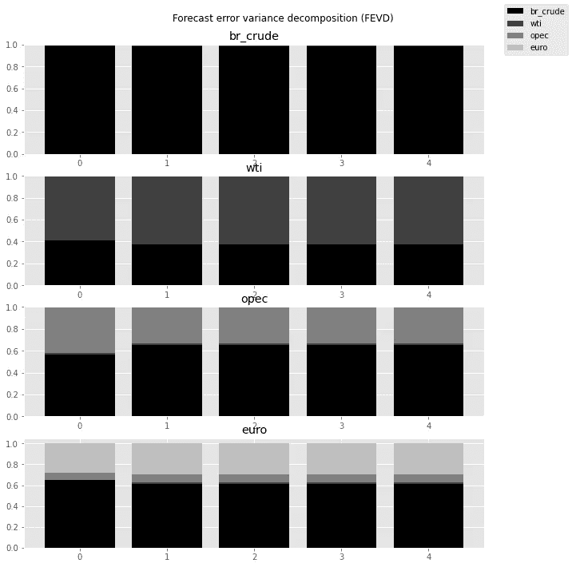

*注:上述测试程序的概念取自 Brooks(2019)；参见参考部分。*

## 预测:

现在模型已经建立，让我们生成预测并与测试/验证集中的实际数据进行比较。

```
# Get the lag order
lag_order = var_model_fit.k_ar
print(lag_order)# Input data for forecasting
input_data = df_tr_diff.values[-lag_order:]
print(input_data)# forecasting
pred = var_model_fit.forecast(y=input_data, steps=nobs)
pred = (pd.DataFrame(pred, index=df_test.index, columns= df.columns + '_pred'))
print(pred)
```

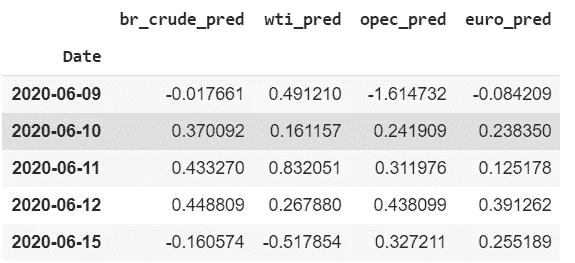

## 反转变换:

```
def invert_transformation(df_tr_diff, pred):
  forecast = pred.copy()
  columns = df_train.columnsfor col in columns:
  forecast[str(col)+'_pred'] = df_train[col].iloc[-1] +  
                               forecast[str(col)+'_pred'].cumsum()
  return forecastoutput = invert_transformation(df_tr_diff, pred)
output.loc[:, ['br_crude_pred']]
```

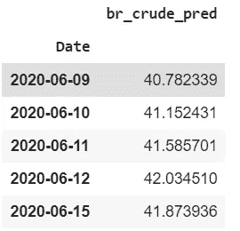

## 预测评估:

```
# forecast bias
forecast_errors = [combine['br_crude'][i]- combine['br_crude_pred'][i] for i in range(len(combine['br_crude']))]
bias = sum(forecast_errors) * 1.0/len(combine['br_crude'])
print('Bias: %f' % bias)# MAE
mae = mean_absolute_error(combine['br_crude'], combine['br_crude_pred'])
print('MAE: %f' % mae)# MSE & RMSE
mse = mean_squared_error(combine['br_crude'], combine['br_crude_pred'])
print('MSE: %f' % mse)
rmse = sqrt(mse)
print('RMSE: %f' % rmse)
```

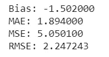

## 实际与预测:

```
combine = pd.concat([df_test['br_crude'], output['br_crude_pred']], axis=1)
combine['accuracy'] = round(combine.apply(lambda row: row.br_crude_pred /
row.br_crude *100, axis = 1),2)combine['accuracy'] = pd.Series(["{0:.2f}%".format(val) for val in combine['accuracy']],index = combine.index)
combine = combine.assign(day_of_week = lambda x: x.index.day_name())
combine = combine.round(decimals=2)
combine = combine.reset_index()
combine
```

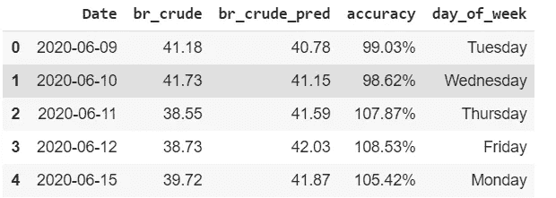

```
fig = go.Figure()
fig.add_trace(go.Scatter(x=combine['Date'], y=combine['br_crude'], name="Actual Crude price"))
fig.add_trace(go.Scatter(x=combine['Date'],y=combine['br_crude_pred'],name="Predicted crude price"))
fig.update_layout(
title="Actual vs Predicted Brent Crude Price",
xaxis_title="Date", yaxis_title="Price", font=dict(family="Courier New, monospace",size=18,color="#7f7f7f"))
fig.update_layout(autosize=False,width=1000,height=400,)
fig.update_layout(legend_orientation="h")
fig.show()
```

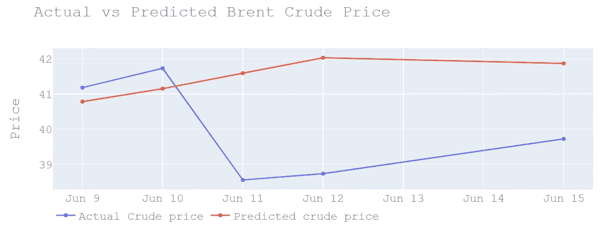

# 结论:

一旦我们有了数据的模型，分析如何评估它的质量是很重要的。第一种选择是使用残差。残差基本上是预测值和实际值之间的平方差。这可能是一个简单的选择来判断我们的模型的准确性。

残差与我们用来创建模型的数据量成比例。因此，不建议使用所有残差的和。一种选择是将残差除以瞬时数量乘以因变量的数量。

***我这里可以到达***[](https://www.linkedin.com/in/saritmaitra/)*。*

**参考文献:**

1.  *汉密尔顿法学博士，1994 年。时间序列分析。新泽西，普林斯顿大学出版社。*
2.  *恩格尔，R.F .，格兰杰，C.W.J，1987。协整与误差修正:表示、估计与检验。计量经济学。55, 251–276.*
3.  *布鲁克斯，C. (2019 年)。金融计量经济学导论。剑桥大学出版社。*