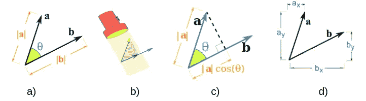
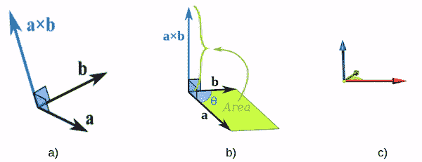
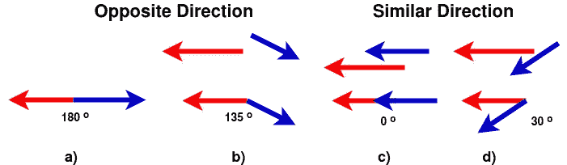
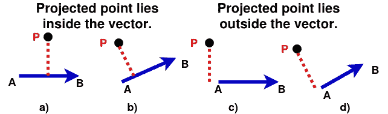
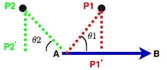
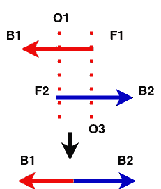

# 重叠向量和向量投影

> 原文：<https://towardsdatascience.com/vector-projection-and-overlapping-vectors-523a5896db1f?source=collection_archive---------42----------------------->

## 寻找共线向量并解决向量重叠(如果有的话)

向量是表示方向大小的非常强大的方法。它们是几何学的组成部分，广泛应用于各种学科，如物理学、计算机视觉和机器学习。有多种方法可以利用向量的不同性质得到重要的结果，在本文中，我们将介绍三个这样的结果。

> 1)确定两个向量是否面向同一方向。
> 
> 2)检查投影到向量上的 3D 空间中的点是否位于向量内部。
> 
> 3)检查两个向量是否相互重叠，如果是，是否有方法消除重叠？

以上所有的观察都是相互联系的，它们在最后一个观察中结合得很好。

在我们开始之前，让我们快速看一下向量点和叉积。

D **ot 乘积:**是指向同一方向的两个向量的大小的乘积或乘积。因为它是量值的乘积，所以得到的答案是标量。可以考虑用相同方向的矢量。

**a . b = | a | * | b | * cos(θ)=(| a | * cos(θ))* | b | = ax * bx+ay * by**



表示点积的不同方法。(来源:[mathisfun](https://www.mathsisfun.com/definitions/projection.html))

所有不同形式的写同一个点积表示沿同一方向的向量相乘。这里一个重要的观察是，对于垂直矢量，点积为零。
***a . b = 0*****as cos(90)= 0。**

> 它可以被认为是相同方向上的矢量幅度的乘法。

C **罗斯乘积:**是两个矢量 *a* 和 *b* 的乘积，使得合成矢量垂直于 *a* 和 *b* 。从另一个角度来看，合成向量是由两个输入向量 *a* 和 *b* 定义的平面的法线。合成向量的大小将给出由 *a* 和 *b* 形成的平行四边形的面积。

***a x b = | a | * | b | * sin(θ)=(| a | * sin(θ))* | b |)***



叉积的不同表示方法。(来源:[mathisfun](https://www.mathsisfun.com/algebra/vectors-cross-product.html))

这里一个重要的观察是，对于面向相同方向的向量，叉积为零。
***a×b = 0***as sin(0)= 0。

> C 罗斯乘积是两个矢量 *a* 和 *b* 的乘积，使得合成矢量垂直于 *a* 和*b*

现在我们有了矢量交叉和点积的基本知识，我们可以开始推导这些强大的结果。

# **1。确定两个向量是否面向同一个方向。**

> G *给定两个向量 a 和 b，如下图所示，用红色和蓝色表示，如果向量尾部之间的角度是锐角或在[0，90]或[0，-90]之间，则称向量方向相同。*

这可以通过使用矢量点积很容易地找到。计算点积的角度是通过连接两个向量的尾部并取它们之间的角度得出的，如下图所示。

如前所见，矢量点积由 **a.b = *|a| *|b| * cos(θ)给出。*** 现在由于矢量的幅度总是正的，点积的符号由 *cos(θ)控制。*我们知道，在坐标系的第一或第四象限中，任何一个角度的余弦值在[0，90]或[0，-90]的范围内总是正的，*因此，如果点积是* ***正的*** *，我们可以说这些矢量都朝向* ***同一个方向*** *。同样，如果点积是* ***负*** *，我们可以确凿地说，这些向量是朝向* ***相反方向*** *。*



面向相反方向的向量，a)180°角 b)135°角。面向相似方向的向量，c)角度为 0，d)角度为 30。(来源:作者)

因此，

> **a . b ≥ 0:向量面向同一个方向。**
> 
> **a . b < 0:矢量朝向相反方向。**

# 2)检查投影到向量上的 3D 空间中的点是否位于向量内部。

我们可以使用向量投影来检查一个点在投影到向量上时是否在向量内部。问题清楚的显示在下图中。我们将在后面讨论的一个非常有用的应用是寻找两个向量是否相互重叠。



a，b)投影点位于矢量内部。c，d)投影点位于向量之外。(来源:作者)

我们将使用矢量投影来解决这个问题。请看下图，我们可以看到点 P1 投影到矢量 BA 上形成矢量 P1'A。如果我们能找到|P1'A|的大小，我们就能找到矢量 P1'A，因为它的方向就是矢量 BA 的方向。现在:

```
BA = B-A; P1A = P1- A; cos(θ1) = |P1'A|/|P1A|;
P1A.BA = |P1A|*|BA|*cos(θ1); Hence **|P1'A| = P1A.BA / |BA|
P1'A = |P1'A| * BA / |BA|**(unit vector along BA)
```



描绘矢量投影(来源:作者)

现在我们有了大小|P1'A|我们可以简单地使用下面的条件来检查投影点 P1 '是否位于向量 BA 内。

> 投影点位于向量内部，如果:0 ≤ |P1'A| ≤ |BA|

上面的等式是正确的，因为如果投影长度|P1'A|大于向量|BA|本身的长度，则该点必须位于远离右侧的点 B 处，因此在向量之外。另一方面，如果投影长度小于零，则该点必须远离左侧的点 A。

**我们知道 *P1A。BA > 0* 因为 P1A 和 BA 都面向同一个方向，所以我们可以肯定地说，点 P1 的投影落在向量 BA 上。**

同样为点 P2， *P2A。巴< 0* ，因为和巴面向相反的方向。因此，点 P2 将不能够满足 0 ≤ |P2'A| ≤ |BA|的条件，因此，点 P2 的投影将不位于向量 BA 内。

# 3.检查两个向量是否相互重叠，如果是，有没有办法消除重叠？

重叠向量可能有三种情况:

1.  B1F1 和 B2F2 部分重叠。图的 a 和 b 部分。
2.  B1F1 与 B2F2 完全重叠，反之亦然。图的 c 部分。
3.  B1F1 和 B2F2 不重叠。图的 d 部分。


a)，b)部分重叠的向量，c)完全重叠的向量，d)不重叠的向量(来源:作者)

让我们把蓝色向量看作根向量，红色向量看作邻居向量。同样，由 F 表示的点是矢量的前端，B 中的点是后端。O1 和 O2 是投影到相邻向量上的根向量的前后点。

现在，为了检查重叠，我们可以使用我们在*“检查投影到矢量上的 3D 空间中的点是否位于矢量内部”*中导出的公式来检查根矢量的投影前点或后点是否位于相邻矢量上。利用这些信息，我们可以得出三个观察结果:

> 从投影点 O1 和 O2，
> 
> 1.如果任一点位于相邻向量上，而另一点不在，则向量部分重叠。
> 
> 2.如果点 O1 和 O2 都位于相邻向量上，则相邻线与根线完全重叠。
> 
> 3.如果点 O1 和 O2 都不在相邻向量上，则向量不重叠。

因此，通过上面的观察，我们可以检查两个向量是否相互重叠。

既然我们知道了如何检查重叠向量，那么让我们来讨论一下是否有消除重叠的方法。



(来源:作者)

如果两个几乎共线的向量重叠，并且我们想要将它们合并成一个向量，这可能是有用的。这个过程的第一步是估计根向量和相邻向量上的重叠区域。两条红色虚线描绘了上图中的重叠区域。现在我们已经有了相邻线的重叠区域 O1F1，因为我们之前已经计算了点 O1。我们同样可以得到 O3，它是邻线的前点在根线上的投影。这样，我们已经隔离了两条线的重叠区域 O1F1 和 O3B2。

最后一步是将重叠的向量合并成一个向量。这里有两种可能的解决方案:

1.  修剪根向量和相邻向量的重叠区域，并完整连接另一个向量。
2.  将根向量和相邻向量分解成多个等距点，并在重叠区域上找到对应点的平均值。

> 我们总共涵盖了三个重要的观察结果:
> 
> *1。使用矢量点积检查矢量是否面向同一方向。*
> 
> *2。求一个点在向量上的投影，看投影点是否在向量内。*
> 
> *3。检查重叠向量和消除重叠的方法。*

如果你有任何问题，请联系我。

参考资料:

1.  [https://www.quora.com/Why-do-we-sine-for-cross-products](https://www.quora.com/Why-do-we-sine-for-cross-products)
2.  [https://www.mathsisfun.com/algebra/vectors.html](https://www.mathsisfun.com/algebra/vectors.html)