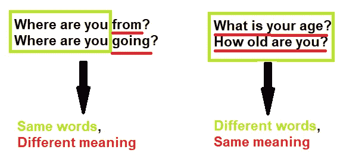
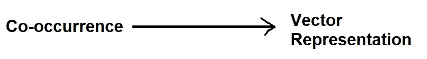
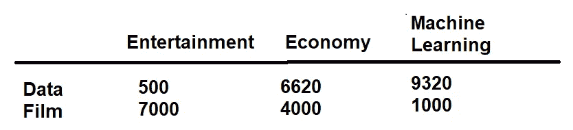
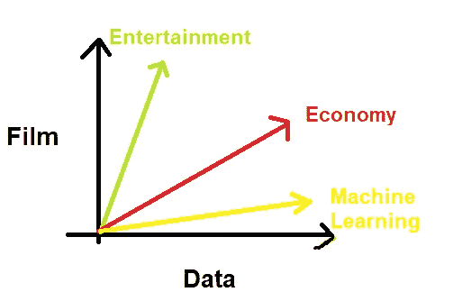
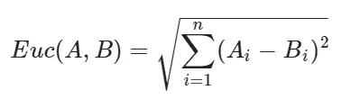
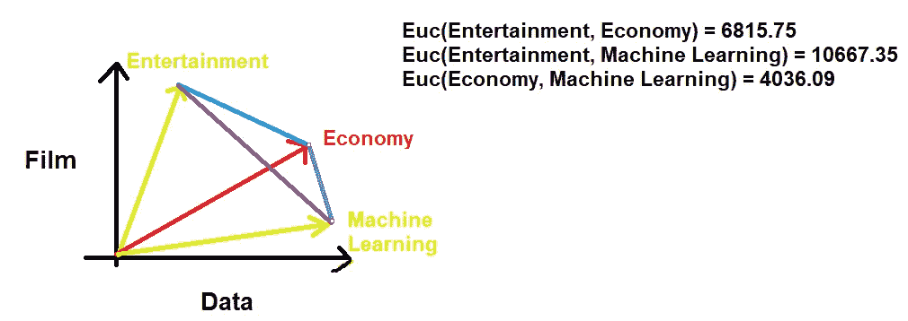
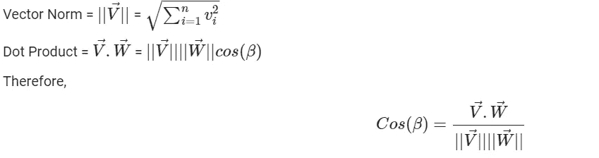
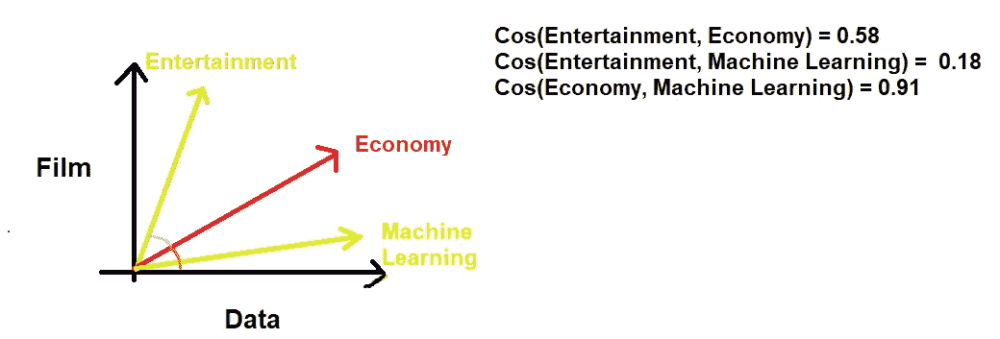
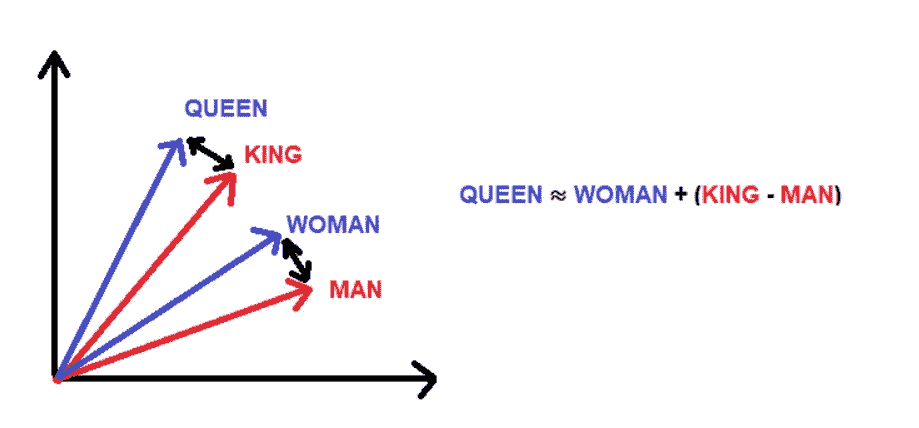

# 向量空间模型

> 原文：<https://towardsdatascience.com/vector-space-models-48b42a15d86d?source=collection_archive---------25----------------------->

## [自然语言处理笔记](https://towardsdatascience.com/tagged/nlpnotes)

## 自然语言处理专业课程 1 第 3 周笔记

由 [NASA](https://unsplash.com/@nasa?utm_source=medium&utm_medium=referral) 在 [Unsplash](https://unsplash.com?utm_source=medium&utm_medium=referral) 上拍摄的照片

继续我们的[自然语言处理笔记](https://towardsdatascience.com/tagged/nlpnotes)系列，你可能已经注意到我跳过了第 2 周。这不是偶然的，我意识到我已经对贝叶斯定理和朴素贝叶斯(下面的链接)**做了相当多的笔记，因为这是从第 1 周到第 2 周所发生的所有变化(我们用来预测推文情绪的算法)。**

 [## 数据科学家解释边际、联合和条件概率

### 以数据科学的方式学习概率

towardsdatascience.com](/marginal-joint-and-conditional-probabilities-explained-by-data-scientist-4225b28907a4)  [## 从零开始的算法:朴素贝叶斯分类器

### 从头开始详述和构建朴素贝叶斯分类器

towardsdatascience.com](/algorithms-from-scratch-naive-bayes-classifier-8006cc691493) 

## 什么是向量空间模型？

向量空间模型是代数模型，通常用于将文本(尽管它们可以表示任何对象)表示为标识符的向量。有了这些模型，我们能够识别各种文本在意义上是否相似，不管它们是否共享相同的单词。

**图 1** :单词如何共享相似的单词但有不同的意思，反之亦然的例子(图片由作者提供)

这个想法是基于一位名叫约翰·鲁珀特·弗斯的英国语言学家(也是 20 世纪 50 年代英国语言学的领军人物)的名言…

> “看一个人交什么样的朋友，你就可以知道一个字”——J·r·弗斯

在许多情况下，我们可能会决定采用矢量空间模型，例如:

*   信息过滤
*   信息检索
*   机器翻译
*   聊天机器人

还有更多！

一般来说，向量空间模型允许我们将单词和文档表示为向量。

## 逐字逐句&逐字逐句

为了用向量来表示我们的文本，我们可以决定使用逐词或逐文档的设计。执行这个任务包括首先创建一个共生矩阵。

虽然我们执行每项任务的方式非常相似，但我们将一次讨论一个设计，尽管如此，目标是相同的。我们想从我们的共生矩阵到一个向量表示。

**图 2** :我们的共现矩阵到向量表示的映射(图片由作者提供)

**逐字**:此设计统计单词在一定距离内出现的次数 **k.**

**图 3**:k = 2 的逐字共现矩阵示例(作者提供的图片)

在逐字设计中，共现矩阵在 1 到 N 个条目之间。

**Word By Doc** :词汇中的单词在属于特定类别的文档中出现的次数。

**图 4** :文档共现矩阵单词示例(图片由作者提供)

使用这些向量表示，我们现在可以在向量空间中表示我们的文本或文档。这是完美的，因为在向量空间中，我们可以确定文档类型之间的关系，比如它们的相似性。

**图 5** :在向量空间中用 doc 表示单词(图片由作者提供)

## 欧几里得距离

我们可以用来确定两个向量彼此相距多远的相似性度量是欧几里德距离，它仅仅是连接两个向量的直线的长度。

**图 6** :欧几里德距离公式(图片由作者提供)

让我们使用**图 6** 中的公式，使用来自**图 5** 的矢量表示来计算更相似的文档。

图 7:计算欧几里得距离(图片由作者提供)

结果告诉我们，经济和机器学习文档更相似，因为基于距离的度量优先考虑具有较低值的对象来检测相似性。也就是说，需要注意的是欧几里德距离不是比例不变的，通常建议对数据进行缩放。

## 余弦相似性

欧几里得距离的问题在于它会因表示中的大小差异而有偏差。因此，我们可以决定使用余弦相似度，这将确定使用内角的文本有多相似。

**图 8** :余弦相似度公式(图片作者提供)

余弦相似性是自然语言处理中最常用的相似性度量之一。为了计算相似性，我们取两个向量之间的夹角的余弦相似性。

**图 9** :计算余弦相似度(图片由作者提供)

当余弦值等于 0 时，这意味着两个向量彼此正交，并且不匹配。反之，余弦值越接近 1，则意味着这两个值之间的匹配度越高(因为角度越小)。因此，从我们的结果来看，经济和机器学习是最相似的——在[维基百科](https://en.wikipedia.org/wiki/Cosine_similarity)上阅读更多关于余弦相似性度量的信息。

## 在向量空间中操纵单词

通过执行一些简单的矢量运算，我们能够推断出单词之间的未知表示。

例如，如果我们知道两个相似者如国王和人之间的关系。为了找到单词“Queen”的向量表示，我们可以将我们从确定 King 和 Man 之间的关系中检索到的向量表示(我们通过减去向量即 King - Man 来检索该向量)添加到 Woman 的向量表示，并且推断最相似的向量表示(在该实例中是 Queen)是我们想要找到的向量。

> **注**:阅读[米科洛夫等人，2013，单词和短语的分布式表征及其组合性。](https://arxiv.org/abs/1310.4546)

**图 10** :视觉呈现(图片作者)

## 包裹

总之，我们可以使用向量空间模型来表示向量空间中的文本或文档，当我们的数据在向量空间中时，我们可以使用向量来确定文本(或文档)之间的关系。

让我们在 LinkedIn 上继续对话…

 [## Kurtis Pykes -人工智能作家-走向数据科学| LinkedIn

### 在世界上最大的职业社区 LinkedIn 上查看 Kurtis Pykes 的个人资料。Kurtis 有一个工作列在他们的…

www.linkedin.com](https://www.linkedin.com/in/kurtispykes/)