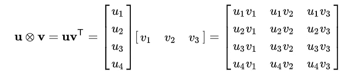
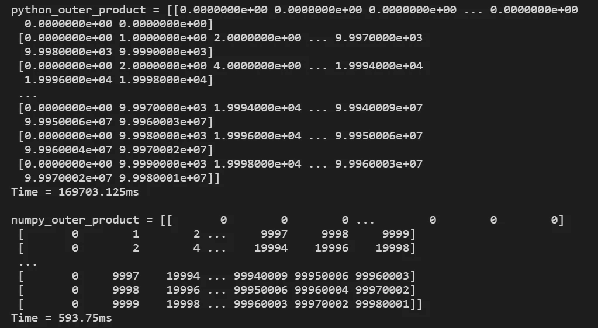
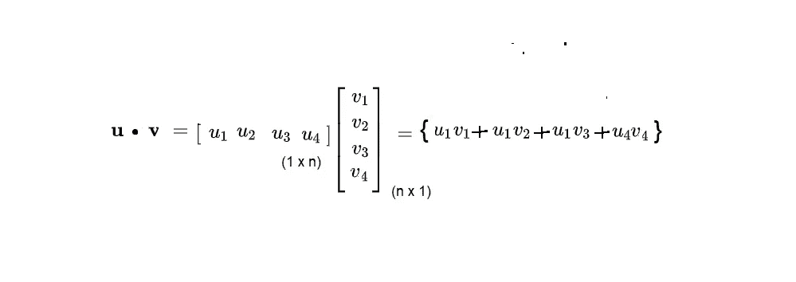
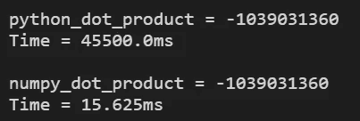

# Python 中的矢量化

> 原文：<https://towardsdatascience.com/vectorization-in-python-46486819d3a?source=collection_archive---------17----------------------->

## [PyTrix 系列](https://towardsdatascience.com/tagged/pytrix-series)

## PyTrix#1:加速我们的 Python 代码

Python 是一种流行的数据科学语言。它的语法很容易学习(和阅读),这使得新手更容易掌握和使用这种语言。然而，不涉及细节，Python 是一种[解释语言](https://en.wikipedia.org/wiki/Interpreted_language)，这意味着它运行起来比像 c 这样的[编译语言](https://en.wikipedia.org/wiki/Compiled_language)慢得多

当我们执行深度学习时，我们可能会使用大量数据，因为这是深度学习蓬勃发展的时候。


图 Coursera 上吴恩达深度学习专业化的照片

为什么我要说这些？很棒的问题！

如果我们有大量的数据和缓慢的 python 代码，我们很可能最终得到一个以蜗牛速度运行的模型，因为我们的代码在计算上不是最优的...人类对这场大灾难的解决方案是什么？矢量化！B-)

**什么是矢量化？**

通俗地说，它加快了 Python 代码的速度，而不需要循环、索引等。在数据科学中，我们使用 Numpy 来完成这项工作——Numpy 是科学编程的事实框架。从技术上来说，当我们在 Numpy 中实现矢量化形式时，我们仍然执行这些操作，但不在 Python 中——在幕后。相反，这些操作是在优化的预编译 C 代码中完成的——参见[文档](https://numpy.org/devdocs/user/whatisnumpy.html)了解更多信息。

> 这种用数组表达式替换显式循环的做法通常被称为向量化。一般来说，矢量化数组运算通常比纯 python 运算快一两个(或更多)数量级，在任何类型的数值计算中都有最大的影响”——McKinney，2012 年，第 97 页

**纯 Python vs Numpy 示例**

在这一节中，我将用 python 实现一些例子，然后用 numpy 实现相同的代码，并比较两者的计算时间，这样我们可以对矢量化有一个直观的了解。下面是我的 Github 库的代码链接。

[](https://github.com/kurtispykes/demo/tree/master/pytrix) [## kurtispykes/演示

### 此时您不能执行该操作。您已使用另一个标签页或窗口登录。您已在另一个选项卡中注销，或者…

github.com](https://github.com/kurtispykes/demo/tree/master/pytrix) 

**外部产品**

两个向量的外积将产生一个矩阵。例如，如果我们有两个维度为`n`和`m`的向量，那么这两个向量的外积——见图 2。



图 2:外积公式[【来源】](https://en.wikipedia.org/wiki/Outer_product)

```
import numpy as np
import timea = np.arange(10000)
b = np.arange(10000)# pure Python outer product implementation
tic = time.process_time()outer_product = np.zeros((10000, 10000))
for i in range(len(a)):
    for j in range(len(b)):
        outer_product[i][j]= a[i] * b[j]toc = time.process_time()print("python_outer_product = "+ str(outer_product))
print("Time = "+str(1000*(toc - tic ))+"ms\n")# Numpy outer product implementation
n_tic = time.process_time()outer_product = np.outer(a, b)n_toc = time.process_time()print("numpy_outer_product = "+str(outer_product));
print("Time = "+str(1000*(n_toc - n_tic ))+"ms")
```

这个细胞输出…



图 3:上面代码块的输出

**点积**

也称为内积，点积接受两个长度相等的数字序列，并返回一个标量—参见图 4。



图 4:点积公式

```
import numpy as np
import timea = np.arange(10000000)
b = np.arange(10000000)# pure Python outer product implementation
tic = time.process_time()dot_product = 0
for i in range(len(a)):
    dot_product += a[i] * b[i]toc = time.process_time()print("python_dot_product = "+ str(dot_product))
print("Time = "+str(1000*(toc - tic ))+"ms\n")# Numpy outer product implementation
n_tic = time.process_time()dot_product = np.dot(a, b)n_toc = time.process_time()print("numpy_dot_product = "+str(dot_product))
print("Time = "+str(1000*(n_toc - n_tic ))+"ms")
```

这个代码块的输出…



图 5:上面代码块的结果。

最终，矢量化不仅使我们的代码更快、更容易阅读，还减少了我们必须编写的代码量，这通常意味着我们得到的 bug 更少。最重要的是，我们编写的代码看起来更“Pythonic 化”,因为我们去掉了代码库中所有低效的、难以阅读的 for 循环。

> 注:如果这对你来说是全新的，我建议你观看下面链接的来自吴恩达的视频，这些视频来自 Coursera 上的[深度学习专业](https://www.coursera.org/specializations/deep-learning?utm_source=gg&utm_medium=sem&utm_content=17-DeepLearning-ROW&campaignid=6465471773&adgroupid=77415260637&device=c&keyword=coursera%20artificial%20intelligence&matchtype=b&network=g&devicemodel=&adpostion=&creativeid=379493352691&hide_mobile_promo&gclid=CjwKCAjw4871BRAjEiwAbxXi28Rmr9JrCIczEjB8MLDHTReKsNdfG0nPYnGFTbtH4583TDzvUal7GhoC6gkQAvD_BwE)，并开始掌握 [Numpy 文档](https://numpy.org/)

图 6:深度学习专业化课程 1 中关于矢量化的吴恩达。

[](https://www.khanacademy.org/math/linear-algebra/vectors-and-spaces) [## 向量和空间|线性代数|数学|可汗学院

### 如果您看到此消息，这意味着我们在网站上加载外部资源时遇到了问题。如果你是…

www.khanacademy.org](https://www.khanacademy.org/math/linear-algebra/vectors-and-spaces)