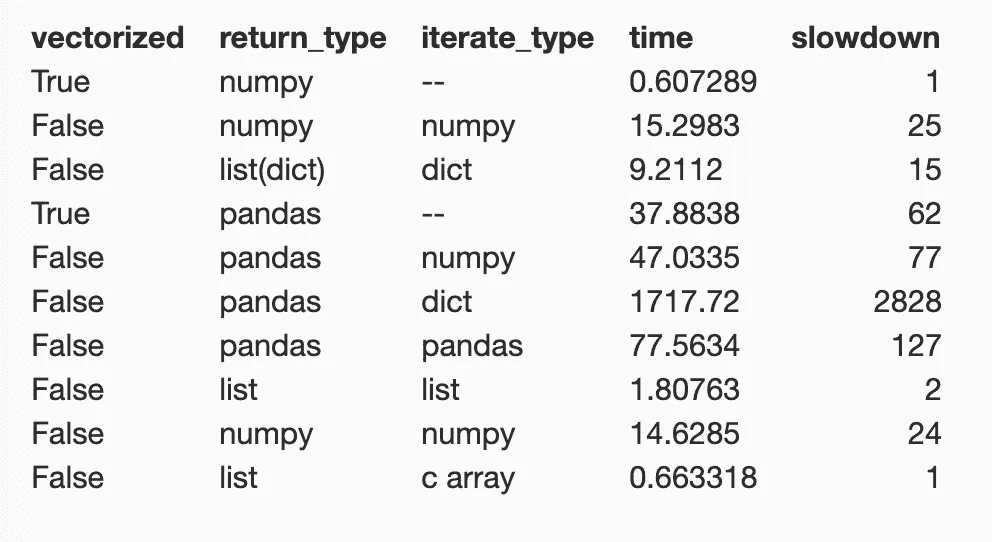

# 向量化代码很重要

> 原文：<https://towardsdatascience.com/vectorizing-code-matters-66c5f95ddfd5?source=collection_archive---------38----------------------->

我来自 MATLAB 和数值计算的世界，在那里，for 循环被删除，向量为王。在 UVM 攻读博士学位期间，[拉科巴](http://www.cems.uvm.edu/~tlakoba/)教授的数值分析课是我上过的最具挑战性的课程之一，对数值代码的深入了解至今仍让我记忆犹新。我最喜欢的矢量化例子是，一位同事在写了一篇非常酷的关于它的论文，并在脚注中提到了所涉及的大量计算之后，与我分享了他的 Lorenz 96 代码。内循环的矢量化速度快了 4 倍，所以现在脚注只是一个碳足迹。

如今，快速数字代码让机器学习成为可能，尽管我不确定现在有多少孩子能用 C 语言编写一个 [QR 分解。我是在开玩笑，因为我没有做过，但是我确信我可以用 MATLAB(在某一点上)或者 Numpy 或者 Julia(我将坚持只使用 R 语言中的 magrittr 和 dplyr)来编写它。我在 MassMutual 做的很多工作基本上都是数值计算，耗时几小时甚至几分钟的管道与耗时几秒钟的管道之间的差别是很大的。几秒钟意味着我们可以迭代，尝试更多的选项，并且行动更快。尽管如此，很多数字代码还是用纯 Python 写的(没有 Cython，没有 Numba)，为了*的灵活性*。我要说这是个坏主意！这是一封转述自同事的电子邮件:](https://www.academia.edu/4902724/Numerical_Recipes_in_C_The_Art_of_Scientific_Computing_2nd_Ed_William_H_Press)

> *在伪代码中，这是我几个月前遇到的‘精算’编码困境:*
> 
> `*EOM = 0
> for months in years:
> PREM = 50
> BOM = EOM + PREM
> WIT = 5
> EOM = BOM – WIT*`
> 
> *一个简单的例子，但我认为显示了 BOM/EOM 的相互依赖性(还有一些其他变量具有类似的关系。)不了解 EOM 就无法矢量化 BOM，了解 BOM 就无法矢量化 EOM。那么你可能会遇到这样的情况，如果 WIT > 0，PREM = 0。基本上出现了许多相互依赖。现在很多函数都不容易向量化。*

我可以把它矢量化，我做到了。以下是 Python 中的非矢量化版本:

```
import numpy as np
years = 10
bom = np.zeros(years*12)
eom = np.zeros(years*12)
for month in range(1, years*12):
    prem = 50
    bom[month] = eom[month-1] + prem
    wit = 5
    eom[month] = bom[month] - wit
```

这是矢量化版本:

```
import numpy as np
years = 10
prem = 50
wit = 5eom = np.arange(years*12)*prem - np.arange(years*12)*wit
# and if you still want bom as an array:
bom = eom + np.arange(years*12)*wit
```

我还通过使用一个字典列表更加灵活地编写了 for 循环:

```
years = 10
prem = 50
wit = 5
result = [{'bom': 0, 'eom': 0}]
for month in range(1, years*12):
    inner = {}
    inner.update({'bom': result[month-1]['eom'] + prem})
    inner.update({'eom': inner['bom'] - wit})
    result.append(inner)
```

上面这个返回一个不同类型的东西，一个字典列表…不是两个数组。

我们还可以导入 Pandas 来填充以上三个项目的结果(因此它们是一致的输出，我们可以保存到 excel，等等)。如果我们加载了 Pandas，我们可以使用一个空的数据帧进行迭代，因此多了一个选项:

```
import numpy as np
import pandas as pd
years = 10
prem = 50
wit = 5
df = pd.DataFrame(data={'bom': np.zeros(years*12), 'eom': np.zeros(years*12)})
for i, row in df.iterrows():
    if i > 0:
        row.bom = df.loc[i-1, 'eom']
        row.eom = row.bom - wit
```

通过所有这些类型的迭代，以及返回数据帧作为结果的选项，我们得到了以下结果:



**Cython 和 Numba**

我还添加了几个 [Cython](https://cython.readthedocs.io/en/latest/src/tutorial/cython_tutorial.html) 版本的代码，展示了通过使用 c，您可以在没有 numpy 的情况下获得矢量化的性能。)和速度。

Numba 也可以保持相同的加速比(它可能和 cy thon/矢量化 Numpy 一样快)。在这两种情况下(Cython/Numba ),您必须小心使用哪些数据类型(不要使用字典或熊猫！).我认为，如果你[更聪明地知道如何整合它们](https://cython.readthedocs.io/en/latest/src/userguide/memoryviews.html#memoryviews)，让 Cython + Numpy 循环和矢量化 Numpy 循环一样快是可能的。

最终，你*可以*鱼和熊掌兼得:可读的 for-loops(是的，矢量化版本可以变得更神秘)，用 Python 编写，具有类似 C 语言的矢量化速度。

所有的代码，包括 Cython，都可以在这里找到:[https://github.com/andyreagan/vectorizing-matters](https://github.com/andyreagan/vectorizing-matters)。