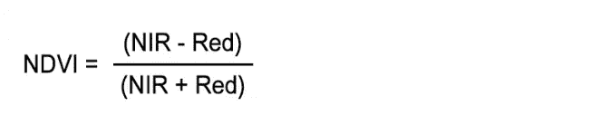

# 从卫星图像计算植被指数

> 原文：<https://towardsdatascience.com/vegetation-index-calculation-from-satellite-imagery-6f5c209cbdb1?source=collection_archive---------11----------------------->

## 利用卫星图像挖掘环境中的环境变化。


来源:谷歌地图

人工智能和机器学习彻底改变了我们今天的世界。从医疗保健到汽车，从体育到银行，几乎所有行业都意识到人工智能带来的力量，以提供更好的解决方案。卫星图像领域也在经历大规模发展，机器学习解决方案已经提供了一些积极的成果。ML 算法已经被证明是分析卫星图像的一个很好的工具。然而，访问数据有时会成为一个瓶颈。这主要是由于卫星图像的巨大规模，以及分析它们需要一些领域的专业知识。很多时候，来自其他领域的人也对访问和分析卫星数据感兴趣，特别是研究当地的模式，如一个国家的污染水平、洪水情况，甚至是森林火灾。这促使我寻找一些资源来简化这个过程，或者访问和分析卫星图像过程，这样我们就可以花更多的时间来理解结果并从中学习。

一年前，我写了一篇关于类似概念的文章，名为使用 Python 进行[卫星图像分析，其中我们**在卫星数据**的帮助下检查了一个地区的植被覆盖。其目的是了解卫星图像数据的概念，以及如何对其进行分析以调查现实世界的环境和人道主义挑战。](https://medium.com/analytics-vidhya/satellite-imagery-analysis-with-python-3f8ccf8a7c32)

然而，这个过程需要几个步骤，这一次我在寻找简化这个过程的方法。幸运的是，我遇到了一个名为 [**EarthAI Notebook**](https://astraea.earth/earth-ai-notebook/) 的平台，这是一个完全托管和管理的 JupyterLab 笔记本，专门用于分析栅格数据。它为我提供了使用熟悉的 Jupyter 实验室平台执行卫星图像分析的便利，完全加载了地理空间分析库和对地球按需目录的 API 访问。

> 在本文中，我将快速向您介绍计算该地区植被指数的步骤。该代码大量改编自 [EarthAI 手册](https://docs.earthai.astraea.io/quick-example-1.html)中的示例代码。

# 案例研究:计算孙德尔本斯的植被指数(NDVI)

[孙德尔本斯](https://en.wikipedia.org/wiki/Sundarbans)是孟加拉湾[的](https://en.wikipedia.org/wiki/Bay_of_Bengal)[恒河](https://en.wikipedia.org/wiki/Ganges)、[布拉马普特拉河](https://en.wikipedia.org/wiki/Brahmaputra_River)和[梅克纳河](https://en.wikipedia.org/wiki/Meghna_River)汇合形成的[三角洲](https://en.wikipedia.org/wiki/Delta_(river))中的[红树林](https://en.wikipedia.org/wiki/Mangrove)区域。它的一部分位于孟加拉国(66%)和印度(34%)，是世界上最大的单一潮汐盐生红树林。Sunderbans 具有巨大的经济和环境价值，已被联合国教科文组织宣布为世界遗产。


[来源](https://en.wikipedia.org/wiki/Sundarbans#/media/File:%E0%A6%B8%E0%A7%81%E0%A6%A8%E0%A7%8D%E0%A6%A6%E0%A6%B0%E0%A6%AC%E0%A6%A8%E0%A7%87%E0%A6%B0_%E0%A6%AE%E0%A6%BE%E0%A6%A8%E0%A6%9A%E0%A6%BF%E0%A6%A4%E0%A7%8D%E0%A6%B0.svg)

[](https://gisgeography.com/ndvi-normalized-difference-vegetation-index/)**或**归一化差异植被指数(NDVI)是最广泛使用的测量植被的指数之一。它是由美国宇航局科学家康普顿·塔克开发的，可以表达如下。****

****

**其中 NIR 和 Red 分别代表来自植物的反射近红外光和反射可见红光。为什么只有这两种颜色？与其他波长相比，健康的植物会反射更多的近红外和绿光。然而，它吸收更多的红光。因此，NDVI 将植物反射的近红外光(NIR)与反射的可见红光(red)进行了比较。NDVI 值的范围从+1.0 到-1.0，其中 1 代表最健康的植被。**

****

**今天的孙德尔本斯已经受到环境干扰和人类活动的深刻影响，因此 NDVI 可以成为测量孙德尔本斯周围植被覆盖率并采取补救措施的有用工具。**

## **设置系统**

**点击`StartFree Trial`选项，接下来的屏幕会出现。启动地球笔记本。你将获得 14 天的试用期，这应该足以让你开始。这可能需要几分钟来脱离熟悉的 Jupyter 实验室环境。**

****

**接下来，您可以导航到 examples 文件夹，在那里使用用例以及快速参考指南。我将使用`quick-example-1.ipynb`文件来熟悉这个平台。**

## **导入库和创建火花会话**

**接下来，我们将从 EarthAI 导入必要的库和依赖项。这又创建了一个新的 [SparkSession](https://spark.apache.org/docs/2.1.0/api/python/pyspark.sql.html?highlight=sparksession) 。这包括`earth_on_demand`、`rasterframes`和`pyspark`**

```
from earthai.init import * 
import pyspark.sql.functions as F 
import matplotlib.pyplot as plt  
%matplotlib inline
```

**[RasterFrames](https://rasterframes.io/getting-started.html) 是一个地理空间**开源**栅格处理库，用于 [Python、Scala 和 SQL](https://rasterframes.io/languages.html) ，可通过[几种机制](https://rasterframes.io/getting-started.html#other-options)获得。RasterFrames 为任意地理空间栅格数据提供了以数据帧为中心的视图，支持时空查询、地图代数栅格操作以及与 Spark ML 的互操作性**

****

**[https://rasterframes.io/](https://rasterframes.io/)**

## **查询和加载卫星影像**

**我们现在需要导入卫星图像数据。我们将使用`earth_ondemand`模块来查询覆盖桑德邦斯国家公园特定区域的 MODIS 图像。在继续之前，我们先了解一下 **MODIS** 是什么。**

**[*MODIS*](https://modis.gsfc.nasa.gov/about/) *代表* ***中分辨率成像光谱仪****(****MODIS****)。它是*[*Terra*](http://terra.nasa.gov/)*(原名 EOS AM-1)和*[*Aqua*](http://aqua.nasa.gov/)*(原名 EOS PM-1)卫星上的关键仪器。Terra MODIS 和 Aqua MODIS 每 1 到 2 天观察一次整个地球表面，获取 36 个光谱带或波长组的数据(来源:*[https://modis.gsfc.nasa.gov/](https://modis.gsfc.nasa.gov/))**

**变量 catalog 返回由指定时间和位置的卫星图像组成的数据帧。我们来看看**目录**的一些基本信息。**

****

**这里的`B01`和`B02`指的是红色和近红外(NIR)波段。**

> **波段(也称为通道或层)可以被认为是在同一地点同时拍摄的图像的集合。这篇名为 [**遥感简介**](http://gsp.humboldt.edu/OLM/Courses/GSP_216_Online/lesson3-1/bands.html) 的文章非常清晰地解释了波段的概念:**
> 
> **地球观测卫星上的许多传感器测量从地球表面反射或发射的电磁辐射(EMR)量。这些传感器被称为多光谱传感器，可以同时测量电磁波谱的多个区域的数据。传感器测量的波长范围称为波段，通常用名称(例如红光或近红外)和所记录能量的波长来描述。**

**这些列提供了到单波段[地理 IFFs](https://en.wikipedia.org/wiki/GeoTIFF) 的直接链接。地理信息系统使用 GeoTIFF 和其他格式来组织和存储栅格数据集，如卫星影像。**

**让我们看看上面目录中的一些关键列。**

```
catalog[['id','eod_collection_attribution', 'datetime', 'eo_cloud_cover', 'proj_crs', 'B01', 'B02']].head(5)
```

****

## **从目录加载影像**

**现在，是时候加载实际的卫星图像了。我们将从上面指定的场景列表中读入**红色(B0)** 和**红外(B1)** 波段。**

**`**df**`是一个[火花数据帧](https://spark.apache.org/docs/latest/sql-programming-guide.html)，其中图像被存储为[图块](https://rasterframes.io/concepts.html)**

****

## **计算 NDVI**

```
df = df.withColumn('ndvi', rf_normalized_difference('nir', 'red'))
```

## **计算每周整个图像的 NDVI 平均值**

**最后，我们将计算一个非常简单的解析。我们将计算数据帧中每周整个图像的 NDVI 平均值。`time_series`是一个火花数据帧。`toPandas`调用触发计算，结果在熊猫数据帧中返回。这使我们能够很容易地将时间序列可视化。**

****

**这里我们得到了特定时间段的 NDVI。我选择了一个非常小的时间窗口来加速这个过程，但是整个过程保持不变，即使我们需要计算更长时间的 NDVI。事实上，这将提供一个关于生态平衡和气候变化对一个地方的影响的更好的想法。**

# **结论**

**卫星图像分析是数据科学家工具箱中的必备工具，挖掘出的信息可用于调查现实世界的环境和人道主义挑战。我希望这篇文章能给你一个良好的开端，让你开始用工具和卫星数据进行一些有价值的分析。**

**附注:这不是 EarthAI 的促销文章。还有其他几个工具可以做同样的分析，但是我对这个平台的体验是积极的，所以我想分享我的经验。**